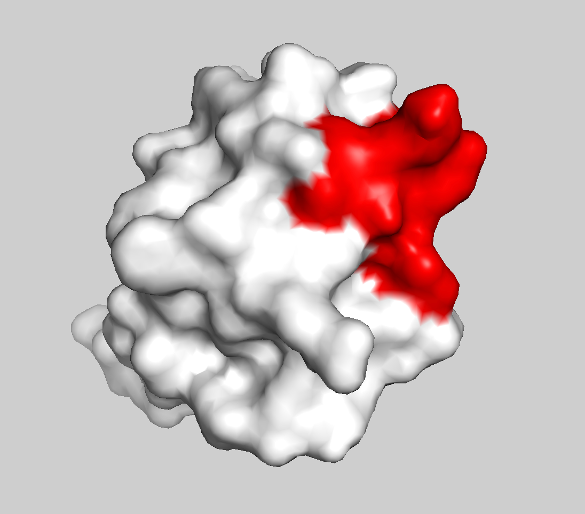

This tutorial consists of the following sections:

* table of contents
{:toc}

<hr>

## Introduction

Structures of protein-DNA complexes fulfill a key role in our understanding of the complex regulatory mechanisms in the living cell.
With the ever-increasing number of putative DNA-interacting proteins, there is a need for high-throughput structural biology pipelines.

However, not all biomolecular complexes are that straightforward to solve using experimental methods such as X-ray crystallography and Nucleic Magnetic Resonance (NMR) spectroscopy.
Indeed, complexes that engage in transient interactions are, by definition, highly dynamic during interaction, while too big ones remain still a challenge for structural experimental techniques.

Computational methods for the calculation of structural models at atomic resolution have proven to be a valid toolset to help overcome some of these experimental limitations.
Especially docking algorithms are becoming increasingly popular. These algorithms aim to solve the structure of a complex from its native constituents using various computational approaches.
While very performant for protein-protein interactions, many of these algorithms suffer limitations when trying to model protein-DNA complexes such as the location of the interaction interfaces and dealing with conformational change upon complex formation.

This tutorial will introduce HADDOCK (High Ambiguity Driven DOCKing) [1] as a method to overcome some of the limitations associated with protein-DNA docking.

<hr>

## About this tutorial

In this tutorial, we aim to introduce you to basic concepts of protein-DNA docking using HADDOCK2.4 webserver.
For a complete protein-DNA docking using HADDOCK 2.4, including the generation of Ambiguous Interaction Restraints (AIRs) and starting structures, visit [the advanced tutorial on protein-DNA docking](https://www.bonvinlab.org/education/HADDOCK24/HADDOCK24-protein-DNA-advanced/).

### What is new in this tutorial?

You will perform a docking of a protein-DNA system composed of 3 biomolecules (2 proteins and 1 DNA).
All of these molecules are in their unbound conformation.

* Introduction on the use of symmetry restraints. 

### Using this tutorial

You should be able to go through this tutorial in about 1 hour.
We will be using the [PBD-tools webserver](https://wenmr.science.uu.nl/pdbtools) for preprocessing a PDB file (optional) and the HADDOCK 2.4 webserver
 [https://wenmr.science.uu.nl/haddock2.4/](https://wenmr.science.uu.nl/haddock2.4/) to perform the docking.

### Tutorial data set

In this tutorial you will perform a protein-DNA docking using the bacteriophage 434 Cro repressor protein and the OR1 operator as an example case.
All the tutorial data are made available as a zip archive and can be downloaded at the [following link](https://surfdrive.surf.nl/files/index.php/s/BWhfEEAEHtmqa5a/download).

### Extract the archive

You need to decompress the tutorial data archive.
Move the archive to your working directory of choice and extract it.
You can either extract the archive by just selecting “extract” option.

Extraction of the archive will present you with a new directory called `protein-DNA_basic` that contains a number of files and directories:
* an NMR ensemble of the 343 Cro repressor structure (`1ZUG_ensemble.pdb`)
* a single structure coming from the NMR ensemble (`1ZUG.pdb`) with the disordered residues removed
* the structure of the OR1 operator in B-DNA conformation (`OR1_unbound.pdb`)
* the ambiguous restrains (`ambig_pm.tbl`), created with a combination of experimental from literature information. A detailed explanation of how to generate these restraints can be found [here](https://www.bonvinlab.org/education/HADDOCK24/HADDOCK24-protein-DNA-advanced/#available-data).
* the X-ray structure of the complex `3CRO_complex.pdb` used as reference to compare with the docking results
* the `prot-dna-outputs-examples/` directory holds a sample of the results obtained by doing this tutorial.

To obtain more detailed information about how to obtain these files, please refer to the [advanced tutorial on protein-DNA docking](https://www.bonvinlab.org/education/HADDOCK24/HADDOCK24-protein-DNA-advanced/).

### Where can I find more information?

An elaborate discussion of all the concepts of protein-DNA docking and the various options of the HADDOCK docking software is beyond the scope of this tutorial.
Where needed, some concepts will be explained throughout the tutorial to maintain the readability and flow of this document.
The tutorial ends with a reference block that provides links to in depth literature or Internet documentation about various topics. 

### What if I do not find an answer to my questions?

It is always possible that you have questions or run into problems for which you cannot find the answer in the regular documentation. Here are some additional links that you can find answers to your questions:

* Bioexcel user forum: [https://ask.bioexcel.eu/c/haddock/6](https://ask.bioexcel.eu/c/haddock/6) 
* HADDOCK Help Center: [https://wenmr.science.uu.nl/haddock2.4/help](https://wenmr.science.uu.nl/haddock2.4/help) 
* HADDOCK software and online manual: [https://www.bonvinlab.org/software/haddock2.4/manual/](https://www.bonvinlab.org/software/haddock2.4/manual/)

### Tutorial icon conventions

Throughout the tutorial we will use the following special fonts and icons to perform certain tasks or draw your attention:

<a class="prompt prompt-question">This is a question prompt: try answering it!</a>
<a class="prompt prompt-info">This an instruction prompt: follow it!</a>
<a class="prompt prompt-pymol">This is a PyMOL prompt: write this in the PyMOL command line prompt!</a>

<hr>

## Introduction to the tutorial test case

To illustrate our protein-DNA docking protocol we will use as an example the complex between the bacteriophage 434 Cro repressor proteins and the OR1 operator.

### Cro is part of the bacteriophage 434 genetic switch

Cro is a *repressor* protein of the temperate bacteriophage 434.
It works in opposition to the phage's *repressor* protein to control the genetic switch.
The competition between both determines whether the phage embarks on a lytic or lysogenic lifecycle after infection.
The *repressors* compete to gain control over an operator region containing three operators that determine the state of the lytic/lysogenic genetic switch.
If Cro wins the late genes of the phage will be expressed and the result is lysis.
If the phage *repressor* wins the transcription of Cro, genes is further blocked and *repressor* synthesis is maintained, resulting in a state of lysogeny.

### Structure of the Cro-OR1 complex

The structure of bacteriophage 434 Cro in complex with the OR1 operator was solved by X-ray crystallography ([4], **Figure 1**).
We will use this structure as reference (or target) during the remaining of the tutorial.
Cro functions as a symmetrical dimer.
Each subunit contains a helix-turn-helix (HTH) DNA binding motif.
This is a typical DNA major groove-binding motif.
Helices α2 and α3 are separated by a short turn. Helix α3 is the recognition helix that fits into the major groove of the operator DNA and is oriented with its axes parallel to the major groove.
The side chains of each helix are thus positioned to interact with the edges of base pairs on the floor of the groove.
Non-specific interactions also help anchor Cro to operator DNA.
These include H-bonds between main chain NH groups and phosphate oxygen's of the DNA in the region of the operator.
Cro distorts the normal B-form DNA conformation: the OR1 DNA is bent (curved) by Cro, and the middle region of the operator is overwound, as reflected in the reduced distance between phosphate backbones in the minor groove. 

<figure align="center">

<p> <b>Figure 1:</b> Cartoon representation of the X-ray structure (PDB id 3CRO) of the bacteriophage 434 Cro-OR1 complex.</p>
</figure>

<hr>


## Understanding the ambiguous interaction restraints

The ambiguous interaction restraints are defined in the `ambig_pm.tbl` file and the creation of such file is explained in detail [here](../HADDOCK24-protein-DNA-advanced/#available-data).

Let's have a look at the first lines of the file:

```bash
! Protein first monomer restraints
!
assign ( resid 31 and segid A)
	(
		( resid 24 and segid C and (name H41 or name H42 or name N3 or name C4 or name C5 or name C6))
	  or
		( resid 17 and segid C and (name H1 or name H21 or name N7 or name O6 or name C5 or name C6 or name C8))
	  or
		( resid 25 and segid C and (name H61 or name H62 or name N1 or name N7 or name C5 or name C6 or name C8))
	  ...
  ) 2.000 2.000 0.000
```

After the two commented lines (starting with !), the first line of the file indicates that residue 31 of chain A is should be involved in the interaction with the DNA (chain C), and that the possibly interacting residues are defined by the following lines (DNA bases 24, 17 and so on, each one with a few atoms). If one of these residues satisfies the distance requirement, the interaction restraint is considered satisfied.

The same syntax is followed for the DNA molecule:

```bash
!
! DNA restraints
!
assign ( resid 16 and segid C and (name H3 or name O4 or name C4 or name C5 or name C6 or name C7))
	(
		( resid 29 and segid A)
	  or
		( resid 31 and segid A)
	  or
		( resid 32 and segid A)
	  or
		( resid 30 and segid A)
	  or
		( resid 28 and segid A)
	  or
		( resid 34 and segid A)
	) 2.000 2.000 0.000
```

which is coupled to a set of amino acids on the protein side (residues 29, 31, 32, 30, 28 and 34 in this case).

## Visualizing the ambiguous interaction restraints

Let's start by visualizing how the interacting residues used to drive the docking are distributed on the protein.

<a class="prompt prompt-pymol">
File menu -> Open -> select 1ZUG_ensemble.pdb
</a>

We will now highlight the amino acids that are supposed to be at the interface. In PyMOL type the following commands:

<a class="prompt prompt-pymol">
color white, all
</a>
<a class="prompt prompt-pymol">
select interacting, (resi 28+29+30+31+32+34+35)<br>
</a>
<a class="prompt prompt-pymol">
color red, interacting
</a>

<a class="prompt prompt-question">
How much does the conformation of the interacting region change in the provided ensemble? Is this the most flexible region of the protein?
</a>

<a class="prompt prompt-question">
Why is residue 33 excluded from these amino acids?
</a>

Let us now switch to a surface representation to inspect the binding site.

<a class="prompt prompt-pymol">
color white, all
</a>
<a class="prompt prompt-pymol">
show surface<br>
</a>
<a class="prompt prompt-pymol">
color red, interacting
</a>

Inspect the surface.

<details style="background-color:#DAE4E7">
  <summary style="bold">
    <b><i>See surface view of the interacting residues</i></b> <i class="material-icons">expand_more</i>
  </summary>
  <figure style="text-align: center;">
    
  </figure>
  <br>
</details>

<br>

<a class="prompt prompt-question">
You can repeat the same analysis for the DNA molecule (OR1_unbound.pdb) using the residues (13+14+15+16+17+18+22+23+24+25) that are supposed to interact with one of the protein chains. What do you observe?
</a>

<hr>

## Extracting a single structure from the NMR ensemble using PBD-tools (optional)

We understood how the NMR ensemble of protein has a disordered tail at the end of the protein chain. Since this disordered region is not involved in the binding, 
we can simply take the first structure from the ensemble and remove this region. This can be done using the PBD-tools program (see **Figure 2**). Docking with an ensemble of conformations is still possible.

First open your web browser to go to [https://wenmr.science.uu.nl/pdbtools/](https://wenmr.science.uu.nl/pdbtools/){:target="_blank"} and choose **Submit a pipeline**.

Here, we fetch the NMR ensemble directly from the PDB database by typing *1ZUG* in the **PDB Code** field.

<a class="prompt prompt-info">
Fetch the NMR ensemble of 1ZUG from the PDB using the PDB code.
</a>

Now we will split our ensemble in several models.

<a class="prompt prompt-info"> Choose 'pdb_splitmodel' from the **Pre-processing** panel and click on +Add a new block.</a>

Then we need to clean our pdb structure by removing all water, ion or other non-protein atoms as a result from the crystallisation process.  

<a class="prompt prompt-info"> Choose 'pdb_delhetatm' and click on +Add a new block.</a>

Now we will remove the disordered region at the end of the protein chain.

<a class="prompt prompt-info"> Choose 'pdb_selres' and click on +Add a new block</a>

<a class="prompt prompt-info"> Once the 'pdb_selres' block is added to the pipeline, add 1:66 to the selection box.</a>

This will select all the residues from 1 to 66, thus removing the disordered region at the end of the protein chain.

<figure align="center">

<p> <b>Figure 2:</b>visualization of the PBD-tools pipeline.</p>
</figure>

<a class="prompt prompt-info"> Once you have all commands in our pipeline click on **Run**.</a>

On the result page we can see twenty output files, each corresponding to one model of the ensemble. For each the command used to run PBD-tools is also given. 

<a class="prompt prompt-info"> Save *output_0_0.pdb* to your local computer as 1zug.pdb. This file is already available in the archive you downloaded.</a>

If you wish to save the pipeline after this step, click on **Download JSON pipeline**.

## Preparing the HADDOCK2.4 web server run

The introduction of the HADDOCK web server in 2008 and the eNMR Grid-enabled web server shortly after, changed a lot in the docking community.
HADDOCK 2.4 is now available for commercial use through [https://wenmr.science.uu.nl/haddock2.4/](https://wenmr.science.uu.nl/haddock2.4/) after registration.
As the years progressed, new machine learning based modelling tools started to emerge, such as AlphaFold.
Although machine learning based methods eased modelling of a variety of protein-protein complexes, it cannot be used for protein-DNA or protein-RNA modelling.
Therefore, HADDOCK remain a convenient tool to be used for protein-DNA docking.
The combination of automated setup procedures, vigorous checks of the input, best practice defaults, easy access to many of the powerful HADDOCK features and access to ample computer resources has made docking available to a wide audience. 

Protein-DNA complexes are one of the more challenging systems to dock but also here the HADDOCK web server assists the user with a number of automated routines to setup the system correctly.
This tutorial will introduce you to these features.

### Using this part

With the protein and DNA starting structures available and the Ambiguous Interaction Restraints setup, you can start setting up your docking using the HADDOCK web server.

This part will introduce you to the use of the HADDOCK web server for the docking of protein-DNA systems.
Although basic two-body protein-DNA docking can be performed using the HADDOCK Easy interface privileges, the use of custom Ambiguous Interaction Restraints requires the `Expert` privileges and the use of additional restraint types such as symmetry restraints, tweaking of the sampling parameters and multi-body docking requires the `Guru` privileges.
Hence, for this tutorial you will require Guru access privileges.
After registering to HADDOCK from [here](https://wenmr.science.uu.nl/auth/register/haddock), you can request access elevation from [here](https://wenmr.science.uu.nl/usr/).

<hr>

## Protein-DNA docking using the HADDOCK web server

Apart from the default setup procedures and server input checks, the use of DNA requires two additional steps that are automatically performed by the server:

* The server will define the proper nucleic acid topology, parameter and linkage files for the partners indicated to be DNA. A ribose or deoxyribose patch will be applied depending on the choice of “Nucleic acid (DNA and/or RNA)” as input structure. 
* An additional set of restraints will be generated to help maintain the helical structure of the DNA. These include sugar-pucker restraints, nucleotide base planarity restraints, sugar-phosphate backbone dihedral restraints and Watson-Crick hydrogen bond restraints between nucleotides that have been detected to be within pairing distance of one another. 
* Dielectric constant (epsilon): Is set to 78 on default for both *it0* and *it1*.

<hr>

## Preparing the Cro-OR1 docking run

Setup the Cro-OR1 multi-body docking run using HADDOCK 2.4 webserver.
Input files can be found in `protein-DNA_basic` directory.

### Input data

<a class="prompt prompt-info">
Name --> Give your run a name.
</a>
<a class="prompt prompt-info">
Molecules --> 3
</a>

**Molecule 1 - input:**

<a class="prompt prompt-info">
Which chain of the structure must be used? --> All<br>
PDB structure to submit --> 1ZUG.pdb<br>
What kind of molecule are you docking? --> Protein or Protein-Ligand<br>
Segment ID to use during the docking --> A
</a>

**Molecule 2 - input:**

<a class="prompt prompt-info">
Which chain of the structure must be used? --> All<br>
PDB structure to submit --> 1ZUG.pdb<br>
What kind of molecule are you docking? --> Protein or Protein-Ligand<br>
Segment ID to use during the docking --> B
</a>

**Molecule 3 - input:**

<a class="prompt prompt-info">
Which chain of the structure must be used? --> All<br>
PDB structure to submit --> OR1_unbound.pdb<br>
What kind of molecule are you docking? --> Nucleic acid (DNA and/or RNA)<br>
Segment ID to use during the docking --> C
</a>

Click `Next` at the bottom of the page to proceed to “Input parameters” section.
This will upload the structures to the HADDOCK webserver where they will be processed and validated (checked for formatting errors).
The server makes use of *Molprobity* to check side-chain conformations, eventually swap them (e.g. for asparagines) and define the protonation state of histidine residues.

### Input parameters

Leave all parameters to their default values and press `Next` at the bottom of the page.

### Docking parameters

**Distance restraints:**

<a class="prompt prompt-info">
Upload the `ambig_pm.tbl` AIR file at “Instead of specifying active and passive residues, you can supply a HADDOCK restraints TBL file (ambiguous restraints)”
</a>

**Energy and interaction parameters:**

<a class="prompt prompt-info">
Epsilon constant for the electrostatic energy term in it0 --> 78 (78 by default)<br>
Epsilon constant for the electrostatic energy term in it1 --> 78 (78 by default)
</a>

<a class="prompt prompt-question">
In standard HADDOCK protein-protein docking the epsilon constant for the electrostatic energy
term is 10.0 for it0 and 1.0 for it1. Why is it different for protein-DNA docking?
</a>

**Symmetry restraints:**

Here we want to enforce a pairwise (C2) symmetry between the two protein monomers.

<a class="prompt prompt-info">
Use symmetry restraints --> Check<br>
Number of C2 symmetry segment pairs --> 1<br>
C2 Segment pair (Segment 1) --> first residue 4, last residue 64, Segment ID: A<br>
C2 Segment pair (Segment 2) --> first residue 4, last residue 64, Segment ID: B
</a>

For more information on symmetry restraints, please refer to the corresponding page in the
 [HADDOCK2.4 manual](https://www.bonvinlab.org/software/haddock2.4/run/#symmetry-restraints).

Click `Submit` at the bottom of the page to launch the docking.

<hr>

## Analysis of the docking run

In case you are running short in time, a permanent link to the docking results of this tutorial is made available at [the following link](https://wenmr.science.uu.nl/haddock2.4/run/4242424242/267340-Protein-DNA-Basic).

### Analysis on the HADDOCK result page

After you run has finished (approximately 1 hour, depending on the load of the server), you will be presented with the results page in which you can observe different data for each cluster (**Figure 2**).

<figure align="center">

<p> <b>Figure 3</b>: HADDOCK2.4 results page of protein-DNA docking of the first cluster, composed of 124 models.</p>
</figure>

<a class="prompt prompt-question">
By looking at the number of models in each clusters and their average energy, can you select which cluster is the best? <br>
Is the selection of the best cluster clear and unambiguous?
</a>

**Note:** At the bottom of the page are present graphical representations of the results, showing the distribution of the solutions for various measures (HADDOCK score, van der Waals energy, …) as a function of the Fraction of Common Contact and RMSD from the best generated model (the best scoring model), as presented in **Figure 4**.
The graphs are interactive, you can turn on/off specific clusters, and zoom in on specific areas of the plot.

<figure align="center">

<p> <b>Figure 4</b>: HADDOCK2.4 graphical representation of the results.</p>
</figure>

Finally, the bottom graphs show you the distribution of scores (van der Waals, Electrostatics and AIRs energy terms) for the various clusters.

### Analysis on your own computer

After you analysed the graphs that are presented within the HADDOCK2.4 result page, you can download the complete run output files from the top of the page by clicking the hyperlink after "The complete run can be downloaded as a gzipped tar file".

Open a new PyMol session and type the following commands in the prompt to superimpose the docking complex Y from cluster X to the reference structure.

<a class="prompt prompt-pymol">
load clusterX_Y.pdb<br>
load 3CRO_complex.pdb<br>
align clusterX_Y, 3CRO_complex
</a>

<hr>

## Congratulations!

You have made it to the end of this basic protein-DNA docking tutorial.
We hope it has been illustrative and may help you get started with your own docking projects.

Happy docking!

<hr>

## References

1) Dominguez, C. et al. (2003). **HADDOCK: a protein-protein docking approach based on biochemical or biophysical information**. *JACS*  125, 1731-1737<br>
2) van Dijk, M. et al. (2006). **Information-driven protein-DNA docking using HADDOCK: it is a matter of flexibility**.  *N.A.R.*  25, 3317-3325<br>
3) van Dijk and Bonvin (2010) **Pushing the limits of what is achievable in protein-DNA docking: benchmarking HADDOCK's performance**. *N.A.R.* 38, 5634-5647<br>
4) Mondragón and Harrison (1991). **The phage 434 Cro/OR1 complex at 2.5 A resolution**. *J Mol Biol* 219, 321-334

More information about the HADDOCK web server:
* de Vries et al. (2010). **The HADDOCK web server for data-driven biomolecular docking**. Nat Protoc 5, 883-897
