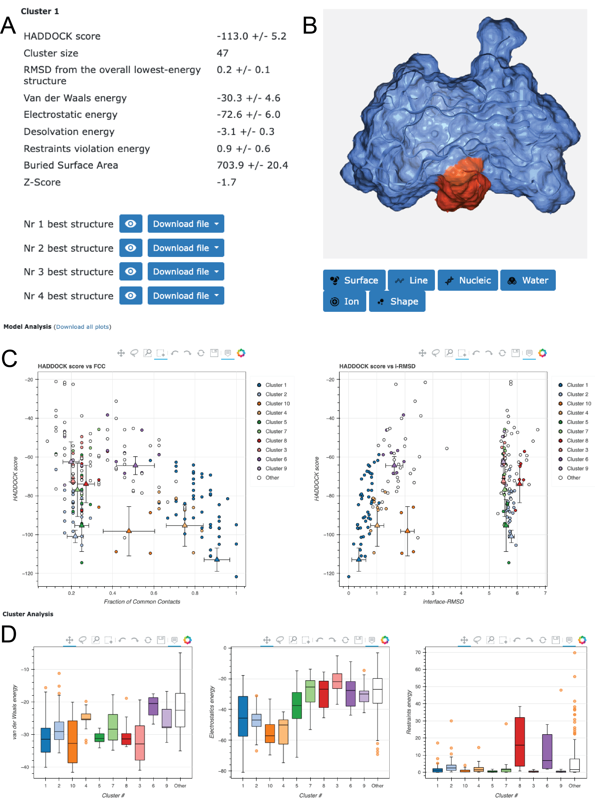

This tutorial consists of the following sections:

* table of contents
{:toc}

<hr>
<hr>

## Introduction

This tutorial demonstrates the use of HADDOCK2.4 for predicting
the structure of a protein-glycan complex using information about the protein binding site. You can check the highly related [HADDOCK3 protein-glycan tutorial](../../HADDOCK3/HADDOCK3-protein-glycan/index.md) for a command-line-based, HADDOCK3 version of the tutorial.

A glycan is a molecule composed of different monosaccharide units, linked to each other
by glycosidic bonds. Glycans are involved in a wide range of biological processes, such as
cell-cell recognition, cell adhesion, and immune response. Glycan are highly diverse and complex 
in their structure, as they can involve multiple *branches* and different *linkages*, namely different ways 
in which a glycosidic bond can connect two monosaccharides. This complexity together with their flexibility 
makes the prediction of protein-glycan interactions a challenging task.

In this tutorial we will be working with *Family 16 Cabohydrate Binding Domain Module 1* of the *Caldanaerobius polysaccharolyticus* thermophile
(PDB code [2ZEW](https://www.ebi.ac.uk/pdbe/entry/pdb/2ZEW){:target="_blank"}) and a linear homopolymer,
*5-beta-glucopyranose*, as glycan
(PDB code of the complex [2ZEX](https://www.ebi.ac.uk/pdbe/entry/pdb/2ZEX){:target="_blank"}).

<figure style="text-align: center;">
  
</figure>
<center>
  <i>Picture of the protein-glycan complex in PDB ID 2ZEX</i>
</center>
<br><br>

Throughout the tutorial, colored text will be used to refer to questions or instructions, and/or PyMOL commands.

<a class="prompt prompt-question">This is a question prompt: try answering it!</a>
<a class="prompt prompt-info">This an instruction prompt: follow it!</a>
<a class="prompt prompt-pymol">This is a PyMOL prompt: write this in the PyMOL command line prompt!</a>

<hr>
<hr>

## Requirements

In order to run this tutorial you will need to have the following software installed: [PyMOL][link-PyMOL].

Also, if not provided with special workshop credentials to use the HADDOCK portal, make sure to register in order to be able to submit jobs. Use for this the following registration page: [https://wenmr.science.uu.nl/auth/register/haddock](https://wenmr.science.uu.nl/auth/register/haddock){:target="_blank"}.

Further we are providing pre-processed PDB files for docking and analysis. For this _download and unzip the following_ [zip archive](/education/HADDOCK24/HADDOCK24-protein-glycan/HADDOCK2.4-protein-glycan.zip){:target="_blank"}
_and note the location of the extracted PDB files in your system_. 
Once unzipped, you should find the following files:

* `2ZEW_clean.pdb`: Contains the pre-processed PDB file of the protein in the unbound form
* `2ZEX_l_u.pdb`: contains the glycan structure in the unbound form
* `2ZEX_target.pdb`: the target structure of the complex

For more information about HADDOCK and its protocol please have a look at the [HADDOCK general concepts](https://www.bonvinlab.org/education/HADDOCK24/HADDOCK24-antibody-antigen/#haddock-general-concepts).

For more information about preprocessing PDB files to use in HADDOCK, please have a look at the [HADDOCK3 protein-glycan tutorial](../../HADDOCK3/HADDOCK3-protein-glycan/index.md).
<hr>
<hr>

## Loading the protein structure and inspecting the binding site

As a first step we need a structure of the protein. A crystal structure of the protein in the unbound form is available, but you are welcome to use either the bound form or the [Alphafold structure](https://www.alphafold.ebi.ac.uk/entry/Q9ZA17) if you prefer. The AlphaFold structure is much longer than the considered domain, so it may be useful to remove the non-relevant residues.

<a class="prompt prompt-info">Just remember that the quality of the resulting models will depend on the quality of the input structures.</a>

Let's have a look at the protein in PyMOL. Start PyMOL and load the PDB file of the unbound protein:

<a class="prompt prompt-pymol">
File menu -> Open -> select 2ZEW_clean.pdb
</a>

Alternatively, you can directly fetch the structure from the PDB database using PyMOL:

<a class="prompt prompt-pymol">
fetch 2ZEW
</a>

<a class="prompt prompt-question">
Can you already identify a possible binding site for a long, linear, unbranched glycan?
</a>

Here we assume that we have enough information about the glycan binding site on the protein, but no knowledge about which monosaccharide units are relevant for the binding. In this case (see Fig. 1), all the five monosaccharide units are at the interface, although this might not be true in general, especially when longer glycans are considered.

The residues corresponding to the glycan binding site on the protein (calculated from the crystal structure of the complex) are:

<pre style="background-color:#DAE4E7">
23,24,80,82,84,96,98,100,124,126,128
</pre>

Let us visualize this interface on our unbound protein structure. For this start PyMol and load the PDB file of the unbound protein:

<a class="prompt prompt-pymol">
File menu -> Open -> select 2ZEW_clean.pdb
</a>
<a class="prompt prompt-pymol">
color white, all<br>
select binding_site, (resi 23+24+80+82+84+96+98+100+124+126+128)<br>
color red, binding_site<br>
</a>

In order to visualize the binding site of a small molecule it's useful to add the side chains to our representation.

<a class="prompt prompt-pymol">
show sticks, binding_site <br>
util.cbao binding_site
</a>

<a class="prompt prompt-question">Are all the highlighted side chains exposed on the surface of the protein?</a>

**Note** that you can visualise the surface in PyMol with the following command:

<a class="prompt prompt-pymol">
color red, binding_site <br>
show surface
</a>

<hr>

## Inspecting the glycan structure

Now it is time to visualize the strucure of our glycan. In this case we used the [GLYCAM webserver](https://glycam.org/cb/){:target="_blank"} to model it.

Our glycan is a linear polymer consisting of 5 beta-D-glucopyranose units. Beta-D-glucopyranose is a common monosaccharide found basically in all the living organisms. In this case the four monosaccharides are linked by beta-1,4-glycosidic bonds, where the *anomeric carbon* (C1) of one monosaccharide is linked to the C4 of the next one.

Let's have a look at our generated glycan. Start PyMOL and then load the generated PDB file from the file menu:

<a class="prompt prompt-pymol">
File menu -> Open -> select 2ZEX_l_u.pdb
</a>

First, let's check that the linkages are correct. You can isolate C1 and C4 atoms with the following commands:

<a class="prompt prompt-pymol">
select c1, name C1 <br>
select c4, name C4
</a>

Alternatively, you can simply click on the atoms in the PyMOL window to select them.

<a class="prompt prompt-question">Are all the C1 and C4 atoms located as expected? Are all of them involved in a glycosidic bond?</a>

Now we would like to know how close the modelled glycan is to the reference structure. For this we will use Pymol to superimpose the two structures and calculate the RMSD.

<a class="prompt prompt-pymol">
fetch 2ZEX
</a>

<a class="prompt prompt-pymol">
align 2ZEX_l_u, 2ZEX, cycles=0
</a>

The `cycles=0` option will make sure that no atoms are neglected during the alignment and RMSD calculation. You can check what happens if you do not use this option.

<a class="prompt prompt-pymol">
align 2ZEX_l_u, 2ZEX
</a>

<a class="prompt prompt-question">What is the RMSD between the two glycan structures (find the value reported by PyMOL)? In which of the five monosaccharide units is the model the most accurate? In which ones is it not?</a>

<figure align="center">
  
</figure>
<center>
  <i>Comparison between the bound (light blue) and modelled (pink) glycan conformations.</i>
</center>
<br>

The two structures are pretty close to each other... Let us next see if HADDOCK can create a reasonable model of the interaction!

<hr>
<hr>

## Protein-glycan docking with HADDOCK

### Registration / Login

In previous steps we have inspected the binding site on the protein. For the glycan, we assume that we have no information about which monosaccharides interact with the protein.

If not provided with special workshop credentials, in order to start the submission you need first to register. For this go to [https://wenmr.science.uu.nl/haddock2.4/](https://wenmr.science.uu.nl/haddock2.4/){:target="_blank"} and click on **Register**.

To start the submission process, you are prompted for our login credentials. After successful validation of the credentials you can proceed to the structure upload under **Submit a new job**.

**Note:** The blue bars on the server can be folded/unfolded by clicking on the arrow on the left

### Submission and analysis of structures

We will make use of the [HADDOCK 2.4 interface](https://wenmr.science.uu.nl/haddock2.4/submit/1){:target="_blank"} of the HADDOCK web server.

In this stage of the submission process we will upload the provided, pre-processed PDB structures.

* **Step 1:** Define a name for your docking run in the field "Job name", e.g. *2zex-protein-glycan*.

* **Step 2:** Select the number of molecules to dock, in this case the default *2*.

* **Step 3:** Input the first protein PDB file. For this, unfold the **Molecule 1 - input** if not already unfolded.

<a class="prompt prompt-info">
First molecule: where is the structure provided? -> "I am submitting it"
</a>
<a class="prompt prompt-info">
Which chain to be used? -> All
</a>
<a class="prompt prompt-info">
PDB structure to submit -> Browse and select *2ZEW_clean.pdb*
</a>
<a class="prompt prompt-info">
What kind of molecule are you docking? --> Protein or Protein-Ligand<br>
</a>

**Note:** Leave all other options to their default values.

* **Step 4:** Input the second PDB file. For this, unfold the **Molecule 2 - input** if not already unfolded.

<a class="prompt prompt-info">
First molecule: where is the structure provided? -> "I am submitting it"
</a>
<a class="prompt prompt-info">
Which chain to be used? -> All
</a>
<a class="prompt prompt-info">
PDB structure to submit -> Browse and select *2ZEX_l_u.pdb*
</a>
<a class="prompt prompt-info">
What kind of molecule are you docking? --> Glycan<br>
</a>

* **Step 5:** Click on the **Next** button at the bottom left of the interface. This will upload the structures to the HADDOCK webserver where they will be processed and validated (checked for formatting errors). The server makes use of [Molprobity](htts://molprobity.biochem.duke.edu/){:target="_blank"} to check side-chain conformations, eventually swap them (e.g. for asparagines) and define the protonation state of histidine residues.

### Definition of interfaces to guide the docking

If everything went well, the interface window should have updated itself and it should now show the list of residues for molecules 1 and 2. We will be making use of the text boxes below the residue sequence of every molecule to specify the list of active residues to be used for the docking run.

* **Step 6:** Specify the active residues for the first molecule. For this, unfold the "Molecule 1 - parameters" if not already unfolded.

<a class="prompt prompt-info">
Active residues (directly involved in the interaction) -> 23,24,80,82,84,96,98,100,124,126,128
</a>

Then uncheck the option to automatically define passive residues: in our case we are defining the whole protein pocket as active, and the glycan will be defined as passive only, so this is not required.

<a class="prompt prompt-info">Automatically define passive residues around the active residues -> **uncheck** (checked by default)
</a>

By default HADDOCK will automatically filter our residues that have a relative solvent surface accessibility below 15%. This is a good default strategy, but in our case it can lead to sub-optimal results, as a few residues are buried in the protein core but still part of the pocket (for example, check Valine 82). We will therefore disable this option.

<a class="prompt prompt-info">Remove buried active/passive residues from selection
 -> **uncheck** (checked by default)
</a>

<a class="prompt prompt-info">Click on the Visualize residues button and make sure all the binding site residues have been selected. They should be highlighted in red, to indicate that they are selected as active.
</a>

* **Step 7:** Specify the residues for the second molecule. For this, unfold the "Molecule 2 - parameters" if not already unfolded.

Here we want to select the full glycan as passive, as we do not know whether all the monosaccharide units take part in the interaction.

<a class="prompt prompt-info">Automatically define passive residues around the active residues -> **uncheck** (checked by default)
</a>

<a class="prompt prompt-info">Click on the sequence (XXXXX) box to select the whole sequence of the glycan.
</a>

<a class="prompt prompt-info">This should automatically add the 5 glycan residues (1,2,3,4,5) to the passive residues box.
</a>

<a class="prompt prompt-info">Click on the Visualize residues button and make sure all the glycan monosaccharide units have been selected. They should be highlighted in green to indicate that they are selected as passive.
</a>

### Docking parameters for protein-glycan modelling

* **Step 8:** Click on the **Next** button on the bottom of the page.

Here we will tweak a few parameters to make the docking more accurate.

**Sampling parameters** : Here we will remove the final refinement step, as, as in the case of small ligands, it is not recommended for this type of molecules.

<a class="prompt prompt-info">Sampling parameters -> Perform final refinement -> **uncheck** (checked by default)
</a>

**Clustering parameters**: HADDOCK uses by default FCC clustering to cluster docking models. For protein glycan docking, this is not the best option, as different models can have very similar contacts. RMSD-based clustering is more appropriate in this case.

If not already done automatically, we should change the followin clustering parameters

<a class="prompt prompt-info">Clustering method -> RMSD
</a>
<a class="prompt prompt-info">RMSD cutoff -> 2.5
</a>

**Scoring parameters**: here we should modify the weight of the van der Waals component of the HADDOCK score at the rigidbody stage to 1.0 instead than the default 0.01. This is in agreement with the settings used for protein-small molecules docking in HADDOCK2.4, as explained in [Journal of Computer-Aided Molecular Design, 2019](https://link.springer.com/article/10.1007/s10822-019-00244-6) and also applied to protein-glycan docking. 

<a class="prompt prompt-info">Scoring parameters -> Evdw 1 -> 1.0
</a>

The interface allows us to download the input structures of the docking run (in the form of a tgz archive) and a haddockparameter file which contains all the settings and input structures for our run (in json format). We strongly recommend downloading this file as it will allow you to repeat the run by uploading it into the file upload interface of the HADDOCK webserver. The haddockparameter file also serves as a run input reference. It can be edited to change a few parameters and repeat the run without going through the whole menu process again.

* **Step 9:** Click on the "Submit" button at the bottom left of the interface.

Upon submission you will be presented with a web page which also contains a link to the previously mentioned haddockparameter file as well as some information about the status of the run.

Currently your run should be queued but eventually its status will change to "Running":

The page will automatically refresh and the results will appear upon completion of the run (which can take between 1/2 hour to several hours depending on the size of your system and the load of the server). You will be notified by email once your job has successfully completed.

If you do not wish to wait for the run to finish, you can find the results of the run [at this link](https://rascar.science.uu.nl/haddock2.4/result/1184711698/484985-2zex).

<hr>
<hr>

## Analysis of docking results

<hr>

### Inspecting the results page of the docking run

Once your run has completed you will be presented with a result page showing the cluster statistics and some graphical representation of the data (and if registered, you will also be notified by email).

In case you do not want to wait for your runs to be finished, a precalculated run can be found [here](https://rascar.science.uu.nl/haddock2.4/result/1184711698/484985-2zex).

<a class="prompt prompt-question">Inspect the result page</a>

<a class="prompt prompt-question">How many clusters are generated?</a>

In the figure below you can see different parts of the result page. 

**In A** the result page reports the number of clusters and for the top 10 clusters also the related statistics (HADDOCK score, Size, RMSD, Energies, BSA and Z-score).

While the name of the clusters is defined by their size (cluster 1 is the largest, followed by cluster 2 etc..) the top 10 clusters are selected and sorted according to the average HADDOCK score of the best 4 models of each cluster, from the lowest (best) HADDOCK score to the highest (worst).

**In B** the visualization option of the various models is shown. You can visualize online a model by clicking on the **eye** icon, or download those for further analysis.

<a class="prompt prompt-info">Toggle the Surface or the Line buttons to visualize the glycan.</a>

**In C** a view of some graphical representation of the results shown at the bottom of the page under **Model analysis** is shown. Distribution of various measures (HADDOCK score, van der Waals energy, ...) as a function of the Fraction of Common Contact with- and RMSD from the best generated model (the best scoring model) are shown. The models are color-coded by the cluster they belong to. You can turn on and off specific clusters, but also zoom in on specific areas of the plot.

**In D** the **Cluster analysis** section shows you the distribution of components of the HADDOCK score (Evdw, Eelec and Edesol) for the various clusters.

<figure align="center">

</figure>

The ranking of the clusters is based on the average score of the top 4 members of each cluster. The score is calculated as:
<pre>
      HADDOCKscore = 1.0 * Evdw + 0.2 * Eelec + 1.0 * Edesol + 0.1 * Eair
</pre>
where Evdw is the intermolecular van der Waals energy, Eelec the intermolecular electrostatic energy, Edesol represents an empirical desolvation energy term adapted from Fernandez-Recio *et al.* J. Mol. Biol. 2004, and Eair the AIR energy.

<a class="prompt prompt-question">Consider the cluster scores and their standard  deviations.</a>
<a class="prompt prompt-question">Is the top ranked cluster significantly better than the second one? What about the third cluster?</a>

In case the scores of various clusters are within standard deviation from each other, all should be considered as a valid solution for the docking. Ideally, some additional independent experimental information should be available to decide on the best solution. In this case we do have such a piece of information, namely the crystal structure of the complex.

<hr>

### Visualisation and comparison with the reference structure

In the CAPRI (Critical Prediction of Interactions) [Méndez et al. 2003](https://doi.org/10.1002/prot.10393){:target="_blank"} 
experiment, one of the parameters used is the Ligand root-mean-square deviation (l-RMSD) which is calculated by superimposing 
the structures onto the backbone atoms of the receptor (the antibody in this case) and calculating the RMSD on the backbone 
residues of the ligand (the antigen). To calculate the l-RMSD it is possible to either use the software 
[Profit](http://www.bioinf.org.uk/software/profit){:target="_blank"} or [PyMOL](https://PyMOL.org/2/){:target="_blank"}.
For the sake of convenience we have provided you with a renumbered reference structure `2ZEX_target.pdb` (in the zip archive you downloaded (see Setup)).

<a class="prompt prompt-info">From your completed (or pre-calculated) result page, use the option to _download all cluster files_ and uncompress the archive (alternatively download for each cluster the Nr. 1 best model).
</a>

To visualize the models from top cluster of your favorite run, start PyMOL and load the cluster representatives you want to view, 
e.g. this could be the top models of the first three clusters.

In the case of the pre-calculated run, those are:

<a class="prompt prompt-pymol">
File menu -> Open -> cluster1_1.pdb <br>
File menu -> Open -> cluster2_1.pdb <br>
File menu -> Open -> cluster10_1.pdb <br>
</a>

If you want to get an impression of how well defined a cluster is, repeat this for the best N models you want to view (`cluster1_X.pdb`).

From the pdbs directory we can load the reference structure:
<a class="prompt prompt-pymol">
File menu -> Open -> 2ZEX_target.pdb
</a>

Once all files have been loaded, type in the PyMOL command window:

<a class="prompt prompt-pymol">
show cartoon<br>
util.cbc<br>
color yellow, 2ZEX_target<br>
util.cnc<br>
</a>

Let us then superimpose all models on the reference structure:

<a class="prompt prompt-pymol">
alignto 2ZEX_target
</a>

This will align the proteins. To evaluate the quality of the glycan pose, we can now calculate the ligand-RMSD (l-RMSD) between the glycan in the model and the reference structure. This can be done with the following, superimposition-free PyMOL command:

<a class="prompt prompt-pymol">
rms_cur 2ZEX_target and chain B, cluster1_1 and chain B <br>
rms_cur 2ZEX_target and chain B, cluster2_1 and chain B <br>
rms_cur 2ZEX_target and chain B, cluster10_1 and chain B <br>
</a>

<a class="prompt prompt-question">
What is the l-RMSD of the best model of the top cluster? What about the second and third clusters? Which of them is the best one?
</a>


Let us now focus on the conformation of the glycan itself.

<a class="prompt prompt-question">Did the flexible refinement improved the glycan conformation?</a>

To address this question you can use the standard align command, focusing on chain B:

<a class="prompt prompt-pymol">
align cluster10_1 and chain B, 2ZEX_target and chain B, cycles=0
</a>

Compare the RMSD values you obtained with that of the conformation we used originally for docking. 

<details style="background-color:#DAE4E7">
 <summary style="bold">
 <i>See RMSD values of the orignal and docked glycan conformations with respect to that of the reference crystal structure</i>
  </summary>
  <pre>
    2ZEX_l_u.pdb
    cluster1_1.pdb
    cluster2_1.pdb
    cluster3_1.pdb
    ...
  </pre>
  <br>
</details>

Let us now check if the active residues which we have defined (the protein binding site) are actually part of the interface. In the PyMOL command window type:

<a class="prompt prompt-pymol">
select binding_site, chain A and (resi 23+24+80+82+84+96+98+100+124+126+128) and not 2ZEX_target<br>
color red, binding_site<br>
show lines, binding_site<br>
</a>

<a class="prompt prompt-question">
Are the residues of the binding_site at the interface with the glycan?
</a>

**Note:** You can turn on and off a model by clicking on its name in the right panel of the PyMOL window.

<details style="background-color:#DAE4E7">
 <summary style="bold">
 <i>See the overlay of the cluster solution with the lowest lRMSD values (ranked #3) onto the reference crystal structure (in yellow)</i>
  </summary>
  <figure style="text-align: center">
    
  </figure>
  <br>
</details>

<hr>
<hr>

## Conclusions

In this tutorial we have demonstrated the use of the HADDOCK 2.4 webserver to predict the structure of a protein-glycan complex using information about the protein binding site. Always check and compare multiple clusters, do not blindly trust the cluster with the best HADDOCK score! We have also discussed the analysis of the docking results and the comparison with the reference structure.

We hope you have enjoyed this tutorial and that you have learned something new. If you have any questions or feedback, please do not hesitate to contact us on the [HADDOCK forum][link-forum]{:target="_blank"}.

<hr>
<hr>

## BONUS: Adding pairwise contact information

In the tutorial we used information about the protein binding site to drive the docking. Such information, though, was quite coarse, as we only had a list of residues that were supposed to be part of the binding site.

In this section we will see how you can add more fine-grained information to HADDOCK. As an example, we will assume that we know that a Saturation Transfer Difference (STD) NMR experiment has been performed and that 2 protons on the third monosaccharide give the strongest STD signal. This means that these two hydrogens are in close contact with the protein.

Then, let's assume we are able to infer the contact those two hydrogens make with the protein and in particular with residue Gln84. 

<a class="prompt prompt-info">Since HADDOCK does not keep all the hydrogens by default, we define the restraints with respect to the two oxygens of the glycan.</a>

The two protons are those located on the O2 and O3 oxygens, that are located at a distance of 2.7 and 3.0 Å from the two Gln84 terminal atoms, respectively. We're sure about these contacts, so we will add them to the docking run as an unambiguous restraints. By doing this, the restraints will be always enforced, and all our resulting models should be compatible with them.

To add these restraints we have to create a file that contains information about the restraints (table file):

```
! std nmr restraints
assign (resid 84 and name OE1 and segid A) (resid 3 and name O2 and segid B) 2.7 0.00 0.00
assign (resid 84 and name NE2 and segid A) (resid 3 and name O3 and segid B) 3.0 0.00 0.00
```

The first line is a comment. The second and third lines contain the information about the restraints. Between the two parenthesis you can see the selection of the atoms that are restrained: the first atom is the one from the protein, and the second one is the one from the glycan. The last three numbers are the selected distance, the lower bound and the upper bound of the restraint. The latter are 0.0, thus indicating that any deviation from the specified distance will be penalized during the docking.

<figure style="text-align: center">
  
</figure>
<center>
  <i>Graphical representation of the imposed unambiguous restraints between the glycan and the protein.</i>
</center>

<br>

<a class="prompt prompt-info">Save the file as contacts.tbl in the same directory as the PDB files.</a>

<a class="prompt prompt-info">Now let's go back to the HADDOCK webserver perform the docking again!</a>

* **Step 1:** Go to the HADDOCK webserver and click on **Submit a new job**.

* **Step 2:** repeat steps 1-7 as [before](#submission-and-analysis-of-structures), including the [generation of restraints](#definition-of-interfaces-to-guide-the-docking).

* **Step 3:** In the **Docking parameters** section, you can find the option to upload an unambiguous restraints table file (**You can supply a HADDOCK restraints TBL file with restraints that will always be enforced (unambiguous restraints)**). Upload the `contacts.tbl` file you just created.

* **Step 4:** Adjust the other docking parameters as explained [in the dedicated section of the tutorial](#docking-parameters-for-protein-glycan-modelling).

* **Step 5:** Click on the **Submit** button at the bottom left of the interface.

You can inspect the results of a precalculated run [here](https://rascar.science.uu.nl/haddock2.4/result/1184711698/485935-2zex-bonus).

<a class="prompt prompt-question">How many clusters are generated? Is the first cluster unambiguously better than the second and third ones? Are the HADDOCK scores better than in the previous case?</a>

<a class="prompt prompt-question">Can you make an hypothesis about the reason why we have a lower number of clusters than before?</a>

<a class="prompt prompt-question">What is the l-RMSD of the best model of the top cluster?</a>


<!-- Links -->
[air-help]: https://www.bonvinlab.org/software/haddock2.4/airs/ "AIRs help"
[gentbl]: https://wenmr.science.uu.nl/gentbl/ "GenTBL"
[haddock24protein]: /education/HADDOCK24/HADDOCK24-protein-protein-basic/
[haddock-repo]: https://github.com/haddocking/haddock3 "HADDOCK3 GitHub"
[installation]: https://www.bonvinlab.org/haddock3/INSTALL.html "Installation"
[link-cns]: https://cns-online.org "CNS online"
[link-forum]: https://ask.bioexcel.eu/c/haddock "HADDOCK Forum"
[link-pdbtools]:http://www.bonvinlab.org/pdb-tools/ "PDB-Tools"
[link-pymol]: https://www.pymol.org/ "PyMOL"
[nat-pro]: https://www.nature.com/articles/s41596-024-01011-0.epdf?sharing_token=UHDrW9bNh3BqijxD2u9Xd9RgN0jAjWel9jnR3ZoTv0O8Cyf_B_3QikVaNIBRHxp9xyFsQ7dSV3t-kBtpCaFZWPfnuUnAtvRG_vkef9o4oWuhrOLGbBXJVlaaA9ALOULn6NjxbiqC2VkmpD2ZR_r-o0sgRZoHVz10JqIYOeus_nM%3D "Nature protocol"
[tbl-examples]: https://github.com/haddocking/haddock-tools/tree/master/haddock_tbl_validation "tbl examples"
