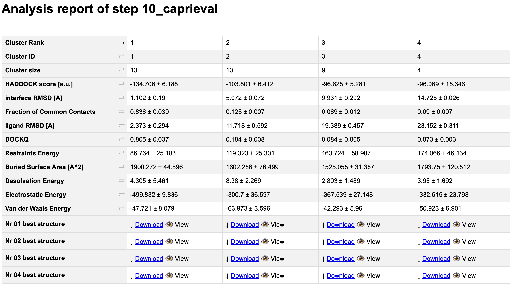
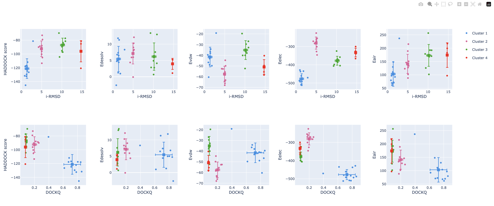
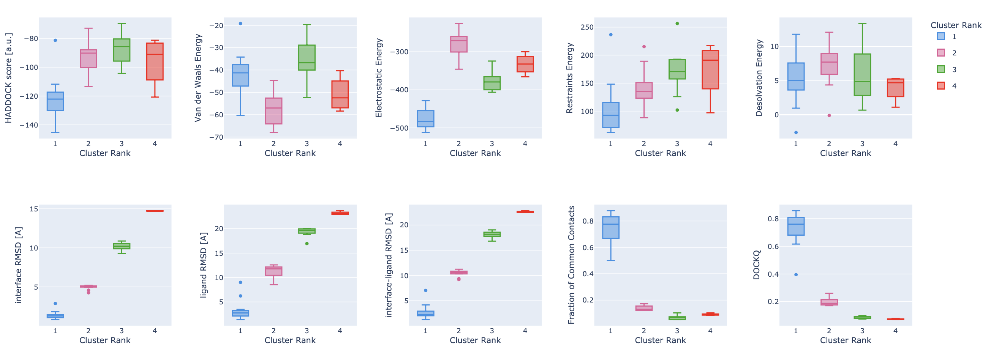

This tutorial consists of the following sections:

* table of contents
{:toc}

## Introduction

This tutorial demonstrates the use of the new modular HADDOCK3 version for predicting
the structure of an antibody-antigen complex using knowledge of the hypervariable loops
on the antibody (i.e., the most basic knowledge) and epitope information identified from NMR experiments for the antigen to guide the docking.

An antibody is a large protein that generally works by attaching itself to an antigen,
which is a unique site of the pathogen. The binding harnesses the immune system to directly
attack and destroy the pathogen. Antibodies can be highly specific while showing low immunogenicity,
which is achieved by their unique structure. **The fragment crystallizable region (Fc region)**
activates the immune response and is species-specific, i.e. the human Fc region should not
induce an immune response in humans.  **The fragment antigen-binding region (Fab region**)
needs to be highly variable to be able to bind to antigens of various nature (high specificity).
In this tutorial we will concentrate on the terminal **variable domain (Fv)** of the Fab region.

<figure style="text-align: center;">
  
</figure>

The small part of the Fab region that binds the antigen is called **paratope**. The part of the antigen
that binds to an antibody is called **epitope**. The paratope consists of six highly flexible loops,
known as **complementarity-determining regions (CDRs)** or hypervariable loops whose sequence
and conformation are altered to bind to different antigens. CDRs are shown in red in the figure below:

<figure style="text-align: center;">
  
</figure>

In this tutorial we will be working with Interleukin-1β (IL-1β)
(PDB code [4I1B](https://www.ebi.ac.uk/pdbe/entry/pdb/4i1b){:target="_blank"}) as an antigen
and its highly specific monoclonal antibody gevokizumab
(PDB code [4G6K](https://www.ebi.ac.uk/pdbe/entry/pdb/4g6k){:target="_blank"})
(PDB code of the complex [4G6M](https://www.ebi.ac.uk/pdbe/entry/pdb/4g6m){:target="_blank"}).

Throughout the tutorial, colored text will be used to refer to questions or
instructions, and/or PyMOL commands.

<a class="prompt prompt-question">This is a question prompt: try answering it!</a>
<a class="prompt prompt-info">This an instruction prompt: follow it!</a>
<a class="prompt prompt-pymol">This is a PyMOL prompt: write this in the PyMOL command line prompt!</a>
<a class="prompt prompt-cmd">This is a Linux prompt: insert the commands in the terminal!</a>

## HADDOCK general concepts

HADDOCK (see [https://www.bonvinlab.org/software/haddock2.4](https://www.bonvinlab.org/software/haddock2.4){:target="_blank"})
is a collection of python scripts derived from ARIA ([https://aria.pasteur.fr](https://aria.pasteur.fr){:target="_blank"})
that harness the power of CNS (Crystallography and NMR System – [https://cns-online.org](https://cns-online.org){:target="_blank"})
for structure calculation of molecular complexes. What distinguishes HADDOCK from other docking software is its ability,
inherited from CNS, to incorporate experimental data as restraints and use these to guide the docking process alongside
traditional energetics and shape complementarity. Moreover, the intimate coupling with CNS endows HADDOCK with the
ability to actually produce models of sufficient quality to be archived in the Protein Data Bank.

A central aspect to HADDOCK is the definition of Ambiguous Interaction Restraints or AIRs. These allow the
translation of raw data such as NMR chemical shift perturbation or mutagenesis experiments into distance
restraints that are incorporated in the energy function used in the calculations. AIRs are defined through
a list of residues that fall under two categories: active and passive. Generally, active residues are those
of central importance for the interaction, such as residues whose knockouts abolish the interaction or those
where the chemical shift perturbation is higher. Throughout the simulation, these active residues are
restrained to be part of the interface, if possible, otherwise incurring in a scoring penalty. Passive residues
are those that contribute for the interaction, but are deemed of less importance. If such a residue does
not belong in the interface there is no scoring penalty. Hence, a careful selection of which residues are
active and which are passive is critical for the success of the docking.

## A brief introduction to HADDOCK3

HADDOCK3 is the next generation integrative modelling software in the
long-lasting HADDOCK project. It represents a complete rethinking and rewriting
of the HADDOCK2.X series, implementing a new way to interact with HADDOCK and
offering new features to users who can now define custom workflows.

In the previous HADDOCK2.x versions, users had access to a highly
parameterisable yet rigid simulation pipeline composed of three steps:
`rigid-body docking (it0)`, `semi-flexible refinement (it1)`, and `final refinement (itw)`.

<figure style="text-align: center;">

</figure>

In HADDOCK3, users have the freedom to configure docking workflows into
functional pipelines by combining the different HADDOCK3 modules, thus
adapting the workflows to their projects. HADDOCK3 has therefore developed to
truthfully work like a puzzle of many pieces (simulation modules) that users can
combine freely. To this end, the “old” HADDOCK machinery has been modularized,
and several new modules added, including third-party software additions. As a
result, the modularization achieved in HADDOCK3 allows users to duplicate steps
within one workflow (e.g., to repeat twice the `it1` stage of the HADDOCK2.x
rigid workflow).

Note that, for simplification purposes, at this time, not all functionalities of
HADDOCK2.x have been ported to HADDOCK3, which does not (yet) support NMR RDC,
PCS and diffusion anisotropy restraints, cryo-EM restraints and coarse-graining.
Any type of information that can be converted into ambiguous interaction
restraints can, however, be used in HADDOCK3, which also supports the
*ab initio* docking modes of HADDOCK.

<figure style="text-align: center;">

</figure>

To keep HADDOCK3 modules organized, we catalogued them into several
categories. But, there are no constraints on piping modules of different
categories.

The main module categories are "topology", "sampling", "refinement",
"scoring", and "analysis". There is no limit to how many modules can belong to a
category. Modules are added as developed, and new categories will be created
if/when needed. You can access the HADDOCK3 documentation page for the list of
all categories and modules. Below is a summary of the available modules:

* **Topology modules**
    * `topoaa`: *generates the all-atom topologies for the CNS engine.*
* **Sampling modules**
    * `rigidbody`: *Rigid body energy minimization with CNS (`it0` in haddock2.x).*
    * `lightdock`: *Third-party glow-worm swam optimization docking software.*
* **Model refinement modules**
    * `flexref`: *Semi-flexible refinement using a simulated annealing protocol through molecular dynamics simulations in torsion angle space (`it1` in haddock2.x).*
    * `emref`: *Refinement by energy minimisation (`itw` EM only in haddock2.4).*
    * `mdref`: *Refinement by a short molecular dynamics simulation in explicit solvent (`itw` in haddock2.X).*
* **Scoring modules**
    * `emscoring`: *scoring of a complex performing a short EM (builds the topology and all missing atoms).*
    * `mdscoring`: *scoring of a complex performing a short MD in explicit solvent + EM (builds the topology and all missing atoms).*
* **Analysis modules**
    * `alascan`: *Performs a systematic (or user-define) alanine scanning mutagenesis of interface residues.*
    * `caprieval`: *Calculates CAPRI metrics (i-RMSD, l-RMSD, Fnat, DockQ) with respect to the top scoring model or reference structure if provided.*
    * `clustfcc`: *Clusters models based on the fraction of common contacts (FCC)*
    * `clustrmsd`: *Clusters models based on pairwise RMSD matrix calculated with the `rmsdmatrix` module.*
    * `contactmap`: *Generate contact matrices of both intra- and intermolecular contacts and a chordchart of intermolecular contacts.*
    * `rmsdmatrix`: *Calculates the pairwise RMSD matrix between all the models generated in the previous step.*
    * `seletop`: *Selects the top N models from the previous step.*
    * `seletopclusts`: *Selects top N clusters from the previous step.*

The HADDOCK3 workflows are defined in simple configuration text files, similar to the TOML format but with extra features.
Contrarily to HADDOCK2.X which follows a rigid (yet highly parameterisable)
procedure, in HADDOCK3, you can create your own simulation workflows by
combining a multitude of independent modules that perform specialized tasks.

## Software and data setup

In order to follow this tutorial you will need to work on a Linux or MacOSX
system. We will also make use of [**PyMOL**][link-pymol] (freely available for
most operating systems) in order to visualize the input and output data. We will
provide you links to download the various required software and data.

Further we are providing pre-processed PDB files for docking and analysis (but the
preprocessing of those files will also be explained in this tutorial). The files have been processed
to facilitate their use in HADDOCK and for allowing comparison with the known reference
structure of the complex. 

If you are running this tutorial on your own resources _download and unzip the following_
[zip archive](https://surfdrive.surf.nl/files/index.php/s/5WIXeRRZEVmiuw0){:target="_blank"}
_and note the location of the extracted PDB files in your system_. 
If running as part of the EU-ASEAN HPC school see the instructions below.

_Note_ that you can also download and unzip this archive directly from the Linux command line:

<a class="prompt prompt-cmd">
wget https://surfdrive.surf.nl/files/index.php/s/5WIXeRRZEVmiuw0/download -O HADDOCK3-antibody-antigen.zip 
unzip HADDOCK3-antibody-antigen-BioExcel.zip
</a>

Unziping the file will create the `HADDOCK3-antibody-antigen` directory which should contain the following directories and files:

* `docking-antibody-antigen-CDR-NMR-CSP.cfg`: the HADDOCK3 configuration file used in this tutorial
* `workflows`: a directory containing example haddock3 config files (workflows)
* `pdbs`: a directory ontains the pre-processed PDB files
* `restraints`: a directory containing the interface information and the corresponding restraint files for HADDOCK
* `runs`: a directory with pre-calculated results
* `scripts`: a directory containing various scripts used in this tutorial

### EU-ASEAN 2023 HPC school

We will be making use of the Fugaku supercomputer for this tutorial. 
Please connect to fugaku using your credentials.

The software and data required for this tutorial have been pre-installed on Fugaku.
In order to run the tutorial, first copy the required data into your home directory on fugagku:

<a class="prompt prompt-cmd">
unzip /vol0300/share/ra022304/LifeScience/20231213_Bonvin/HADDOCK3-antibody-antigen.zip
</a>

This will create the `HADDOCK3-antibody-antigen` directory with all necessary data and script and job examples ready for submission to the batch system.

HADDOCK3 has been pre-installed for the compute nodes. To test the installation, first create an interactive session on a node with:

<a class="prompt prompt-cmd">
pjsub \-\-interact \-L "node=1" \-L \"rscgrp=int\" \-\-sparam \"wait-time=600\" -L \"elapse=01:00:00\"
</a>

Once the session is active, activate HADDOCK3 with:

<a class="prompt prompt-cmd">
source /vol0300/share/ra022304/LifeScience/20231213_Bonvin/miniconda3/etc/profile.d/conda.sh 
conda activate haddock3
</a>

You can then test that haddock3 is indeed accessible with:

<a class="prompt prompt-cmd">
haddock3 -h
</a>

You should see a small help message explaining how to use the software.

  

  <i>View output</i><i class="material-icons">expand_more</i>
 

<pre>
(haddock3)$ haddock3 -h
usage: haddock3 [-h] [--restart RESTART] [--extend-run EXTEND_RUN] [--setup]
                [--log-level {DEBUG,INFO,WARNING,ERROR,CRITICAL}] [-v]
                recipe

positional arguments:
  recipe                The input recipe file path

optional arguments:
  -h, --help            show this help message and exit
  --restart RESTART     Restart the run from a given step. Previous folders from the
                        selected step onward will be deleted.
  --extend-run EXTEND_RUN
                        Start a run from a run directory previously prepared with the
                        `haddock3-copy` CLI. Provide the run directory created with
                        `haddock3-copy` CLI.
  --setup               Only setup the run, do not execute
  --log-level {DEBUG,INFO,WARNING,ERROR,CRITICAL}
  -v, --version         show version
</pre>

 
In case you want to obtain HADDOCK3 for another platform, navigate to [its repository][haddock-repo], fill the
registration form, and then follow the [installation instructions](https://www.bonvinlab.org/haddock3/INSTALL.html){:target="_blank"}.

### Local setup (on your own)

If you are installing HADDOCK3 on your own system check the instructions are requirement below.

#### Installing HADDOCK3

To obtain HADDOCK3 navigate to [its repository][haddock-repo], fill the
registration form, and then follow the [installation instructions](https://www.bonvinlab.org/haddock3/INSTALL.html){:target="_blank"}.

#### Installing CNS

The other required piece of software to run HADDOCK is its computational engine,
CNS (Crystallography and NMR System –
[https://cns-online.org](https://cns-online.org){:target="_blank"}). CNS is
freely available for non-profit organizations. In order to get access to all
features of HADDOCK you will need to compile CNS using the additional files
provided in the HADDOCK distribution in the `extras/cns1.3` directory. Compilation of
CNS might be non-trivial. Some guidance on installing CNS is provided in the online
HADDOCK3 documentation page [here](https://www.bonvinlab.org/haddock3/CNS.html){:target="_blank"}.

Once CNS has been properly compiled, you will have to copy the executable to `haddock3/bin/cns` and make sure it is executable and work. Try starting cns from the command line. You should see the following output:

  

  <i>View CNS prompt output</i><i class="material-icons">expand_more</i>
 

<pre>
          ============================================================
          |                                                          |
          |            Crystallography & NMR System (CNS)            |
          |                         CNSsolve                         |
          |                                                          |
          ============================================================
           Version: 1.3 at patch level U
           Status: Special UU release with Rg, paramagnetic
                   and Z-restraints (A. Bonvin, UU 2013)
          ============================================================
           Written by: A.T.Brunger, P.D.Adams, G.M.Clore, W.L.DeLano,
                       P.Gros, R.W.Grosse-Kunstleve,J.-S.Jiang,J.M.Krahn,
                       J.Kuszewski, M.Nilges, N.S.Pannu, R.J.Read,
                       L.M.Rice, G.F.Schroeder, T.Simonson, G.L.Warren.
           Copyright (c) 1997-2010 Yale University
          ============================================================
           Running on machine: hostname unknown (Linux,64-bit)
           Program started by: l00902
           Program started at: 16:34:22 on 06-Dec-2023
          ============================================================

 FFT3C: Using FFTPACK4.1

CNSsolve>
</pre>

 
Exit the CNS command line by typing `stop`.

#### Auxiliary software

**[PDB-tools][link-pdbtools]**: A useful collection of Python scripts for the
manipulation (renumbering, changing chain and segIDs...) of PDB files is freely
available from our GitHub repository. `pdb-tools` is automatically installed
with HADDOCK3. If you have activated the HADDOCK3 Python environment you have
access to the pdb-tools package.

**[PyMol][link-pymol]**: In this tutorial we will make use of PyMol for visualization. If not
already installed on your system, download and install PyMol. Note that you can use your favorite visulation software but instructions are only provided here for PyMol.

## Preparing PDB files for docking

In this section we will prepare the PDB files of the antibody and antigen for docking.
Crystal structures of both the antibody and the antigen in their free forms are available from the
[PDBe database](https://www.pdbe.org){:target="_blank"}. 

*__Important:__ For a docking run with HADDOCK, each molecule should consist of a single chain with non-overlapping residue numbering*.

As an antibody consists of two chains (L+H), we will have to prepare it for use in HADDOCK. For this we will be making use of `pdb-tools` from the command line.

_**Note**_ that `pdb-tools` is also available as a [web service](https://wenmr.science.uu.nl/pdbtools/){:target="_blank"}.

### Preparing the antibody structure

Using PDB-tools we will download the unbound structure of the antibody from the PDB database (the PDB ID is [4G6K](https://www.ebi.ac.uk/pdbe/entry/pdb/4g6k){:target="_blank"}) and then process it to have a unique chain ID (A) and non-overlapping residue numbering by renumbering the merged pdb (starting from 1).

This can be done from the command line with:

<a class="prompt prompt-cmd">
pdb_fetch 4G6K | pdb_tidy \-strict | pdb_selchain \-H | pdb_delhetatm | pdb_fixinsert | pdb_keepcoord | pdb_selres \-1:120 | pdb_tidy -strict > 4G6K_H.pdb
</a>
<a class="prompt prompt-cmd">
pdb_fetch 4G6K | pdb_tidy \-strict | pdb_selchain -L | pdb_delhetatm | pdb_fixinsert | pdb_keepcoord | pdb_selres \-1:107 | pdb_tidy \-strict > 4G6K_L.pdb
</a>
<a class="prompt prompt-cmd">
pdb_merge 4G6K_H.pdb 4G6K_L.pdb | pdb_reres \-1 | pdb_chain \-A | pdb_chainxseg | pdb_reres \-1 | pdb_tidy \-strict > 4G6K_clean.pdb
</a>

The first command fetches the PDB ID, selects the heavy chain (H) (`pdb_selchain`) and removes water and heteroatoms (`pdb_delhetatm`) (in this case no co-factor is present that should be kept).

An important part for antibodies is the `pdb_fixinsert` command that fixes the residue numbering of the HV loops: Antibodies often follow the [Chothia numbering scheme](https://pubmed.ncbi.nlm.nih.gov/9367782/?otool=inluulib){:target="_blank"} and insertions created by this numbering scheme (e.g. 82A, 82B, 82C) cannot be processed by HADDOCK directly (if not done those residues will not be considered resulting effectively in a break in the loop). As such renumbering is necessary before starting the docking. 

Then, the command `pdb_selres` selects only the residues from 1 to 120, so as to consider only the variable domain (FV) of the antibody. This allows to save a substantial amount of computational resources.

The second command does the same for the light chain (L) with the difference that the light chain is slightly shorter and we can focus on the first 107 residues.

The third and last command merges the two processed chains, renumber the residues starting from 1 (`pdb_reres`) and assign them unique chain and segIDs (`pdb_chain` and `pdb_chainxseg`), resulting in the HADDOCK-ready `4G6K_clean.pdb` file. You can view its sequence running:

<a class="prompt prompt-cmd">
pdb_tofasta 4G6K_clean.pdb
</a>

_**Note**_ The ready-to-use file can be found in the `pdbs` directory of the provided tutorial data.

### Preparing the antigen structure

Using PDB-tools we will download the unbound structure of Interleukin-1β from the PDB database (the PDB ID is [4I1B](https://www.ebi.ac.uk/pdbe/entry/pdb/4i1b){:target="_blank"}), remove the hetero atoms and then process it to assign it chainID B.

*__Important__: Each molecule given to HADDOCK in a docking scenario must have a unique chainID/segID.*

<a class="prompt prompt-cmd">
pdb_fetch 4I1B | pdb_tidy \-strict | pdb_delhetatm  | pdb_keepcoord | pdb_chain \-B | pdb_chainxseg | pdb_tidy \-strict > 4I1B_clean.pdb
</a>

## Defining restraints for docking

Before setting up the docking we need first to generate distance restraint files
in a format suitable for HADDOCK.  HADDOCK uses [CNS][link-cns]{:target="_blank"} as computational
engine. A description of the format for the various restraint types supported by
HADDOCK can be found in our [Nature Protocol][nat-pro]{:target="_blank"} paper, Box 4.

Distance restraints are defined as follows:

<pre style="background-color:#DAE4E7">
assi (selection1) (selection2) distance, lower-bound correction, upper-bound correction
</pre>

The lower limit for the distance is calculated as: distance minus lower-bound correction
and the upper limit as: distance plus upper-bound correction

The syntax for the selections can combine information about:

* chainID - `segid` keyword
* residue number - `resid` keyword
* atom name - `name` keyword.

Other keywords can be used in various combinations of OR and AND statements. Please refer for that to the [online CNS manual][link-cns]{:target="_blank"}.

E. g. a distance restraint between the CB carbons of residues 10 and 200 in chains A and B with an
allowed distance range between 10 and 20Å would be defined as follows:

<pre style="background-color:#DAE4E7">
assi (segid A and resid 10 and name CB) (segid B and resid 200 and name CB) 20.0 10.0 0.0
</pre>

<a class="prompt prompt-question">
Can you think of a different way of defining the distance and lower and upper corrections while maintaining the same
allowed range?
</a>

### Identifying the paratope of the antibody

Nowadays there are several computational tools that can identify the paratope (the residues of the hypervariable loops involved in binding) from the provided antibody sequence. In this tutorial we are providing you the corresponding list of residue obtained using [ProABC-2](https://wenmr.science.uu.nl/proabc2/){:target="_blank"}. ProABC-2 uses a convolutional neural network to identify not only residues which are located in the paratope region but also the nature of interactions they are most likely involved in (hydrophobic or hydrophilic). The work is described in [Ambrosetti, *et al* Bioinformatics, 2020](https://academic.oup.com/bioinformatics/article/36/20/5107/5873593){:target="_blank"}.

The corresponding paratope residues (those with either an overall probability >= 0.4 or a probability for hydrophobic or hydrophilic > 0.3) are:

<pre style="background-color:#DAE4E7">
31,32,33,34,35,52,54,55,56,100,101,102,103,104,105,106,151,152,169,170,173,211,212,213,214,216
</pre>

The numbering corresponds to the numbering of the `4G6K_clean.pdb` PDB file.

Let us visualize those onto the 3D structure.
For this start PyMOL and load `4G6K_clean.pdb`

<a class="prompt prompt-pymol">
File menu -> Open -> select 4G6K_clean.pdb
</a>

Alternatively, if PyMol is accessible from the command line simply type:

<a class="prompt prompt-cmd">
pymol 4G6K_clean.pdb
</a>

We will now highlight the predicted paratope. In PyMOL type the following commands:

<a class="prompt prompt-pymol">
color white, all
</a>
<a class="prompt prompt-pymol">
select paratope, (resi 31+32+33+34+35+52+54+55+56+100+101+102+103+104+105+106+151+152+169+170+173+211+212+213+214+216) 
</a>
<a class="prompt prompt-pymol">
color red, paratope
</a>

<a class="prompt prompt-question">
Can you identify the H3 loop? H stands for heavy chain (the first domain in our case with lower residue numbering). H3 is typically the longest loop.
</a>

Let us now switch to a surface representation to inspect the predicted binding site.

<a class="prompt prompt-pymol">
show surface 
</a>

Inspect the surface.

<a class="prompt prompt-question">
Do the identified paratope residues form a well defined patch on the surface?
</a>

  

    <b><i>See surface view of the paratope</i></b> <i class="material-icons">expand_more</i>
  

  <figure style="text-align: center;">
    
  </figure>
   

### Identifying the epitope of the antigen

The article describing the crystal structure of the antibody-antigen complex we are modelling also reports on experimental NMR chemical shift titration experiments to map the binding site of the antibody (gevokizumab) on Interleukin-1β. The residues affected by binding are listed in Table 5 of
[Blech et al. JMB 2013](https://dx.doi.org/10.1016/j.jmb.2012.09.021){:target="_blank"}:

<figure style="text-align: center;">
  
</figure>

The list of binding site (epitope) residues identified by NMR is:

<pre style="background-color:#DAE4E7">
72,73,74,75,81,83,84,89,90,92,94,96,97,98,115,116,117
</pre>

We will now visualize the epitope on Interleukin-1β. For this start PyMOL and from the PyMOL File menu open the provided PDB file of the antigen.

<a class="prompt prompt-pymol">
File menu -> Open -> select 4I1B_clean.pdb
</a>

<a class="prompt prompt-pymol">
color white, all
</a>
<a class="prompt prompt-pymol">
show surface
</a>
<a class="prompt prompt-pymol">
select epitope, (resi 72+73+74+75+81+83+84+89+90+92+94+96+97+98+115+116+117)
</a>
<a class="prompt prompt-pymol">
color red, epitope
</a>

Inspect the surface.

<a class="prompt prompt-question">
Do the identified residues form a well defined patch on the surface?
</a>

The answer to that question should be yes, but we can see some residues not colored that might also be involved in the binding - there are some white spots around/in the red surface.

  

    <b><i>See surface view of the epitope identified by NMR</i></b> <i class="material-icons">expand_more</i>
  

  <figure style="text-align: center;">
    
  </figure>
   

 

In HADDOCK we are dealing with potentially incomplete binding sites by defining surface neighbors as `passive` residues. These are added to the definition of the interface but will not lead to any energetic penalty if they are not part of the binding site in the final models, while the residues defined as `active` (typically the identified or predicted binding site residues) will. When using the HADDOCK server, `passive` residues will be automatically defined. Here since we are
using a local version, we need to define those manually.

This can easily be done using a haddock3 command line tool in the following way:

<a class="prompt prompt-cmd">
haddock3-restraints passive_from_active 4I1B_clean.pdb 72,73,74,75,81,83,84,89,90,92,94,96,97,98,115,116,117
</a>

The command returns a list of passive residues which you should save to a file for further use.

We can visualize the epitope and its surface neighbors using PyMOL:

<a class="prompt prompt-pymol">
File menu -> Open -> select 4I1B_clean.pdb
</a>

<a class="prompt prompt-pymol">
color white, all
</a>
<a class="prompt prompt-pymol">
show surface
</a>
<a class="prompt prompt-pymol">
select epitope, (resi 72+73+74+75+81+83+84+89+90+92+94+96+97+98+115+116+117)
</a>
<a class="prompt prompt-pymol">
color red, epitope
</a>
<a class="prompt prompt-pymol">
select passive, (resi 3+24+46+47+48+50+66+76+77+79+80+82+86+87+88+91+93+95+118+119+120)
</a>
<a class="prompt prompt-pymol">
color green, passive
</a>

  

    <b><i>See the epitope and passive residues</i></b> <i class="material-icons">expand_more</i>
  

  <figure style="text-align: center;">
    
  </figure>
   

 

The NMR-identified residues and their surface neighbors generated with the above command can be used to define ambiguous interactions restraints, either using the NMR identified residues as active in HADDOCK, or combining those with the surface neighbors. 

The difference between `active` and `passive` residues in HADDOCK is:

*__active__* residues will be "forced" to be at the interface, meaning that if the end models they are not an energetic penalty will be paid. The interface in this context is defined by the union of active and passive residues on the partner molecules.

*__passive__* residues should be at the interface, if they are not no energetic penalty is paid.

In general it is better to be too generous rather than too strict in the definition of passive residues. An important aspect is to filter both the active (the residues identified from
your mapping experiment) and passive residues by their solvent accessibility. This is done automatically when using the `haddock3-restraints passive_from_active` command: residues with less that 15% relative solvent accessibility (same cutoff as the default in the HADDOCK server) are discared.
This is however not a hard limit and you might consider including even more buried residues if some
important chemical group seems solvent accessible from a visual inspection.

### Defining ambiguous restraints

Once you have identified your active and passive residues for both molecules, you can proceed with the generation of the ambiguous interaction restraints (AIR) file for HADDOCK. For this you can either make use of our online [GenTBL][gentbl] web service, entering the list of active and passive residues for each molecule, the chainIDs of each molecule and saving the resulting restraint list to a text file, or use again the `haddock3-restraints` command.

To use our `haddock3-restraints active_passive_to_ambig` script you need to
create for each molecule a file containing two lines:

* The first line corresponds to the list of active residues (numbers separated by spaces)
* The second line corresponds to the list of passive residues (numbers separated by spaces).

*__Important__*: The file must consist of two lines, but a line could be empty (e.g. if you do not want to define active residues for one molecule). There must however be at least one set of active residue defined for one of the molecule.

* For the antibody we will use the predicted paratope as active and no passive residues defined. The corresponding file can be found in the `restraints` directory as `antibody-paratope.act-pass`:

<pre style="background-color:#DAE4E7">
1 32 33 34 35 52 54 55 56 100 101 102 103 104 105 106 151 152 169 170 173 211 212 213 214 216

</pre>

* For the antigen we will use the NMR-identified epitope as active and the surface neighbors as passive. The corresponding file can be found in the `restraints` directory as `antigen-NMR-epitope.act-pass`:

<pre style="background-color:#DAE4E7">
72 73 74 75 81 83 84 89 90 92 94 96 97 98 115 116 117
3 24 46 47 48 50 66 76 77 79 80 82 86 87 88 91 93 95 118 119 120
</pre>

Using those two files, we can generate the CNS-formatted AIR restraint files with the following command:

<a class="prompt prompt-cmd">
haddock3-restraints active_passive_to_ambig ./restraints/antibody-paratope.act-pass ./restraints/antigen-NMR-epitope.act-pass > ambig-paratope-NMR-epitope.tbl
</a>

This generates a file called `ambig-paratope-NMR-epitope.tbl` that contains the AIR
restraints. 

<a class="prompt prompt-question">
Inspect the generated file and note how the ambiguous distances are defined.
</a>

  

    <b><i>View an extract of the AIR file</i></b> <i class="material-icons">expand_more</i>
  

<pre>
assign (resi 31 and segid A)
(
       (resi 72 and segid B)
        or
       (resi 73 and segid B)
        or
       (resi 74 and segid B)
        or
       (resi 75 and segid B)
        or
       (resi 81 and segid B)
        or
       (resi 83 and segid B)
        or
       (resi 84 and segid B)
        or
       (resi 89 and segid B)
        or
       (resi 90 and segid B)
        or
       (resi 92 and segid B)
        or
       (resi 94 and segid B)
        or
       (resi 96 and segid B)
        or
       (resi 97 and segid B)
        or
       (resi 98 and segid B)
        or
       (resi 115 and segid B)
        or
       (resi 116 and segid B)
        or
       (resi 117 and segid B)
        or
       (resi 3 and segid B)
        or
       (resi 24 and segid B)
        or
       (resi 46 and segid B)
        or
       (resi 47 and segid B)
        or
       (resi 48 and segid B)
        or
       (resi 50 and segid B)
        or
       (resi 66 and segid B)
        or
       (resi 76 and segid B)
        or
       (resi 77 and segid B)
        or
       (resi 79 and segid B)
        or
       (resi 80 and segid B)
        or
       (resi 82 and segid B)
        or
       (resi 86 and segid B)
        or
       (resi 87 and segid B)
        or
       (resi 88 and segid B)
        or
       (resi 91 and segid B)
        or
       (resi 93 and segid B)
        or
       (resi 95 and segid B)
        or
       (resi 118 and segid B)
        or
       (resi 119 and segid B)
        or
       (resi 120 and segid B)
) 2.0 2.0 0.0
...
</pre>
   

 

<a class="prompt prompt-question">
Refering to the way the distance restraints are defined (see above), what is the distance range for the ambiguous distance restraints?
</a>

  

    <b><i>See answer</i></b> <i class="material-icons">expand_more</i>
  

The default distance range for those is between 0 and 2Å, which 
might seem short but makes senses because of the 1/r^6 summation in the AIR
energy function that makes the effective distance to be significantly shorter than
the shortest distance entering the sum.
 
 
The effective distance is calculated as the SUM over all pairwise atom-atom
distance combinations between an active residue and all the active+passive on
the other molecule: SUM[1/r^6]^(-1/6).

 

### Restraints validation

If you modify manually this generated restraint files or create your own, it is possible to quickly check if the format is valid using the following haddock3 command:

<a class="prompt prompt-cmd">
haddock3-restraints validate_tbl ambig-paratope-NMR-epitope.tbl \-\-silent
</a>

No output means that your TBL file is valid.

*__Note__* that this only validates the syntax of the restraint file, but does not check if the selections defined in the restraints are actually existing in your input PDB files.

### Additional restraints for multi-chain proteins

As an antibody consists of two separate chains, it is important to define a few distance restraints
to keep them together during the high temperature flexible refinement stage of HADDOCK otherwise they might slightly drift appart. This can easily be done using the `haddock3-restraints restrain_bodies` subcommand.

<a class="prompt prompt-cmd">
haddock3-restraints restrain_bodies 4G6K_clean.pdb > antibody-unambig.tbl
</a>

The result file contains two CA-CA distance restraints with the exact distance measured between two randomly picked CA atoms:

<pre style="background-color:#DAE4E7">
  assign (segid A and resi 110 and name CA) (segid A and resi 132 and name CA) 47.578 0.0 0.0
  assign (segid A and resi 97 and name CA) (segid A and resi 204 and name CA) 33.405 0.0 0.0
</pre>

This file is also provided in the `restraints` directory.

## Setting up and running the docking with HADDOCK3

Now that we have all required files at hand (PDB and restraints files) it is time to setup our docking protocol. In this tutorial, considering we have rather good information about the paratope and epitope, we will execute a fast HADDOCK3 docking workflow, reducing the non-negligible computational cost of HADDOCK by decreasing the sampling, without impacting too much the accuracy of the resulting models.

### HADDOCK3 workflow definition

The first step is to create a HADDOCK3 configuration file that will define the docking workflow. 
We will follow a classic HADDOCK workflow consisting of rigid body docking, semi-flexible refinement and final energy minimisation followed by clustering.

We will also integrate various analysis modules in our workflow: 

- `caprieval` will be used at various stages to compare models to either the best scoring model (if no reference is given) or a reference structure, which in our case we have at hand. This will directly allow us to assess the performance of the protocol. In the absence of a reference, `caprieval` is still usefull to assess the convergence of a run and analyse the results. 

- `contactmap` added as last module will generate contact matrices of both intra- and intermolecular contacts and a chordchart of intermolecular contacts for each cluster.

Our workflow consists of the following modules:

1. **`topoaa`**: *Generates the topologies for the CNS engine and build missing atoms*
2. **`rigidbody`**: *Rigid body energy minimisation (`it0` in haddock2.x)*
3. **`caprieval`**: *Calculates CAPRI metrics (i-RMSD, l-RMSD, Fnat, DockQ) with respect to the top scoring model or reference structure if provided*
4. **`seletop`** : *Selects the top X models from the previous module*
5. **`flexref`**: *Semi-flexible refinement of the interface (`it1` in haddock2.4)*
6. **`caprieval`**
7. **`emref`**: *Final refinement by energy minimisation (`itw` EM only in haddock2.4)*
8. **`caprieval`**
9. **`clustfcc`**: *Clustering of models based on the fraction of common contacts (FCC)*
10. **`seletopclusts`**: *Selects the top models of all clusters*
11. **`caprieval`**
12. **`contactmap`**: *Contacts matrix and a chordchart of intermolecular contacts*

The corresponding toml configuration file (provided in `workflows/docking-antibody-antigen-CDR-NMR-CSP.cfg`) looks like:


# ====================================================================
# Antibody-antigen docking example with restraints from the antibody
# paratope to the NMR-identified epitope on the antigen 
# ====================================================================

# directory in which the scoring will be done
run_dir = "run1-CDR-NMR-CSP"

# compute mode
mode = "local"
ncores=50

# Self contained rundir (to avoid problems with long filename paths)
self_contained = true

# Post-processing to generate statistics and plots
postprocess = true
clean = true

molecules =  [
    "pdbs/4G6K_clean.pdb",
    "pdbs/4I1B_clean.pdb"
    ]

# ====================================================================
# Parameters for each stage are defined below, prefer full paths
# ====================================================================
[topoaa]

[rigidbody]
# CDR to NMR epitope ambig restraints
ambig_fname = "restraints/ambig-paratope-NMR-epitope.tbl"
# Restraints to keep the antibody chains together
unambig_fname = "restraints/antibody-unambig.tbl"
sampling = 50

[caprieval]
reference_fname = "pdbs/4G6M_matched.pdb"

[seletop]
select = 50

[flexref]
tolerance = 5
# CDR to NMR epitope ambig restraints
ambig_fname = "restraints/ambig-paratope-NMR-epitope.tbl"
# Restraints to keep the antibody chains together
unambig_fname = "restraints/antibody-unambig.tbl"

[caprieval]
reference_fname = "pdbs/4G6M_matched.pdb"

[emref]
tolerance = 5
# CDR to NMR epitope ambig restraints
ambig_fname = "restraints/ambig-paratope-NMR-epitope.tbl"
# Restraints to keep the antibody chains together
unambig_fname = "restraints/antibody-unambig.tbl"

[caprieval]
reference_fname = "pdbs/4G6M_matched.pdb"

[clustfcc]

[seletopclusts]
top_models = 4

[caprieval]
reference_fname = "pdbs/4G6M_matched.pdb"

[contactmap]

# ====================================================================



In this case since we have information for both interfaces we use a low-sampling configuration file, which takes only a small amount of computational resources to run. From the sampling parameters in the above config file you can see we are sompling 50 models at each stage of the docking: 

The initial `sampling` parameter at the rigid-body energy minimization (*rigidbody*) module is set to 50 models, all of which are passed to the flexible refinement (*flexref*) module with the *seletop* module. The subsequence flexible refinement (*flexref* module) and energy minimisation (*emref*) modules will use all models passed by the *seletop* module. FCC clustering (*clustfcc*) is then applied to group together models sharing a consistent fraction of the interface contacts. The top 4 models of each cluster are saved to disk (*seletopclusts*). Multiple *caprieval* modules are executed at different stages of the workflow to check how the quality (and rankings) of the models change throughout the protocol.

To get a list of all possible parameters that can be defined in a specific module (and their default values) you can use the following command:

<a class="prompt prompt-cmd">
haddock3-cfg -m \<module\-name\>
</a>

Add the `-d` option to get a more detailed description of parameters and use the `-h` option to see a list of arguments and options.

<a class="prompt prompt-question">
In the above workflow we see in three modules a *tolerance* parameter defined. Using the *haddock3-cfg* command try to figure out what this parameter does.
</a>

*__Note__* that, in contrast to HADDOCK2.X, we have much more flexibility in defining our workflow. As an example, we could use this flexibility by introducing a clustering step after the initial rigid-body docking stage, select a given number of models per cluster and refine all of those. For an example of this strategy see the BONUS 3 section about ensemble docking.

### Running HADDOCK3

In in the first section of the workflow above we have a parameter `mode` defining the execution mode. HADDOCK3 currently supports three difference execution modes:

- **local** : In this mode HADDOCK3 will run on the current system, using the defined number of cores (`ncores`) in the config file to a maximum of the total number of available cores on the system
- **HPC**: in this mode HADDOCK3 will typically be started on your local server (e.g. the login node) and will dispatch jobs to the batch system of your cluster (slurm and torque are currently supported);
- **mpi**: HADDOCK3 supports a pseudo parallel MPI implementation which allows to harvest the power of mutliple nodes to distribute the computations (functional but still very experimental at this stage).

#### Execution of Fugaku using a full node (EU-ASEAN HPC School)

To execute the workflow on Fugaku, we will create a job file that will execute HADDOCK3 on a node, with HADDOCK3 running in local mode (the setup in the above configuration file with `mode="local"`) and harvesting all core of that node (`ncores=50`).

Here is an example of such an execution script (also provided in the `workflows` directory as `run-haddock3-fugaku.sh`):


#!/bin/sh
#PJM -g ra022304
#PJM -L "rscgrp=small"
#PJM -L "node=1"
#PJM -L "elapse=01:00:00"
#PJM -x PJM_LLIO_GFSCACHE=/vol0004:/vol0003
#PJM -s # Statistical information output

source /vol0300/share/ra022304/LifeScience/20231213_Bonvin/miniconda3/etc/profile.d/conda.sh
conda activate haddock3

haddock3 docking-antibody-antigen-CDR-NMR-CSP.cfg



This file should be submitted to the batch system using the `pjsub` command:

<a class="prompt prompt-cmd">
pjsub workflows/run-haddock3-fugaku.sh
</a>
 

This run should take about 20 minutes to complete on a single node using 50 arm cores.

#### Local execution

In this mode HADDOCK3 will run on the current system, using the defined number of cores (`ncores`) in the config file to a maximum of the total number of available cores on the system minus one. An example of the relevant parameters to be defined in the first section of the config file is:


# compute mode
mode = "local"
#  1 nodes x 50 ncores
ncores = 50


In this mode HADDOCK3 can be started from the command line with as argument the configuration file of the defined workflow.

<a class="prompt prompt-cmd">
haddock3 \<my-workflow-configuration-file\>
</a>

Alternatively redirect the output to a log file and send haddock3 to the background.

As an indication, running locally on an Apple M2 laptop using 10 cores, this workflow completed in 7 minutes.

<a class="prompt prompt-cmd">
haddock3 \<my-workflow-configuration-file\> \> haddock3.log &
</a>

_**Note**_: This is also the execution mode that should be used for example when submitting the HADDOCK3 job to a node of a cluster, requesting X number of cores.

  

    <i>View an example script for submitting via the slurm batch system</i> <i class="material-icons">expand_more</i>
  

  
  #!/bin/bash
  #SBATCH --nodes=1
  #SBATCH --tasks-per-node=50
  #SBATCH -J haddock3
  #SBATCH --partition=medium

  # activate the haddock3 conda environment
  source $HOME/miniconda3/etc/profile.d/conda.sh
  conda activate haddock3

  # go to the run directory
  cd $HOME/HADDOCK3-antibody-antigen

  # execute
  haddock3 \<my-workflow-configuration-file\>
  
   

#### Exection in HPC/batch mode using slurm

In this mode HADDOCK3 will typically be started on your local server (e.g. the login node) and will dispatch jobs to the batch system of your cluster. Two batch systems are currently supported: `slurm` and `torque` (defined by the `batch_type` parameter). In the configuration file you will
have to define the `queue` name and the maximum number of concurrent jobs sent to the queue (`queue_limit`). 

Since HADDOCK3 single model calculations are quite fast, it is recommended to calculate multiple models within one job submitted to the batch system. The number of model per job is defined by the `concat` parameter in the configuration file. You want to avoid sending thousands of very short jobs to the batch system if you want to remain friend with your system administrators...

An example of the relevant parameters to be defined in the first section of the config file is:


# compute mode
mode = "hpc"
# batch system
batch_type = "slurm"
# queue name
queue = "short"
# number of concurrent jobs to submit to the batch system
queue_limit = 100
# number of models to produce per submitted job
concat = 10


In this mode HADDOCK3 can be started from the command line as for the local mode.

#### MPI mode

HADDOCK3 supports a parallel pseudo-MPI implementation (functional but still very experimental at this stage). For this to work, the `mpi4py` library must have been installed at installation time. Refer to the [MPI-related instructions](https://www.bonvinlab.org/haddock3/tutorials/mpi.html).

The execution mode should be set to `mpi` and the total number of cores should match the requested resources when submitting to the batch system.

An example of the relevant parameters to be defined in the first section of the config file is:


# compute mode
mode = "mpi"
#  5 nodes x 50 tasks = ncores = 250
ncores = 250


In this execution mode the HADDOCK3 job should be submitted to the batch system requesting the corresponding number of nodes and cores per node.

  

    <i>View an example script for submitting an MPI HADDOCK3 job the slurm batch system</i> <i class="material-icons">expand_more</i>
  

  
  #!/bin/bash
  #SBATCH --nodes=5
  #SBATCH --tasks-per-node=50
  #SBATCH -J haddock3mpi

  # Make sure haddock3 is activated
  source $HOME/miniconda3/etc/profile.d/conda.sh
  conda activate haddock3

  # go to the run directory
  # edit if needed to specify the correct location
  cd $HOME/HADDOCK3-antibody-antigen

  # execute
  haddock3 \<my-workflow-configuration-file\>
  
   

 

## Analysis of docking results

In case something went wrong with the docking (or simply if you do not want to wait for the results) you can find the following precalculated runs in the `runs` directory:
- `run1`: run started using the unbound antibody
- `run1-af2`: run started using the Alphafold-multimer antibody (see BONUS 2)
- `run1-abb`: run started using the Immunebuilder antibody (see BONUS 2)
- `run1-ens`: run started using an ensemble of antibody models (see BONUS 3)

Once your run has completed inspect the content of the resulting directory. You will find the various steps (modules) of the defined workflow numbered sequentially startin at 0, e.g.:


> ls run1/
     00_topoaa/
     01_rigidbody/
     02_caprieval/
     03_seletop/
     04_flexref/
     05_caprieval/
     06_emref/
     07_caprieval/
     08_clustfcc/
     09_seletopclusts/
     10_caprieval/
     11_contactmap/
     analysis/
     data/
     log
     toppar/
     traceback/


There is in addition the log file (text file) and four additional directories:

- the `analysis` directory containing various plots to visualise the results for each `caprieval` step and a general report (`report.html`) that provides all statistics with various plot. You can open this file in your preferred web browser.
- the `data` directory containing the input data (PDB and restraint files) for the various modules
- the `toppar` directory containing the force field topology and paramter files (only present when running in self-contained mode)
- the `traceback` directory containing `traceback.tsv` that links all models in order to see which model originates from which throughout all steps of the workflow
You can find information about the duration of the run at the bottom of the log file. Each sampling/refinement/selection module will contain PDB files.

For example, the `09_seletopclusts` directory contains the selected models from each cluster. The clusters in that directory are numbered based
on their rank, i.e. `cluster_1` refers to the top-ranked cluster. Information about the origin of these files can be found in that directory in the `seletopclusts.txt` file.

The simplest way to extract ranking information and the corresponding HADDOCK scores is to look at the `10_caprieval` directories (which is why it is a good idea to have it as the final module, and possibly as intermediate steps). This directory will always contain a `capri_ss.tsv` single model statistics file, which contains the model names, rankings and statistics (score, iRMSD, Fnat, lRMSD, ilRMSD and dockq score). E.g.:

<pre style="background-color:#DAE4E7">
model   md5 caprieval_rank  score   irmsd   fnat    lrmsd   ilrmsd  dockq   cluster-id  cluster-ranking model-cluster-ranking   air angles  bonds   bsa cdih    coup    dani    desolv  dihe    elec    improper    rdcs    rg  sym total   vdw vean    xpcs
../06_emref/emref_4.pdb -   1   -145.275    1.034   0.879   2.856   1.929   0.819   -   -   -   69.699  0.000   0.000   1976.860    0.000   0.000   0.000   6.775   0.000   -493.142    0.000   0.000   0.000   0.000   -483.835    -60.391 0.000   0.000
../06_emref/emref_6.pdb -   2   -132.350    1.255   0.828   2.269   2.166   0.783   -   -   -   67.962  0.000   0.000   1882.240    0.000   0.000   0.000   11.799  0.000   -510.162    0.000   0.000   0.000   0.000   -491.112    -48.912 0.000   0.000
../06_emref/emref_1.pdb -   3   -131.650    0.822   0.862   2.060   1.269   0.858   -   -   -   79.712  0.000   0.000   1879.870    0.000   0.000   0.000   -2.596  0.000   -487.314    0.000   0.000   0.000   0.000   -447.165    -39.562 0.000   0.000
../06_emref/emref_2.pdb -   4   -129.551    1.296   0.776   2.308   2.364   0.760   -   -   -   129.685 0.000   0.000   1862.120    0.000   0.000   0.000   1.240   0.000   -508.711    0.000   0.000   0.000   0.000   -421.043    -42.018 0.000   0.000
...
</pre>

If clustering was performed prior to calling the `caprieval` module the `capri_ss.tsv` file will also contain information about to which cluster the model belongs to and its ranking within the cluster.

The relevant statistics are:

* **score**: *the HADDOCK score (arbitrary units)*
* **irmsd**: *the interface RMSD, calculated over the interfaces the molecules*
* **fnat**: *the fraction of native contacts*
* **lrmsd**: *the ligand RMSD, calculated on the ligand after fitting on the receptor (1st component)*
* **ilrmsd**: *the interface-ligand RMSD, calculated over the interface of the ligand after fitting on the interface of the receptor (more relevant for small ligands for example)*
* **dockq**: *the DockQ score, which is a combination of irmsd, lrmsd and fnat and provides a continuous scale between 1 (exactly equal to reference) and 0*

Various other terms are also reported including:

* **bsa**: *the buried surface area in squared Angstromn*
* **elec**: *the intermolecular electrostatic energy*
* **vdw**: *the intermolecular van der Waals energy*
* **desolv**: *the desolvation energy*

The iRMSD, lRMSD and Fnat metrics are the ones used in the blind protein-protein prediction experiment [CAPRI](https://capri.ebi.ac.uk/) (Critical PRediction of Interactions).

In CAPRI the quality of a model is defined as (for protein-protein complexes):

* **acceptable model**: i-RMSD < 4Å or l-RMSD<10Å and Fnat > 0.1 (0.23 < DOCKQ < 0.49)
* **medium quality model**: i-RMSD < 2Å or l-RMSD<5Å and Fnat > 0.3 (0.49 < DOCKQ < 0.8)
* **high quality model**: i-RMSD < 1Å or l-RMSD<1Å and Fnat > 0.5 (DOCKQ > 0.8)

<a class="prompt prompt-question">
What is based on this CAPRI criterion the quality of the best model listed above (emref_6.pdb)?
</a>

In case the `caprieval` module is called after a clustering step an additional file will be present in the directory: `capri_clt.tsv`.
This file contains the cluster ranking and score statistics, averaged over the minimum number of models defined for clustering
(4 by default), with their corresponding standard deviations. E.g.:

<pre style="background-color:#DAE4E7">
cluster_rank    cluster_id  n   under_eval  score   score_std   irmsd   irmsd_std   fnat    fnat_std    lrmsd   lrmsd_std   dockq   dockq_std   air air_std bsa bsa_std desolv  desolv_std  elec    elec_std    total   total_std   vdw vdw_std caprieval_rank
1   1   13  -   -134.706    6.188   1.102   0.190   0.836   0.039   2.373   0.294   0.805   0.037   86.764  25.183  1900.272    44.896  4.305   5.461   -499.832    9.836   -460.789    28.355  -47.721 8.079   1
2   2   10  -   -103.801    6.412   5.072   0.072   0.125   0.007   11.718  0.592   0.184   0.008   119.323 25.301  1602.258    76.499  8.380   2.269   -300.700    36.597  -245.350    36.102  -63.973 3.596   2
3   3   9   -   -96.625 5.281   9.931   0.292   0.069   0.012   19.389  0.457   0.084   0.005   163.724 58.987  1525.055    31.387  2.803   1.489   -367.539    27.148  -246.109    63.575  -42.293 5.960   3
4   4   4   -   -96.089 15.346  14.725  0.026   0.090   0.007   23.152  0.311   0.073   0.003   174.066 46.134  1793.750    120.512 3.950   1.692   -332.615    23.798  -209.472    70.181  -50.923 6.901   4
</pre>

In this file you find the cluster rank, the cluster ID (which is related to the size of the cluster, 1 being always the largest cluster), the number of models (n) in the cluster and the corresponding statistics (averages + standard deviations). The corresponding cluster PDB files will be found in the processing `09_seletopclusts` directory.

While these simple text file can  be easily checked from the command line already, they might be cumbersome to read. For that reason we have developed a post-processing analysis that automatically generates html reports for all `caprieval` steps in the workflow. These are located in the respective `analysis/XX_caprieval` directories and can be viewed using your favorite web browser.

### Cluster statistics

Let us now analyse the docking results. Use for that either your own run or a pre-calculated run provided in the `runs` directory.
Go into the _analysis/10_caprieval_analysis_  directory of the respective run directory  (if needed copy the run or that directory to your local computer) and open in a web browser the `report.html` file. Be patient as this page contains interactive plots that take some time to generate.

On the top of the page you will see a table that summarises the cluster statistics (taken from the `capri_clt.tsv` file).
The columns (corresponding to the various clusters) are sorted by default on the cluster rank, which is based on the HADDOCK score (found on row 4 of the table).
As this is an interactive table you can sort it as you wish by using the arrows present in the first column. Simply click on the arrows of the term you want to use to sort the table (and you can sort it in ascending or descending order). A snapshot of this table is shown below.

<figure style="text-align: center;">
    
</figure>

You can also view this report online [here](plots/report.html){:target="_blank"}

*__Note__* that in case the PDB files are still compressed (gzipped) the download links will not work. Also online visualisation is not enabled.

<a class="prompt prompt-info">Inspect the final cluster statistics</a>

<a class="prompt prompt-question">How many clusters are generated?</a>

<a class="prompt prompt-question">Look at the score of the first few clusters: Are they significantly different if you consider their average scores and standard deviations?</a>

Since for this tutorial we have at hand the crystal structure of the complex, we provided it as reference to the `caprieval` modules.
This means that the iRMSD, lRMSD, Fnat and DockQ statistics report on the quality of the docked model compared to the reference crystal structure.

<a class="prompt prompt-question">How many clusters of acceptable or better quality have been generate according to CAPRI criteria?</a>

<a class="prompt prompt-question">What is the rank of the best cluster generated?</a>

<a class="prompt prompt-question">What is the rank of the first acceptable of better cluster generated?</a>

### Visualizing the scores and their components

Next to the cluster statistic table shown above, the `report.html` file also contains a variety of plots plotting the HADDOCK score 
and its components against various CAPRI metrics (i-RMSD, l-RMSD,  Fnat, Dock-Q) with a color-coded representation of the clusters.
These are interactive plots. A menu on the top right of the first row (you might have to scroll to the rigth to see it) 
allows you to zoom in and out in the plots and turn on and off clusters. 

<figure style="text-align: center;">
    
</figure>

As a reminder, you can also view this report online [here](plots/report.html){:target="_blank"}

<a class="prompt prompt-info">
Examine the plots (remember here that higher DockQ values and lower i-RMSD values correspond to better models)
</a>

Finally, the report also shows plots of the cluster statistics (distributions of values per cluster ordered according to their HADDOCK rank):

<figure style="text-align: center;">
    
</figure>

<a class="prompt prompt-question">For this antibody-antigen case, which of the score component is correlating best with the quality of the models?.</a>

### Some single structure analysis

Going back to command line analysis, we are providing in the `scripts` directory a simple script that extract some model statistics for acceptable or better models from the `caprieval` steps.
To use is simply call the script with as argument the run directory you want to analyze, e.g.:

<a class="prompt prompt-cmd">
./scripts/extract-capri-stats.sh ./runs/run1-CDR-NMR-CSP
</a>

<i>View the output of the script</i> <i class="material-icons">expand_more</i>
 

<pre>
==============================================
== run1/02_caprieval/capri_ss.tsv
==============================================
Total number of acceptable or better models:  16  out of  50
Total number of medium or better models:      12  out of  50
Total number of high quality models:           0  out of  50

First acceptable model - rank:   4  i-RMSD:  1.229  Fnat:  0.707  DockQ:  0.744
First medium model     - rank:   4  i-RMSD:  1.229  Fnat:  0.707  DockQ:  0.744
Best model             - rank:  21  i-RMSD:  1.154  Fnat:  0.828  DockQ:  0.795
==============================================
== run1/05_caprieval/capri_ss.tsv
==============================================
Total number of acceptable or better models:  16  out of  50
Total number of medium or better models:      12  out of  50
Total number of high quality models:           2  out of  50

First acceptable model - rank:  1  i-RMSD:  0.778  Fnat:  0.897  DockQ:  0.877
First medium model     - rank:  1  i-RMSD:  0.778  Fnat:  0.897  DockQ:  0.877
Best model             - rank:  1  i-RMSD:  0.778  Fnat:  0.897  DockQ:  0.877
==============================================
== run1/07_caprieval/capri_ss.tsv
==============================================
Total number of acceptable or better models:  16  out of  50
Total number of medium or better models:      12  out of  50
Total number of high quality models:           2  out of  50

First acceptable model - rank:  1  i-RMSD:  1.034  Fnat:  0.879  DockQ:  0.819
First medium model     - rank:  1  i-RMSD:  1.034  Fnat:  0.879  DockQ:  0.819
Best model             - rank:  3  i-RMSD:  0.822  Fnat:  0.862  DockQ:  0.858
==============================================
</pre>

 

_**Note**_ that this kind of analysis only makes sense when we know the reference complex and for benchmarking / performance analysis purposes.

<a class="prompt prompt-info">Look at the single structure statistics provided by the script</a>

<a class="prompt prompt-question">How does the quality of the best model changes after flexible refinement? Consider here the various metrics.</a>

  

    <i>Answer</i> <i class="material-icons">expand_more</i>
  

  

    In terms of iRMSD values we only observe very small differences in the best model. The fraction of native contacts and the DockQ scores are however improving much more after flexible refinement, but increases again slightly after final minimisation. All this will of course depend on how different are the bound and unbound conformations and the amount of data used to drive the docking process. In general, from our experience, the more and better data at hand, the larger the conformational changes that can be induced.
  

 

<a class="prompt prompt-question">Is the best model always ranked as first?</a>

  

    <i>Answer</i> <i class="material-icons">expand_more</i>
  

  

    This is not the case. The scoring function is not perfect, but does a reasonable job in ranking models of acceptable or better quality on top in this case.
  

 

### Contacts analysis

We have recently added a new contact analysis module to HADDOCK3 that generates for each cluster both a contact matrix of the entire system showing all contacts within a 5Å cutoff and a chord chart representation of intermolecular contacts.

In the current workflow we run, those files can be found in the `11_contactmap` directory.
These are again html files with interactive plots (hoover with your mouse over the plots).

<a class="prompt prompt-info">
Open in your favorite web browser the _cluster1_contmap_chordchart.html_ file to analyse the intermolecular contacts of the best ranked cluster.
</a>

This file taken from the pre-computed run can also directly be visualized [here](cluster1_contmap_chordchart.html){:target="_blank"}

<a class="prompt prompt-question">
Can you identify which residue(s) make(s) the most intermolecular contacts?
</a>

### Visualization of the models

To visualize the models from top cluster of your favorite run, start PyMOL and load the cluster representatives you want to view, e.g. this could be the top model from cluster1 for run `run1-CDR-NMR-CSP`.
These can be found in the `runs/run1/09_seletopclusts/` directory

<a class="prompt prompt-pymol">File menu -> Open -> select cluster_1_model_1.pdb</a>

*__Note__* that the PDB files are compressed (gzipped) by default at the end of a run. You can uncompress those with the `gunzip` command. PyMol can directly read the gzipped files.

If you want to get an impression of how well defined a cluster is, repeat this for the best N models you want to view (`cluster_1_model_X.pdb`).
Also load the reference structure from the `pdbs` directory, `4G6M-matched.pdb`.

Once all files have been loaded, type in the PyMOL command window:

<a class="prompt prompt-pymol">
show cartoon
</a>
<a class="prompt prompt-pymol">
util.cbc
</a>
<a class="prompt prompt-pymol">
color yellow, 4G6M_matched
</a>

Let us then superimpose all models onto the reference structure:

<a class="prompt prompt-pymol">
alignto 4G6M_matched
</a>

<a class="prompt prompt-question">
How close are the top4 models to the reference? Did HADDOCK do a good job at ranking the best in the top?
</a>

Let’s now check if the active residues which we have defined (the paratope and epitope) are actually part of the interface. In the PyMOL command window type:

<a class="prompt prompt-pymol">
select paratope, (resi 31+32+33+34+35+52+54+55+56+100+101+102+103+104+105+106+151+152+169+170+173+211+212+213+214+216 and chain A)
</a>
<a class="prompt prompt-pymol">
color red, paratope
</a>
<a class="prompt prompt-pymol">
select epitope, (resi 72+73+74+75+81+83+84+89+90+92+94+96+97+98+115+116+117 and chain B)
</a>
<a class="prompt prompt-pymol">
color orange, epitope
</a>

<a class="prompt prompt-question">
Are the residues of the paratope and NMR epitope at the interface?
</a>

**Note:** You can turn on and off a model by clicking on its name in the right panel of the PyMOL window.

 

  <b><i>See the overlay of the top ranked model onto the reference structure</i></b> <i class="material-icons">expand_more</i>
 

 
 Top-ranked model of the top cluster superimposed onto the reference crystal structure (in yellow)

 <figure style="text-align: center">
   
 </figure>
  

## Conclusions

We have demonstrated the usage of HADDOCK3 in an antibody-antigen docking scenario making use of the paratope information on the antibody side (i.e. no prior experimental information) and a NMR-mapped epitope for the antigen. Compared to the static HADDOCK2.X workflow, the modularity and flexibility of HADDOCK3 allows to customise the docking protocols and to run a deeper analysis of the results.
While HADDOCK3 is still very much work in progress, its intrinsic flexibility can be used to improve the performance of antibody-antigen modelling compared to the results we presented in our
[Structure 2020](https://doi.org/10.1016/j.str.2019.10.011){:target="_blank"} article and in the [related HADDOCK2.4 tutorial](/education/HADDOCK24/HADDOCK24-antibody-antigen){:target="_blank"}.

## BONUS 1: Does the antibody bind to a known interface of interleukin? ARCTIC-3D analysis

Gevokizumab is a highly specific antibody that targets an allosteric site of Interleukin-1β (IL-1β) in PDB file *4G6M*, thus reducing its binding affinity for its substrate, interleukin-1 receptor type I (IL-1RI). Canakinumab, another antibody binding to IL-1β, has a different mode of action, as it competes directly with the binding site of IL-1RI (in PDB file *4G6J*). For more details please check [this article](https://www.sciencedirect.com/science/article/abs/pii/S0022283612007863?via%3Dihub){:target="_blank"}.

We will now use our new software, [ARCTIC-3D](https://www.biorxiv.org/content/10.1101/2023.07.10.548477v1){:target="_blank"}, to visualize the binding interfaces formed by IL-1β. First, the program retrieves all the existing binding surfaces formed by IL-1β from the [PDBe website](https://www.ebi.ac.uk/pdbe/){:target="_blank"}. Then, these binding surfaces are compared and clustered together if they span a similar region of the selected protein (IL-1β in our case).

We will run an ARCTIC-3D job targeting the uniprot ID of human Interleukin-1 beta, namely [P01584](https://www.uniprot.org/uniprotkb/P01584/entry){:target="_blank"}.

For this first open the ARCTIC-3D web-server page [here](https://wenmr.science.uu.nl/arctic3d/){:target="_blank"}. 

<a class="prompt prompt-info">
Insert the selected uniprot ID in the **UniprotID** field.
</a>

<a class="prompt prompt-info">
Leave the other parameters as they are and click on **Submit**.
</a>

Wait a few seconds for the job to complete or access a precalculated run [here](https://wenmr.science.uu.nl/arctic3d/example-P01584).

<a class="prompt prompt-question">
How many interface clusters were found for this protein?
</a>

Once you download the output archive, you can find the clustering information presented in the dendrogram:

<figure style="text-align: center;">

</figure>

We can see how the two *4G6M* antibody chains are recognized as a unique cluster, clearly separated from the other binding surfaces and, in particular, from those proper to IL-1RI (uniprot ID P14778).

<a class="prompt prompt-info">
Rerun ARCTIC-3D with a clustering threshold equal to 0.95
</a>

This means that the clustering will be looser, therefore lumping more dissimilar surfaces into the same object.

You can inspect a precalculated run [here](https://wenmr.science.uu.nl/arctic3d/example-P01584-095).

<a class="prompt prompt-question">
How do the results change? Are gevokizumab or canakinumab PDB files being clustered with any IL-1RI-related interface?
</a>

## BONUS 2: How good are AI-based models of antibody for docking?

The release of Alphafold2 in late 2020 has brought structure prediction methods to a new frontier, providing accurate models for the majority of known proteins. This revolution did not spare antibodies, with [Alphafold2-multimer](https://github.com/sokrypton/ColabFold) and other prediction methods (most notably [ABodyBuilder2](https://opig.stats.ox.ac.uk/webapps/sabdab-sabpred/sabpred/abodybuilder2/), from the ImmuneBuilder suite) performing nicely on the variable regions.

For a short introduction to AI and AlphaFold refer to this other tutorial [introduction](/education/molmod_online/alphafold/#introduction){:target="_blank"}.

CDR loops are clearly the most challenging region to be predicted given their high sequence variability and flexibility. 
Multiple Sequence Alignment (MSA)-derived information is also less useful in this context.

Here we will see whether the antibody models given by Alphafold2-multimer and ABodyBuilder2 can be used for generating reliabble models of the antibody-antigen complex by docking, instead of the unbound form used in this tutorial, which, in a many cases, will not be available.

### Analysing the AI models

We already ran the prediction with these two tools, and you can find the resulting models in the `pdbs` directory as:

- `4g6k_Abodybuilder2.pdb`
- `4g6k_AF2_multimer.pdb`

As was demonstrated in the tutorial, those files must be preprocess for use in HADDOCK. Docking-ready files are also provided in the `pdbs` directory:

- `4G6K_abb_clean.pdb`
- `4G6K_af2_clean.pdb`

Load the experimental unbound structure (`4G6K_clean.pdb`) and the two AI model in PyMol to see whether they ressemble the experimental unbound structure.

<a class="prompt prompt-pymol">
File menu -> Open -> select 4G6K_clean.pdb
</a>
<a class="prompt prompt-pymol">
File menu -> Open -> select 4G6K_abb_clean.pdb
</a>
<a class="prompt prompt-pymol">
File menu -> Open -> select 4G6K_af2_clean.pdb
</a>

Align the models to the experimental unbound structure

<a class="prompt prompt-pymol">
alignto 4G6K_clean
</a>

<a class="prompt prompt-question">
Which model is the closest to the unbound conformation?
</a>

 

  <i>See the RMSD values</i> <i class="material-icons">expand_more</i>
 

<pre>
  4G6K_abb_clean       RMSD =    0.428 Å
  4G6K_af2_clean       RMSD =    0.765 Å
</pre>
  

 

For docking purposes however, it might be more interesting to know how far are the models from the bound conformation, i.e. the conformation in the antibody-antigen complex.
The closer it is the easiest it should become to model the complex by docking. To assess this we can load the structure of the complex in PyMol and align all other structures/models to it.

<a class="prompt prompt-pymol">
File menu -> Open -> select 4G6M_matched.pdb
</a>

<a class="prompt prompt-pymol">
File menu -> Open -> color yellow, 4G6M_matched
</a>

Align now the models to the experimental bound structure

<a class="prompt prompt-pymol">
alignto 4G6M_matched and chain A
</a>

<a class="prompt prompt-question">
Which model is the closest to the bound conformation?
</a>

 

  <i>See the RMSD values</i> <i class="material-icons">expand_more</i>
 

<pre>
  4G6K_abb_clean       RMSD =    0.330 Å
  4G6K_af2_clean       RMSD =    0.675 Å
  4G6K_clean           RMSD =    0.393 Å
</pre>
  

 

### Docking performance using AI-based antibody models

We can repeat the docking as described above in our tutorial, but using this time either the ABodyBuilder2 or Alphafold2 models as input.
For this modify your haddock3 configuration file, changing the input PDB file of the first molecule (the antibody) using the respective HADDOCK-ready models provided in the `pdbs` directory.
You will also need to change the restraint filename using to keep the two parts of the antibody together (those files are present in the `restraints` directory.

Further run haddock3 as described above.

Pre-calculated runs are provided in the `runs` directory. Analyse your run (or the pre-calculated ones) as described previously.

<a class="prompt prompt-question">
Which starting structure of the antibody gives the best results in terms of cluster quality and ranking?
</a>

 

  <i>See the cluster statistics </i> <i class="material-icons">expand_more</i>
 

<pre>
==============================================
== run1/10_caprieval/capri_clt.tsv
==============================================
Total number of acceptable or better clusters:  1  out of  4
Total number of medium or better clusters:      1  out of  4
Total number of high quality clusters:          0  out of  4

First acceptable cluster - rank:  1  i-RMSD:  1.102  Fnat:  0.836  DockQ:  0.805
First medium cluster     - rank:  1  i-RMSD:  1.102  Fnat:  0.836  DockQ:  0.805
Best cluster             - rank:  1  i-RMSD:  1.102  Fnat:  0.836  DockQ:  0.805

==============================================
== run1-abb/10_caprieval/capri_clt.tsv
==============================================
Total number of acceptable or better clusters:  1  out of  5
Total number of medium or better clusters:      1  out of  5
Total number of high quality clusters:          0  out of  5

First acceptable cluster - rank:  1  i-RMSD:  1.103  Fnat:  0.832  DockQ:  0.797
First medium cluster     - rank:  1  i-RMSD:  1.103  Fnat:  0.832  DockQ:  0.797
Best cluster             - rank:  1  i-RMSD:  1.103  Fnat:  0.832  DockQ:  0.797

==============================================
== run1-af2/10_caprieval/capri_clt.tsv
==============================================
Total number of acceptable or better clusters:  2  out of  5
Total number of medium or better clusters:      0  out of  5
Total number of high quality clusters:          0  out of  5

First acceptable cluster - rank:  1  i-RMSD:  2.956  Fnat:  0.375  DockQ:  0.413
Best cluster             - rank:  3  i-RMSD:  2.903  Fnat:  0.375  DockQ:  0.327
</pre>
  

 

<a class="prompt prompt-question">
Which starting structure of the antibody gives the best overall model (irrespective of the ranking)?
</a>

*__Hint__*: Use the `extract-capri-stats.sh` script to analyse the various runs and find the best (lowest i-RMSD or highest Dock-Q score).

 

  <i>See single structure statistics </i> <i class="material-icons">expand_more</i>
 

<pre>
==============================================
== run1/07_caprieval/capri_ss.tsv
==============================================
Total number of acceptable or better models:  16  out of  50
Total number of medium or better models:      12  out of  50
Total number of high quality models:           2  out of  50

First acceptable model - rank:  1  i-RMSD:  1.034  Fnat:  0.879  DockQ:  0.819
First medium model     - rank:  1  i-RMSD:  1.034  Fnat:  0.879  DockQ:  0.819
Best model             - rank:  3  i-RMSD:  0.822  Fnat:  0.862  DockQ:  0.858

==============================================
== run1-abb/07_caprieval/capri_ss.tsv
==============================================
Total number of acceptable or better models:  13  out of  50
Total number of medium or better models:      10  out of  50
Total number of high quality models:           2  out of  50

First acceptable model - rank:  1  i-RMSD:  1.249  Fnat:  0.793  DockQ:  0.773
First medium model     - rank:  1  i-RMSD:  1.249  Fnat:  0.793  DockQ:  0.773
Best model             - rank:  4  i-RMSD:  0.901  Fnat:  0.862  DockQ:  0.857

==============================================
== run1-af2/07_caprieval/capri_ss.tsv
==============================================
Total number of acceptable or better models:  23  out of  50
Total number of medium or better models:       1  out of  50
Total number of high quality models:           0  out of  50

First acceptable model - rank:   2  i-RMSD:  2.492  Fnat:  0.466  DockQ:  0.508
First medium model     - rank:  22  i-RMSD:  1.780  Fnat:  0.448  DockQ:  0.592
Best model             - rank:  22  i-RMSD:  1.780  Fnat:  0.448  DockQ:  0.592
</pre>
  

 

### Conclusions - AI-based docking

All three antibody structures used in input give good to reasonable results. The unbound and the ABodyBuilder2 antibodies provided better results, with the best cluster showing models within 1 angstrom of interface-RMSD with respect to the unbound structure. Using the Alphafold2 structure in this case is not the best option, as the input antibody is not perfectly modelled in its H3 loop.

## BONUS 3: Ensemble-docking using a combination of exprimental and AI-predicted antibody structures

Instead of running haddock3 using a specific input structure of the antibody we can also use an ensemble of all available models.
Such an ensemble can be create from the individual models using `pdb_mkensemble` from PDB-tools:

<a class="prompt prompt-cmd">
pdb_mkensemble 4G6K_clean.pdb 4G6K_abb_clean.pdb 4G6K_af2_clean.pdb >4G6K-ensemble.pdb
</a>

This ensemble file is provided in the `pdbs` directory.

Now we can make use of the flexibility of haddock3 in defining workflows to add a clustering step after the rigid body docking step in order to make sure that models originating from all models will ideally be selected for the refinement steps (provided they do cluster). This modified workflow looks like:


# ====================================================================
# Antibody-antigen docking example with restraints from the antibody
# paratope to the NMR-identified epitope on the antigen 
# ====================================================================

# directory in which the scoring will be done
run_dir = "run1-CDR-NMR-CSP"

# compute mode
mode = "local"
ncores=50

# Self contained rundir (to avoid problems with long filename paths)
self_contained = true

# Post-processing to generate statistics and plots
postprocess = true
clean = true

molecules =  [
    "pdbs/4G6K-ensemble.pdb",
    "pdbs/4I1B_clean.pdb"
    ]

# ====================================================================
# Parameters for each stage are defined below, prefer full paths
# ====================================================================
[topoaa]

[rigidbody]
# CDR to NMR epitope ambig restraints
ambig_fname = "restraints/ambig-paratope-NMR-epitope.tbl"
# Restraints to keep the antibody chains together
unambig_fname = "restraints/antibody-unambig.tbl"
sampling = 150

[clustfcc]

[seletopclusts]
top_models = 10

[caprieval]
reference_fname = "pdbs/4G6M_matched.pdb"

[flexref]
tolerance = 5
# CDR to NMR epitope ambig restraints
ambig_fname = "restraints/ambig-paratope-NMR-epitope.tbl"
# Restraints to keep the antibody chains together
unambig_fname = "restraints/antibody-unambig.tbl"

[caprieval]
reference_fname = "pdbs/4G6M_matched.pdb"

[emref]
tolerance = 5
# CDR to NMR epitope ambig restraints
ambig_fname = "restraints/ambig-paratope-NMR-epitope.tbl"
# Restraints to keep the antibody chains together
unambig_fname = "restraints/antibody-unambig.tbl"

[caprieval]
reference_fname = "pdbs/4G6M_matched.pdb"

[clustfcc]

[seletopclusts]
top_models = 4

[caprieval]
reference_fname = "pdbs/4G6M_matched.pdb"

[contactmap]

# ====================================================================



Our workflow consists of the following 14 modules:

0. **`topoaa`**: *Generates the topologies for the CNS engine and build missing atoms*
1. **`rigidbody`**: *Rigid body energy minimisation* - with increased sampling (150 models - 50 per input model)
2. **`caprieval`**: *Calculates CAPRI metrics*
3. **`clustfcc`**: *Clustering of models based on the fraction of common contacts (FCC)*
4. **`seletopclusts`**: *Selects the top models of all clusters* - In this case we select max 10 models per cluster.
5. **`caprieval`**: *Calculates CAPRI metrics* of the selected clusters
6. **`flexref`**: *Semi-flexible refinement of the interface (`it1` in haddock2.4)*
7. **`caprieval`**
8. **`emref`**: *Final refinement by energy minimisation (`itw` EM only in haddock2.4)*
9. **`caprieval`**
10. **`clustfcc`**: *Clustering of models based on the fraction of common contacts (FCC)*
11. **`seletopclusts`**: *Selects the top models of all clusters*
12. **`caprieval`**
13. **`contactmap`**: *Contacts matrix and a chordchart of intermolecular contacts*

Compared to the original workflow described in this tutorial we have added clustering and cluster selections steps after the rigid body docking.

Run haddock3 with this configuration file as described above.

A pre-calculated run is provided in the `runs` directory as `run1-ens-clst. 
Analyse your run (or the pre-calculated ones) as described previously.

 

  <i>See the cluster statistics </i> <i class="material-icons">expand_more</i>
 

<pre>
==============================================
== run1-ens-clst//12_caprieval/capri_clt.tsv
==============================================
Total number of acceptable or better clusters:  3  out of  7
Total number of medium or better clusters:      1  out of  7
Total number of high quality clusters:          0  out of  7

First acceptable cluster - rank:  1  i-RMSD:  1.276  Fnat:  0.828  DockQ:  0.779
First medium cluster     - rank:  1  i-RMSD:  1.276  Fnat:  0.828  DockQ:  0.779
Best cluster             - rank:  1  i-RMSD:  1.276  Fnat:  0.828  DockQ:  0.779
</pre>
  

 

 

  <i>See single structure statistics </i> <i class="material-icons">expand_more</i>
 

<pre>
==============================================
== run1-ens-clst//02_caprieval/capri_ss.tsv
==============================================
Total number of acceptable or better models:  50  out of  150
Total number of medium or better models:      25  out of  150
Total number of high quality models:          0  out of  150

First acceptable model - rank:  3  i-RMSD:  1.273  Fnat:  0.672  DockQ:  0.716
First medium model     - rank:  3  i-RMSD:  1.273  Fnat:  0.672  DockQ:  0.716
Best model             - rank:  46  i-RMSD:  1.154  Fnat:  0.828  DockQ:  0.795
==============================================
== run1-ens-clst//05_caprieval/capri_ss.tsv
==============================================
Total number of acceptable or better models:  28  out of  68
Total number of medium or better models:      10  out of  68
Total number of high quality models:          0  out of  68

First acceptable model - rank:  3  i-RMSD:  1.273  Fnat:  0.672  DockQ:  0.716
First medium model     - rank:  3  i-RMSD:  1.273  Fnat:  0.672  DockQ:  0.716
Best model             - rank:  15  i-RMSD:  1.229  Fnat:  0.707  DockQ:  0.744
==============================================
== run1-ens-clst//07_caprieval/capri_ss.tsv
==============================================
Total number of acceptable or better models:  27  out of  68
Total number of medium or better models:      10  out of  68
Total number of high quality models:          3  out of  68

First acceptable model - rank:  1  i-RMSD:  1.454  Fnat:  0.759  DockQ:  0.720
First medium model     - rank:  1  i-RMSD:  1.454  Fnat:  0.759  DockQ:  0.720
Best model             - rank:  22  i-RMSD:  0.908  Fnat:  0.776  DockQ:  0.803
</pre>
  

 

We started from three different conformations of the antibody: 1) the unbound crystal structure, 2) the ABodyBuilder2 model and 3) the AlphaFold2 model.

<a class="prompt prompt-question">
Using the information in the _traceback_ directory, try to figure out which of the three starting antibody models makes it into the best cluster at the end of the workflow.
</a>

## BONUS 4: Antibody-antigen complex structure prediction from sequence using AlphaFold2

With the advent of Artificial Intelligence (AI) and AlphaFold we can also try to predict directly the full antibody-antigen complex using AlphaFold.
For this we are going to use the _AlphaFold2_mmseq2_ Jupyter notebook which can be found with other interesting notebooks in Sergey Ovchinnikov 
[ColabFold GitHub repository](https://github.com/sokrypton/ColabFold){:target="_blank"}, making use of the Google Colab CLOUD resources.

Start the AlphaFold2 notebook on Colab by clicking [here](https://colab.research.google.com/github/sokrypton/ColabFold/blob/main/AlphaFold2.ipynb){:target="_blank"}.

**Note**: The bottom part of the notebook contains instructions on how to use it.

 

### Setting up the antibody-antigen complex prediction with AlphaFold2

To setup the prediction we need to provide the sequence of the heavy and light chains of the antibody and the sequence of the antigen.
These are respectively

* Antibody heavy chain:
<pre style="background-color:#DAE4E7">
QVQLQESGPGLVKPSQTLSLTCSFSGFSLSTSGMGVGWIRQPSGKGLEWLAHIWWDGDES
YNPSLKSRLTISKDTSKNQVSLKITSVTAADTAVYFCARNRYDPPWFVDWGQGTLVTVSS
</pre>

* Antibody light chain:
<pre style="background-color:#DAE4E7">
DIQMTQSTSSLSASVGDRVTITCRASQDISNYLSWYQQKPGKAVKLLIYYTSKLHSGVPS
RFSGSGSGTDYTLTISSLQQEDFATYFCLQGKMLPWTFGQGTKLEIK
</pre>

* Antigen:
<pre style="background-color:#DAE4E7">
VRSLNCTLRDSQQKSLVMSGPYELKALHLQGQDMEQQVVFSMSFVQGEESNDKIPVALGL
KEKNLYLSCVLKDDKPTLQLESVDPKNYPKKKMEKRFVFNKIEINNKLEFESAQFPNWYI
STSQAENMPVFLGGTKGGQDITDFTMQFVSS
</pre>
 

To use AlphaFold2 to predict this antibody-antigen complex follow the following steps:

<a class="prompt prompt-info">
Copy and paste each of the above sequence in the _query_sequence_ field, adding a colon *:* in between the sequences.
</a>

For your convenience the full sequence with colons is:

<pre style="background-color:#DAE4E7">
QVQLQESGPGLVKPSQTLSLTCSFSGFSLSTSGMGVGWIRQPSGKGLEWLAHIWWDGDESYNPSLKSRLTISKDTSKNQVSLKITSVTAADTAVYFCARNRYDPPWFVDWGQGTLVTVSS:DIQMTQSTSSLSASVGDRVTITCRASQDISNYLSWYQQKPGKAVKLLIYYTSKLHSGVPSRFSGSGSGTDYTLTISSLQQEDFATYFCLQGKMLPWTFGQGTKLEIK:VRSLNCTLRDSQQKSLVMSGPYELKALHLQGQDMEQQVVFSMSFVQGEESNDKIPVALGLKEKNLYLSCVLKDDKPTLQLESVDPKNYPKKKMEKRFVFNKIEINNKLEFESAQFPNWYISTSQAENMPVFLGGTKGGQDITDFTMQFVSS
</pre>

<a class="prompt prompt-info">
Define the _jobname_, e.g. Ab-Ag
</a>

<a class="prompt prompt-info">
In the _Advanced settings_ block you can check the option to save the results to your Google Drive (if you have an account)
</a>

<a class="prompt prompt-info">
In the top section of the Colab, click: _Runtime > Run All_
</a>

(It may give a warning that this is not authored by Google, because it is pulling code from GitHub - you can ignore it). 

This will automatically install, configure and run AlphaFold for you - leave this window open. 
After the prediction complete you will be asked to download a zip-archive with the results (if you configured it to use Google Drive, a result archive will be automatically saved to your Google Drive).

 
_Time to grap a cup of tea or a coffee!
And while waiting try to answer the following questions:_

<a class="prompt prompt-question">
    How do you interpret AlphaFold2 predictions? What are the predicted LDDT (pLDDT), PAE, iptm?
</a>

_Tip_: Try to find information about the prediction confidence at [https://alphafold.ebi.ac.uk/faq](https://alphafold.ebi.ac.uk/faq){:target="\_blank"}. A nice summary can also be found [here](https://www.rbvi.ucsf.edu/chimerax/data/pae-apr2022/pae.html){:target="\_blank"}.

Pre-calculated AlphFold2 predictions are provided [here](abagtest_2d03e.result.zip){:target="\_blank"}. This archive contains the five predicted models (the naming indicates the rank), figures (png) files (PAE, pLDDT, coverage) and json files containing the corresponding values (the last part of the json files report the ptm and iptm values).

 

### Analysis of the generated AF2 models

While the notebook is running models will appear first under the `Run Prediction` section, colored both by chain and by pLDDT.

The best model will then be displayed under the `Display 3D structure` section. This is an interactive 3D viewer that allows you to rotate the molecule and zoom in or out.

**Note** that you can change the model displayed with the _rank_num_ option. After changing it execute the cell by clicking on the run cell icon on the left of it.

<a class="prompt prompt-question">
    How similar are the five models generated by AF2?
</a>

Consider the pLDDT of the various models (the higher the pLDDT the more reliable the model).

<a class="prompt prompt-question">
    What is the confidence of those predictions? (check again the FAQ page of the Alphafold database provided above for pLDDT values)
</a>

While the pLDDT score is an overall measure, you can also focus on the interface score reported in the `iptm` score (value between 0 and 1).

  

    <i>See the confidence statistics for the five generated models</i>
  

   <pre>
    Model1: pLDDT=90.4 pTM=0.654 ipTM=0.525
    Model2: pLDDT=88.0 pTM=0.65  ipTM=0.522
    Model3: pLDDT=88.2 pTM=0.647 ipTM=0.52
    Model4: pLDDT=88.0 pTM=0.644 ipTM=0.516
    Model5: pLDDT=88.1 pTM=0.641 ipTM=0.512
</pre>
 
Note that if you performed a fresh run your results might well differ from those show here.
 

 

<a class="prompt prompt-question">
    Based on the iptm scores, would you qualify those models as reliable?
</a>

**Note** that in this case the iptm score reports on all interfaces, i.e. both the interface between the two chains of the antibody, and the antibody-antigen interface

Another useful way of looking at the model accuracy is to check the Predicted Alignment Error plots (PAE) (also referred to as Domain position confidence).
The PAE gives a distance error for every pair of residues: It gives the estimate of the position error at residue x when the predicted and true structures are aligned on residue y.
Values range from 0 to 35 Angstroms. It is usually shown as a heatmap image with residue numbers running along vertical and horizontal axes and each pixel colored according to the PAE value for the corresponding pair of residues. If the relative position of two domains is confidently predicted then the PAE values will be low (less than 5A - dark blue) for pairs of residues with one residue in each domain. When analysing your complex, the diagonal block will indicate the PAE within each molecule/domain, while the off-diagonal blocks report on the accuracy of the domain-domain placement.

Our antibody-antigen complex consists of three interfaces:

* The interface between the heavy and light chains of the antibody
* The interface between the heavy chain of the antibody and the antigen
* The interface between the light chain of the antibody and the antigen

 

  

    <i>See the PAE plots for the five generated models</i>
   
  

  <figure align="center">
   
  </figure>

 

<a class="prompt prompt-question">
    Based on the PAE plots, which interfaces can be considered reliable/unreliable?
</a>

 

### Visualization of the generated AF2 models

In order to visualize the models in PyMOL save your predictions to disk or download the precalculated AlphaFold2 model from [here](abagtest_2d03e.result.zip){:target="\_blank"}.

Start PyMOL and load via the File menu all five AF2 models.

<a class="prompt prompt-pymol">File menu -> Open -> select abagtest_2d03e_unrelaxed_rank_001_alphafold2_multimer_v3_model_3_seed_000.pdb</a>

Repeat this for each model (`abagtest_2d03e_unrelaxed_rank_X_alphafold2_multimer_v3_model_X_seed_000.pdb` or whatever the naming of your model is).

Let us superimpose all models on the antibody (the antibody in the provided AF2 models correspond to chains A and B):

<a class="prompt prompt-pymol">
util.cbc 
select abagtest_2d03e_unrelaxed_rank_001_alphafold2_multimer_v3_model_3_seed_000 and chain A+B 
alignto sele 
</a>

This will align all clusters on the antibody, maximizing the differences in the orientation of the antigen.

<a class="prompt prompt-question">
Examine the various models. How does the orientation of the antigen differ between them?
</a>

**Note:** You can turn on and off a model by clicking on its name in the right panel of the PyMOL window.

  

    <i>See tips on how to visualize the prediction confidence in PyMOL</i>
  

  When looking at the structures generated by AlphaFold in PyMOL, the pLDDT is encoded as the B-factor.  
  To color the model according to the pLDDT type in PyMOL:
   
  <a class="prompt prompt-pymol">
    spectrum b
  </a>

  **Note** that the scale in the B-factor field is the inverse of the color coding in the PAE plots: i.e. red mean reliable (high pLDDT) and blue unreliable (low pLDDT))

 

Since we do have NMR chemical shift perturbation data for the antigen, we can check if the perturbed residues are at the interface in the AF2 models.
Note that there is a shift in numbering of 2 residues between the AF2 and the HADDOCK models.

<a class="prompt prompt-pymol">
util.cbc 
select epitope, (resi 70,71,72,73,81,82,87,88,90,92,94,95,96,113,114,115) and chain C 
color orange, epitope 
</a>

<a class="prompt prompt-question">
Does any model have the NMR-identified epitope at the interface with the antibody?
</a>

  

    <i>See the AlphaFold models with the NMR-mapped epitope </i>
   
  

  <figure align="center">
   
  </figure>
   

 

It should be clear from the visualization of the NMR-mapped epitope on the AF2 models that none does satisfy the NMR data.
To further make that clear we can compare the models to the crystal structure of the complex (4G6M).

For this download and superimpose the models onto the crystal structure in PyMOL with the following commands:

<a class="prompt prompt-pymol">
fetch 4G6M 
remove resn HOH 
color yellow, 4G6M 
select 4G6M and chain H+L 
alignto sele
</a>

  

    <i>See the AlphaFold models superimposed onto the crystal structure of the complex (4G6M)</i>
   
  

  <figure align="center">
   
  </figure>
   

 

## Congratulations! 🎉

You have completed this tutorial. If you have any questions or suggestions, feel free to contact us via email or asking a question through our [support center](https://ask.bioexcel.eu){:target="_blank"}.

And check also our [education](/education) web page where you will find more tutorials!

<!-- Links -->
[air-help]: https://www.bonvinlab.org/software/haddock2.4/airs/ "AIRs help"
[gentbl]: https://wenmr.science.uu.nl/gentbl/ "GenTBL"
[haddock24protein]: /education/HADDOCK24/HADDOCK24-protein-protein-basic/
[haddock-repo]: https://github.com/haddocking/haddock3 "HADDOCK3 GitHub"
[haddock-tools]: https://github.com/haddocking/haddock-tools "HADDOCK tools GitHub"
[installation]: https://www.bonvinlab.org/haddock3/INSTALL.html "Installation"
[link-cns]: https://cns-online.org "CNS online"
[link-forum]: https://ask.bioexcel.eu/c/haddock "HADDOCK Forum"
[link-freesasa]: https://freesasa.github.io "FreeSASA"
[link-pdbtools]:http://www.bonvinlab.org/pdb-tools/ "PDB-Tools"
[link-pymol]: https://www.pymol.org/ "PyMOL"
[nat-pro]: https://www.nature.com/nprot/journal/v5/n5/abs/nprot.2010.32.html "Nature protocol"
[tbl-examples]: https://github.com/haddocking/haddock-tools/tree/master/haddock_tbl_validation "tbl examples"
