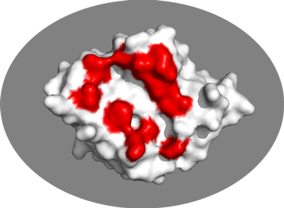
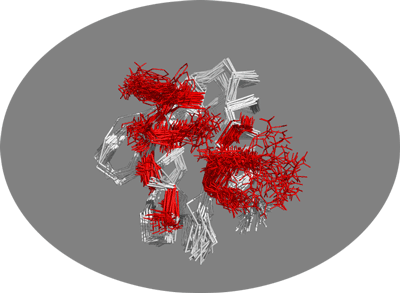

This tutorial consists of the following sections:

* table of contents
{:toc}

## Introduction

This tutorial demonstrates the use of the new modular HADDOCK3 version for predicting the structure of a protein-protein complex from NMR chemical shift perturbation (CSP) data. 
Namely, we will dock two E. coli proteins involved in glucose transport: the glucose-specific enzyme IIA (E2A) and the histidine-containing phosphocarrier protein (HPr). 
The structures in the free form have been determined using X-ray crystallography (E2A) (PDB ID [1F3G](https://www.ebi.ac.uk/pdbe/entry/pdb/1f3g){:target="_blank"}) and NMR spectroscopy (HPr) (PDB ID [1HDN](https://www.ebi.ac.uk/pdbe/entry/pdb/1hdn){:target="_blank"}). 
The structure of the native complex has also been determined with NMR (PDB ID [1GGR](https://www.ebi.ac.uk/pdbe/entry/pdb/1ggr){:target="_blank"}). 
These NMR experiments have also provided us with an array of data on the interaction itself (chemical shift perturbations, intermolecular NOEs, residual dipolar couplings, and simulated diffusion anisotropy data), which will be useful for the docking. 
For this tutorial, we will only make use of inteface residues identified from NMR chemical shift perturbation data as described in [Wang *et al*, EMBO J (2000)](https://onlinelibrary.wiley.com/doi/10.1093/emboj/19.21.5635/abstract){:target="_blank"}.

Throughout the tutorial, colored text will be used to refer to questions or instructions, and/or PyMOL commands.

<a class="prompt prompt-question">This is a question prompt: try answering it!</a>
<a class="prompt prompt-info">This an instruction prompt: follow it!</a>
<a class="prompt prompt-pymol">This is a PyMOL prompt: write this in the PyMOL command line prompt!</a>
<a class="prompt prompt-cmd">This is a Linux prompt: insert the commands in the terminal!</a>

## Setup/Requirements

In order to follow this tutorial you will need to work on a Linux or MacOSX
system. We will also make use of [**PyMOL**][link-pymol] (freely available for
most operating systems) in order to visualize the input and output data. We will
provide you links to download the various required software and data.

Further we are providing pre-processed PDB files for docking and analysis (but the
preprocessing of those files will also be explained in this tutorial). The files have been processed
to facilitate their use in HADDOCK and for allowing comparison with the known reference
structure of the complex. For this _download and unzip the following_
[zip archive](https://surfdrive.surf.nl/files/index.php/s/HvXxgxCTY1DiPsV){:target="_blank"}
_and note the location of the extracted PDB files in your system_. In it you should find the following directories:

* `haddock3`: Contains HADDOCK3 configuration and job files for the various scenarios in this tutorial
* `pdbs`: Contains the pre-processed PDB files
* `plots`: Contains pre-generated html plots for the various scenarios in this tutorial
* `restraints`: Contains the interface information and the correspond restraint files for HADDOCK
* `runs`: Contains pre-calculated (partial) run results for the various scenarios in this tutorial
* `scripts`: Contains a variety of scripts used in this tutorial

## HADDOCK general concepts

HADDOCK (see [https://www.bonvinlab.org/software/haddock2.4](https://www.bonvinlab.org/software/haddock2.4){:target="_blank"})
is a collection of python scripts derived from ARIA ([https://aria.pasteur.fr](https://aria.pasteur.fr){:target="_blank"})
that harness the power of CNS (Crystallography and NMR System – [https://cns-online.org](https://cns-online.org){:target="_blank"})
for structure calculation of molecular complexes. What distinguishes HADDOCK from other docking software is its ability,
inherited from CNS, to incorporate experimental data as restraints and use these to guide the docking process alongside
traditional energetics and shape complementarity. Moreover, the intimate coupling with CNS endows HADDOCK with the
ability to actually produce models of sufficient quality to be archived in the Protein Data Bank.

A central aspect to HADDOCK is the definition of Ambiguous Interaction Restraints or AIRs. These allow the
translation of raw data such as NMR chemical shift perturbation or mutagenesis experiments into distance
restraints that are incorporated in the energy function used in the calculations. AIRs are defined through
a list of residues that fall under two categories: active and passive. Generally, active residues are those
of central importance for the interaction, such as residues whose knockouts abolish the interaction or those
where the chemical shift perturbation is higher. Throughout the simulation, these active residues are
restrained to be part of the interface, if possible, otherwise incurring in a scoring penalty. Passive residues
are those that contribute for the interaction, but are deemed of less importance. If such a residue does
not belong in the interface there is no scoring penalty. Hence, a careful selection of which residues are
active and which are passive is critical for the success of the docking.

## A brief introduction to HADDOCK3

HADDOCK3 is the next generation integrative modelling software in the
long-lasting HADDOCK project. It represents a complete rethinking and rewriting
of the HADDOCK2.X series, implementing a new way to interact with HADDOCK and
offering new features to users who can now define custom workflows.

In the previous HADDOCK2.x versions, users had access to a highly
parameterisable yet rigid simulation pipeline composed of three steps:
`rigid-body docking (it0)`, `semi-flexible refinement (it1)`, and `final refinement (itw)`.

<figure style="text-align: center;">

</figure>

In HADDOCK3, users have the freedom to configure docking workflows into
functional pipelines by combining the different HADDOCK3 modules, thus
adapting the workflows to their projects. HADDOCK3 has therefore developed to
truthfully work like a puzzle of many pieces (simulation modules) that users can
combine freely. To this end, the “old” HADDOCK machinery has been modularized,
and several new modules added, including third-party software additions. As a
result, the modularization achieved in HADDOCK3 allows users to duplicate steps
within one workflow (e.g., to repeat twice the `it1` stage of the HADDOCK2.x
rigid workflow).

Note that, for simplification purposes, at this time, not all functionalities of
HADDOCK2.x have been ported to HADDOCK3, which does not (yet) support NMR RDC,
PCS and diffusion anisotropy restraints, cryo-EM restraints and coarse-graining.
Any type of information that can be converted into ambiguous interaction
restraints can, however, be used in HADDOCK3, which also supports the
*ab initio* docking modes of HADDOCK.

<figure style="text-align: center;">

</figure>

To keep HADDOCK3 modules organized, we catalogued them into several
categories. But, there are no constraints on piping modules of different
categories.

The main module categories are "topology", "sampling", "refinement",
"scoring", and "analysis". There is no limit to how many modules can belong to a
category. Modules are added as developed, and new categories will be created
if/when needed. You can access the HADDOCK3 documentation page for the list of
all categories and modules. Below is a summary of the available modules:

* **Topology modules**
    * `topoaa`: *generates the all-atom topologies for the CNS engine.*
* **Sampling modules**
    * `rigidbody`: *Rigid body energy minimization with CNS (`it0` in haddock2.x).*
    * `lightdock`: *Third-party glow-worm swam optimization docking software.*
* **Model refinement modules**
    * `flexref`: *Semi-flexible refinement using a simulated annealing protocol through molecular dynamics simulations in torsion angle space (`it1` in haddock2.x).*
    * `emref`: *Refinement by energy minimisation (`itw` EM only in haddock2.4).*
    * `mdref`: *Refinement by a short molecular dynamics simulation in explicit solvent (`itw` in haddock2.X).*
* **Scoring modules**
    * `emscoring`: *scoring of a complex performing a short EM (builds the topology and all missing atoms).*
    * `mdscoring`: *scoring of a complex performing a short MD in explicit solvent + EM (builds the topology and all missing atoms).*
* **Analysis modules**
    * `caprieval`: *Calculates CAPRI metrics (i-RMSD, l-RMSD, Fnat, DockQ) with respect to the top scoring model or reference structure if provided.*
    * `clustfcc`: *Clusters models based on the fraction of common contacts (FCC)*
    * `clustrmsd`: *Clusters models based on pairwise RMSD matrix calculated with the `rmsdmatrix` module.*
    * `rmsdmatrix`: *Calculates the pairwise RMSD matrix between all the models generated in the previous step.*
    * `seletop`: *Selects the top N models from the previous step.*
    * `seletopclusts`: *Selects top N clusters from the previous step.*

The HADDOCK3 workflows are defined in simple configuration text files, similar to the TOML format but with extra features.
Contrarily to HADDOCK2.X which follows a rigid (yet highly parameterisable)
procedure, in HADDOCK3, you can create your own simulation workflows by
combining a multitude of independent modules that perform specialized tasks.

## Software requirements

### Installing CNS
The other required piece of software to run HADDOCK is its computational engine,
CNS (Crystallography and NMR System –
[https://cns-online.org](https://cns-online.org){:target="_blank"}). CNS is
freely available for non-profit organizations. In order to get access to all
features of HADDOCK you will need to compile CNS using the additional files
provided in the HADDOCK distribution in the `varia/cns1.3` directory. Compilation of
CNS might be non-trivial. Some guidance on installing CNS is provided in the online
HADDOCK3 documentation page [here](https://www.bonvinlab.org/haddock3/CNS.html){:target="_blank"}.

### Installing HADDOCK3

In this tutorial we will make use of the HADDOCK3 version. In case HADDOCK3
is not pre-installed in your system you will have to install it.

To obtain HADDOCK3 navigate to [its repository][haddock-repo], fill the
registration form, and then follow the [installation instructions](https://www.bonvinlab.org/haddock3/INSTALL.html){:target="_blank"}.

### Auxiliary software

**[FreeSASA][link-freesasa]**: FreeSASA will be used to identify surface-accessible residues
(pre-calculated data are provided).

**[PDB-tools][link-pdbtools]**: A useful collection of Python scripts for the
manipulation (renumbering, changing chain and segIDs...) of PDB files is freely
available from our GitHub repository. `pdb-tools` is automatically installed
with HADDOCK3. If you have activated the HADDOCK3 Python environment you have
access to the pdb-tools package.

**[PyMol][link-pymol]**: We will make use of PyMol for visualization. If not
already installed on your system, download and install PyMol.

## Preparing PDB files for docking

In this section we will prepare the PDB files of the antibody and antigen for docking.
Crystal structures of both the antibody and the antigen in their free forms are available from the
[PDBe database](https://www.pdbe.org){:target="_blank"}. In the case of the antibody which consists
of two chains (L+H) we will have to prepare it for use in HADDOCK such as it can be treated as
a single chain with non-overlapping residue numbering. For this we will be making use of `pdb-tools` from the command line.

_**Note**_ that `pdb-tools` is also available as a [web service](https://wenmr.science.uu.nl/pdbtools/){:target="_blank"}.

_**Note**_: Before starting to work on the tutorial, make sure to activate haddock3 (follow the workshop-specific instructions above), or, e.g. if installed using `conda`

<a class="prompt prompt-cmd">
conda activate haddock3
</a>

### Inspecting and preparing E2A for docking

We will now inspect the E2A structure. For this start PyMOL and in the command line window of PyMOL (indicated by PyMOL>) type:

<a class="prompt prompt-pymol">
fetch 1F3G 
show cartoon 
hide lines 
show sticks, resn HIS 
</a>

You should see a backbone representation of the protein with only the histidine side-chains visible.
Try to locate the histidines in this structure.

<a class="prompt prompt-question">Is there any phosphate group present in this structure?</a>

Note that you can zoom on the histidines by typing in PyMOL:

<a class="prompt prompt-pymol">zoom resn HIS</a>

Revert to a full view with:

<a class="prompt prompt-pymol">zoom vis</a>

As a preparation step before docking, it is advised to remove any irrelevant water and other small molecules (e.g. small molecules from the crystallisation buffer), however do leave relevant co-factors if present. For E2A, the PDB file only contains water molecules. You can remove those in PyMOL by typing:

<a class="prompt prompt-pymol">remove resn HOH</a>

Now let's vizualize the residues affected by binding as identified by NMR. From [Wang *et al*, EMBO J (2000)](https://onlinelibrary.wiley.com/doi/10.1093/emboj/19.21.5635/abstract){:target="_blank"} the following residues of E2A were identified has having significant chemical shift perturbations:

<a class="prompt prompt-info">38,40,45,46,69,71,78,80,94,96,141</a>

We will now switch to a surface representation of the molecule and highlight the NMR-defined interface. In PyMOL type the following commands:

<a class="prompt prompt-pymol">
color white, all 
show surface 
select e2a_active, (1F3G and resi 38,40,45,46,69,71,78,80,94,96,141) 
color red, e2a_active 
</a>

<figure align="center">

</figure>

Inspect the surface.

<a class="prompt prompt-question">Do the identified residues form a well defined patch on the surface?</a>
<a class="prompt prompt-question">Do they form a contiguous surface?</a>

The answer to the last question should be no: We can observe residue in the center of the patch that do not seem significantly affected while still being in the middle of the defined interface. This is the reason why in HADDOCK we also define "*passive*" residues that correspond to surface neighbors of active residues. These can be selected manually, or more conveniently you can let the HADDOCK server do it for you (see [Setting up the docking run](#setting-up-the-docking-run) below).

As final step save the molecule as a new PDB file which we will call: *e2a_1F3G.pdb* 
For this in the PyMOL menu on top select:

<a class="prompt prompt-info">File -> Export molecule...</a>
<a class="prompt prompt-info">Click on the save button</a>
<a class="prompt prompt-info">Select as ouptut format PDB (*.pdb *.pdb.gz)</a>
<a class="prompt prompt-info">Name your file *e2a_1F3G.pdb* and note its location</a>

After saving the molecule delete it from the Pymol window or close Pymol. You can remove the molecule by typing this into the command line window of PyMOL:

<a class="prompt prompt-pymol">
delete 1F3G
</a>

In a terminal, change the chain of e2a from a to B. 

<a class="prompt prompt-cmd">
pdb_chain -B e2a_1F3G.pdb > e2a_1F3G_B.pdb
</a>

This will be usefull in the docking phase, as HADDOCK3 needs different chain associated to each protein involved in the docking.

### Adding a phosphate group

Since the biological function of this complex is to transfer a phosphate group from one protein to another, via histidines side-chains, it is relevant to make sure that a phosphate group be present for docking. As we have seen above none is currently present in the PDB files. HADDOCK does support a list of modified amino acids which you can find at the following link: [https://wenmr.science.uu.nl/haddock2.4/library](https://wenmr.science.uu.nl/haddock2.4/library){:target="_blank"}.

<a class="prompt prompt-question">Check the list of supported modified amino acids.</a>
<a class="prompt prompt-question">What is the proper residue name for a phospho-histidine in HADDOCK?</a>

In order to use a modified amino-acid in HADDOCK, the only thing you will need to do is to edit the PDB file and change the residue name of the amino-acid you want to modify. Don't bother deleting irrelevant atoms or adding missing ones, HADDOCK will take care of that. For E2A, the histidine that is phosphorylated has residue number 90. In order to change it to a phosphorylated histidine do the following:

<a class="prompt prompt-info">Edit the PDB file (*e2a_1F3G_B.pdb*) in your favorite editor</a>
<a class="prompt prompt-info">Change the name of histidine 90 to NEP </a>
<a class="prompt prompt-info">Save the file (as simple text file) under a new name, e.g. *e2aP_1F3G.pdb*</a>

**Note:** The same procedure can be used to introduce a mutation in an input protein structure.

### Inspecting and preparing HPR for docking

We will now inspect the HPR structure. For this start PyMOL and in the command line window of PyMOL type:

<a class="prompt prompt-pymol">
fetch 1HDN 
show cartoon 
hide lines 
</a>

Since this is an NMR structure it does not contain any water molecules and we don't need to remove them.

Let's vizualize the residues affected by binding as identified by NMR. From [Wang *et al*, EMBO J (2000)](https://onlinelibrary.wiley.com/doi/10.1093/emboj/19.21.5635/abstract){:target="_blank"} the following residues were identified has having significant chemical shift perturbations:

<a class="prompt prompt-info">15,16,17,20,48,49,51,52,54,56</a>

We will now switch to a surface representation of the molecule and highlight the NMR-defined interface. In PyMOL type the following commands:

<a class="prompt prompt-pymol">
color white, all 
show surface 
select hpr_active, (1HDN and resi 15,16,17,20,48,49,51,52,54,56) 
color red, hpr_active 
</a>

Again, inspect the surface.

<a class="prompt prompt-question">Do the identified residues form a well defined patch on the surface?</a>
<a class="prompt prompt-question">Do they form a contiguous surface?</a>

Now since this is an NMR structure, it actually consists of an ensemble of models. HADDOCK can handle such ensemble, using each conformer in turn as starting point for the docking. We however recommend to limit the number of conformers used for docking, since the number of conformer combinations of the input molecules might explode (e.g. 10 conformers each will give 100 starting combinations and if we generate 1000 ridig body models (see [HADDOCK general concepts](#haddock-general-concepts) above) each combination will only be sampled 10 times).

Now let's vizualise this NMR ensemble. In PyMOL type:

<a class="prompt prompt-pymol">
hide all 
show ribbon 
set all_states, on 
</a>

You should now be seing the 30 conformers present in this NMR structure. To illustrate the potential benefit of using an ensemble of conformations as starting point for docking let's look at the side-chains of the active residues:

<a class="prompt prompt-pymol">
show lines, hpr_active 
</a>

<figure align="center">

</figure>

You should be able to see the amount of conformational space sampled by those surface side-chains. You can clearly see that some residues do sample a large variety of conformations, one of which might lead to much better docking results.

**Note:** Pre-sampling of possible conformational changes can thus be beneficial for the docking, but again do limit the number of conformers used for the docking (or increase the number of sampled models, which is possible for users with expert- or guru-level access. The default access level is however only easy - for a higher level access do request it after registration).

As final step, save the molecule as a new PDB file which we will call: *hpr-ensemble.pdb*
For this in the PyMOL menu select:

<a class="prompt prompt-info">File -> Export molecule...</a>
<a class="prompt prompt-info">Select as State 0 (all states)</a>
<a class="prompt prompt-info">Click on Save...</a>
<a class="prompt prompt-info">Select as ouptut format PDB (*.pdb *.pdb.gz)</a>
<a class="prompt prompt-info">Name your file *hpr-ensemble.pdb* and note its location</a>

## Defining restraints for docking

Before setting up the docking we need first to generate distance restraint files
in a format suitable for HADDOCK.  HADDOCK uses [CNS][link-cns]{:target="_blank"} as computational
engine. A description of the format for the various restraint types supported by
HADDOCK can be found in our [Nature Protocol][nat-pro]{:target="_blank"} paper, Box 4.

Distance restraints are defined as:

<pre style="background-color:#DAE4E7">
assign (selection1) (selection2) distance, lower-bound correction, upper-bound correction
</pre>

The lower limit for the distance is calculated as: distance minus lower-bound
correction and the upper limit as: distance plus upper-bound correction.  The
syntax for the selections can combine information about chainID - `segid`
keyword -, residue number - `resid` keyword -, atom name - `name` keyword.
Other keywords can be used in various combinations of OR and AND statements.
Please refer for that to the [online CNS manual](http://cns-online.org/v1.3/){:target="_blank"}.

### Defining active and passive residues for E2A

As stated before, the following residues were identified has having significant chemical shift perturbations from [Wang *et al*, EMBO J (2000)](https://onlinelibrary.wiley.com/doi/10.1093/emboj/19.21.5635/abstract){:target="_blank"}:

<a class="prompt prompt-info">38,40,45,46,69,71,78,80,94,96,141</a>

Hence, we are using these residues as `active` residues for the docking run. However, we have to define `passive` residues before the run. 
These passive residues allows us to deal with potentially incomplete binding sites by defining surface neighbors as `passive` residues.
These are added to the definition of the interface but will not lead to any energetic penalty if they are not part of the
binding site in the final models, while the residues defined as `active` (typically the identified or predicted binding
site residues) will. When using the HADDOCK server, `passive` residues will be automatically defined. Here since we are
using a local version, we need to define those manually and create a file in which the active and passive residues will be listed.

This can easily be done using a script from our [haddock-tools][haddock-tools] repository, which is also provided for convenience
in the `scripts` directly of the archive you downloaded for this tutorial:

<a class="prompt prompt-cmd">
echo "38 40 45 46 69 71 78 80 94 96 141" > e2a.act-pass
python ./scripts/passive_from_active.py e2a_1F3G.pdb 38,40,45,46,69,71,78,80,94,96,141 >> e2a.act-pass
</a>

The NMR-identified residues and their surface neighbors generated with the above command can be used to define ambiguous interactions restraints, either using the NMR identified residues as active in HADDOCK, or combining those with the surface neighbors and use this combination as passive only. Here we decided to treat the NMR-identified residues as active residues. 
Note the file consists of two lines, with the first one defining the `active` residues and
the second line the `passive` ones. We will use later these files to generate the ambiguous distance restraints for HADDOCK.

In general it is better to be too generous rather than too strict in the
definition of passive residues.

An important aspect is to filter both the active (the residues identified from
your mapping experiment) and passive residues by their solvent accessibility.
Our web service uses a default relative accessibility of 15% as cutoff. This is
not a hard limit. You might consider including even more buried residues if some
important chemical group seems solvent accessible from a visual inspection.

### Defining active and passive residues for HPR

As stated before, the following residues were identified has having significant chemical shift perturbations from [Wang *et al*, EMBO J (2000)](https://onlinelibrary.wiley.com/doi/10.1093/emboj/19.21.5635/abstract){:target="_blank"}:

<a class="prompt prompt-info">15,16,17,20,48,49,51,52,54,56</a>

Using the same script provided in the archive of this tutorial: 

<a class="prompt prompt-cmd">
echo "15 16 17 20 48 49 51 52 54 56" > hpr.act-pass
python ./scripts/passive_from_active.py hpr-ensemble.pdb 15,16,17,20,48,49,51,52,54,56 >> hpr.act-pass
</a>

### Defining the position restraints locally

Once you have defined your active and passive residues for both molecules, you
can proceed with the generation of the ambiguous interaction restraints (AIR) file for HADDOCK.
For this you can either make use of our online [GenTBL][gentbl] web service, entering the
list of active and passive residues for each molecule, and saving the resulting
restraint list to a text file, or use the relevant `haddock-tools` script.

To use our `haddock-tools` `active-passive-to-ambig.py` script (also found in the archive of the tutorial) you need to create for each molecule a file containing two lines:

* The first line corresponds to the list of active residues (numbers separated by spaces)
* The second line corresponds to the list of passive residues.

* For E2A (the file called `e2a.act-pass`):
<pre style="background-color:#DAE4E7">
38 40 45 46 69 71 78 80 94 96 141
35 37 39 42 43 44 47 48 64 66 68 70 72 74 81 82 83 84 86 88 97 98 99 100 105 109 110 131 132 133 142 143 144 145
</pre>

* and for HPR (the file called `hpr.act-pass`):
<pre style="background-color:#DAE4E7">
15 16 17 20 48 49 51 52 54 56
9 10 11 12 21 24 25 37 38 40 41 43 45 46 47 53 55 57 58 59 60 84 85
</pre>

Using those two files, we can generate the CNS-formatted AIR restraint files
with the following command:

<a class="prompt prompt-cmd">
python ./scripts/active-passive-to-ambig.py e2a.act-pass hpr.act-pass > e2a-hpr_air.tbl
</a>

This generates a file called `ambig-prot-prot.tbl` that contains the AIR
restraints. The default distance range for those is between 0 and 2Å, which
might seem short but makes senses because of the 1/r^6 summation in the AIR
energy function that makes the effective distance be significantly shorter than
the shortest distance entering the sum.

The effective distance is calculated as the SUM over all pairwise atom-atom
distance combinations between an active residue and all the active+passive on
the other molecule: SUM[1/r^6]^(-1/6).

If you modify manually this file, it is possible to quickly check if the format is valid.
To do so, you can find in our [haddock-tools][haddock-tools] repository a folder named
`haddock_tbl_validation` that contains a script called `validate_tbl.py` (also provided here in the `scripts` directory).
To use it, type:

<a class="prompt prompt-cmd">
python ./scripts/validate_tbl.py \-\-silent e2a-hpr_air.tbl
</a>

No output means that your TBL file is valid.

## Setting up the docking with HADDOCK3

Now that we have all required files at hand (PBD and restraints files) it is time to setup our docking protocol.
For this we need to create a HADDOCK3 configuration file that will define the docking workflow. In contrast to HADDOCK2.X,
we have much more flexibility in doing this. We will illustrate this flexibility by introducing a clustering step
after the initial rigid-body docking stage, select up to 10 models per cluster and refine all of those.

HADDOCK3 also provides an analysis module (`caprieval`) that allows
to compare models to either the best scoring model (if no reference is given) or a reference structure, which in our case
we have at hand. This will directly allow us to assess the performance of the protocol for the following three scenarios:

1. Scenario 1: Docking using the paratope information only and the surface of the antigen
2. Scenario 2a: Docking using the paratope and the NMR-identified epitope as passive
3. Scenario 2b: Docking using the paratope and the NMR-identified epitope as active

The basic workflow for all three scenarios will consists of the following modules, with some differences in the restraints used and some parameter settings (see below):

1. **`topoaa`**: *Generates the topologies for the CNS engine and build missing atoms*
2. **`rigidbody`**: *Rigid body energy minimisation (`it0` in haddock2.x)*
3. **`clustfcc`**: *Clustering of models based on the fraction of common contacts (FCC)*
4. **`seletopclusts`**: *Selection of the top10 models of all clusters*
5. **`flexref`**: *Semi-flexible refinement of the interface (`it1` in haddock2.4)*
6. **`emref`**: *Final refinement by energy minimisation (`itw` EM only in haddock2.4)*
7. **`clustfcc`**: *Clustering of models based on the fraction of common contacts (FCC)*
8. **`caprieval`**: *Calculates CAPRI metrics (i-RMSD, l-RMSD, Fnat, DockQ) with respect to the top scoring model or reference structure if provided*

The input PDB files are the same for all three scenarios. The differences are in the ambiguous interaction restraint files used and the sampling at the rigid body stage in the case of scenario1.

### HADDOCK3 execution modes

HADDOCK3 currently supports three difference execution modes that are defined in the first section of the configuration file of a run.

#### 1. local mode

In this mode HADDOCK3 will run on the current system, using the defined number of cores (`ncores`) in the config file
to a maximum of the total number of available cores on the system minus one. An example of the relevant parameters to be defined in the first section of the config file is:


# compute mode
mode = "local"
#  1 nodes x 96 ncores
ncores = 96


In this mode HADDOCK3 can be started from the command line with as argument the configuration file of the defined workflow.

<a class="prompt prompt-cmd">
haddock3 \<my-workflow-configuration-file\>
</a>

Alternatively redirect the output to a log file and send haddock3 to the background.

_**Note**_: This is the execution mode you should use on the NMRBox resources. For the tutorial we limit the number of cores to 10.

<a class="prompt prompt-cmd">
haddock3 \<my-workflow-configuration-file\> \> haddock3.log &
</a>

_**Note**_: This is also the execution mode that should be used for example when submitting the HADDOCK3 job to a node of a cluster, requesting X number of cores.

  

    <i>View an example script for submitting via the slurm batch system</i> <i class="material-icons">expand_more</i>
  

  
  #!/bin/bash
  #SBATCH --nodes=1
  #SBATCH --tasks-per-node=96
  #SBATCH -J haddock3
  #SBATCH --partition=medium

  # load haddock3 module
  module load haddock3
  # or activate the haddock3 conda environment
  ##source $HOME/miniconda3/etc/profile.d/conda.sh
  ##conda activate haddock3

  # go to the run directory
  cd $HOME/HADDOCK3-antibody-antigen

  # execute
  haddock3 scenario1-surface-node.cfg
  
   

View an EU-ASEAN HPC school example script for submitting to the Fugaku batch system <i class="material-icons">expand_more</i>
 


#!/bin/bash
#PJM -L  "node=1"                            # Assign 1 node
#PJM -L  "elapse=02:00:00"                   # Elapsed time limit 2 hour
#PJM -x PJM_LLIO_GFSCACHE=/vol0003:/vol0006  # volume names that job uses
#PJM -s                                      # Statistical information output

# active the haddock3 conda environment
source /vol0601/share/ra020021/LifeScience/20221208_Bonvin/miniconda3-arm8/etc/profile.d/conda.sh
conda activate haddock3

# go to the tutorial directory in your home directory
# edit if needed to specify the correct location
cd $HOME/HADDOCK3-antibody-antigen

# execute haddock3
haddock3 scenario2a-NMR-epitope-pass-node.cfg

 

 

#### 2. batch mode

In this mode HADDOCK3 will typically be started on your local server (e.g. the login node) and will dispatch jobs to the batch system of your cluster.
Two batch systems are currently supported: `slurm` and `torque` (defined by the `batch_type` parameter). In the configuration file you will
have to define the `queue` name and the maximum number of concurrent jobs sent to the queue (`queue_limit`). Since HADDOCK3 single model
calculations are quite fast, it is recommended to calculate multiple models within one job submitted to the batch system.
The number of model per job is defined by the `concat` parameter in the configuration file.
You want to avoid sending thousands of very short jobs to the batch system if you want to remain friend with your system administrators...

An example of the relevant parameters to be defined in the first section of the config file is:


# compute mode
mode = "batch"
# batch system
batch_type = "slurm"
# queue name
queue = "short"
# number of concurrent jobs to submit to the batch system
queue_limit = 100
# number of models to produce per submitted job
concat = 10


In this mode HADDOCK3 can be started from the command line as for the local mode.

#### 3. MPI mode

HADDOCK3 supports a parallel MPI implementation (functional but still very experimental at this stage). For this to work, the `mpi4py` library
must have been installed at installation time. Refer to the [MPI-related instructions](https://www.bonvinlab.org/haddock3/tutorials/mpi.html).
The execution mode should be set to `mpi` and the total number of cores should match the requested resources when submitting to the batch system.

An example of the relevant parameters to be defined in the first section of the config file is:


# compute mode
mode = "mpi"
#  5 nodes x 50 tasks = ncores = 250
ncores = 250


In this execution mode the HADDOCK3 job should be submitted to the batch system requesting the corresponding number of nodes and cores per node.

  

    <i>View an example script for submitting an MPI HADDOCK3 job the slurm batch system</i> <i class="material-icons">expand_more</i>
  

  
  #!/bin/bash
  #SBATCH --nodes=5
  #SBATCH --tasks-per-node=50
  #SBATCH -J haddock3mpi

  # load haddock3 module
  module load haddock3
  # or make sure haddock3 is activated
  ##source $HOME/miniconda3/etc/profile.d/conda.sh
  ##conda activate haddock3

  # go to the run directory
  # edit if needed to specify the correct location
  cd $HOME/HADDOCK3-antibody-antigen

  # execute
  haddock3 scenario2a-NMR-epitope-pass-mpi.cfg
  
   

### Scenario 1: 1000 rigidbody docking models, selection of top200 and flexible refinement + EM of those

Now that we have all data ready, and know about execution modes of HADDOCK3 it is time to setup the docking for the first scenario in which we will use the paratope on the antibody to guide the docking, targeting the entire surface of the antibody. The restraint file to use for this is `e2a-hpr_air.tbl`. We proceed to produce 1000 rigidbody docking models, from which 200 will be selected and refined through flexible refinment and energy minimization. [DESCRIBE BETTER]. 
For the analysis following the docking results, we are using the solved complex [1GGR](https://www.rcsb.org/structure/1GGR), named e2a-hpr_1GGR.pdb.
The configuration file for this scenario (assuming a local running mode, eventually submitted to the batch system requesting a full node) is:


# ====================================================================
# Protein-protein docking example with NMR-derived ambiguous interaction restraints

# directory in which the scoring will be done
run_dir = "run1-full"

# execution mode
mode = "batch"
#  it will take the system's default
# queue = "short"
# concatenate models inside each job, concat = 5 each .job will produce 5 models
concat = 5
#  Limit the number of concurrent submissions to the queue
queue_limit = 100

# molecules to be docked
molecules =  [
    "data/e2aP_1F3G.pdb",
    "data/hpr_ensemble.pdb"
    ]

# ====================================================================
# Parameters for each stage are defined below, prefer full paths
# ====================================================================
[topoaa]
autohis = false
[topoaa.mol1]
nhisd = 0
nhise = 1
hise_1 = 75
[topoaa.mol2]
nhisd = 1
hisd_1 = 76
nhise = 1
hise_1 = 15

[rigidbody]
tolerance = 5
ambig_fname = "data/e2a-hpr_air.tbl"
sampling = 1000

[caprieval]
reference_fname = "data/e2a-hpr_1GGR.pdb"

[seletop]
select = 200

[caprieval]
reference_fname = "data/e2a-hpr_1GGR.pdb"

[flexref]
tolerance = 5
ambig_fname = "data/e2a-hpr_air.tbl"

[caprieval]
reference_fname = "data/e2a-hpr_1GGR.pdb"

[emref]
tolerance = 5
ambig_fname = "data/e2a-hpr_air.tbl"

[caprieval]
reference_fname = "data/e2a-hpr_1GGR.pdb"

[clustfcc]

[seletopclusts]
top_models = 4

[caprieval]
reference_fname = "data/e2a-hpr_1GGR.pdb"

# ====================================================================


This configuration file is provided in the `haddock3` directory of the downloaded data set for this tutorial as `docking-protein-protein-full.cfg`.

If you have everything ready, you can launch haddock3 either from the command line, or, better,
submitting it to the batch system requesting in this local run mode a full node (see local execution mode above).

_**Note**_ that this scenario is computationally more expensive because of the increased sampling.
On our own cluster, running in batch mode took 12 minutes and 37 seconds.
Running in MPI mode with 250 cores on AMD EPYC 7451 processors took [TO BE TESTED].
The same run on a single node using all 96 threads took on the same architecture [TO BE TESTED].

### Scenario 2: 1000 rigidbody docking models, selection of top200 and flexible refinement + final refinement in explicit solvent (water) of those 

In scenario 2 we are setting up the docking in which [DESCRIBE BETTER]. 
The configuration file for this scenario (assuming a batch running mode) is:


# ====================================================================
# Protein-protein docking example with NMR-derived ambiguous interaction restraints

# directory in which the scoring will be done
run_dir = "run2-mdref-full"

# execution mode
mode = "batch"
# in which queue the jobs should run, if nothing is defined
#  it will take the system's default
# queue = "short"
# concatenate models inside each job, concat = 5 each .job will produce 5 models
concat = 5
#  Limit the number of concurrent submissions to the queue
queue_limit = 100
# cns_exec = "path/to/bin/cns" # optional

# molecules to be docked
molecules =  [
    "data/e2aP_1F3G.pdb",
    "data/hpr_ensemble.pdb"
    ]

# ====================================================================
# Parameters for each stage are defined below, prefer full paths
# ====================================================================
[topoaa]
autohis = false
[topoaa.mol1]
nhisd = 0
nhise = 1
hise_1 = 75
[topoaa.mol2]
nhisd = 1
hisd_1 = 76
nhise = 1
hise_1 = 15

[rigidbody]
tolerance = 5
ambig_fname = "data/e2a-hpr_air.tbl"
sampling = 1000

[caprieval]
reference_fname = "data/e2a-hpr_1GGR.pdb"

[seletop]
select = 200

[caprieval]
reference_fname = "data/e2a-hpr_1GGR.pdb"

[flexref]
tolerance = 5
ambig_fname = "data/e2a-hpr_air.tbl"

[caprieval]
reference_fname = "data/e2a-hpr_1GGR.pdb"

[mdref]
tolerance = 5
ambig_fname = "data/e2a-hpr_air.tbl"

[caprieval]
reference_fname = "data/e2a-hpr_1GGR.pdb"

[clustfcc]

[seletopclusts]
top_models = 4

[caprieval]
reference_fname = "data/e2a-hpr_1GGR.pdb"

# ====================================================================


This configuration is provided in the `haddock3` directory of the downloaded data set for this tutorial as `docking-protein-protein-mdref-full.cfg`. 

If you have everything ready, you can launch haddock3 either from the command line, or, better, submitting it to the batch system requesting in this local run mode a full node (see local execution mode above).

_**Note**_ On our own cluster, running in MPI mode with 250 cores on AMD EPYC 7451 processors the run completed in about [TO BE COMPLETED]. The same run on a single node using all 96 threads took on the same architecture about [TO BE COMPLETED]. In `batch` mode, using 100 queue slots and 10 models per job, the same run completed in about [TO BE COMPLETED].

On the Fugaku supercomputer used for the EU ASEAN HPC school, running on a single node (48 [armv8 A64FX](https://github.com/fujitsu/A64FX){:target="_blank"} processors), this run completed in about [TO BE COMPLETED]. 

### Scenario 3: 1000 rigidbody docking models, FCC clustering and selection of max 20 models per cluster followed by flexible refinement and EM 

Scenario 3 is [TO BE COMPETED]
The configuration file for this scenario (assuming a batch running mode) is:


# ====================================================================
# Protein-protein docking example with NMR-derived ambiguous interaction restraints
# ====================================================================

# directory in which the scoring will be done
run_dir = "run3-cltsel-full"

# execution mode
mode = "batch"
# concatenate models inside each job, concat = 5 each .job will produce 5 models
concat = 5
#  Limit the number of concurrent submissions to the queue
queue_limit = 100

# molecules to be docked
molecules =  [
    "data/e2aP_1F3G.pdb",
    "data/hpr_ensemble.pdb"
    ]

# ====================================================================
# Parameters for each stage are defined below, prefer full paths
# ====================================================================

[topoaa]
autohis = false
[topoaa.mol1]
nhisd = 0
nhise = 1
hise_1 = 75
[topoaa.mol2]
nhisd = 1
hisd_1 = 76
nhise = 1
hise_1 = 15

[rigidbody]
tolerance = 5
ambig_fname = "data/e2a-hpr_air.tbl"

[caprieval]
reference_fname = "data/e2a-hpr_1GGR.pdb"

[clustfcc]

[seletopclusts]
## select the best 4 models of each cluster
top_models = 20

[caprieval]
reference_fname = "data/e2a-hpr_1GGR.pdb"

[flexref]
tolerance = 5
ambig_fname = "data/e2a-hpr_air.tbl"

[caprieval]
reference_fname = "data/e2a-hpr_1GGR.pdb"

[emref]
tolerance = 5
ambig_fname = "data/e2a-hpr_air.tbl"

[caprieval]
reference_fname = "data/e2a-hpr_1GGR.pdb"

[clustfcc]

[seletopclusts]
top_models = 4

[caprieval]
reference_fname = "data/e2a-hpr_1GGR.pdb"

# ====================================================================


This configuration file is provided in the `haddock3` directory of the downloaded data set for this tutorial as `docking-protein-protein-cltsel-full.cfg`. 

If you have everything ready, you can launch haddock3 either from the command line, or, better, submitting it to the batch system requesting in this local run mode a full node (see local execution mode above).

_**Note**_ The running time for this scenario is similar to that of scenario 2a (see above).

## Analysis of docking results

### Structure of the run directory

Once your run has completed inspect the content of the resulting directory. You will find the various steps (modules) of the defined workflow numbered sequentially, e.g.:


> ls scenario3/
    00_topoaa/
    01_rigidbody/
    02_caprieval/
    03_clustfcc/
    04_seletopclusts/
    05_caprieval/
    06_flexref/
    07_caprieval/
    08_emref/
    09_caprieval/
    10_clustfcc/
    11_seletopclusts/
    12_caprieval/
    analysis/
    data/
    log


There is in addition the log file (text file) and two additional directories:

- the `data` directory containing the input data (PDB and restraint files) for the various modules
- the `analysis` directory containing various plots to visualise the results for each `caprieval` step

You can find information about the duration of the run at the bottom of the log file. Each sampling/refinement/selection module will contain PBD files.

For example, the `X_seletopclusts` directory contains the selected models from each cluster. The clusters in that directory are numbered based
on their rank, i.e. `cluster_1` refers to the top-ranked cluster. Information about the origin of these files can be found in that directory in the `seletopclusts.txt` file.

The simplest way to extract ranking information and the corresponding HADDOCK scores is to look at the `X_caprieval` directories (which is why it is a good idea to have it as the final module, and possibly as intermediate steps). This directory will always contain a `capri_ss.tsv` file, which contains the model names, rankings and statistics (score, iRMSD, Fnat, lRMSD, ilRMSD and dockq score). E.g.:

<pre style="background-color:#DAE4E7">
model	md5	caprieval_rank	score	irmsd	fnat	lrmsd	ilrmsd	dockq	cluster_id	cluster_ranking	model-cluster_ranking	air	angles	bonds	bsa	cdih	coup	dani	desolv	dihe	elec	improper	rdcs	rg	sym	total	vdw	vean	xpcs
../07_emref/emref_33.pdb	-	1	-147.229	0.894	0.889	1.452	1.542	0.866	-	-	-	6.877	0.000	0.000	1533.550	0.000	0.000	0.000	-10.230	0.000	-522.517	0.000	0.000	0.000	0.000	-548.824	-33.184	0.000	0.000
../07_emref/emref_3.pdb	-	2	-145.818	0.949	0.917	2.103	1.801	0.858	-	-	-	7.810	0.000	0.000	1569.000	0.000	0.000	0.000	-9.026	0.000	-533.832	0.000	0.000	0.000	0.000	-556.827	-30.806	0.000	0.000
../07_emref/emref_52.pdb	-	3	-141.925	1.016	0.889	1.378	1.678	0.850	-	-	-	12.488	0.000	0.000	1591.170	0.000	0.000	0.000	-9.507	0.000	-482.747	0.000	0.000	0.000	0.000	-507.376	-37.117	0.000	0.000
../07_emref/emref_4.pdb	-	4	-141.400	1.067	0.778	2.299	2.094	0.791	-	-	-	4.617	0.000	0.000	1515.630	0.000	0.000	0.000	-10.495	0.000	-526.925	0.000	0.000	0.000	0.000	-548.288	-25.981	0.000	0.000
../07_emref/emref_81.pdb	-	5	-137.507	1.569	0.639	4.430	3.047	0.634	-	-	-	30.617	0.000	0.000	1562.350	0.000	0.000	0.000	-16.298	0.000	-442.005	0.000	0.000	0.000	0.000	-447.257	-35.870	0.000	0.000
....
</pre>

If clustering is performed prior to calling the `caprieval` module, the `capri_ss.tsv` will also contain information about to which cluster the model belongs to and its ranking within the cluster as shown above.

The relevant statistics are:

* **score**: *the HADDOCK score (arbitrary units)*
* **irmsd**: *the interface RMSD, calculated over the interfaces the molecules*
* **fnat**: *the fraction of native contacts*
* **lrmsd**: *the ligand RMSD, calculated on the ligand after fitting on the receptor (1st component)*
* **ilrmsd**: *the interface-ligand RMSD, calculated over the interface of the ligand after fitting on the interface of the receptor (more relevant for small ligands for example)*
* **dockq**: *the DockQ score, which is a combination of irmsd, lrmsd and fnat and provides a continuous scale between 1 (equal to reference) and 0*

The iRMSD, lRMSD and Fnat metrics are the ones used in the blind protein-protein prediction experiment [CAPRI](https://capri.ebi.ac.uk/) (Critical PRediction of Interactions).

In CAPRI the quality of a model is defined as (for protein-protein complexes):

* **acceptable model**: i-RMSD < 4Å or l-RMSD<10Å and Fnat > 0.1
* **medium quality model**: i-RMSD < 2Å or l-RMSD<5Å and Fnat > 0.3
* **high quality model**: i-RMSD < 1Å or l-RMSD<1Å and Fnat > 0.5

<a class="prompt prompt-question">
What is based on this CAPRI criterion the quality of the best model listed above (emref_33.pdb)?
</a>

In case the `caprieval` module is called after a clustering step an additional file will be present in the directory: `capri_clt.tsv`.
This file contains the cluster ranking and score statistics, averaged over the minimum number of models defined for clustering
(4 by default), with their corresponding standard deviations. E.g.:

<pre style="background-color:#DAE4E7">
cluster_rank    cluster_id      n       under_eval      score   score_std       irmsd   irmsd_std       fnat    fnat_std        lrmsd   lrmsd_std       dockq   dockq_std       air     air_std bsa     bsa_std desolv  desolv_std      elec    elec_std        total   total_std       vdw     vdw_std caprieval_rank
1       1       4       -       -124.146        3.141   1.022   0.113   0.785   0.074   1.812   0.477   0.808   0.045   19.088  8.507   1493.348        101.980 -14.374 2.868   -390.668        44.141  -405.127        39.003  -33.547 7.112   1
2       2       4       -       -109.733        4.447   8.384   0.538   0.153   0.063   15.962  0.969   0.135   0.029   64.065  29.996  1461.225        113.842 -13.164 2.827   -394.903        13.092  -354.834        34.074  -23.996 4.254   2
3       6       4       -       -105.989        3.889   4.022   0.232   0.243   0.050   6.572   0.337   0.331   0.025   38.555  17.146  1385.205        39.561  -6.273  3.174   -425.420        56.558  -405.353        38.939  -18.487 5.586   3
...
</pre>

In this file you find the cluster rank, the cluster ID (which is related to the size of the cluster, 1 being always the largest cluster), the number of models (n) in the cluster and the corresponding statistics (averages + standard deviations). The corresponding cluster PDB files will be found in the processing `X_seletopclusts` directory.

### Analysis scenario 1: 

Let us now analyze the docking results for this scenario. Use for that either your own run or a pre-calculated run provided in the `runs` directory (note that to save space only partial data have been kept in this pre-calculated runs, but all relevant information for this tutorial is available).

First of all let us check the final cluster statistics.

<a class="prompt prompt-info">Inspect the _capri_clt.tsv_ file</a>

<i>View the pre-calculated 11_caprieval/capri_clt.tsv file</i> <i class="material-icons">expand_more</i>
 

<pre>
cluster_rank    cluster_id      n       under_eval      score   score_std       irmsd   irmsd_std       fnat    fnat_std        lrmsd   lrmsd_std       dockq   dockq_std       air     air_std bsa     bsa_std desolv  desolv_std      elec    elec_std        total   total_std       vdw     vdw_std caprieval_rank
1       1       4       -       -144.093        2.488   0.982   0.066   0.868   0.053   1.808   0.400   0.841   0.030   7.948   2.867   1552.338        29.521  -9.815  0.581   -516.505        19.903  -540.329        19.324  -31.772 4.032   1
2       2       4       -       -114.725        2.332   7.857   0.537   0.160   0.060   15.260  1.442   0.145   0.031   20.796  13.446  1463.065        62.919  -15.198 1.933   -366.827        51.294  -374.272        36.604  -28.241 6.257   2
3       3       4       -       -94.068 5.808   3.275   0.819   0.438   0.069   6.634   0.746   0.421   0.078   39.979  8.006   1355.070        46.720  -15.369 2.124   -277.523        45.985  -264.737        43.408  -27.193 3.176   3
4       4       4       -       -90.571 9.613   7.949   0.272   0.139   0.020   13.948  0.422   0.148   0.007   11.023  13.529  1180.695        135.973 -12.646 2.946   -267.354        21.668  -281.889        19.831  -25.557 6.065   4
</pre>

 

<a class="prompt prompt-question">How many clusters are generated?</a>

<a class="prompt prompt-question">Look at the score of the first few clusters: Are they significantly different if you consider their average scores and standard deviations?</a>

Since for this tutorial we have at hand the crystal structure of the complex, we provided it as reference to the `caprieval` modules.
This means that the iRMSD, lRMSD, Fnat and DockQ statistics report on the quality of the docked model compared to the reference crystal structure.

<a class="prompt prompt-question">How many clusters of acceptable or better quality have been generate according to CAPRI criteria?</a>

<a class="prompt prompt-question">What is the rank of the best cluster generated?</a>

<a class="prompt prompt-question">What is the rank of the first acceptable of better cluster generated?</a>

We are providing in the `scripts` directory a simple script that extract some cluster statistics for acceptable or better clusters from the `caprieval` steps.
To use is simply call the script with as argument the run directory you want to analyze, e.g.:

<a class="prompt prompt-cmd">
   ./scripts/extract-capri-stats-clt.sh ./scenario1-surface
</a>

 

  <i>View the output of the script</i> <i class="material-icons">expand_more</i>
 

<pre>
==============================================
==============================================
== run1-full/02_caprieval/capri_clt.tsv
==============================================
Total number of acceptable or better clusters:  0  out of  1
Total number of medium or better clusters:      0  out of  1
Total number of high quality clusters:          0  out of  1

First acceptable cluster - rank:   i-RMSD:   Fnat:   DockQ: 
First medium cluster     - rank:   i-RMSD:   Fnat:   DockQ:
Best cluster             - rank:  -  i-RMSD:  7.330  Fnat:  0.125  DockQ:  0.155      
==============================================
== run1-full/04_caprieval/capri_clt.tsv
==============================================
Total number of acceptable or better clusters:  0  out of  1
Total number of medium or better clusters:      0  out of  1
Total number of high quality clusters:          0  out of  1

First acceptable cluster - rank:   i-RMSD:   Fnat:   DockQ: 
First medium cluster     - rank:   i-RMSD:   Fnat:   DockQ:
Best cluster             - rank:  -  i-RMSD:  7.330  Fnat:  0.125  DockQ:  0.155      
==============================================
== run1-full/06_caprieval/capri_clt.tsv
==============================================
Total number of acceptable or better clusters:  0  out of  1
Total number of medium or better clusters:      0  out of  1
Total number of high quality clusters:          0  out of  1

First acceptable cluster - rank:   i-RMSD:   Fnat:   DockQ: 
First medium cluster     - rank:   i-RMSD:   Fnat:   DockQ:
Best cluster             - rank:  -  i-RMSD:  4.563  Fnat:  0.424  DockQ:  0.455      
==============================================
== run1-full/08_caprieval/capri_clt.tsv
==============================================
Total number of acceptable or better clusters:  1  out of  1
Total number of medium or better clusters:      1  out of  1
Total number of high quality clusters:          1  out of  1

First acceptable cluster - rank:  -  i-RMSD:  0.982  Fnat:  0.868  DockQ:  0.841
First medium cluster     - rank:  -  i-RMSD:  0.982  Fnat:  0.868  DockQ:  0.841      
Best cluster             - rank:  -  i-RMSD:  0.982  Fnat:  0.868  DockQ:  0.841      
==============================================
== run1-full/11_caprieval/capri_clt.tsv
==============================================
Total number of acceptable or better clusters:  2  out of  4
Total number of medium or better clusters:      1  out of  4
Total number of high quality clusters:          1  out of  4

First acceptable cluster - rank:  1  i-RMSD:  0.982  Fnat:  0.868  DockQ:  0.841
First medium cluster     - rank:  1  i-RMSD:  0.982  Fnat:  0.868  DockQ:  0.841      
Best cluster             - rank:  1  i-RMSD:  0.982  Fnat:  0.868  DockQ:  0.841      
</pre>

 

Similarly some simple statistics can be extracted from the single model `caprieval` `capri_ss.tsv` files with the `extract-capri-stats.sh` script:

<a class="prompt prompt-cmd">
   ./scripts/extract-capri-stats.sh ./runs/scenario1-surface
</a>

<i>View the output of the script:</i> <i class="material-icons">expand_more</i>
 

<pre>
==============================================
== run1-full/02_caprieval/capri_ss.tsv
==============================================
Total number of acceptable or better models:  351  out of  1000
Total number of medium or better models:      201  out of  1000
Total number of high quality models:          0  out of  1000

First acceptable model - rank:  15  i-RMSD:  1.677  Fnat:  0.472  DockQ:  0.568
First medium model     - rank:  15  i-RMSD:  1.677  Fnat:  0.472  DockQ:  0.568       
Best model             - rank:  48  i-RMSD:  1.146  Fnat:  0.556  DockQ:  0.713       
==============================================
== run1-full/04_caprieval/capri_ss.tsv
==============================================
Total number of acceptable or better models:  138  out of  200
Total number of medium or better models:      131  out of  200
Total number of high quality models:          0  out of  200

First acceptable model - rank:  15  i-RMSD:  1.677  Fnat:  0.472  DockQ:  0.568
First medium model     - rank:  15  i-RMSD:  1.677  Fnat:  0.472  DockQ:  0.568       
Best model             - rank:  48  i-RMSD:  1.146  Fnat:  0.556  DockQ:  0.713       
==============================================
== run1-full/06_caprieval/capri_ss.tsv
==============================================
Total number of acceptable or better models:  141  out of  200
Total number of medium or better models:      123  out of  200
Total number of high quality models:          29  out of  200

First acceptable model - rank:  3  i-RMSD:  0.966  Fnat:  0.833  DockQ:  0.828
First medium model     - rank:  3  i-RMSD:  0.966  Fnat:  0.833  DockQ:  0.828        
Best model             - rank:  92  i-RMSD:  0.890  Fnat:  0.806  DockQ:  0.840       
==============================================
== run1-full/08_caprieval/capri_ss.tsv
==============================================
Total number of acceptable or better models:  140  out of  200
Total number of medium or better models:      124  out of  200
Total number of high quality models:          45  out of  200

First acceptable model - rank:  1  i-RMSD:  0.894  Fnat:  0.889  DockQ:  0.866
First medium model     - rank:  1  i-RMSD:  0.894  Fnat:  0.889  DockQ:  0.866        
Best model             - rank:  52  i-RMSD:  0.838  Fnat:  0.861  DockQ:  0.866       
==============================================
== run1-full/11_caprieval/capri_ss.tsv
==============================================
Total number of acceptable or better models:  8  out of  16
Total number of medium or better models:      5  out of  16
Total number of high quality models:          2  out of  16

First acceptable model - rank:  1  i-RMSD:  0.894  Fnat:  0.889  DockQ:  0.866
First medium model     - rank:  1  i-RMSD:  0.894  Fnat:  0.889  DockQ:  0.866        
Best model             - rank:  1  i-RMSD:  0.894  Fnat:  0.889  DockQ:  0.866        
</pre>

 

_**Note**_ that this kind of analysis only makes sense when we know the reference complex and for benchmarking / performance analysis purposes.

<a class="prompt prompt-info">Look at the single structure statistics provided by the script</a>

<a class="prompt prompt-question">How does the quality of the model changes after flexible refinement? Consider here the various metrics.</a>

  

    <i>Answer</i> <i class="material-icons">expand_more</i>
  

  

    In terms of iRMSD values we only observe very small differences in the best models, but the change in ranking is impressive!
    The fraction of native contacts and the DockQ scores are however improving much more after flexible refinement.
    All this will of course depend on how different are the bound and unbound conformations and the amount of data
    used to drive the docking process. In general, from our experience, the more and better data at hand,
    the larger the conformational changes that can be induced.
  

  

 

<a class="prompt prompt-question">Is the best model always rank as first?</a>

  

    <i>Answer</i> <i class="material-icons">expand_more</i>
  

  

    This is clearly not the case. The scoring function is not perfect, but does a reasonable job in ranking models of acceptable or better quality on top in this case.
  

 

### Analysis scenario 2: 

Let us now analyse the docking results for this scenario. Use for that either your own run or a pre-calculated run provided in the `runs` directory.
Go into the _analysis/9_caprieval_analysis_  directory of the respective run directory and

<a class="prompt prompt-info">Inspect the final cluster statistics in _capri_clt.tsv_ file </a>

<i>View the pre-calculated 9_caprieval/capri_clt.tsv file</i> <i class="material-icons">expand_more</i>
 

<pre>
cluster_rank    cluster_id      n       under_eval      score   score_std       irmsd   irmsd_std       fnat    fnat_std        lrmsd   lrmsd_std       dockq   dockq_std       air     air_std bsa     bsa_std desolv  desolv_std      elec    elec_std        total   total_std       vdw     vdw_std caprieval_rank
1       1       4       -       -152.266        6.827   1.063   0.088   0.875   0.046   1.919   0.354   0.831   0.030   9.789   4.782   1666.013        73.943  -14.186 2.889   -451.427        36.126  -490.412        39.908  -48.774 6.566   1
2       2       4       -       -118.927        4.544   8.218   0.226   0.084   0.034   16.077  0.481   0.111   0.014   15.749  9.293   1446.352        88.238  -11.992 2.298   -382.010        16.477  -398.369        16.682  -32.108 1.977   2
3       3       4       -       -92.965 7.490   3.203   0.522   0.416   0.027   6.760   0.336   0.406   0.024   18.864  13.757  1293.035        117.159 -18.657 4.710   -234.961        19.534  -245.298        24.082  -29.202 6.667   3
4       4       4       -       -88.999 5.805   7.961   0.279   0.146   0.023   13.985  0.473   0.150   0.003   5.901   6.214   1224.918        78.277  -15.469 3.235   -212.758        22.313  -238.425        21.362  -31.568 4.338   4
5       5       4       -       -79.140 9.087   3.194   1.314   0.312   0.135   6.154   1.904   0.406   0.135   24.820  15.208  1180.793        111.786 -14.802 4.462   -230.060        40.784  -226.049        33.401  -20.809 3.137   5
</pre>

 

<a class="prompt prompt-question">How many clusters are generated?</a>

<a class="prompt prompt-question">Look at the score of the first few clusters: Are they significantly different if you consider their average scores and standard deviations?</a>

Since for this tutorial we have at hand the crystal structure of the complex, we provided it as reference to the `caprieval` modules.
This means that the iRMSD, lRMSD, Fnat and DockQ statistics report on the quality of the docked model compared to the reference crystal structure.

<a class="prompt prompt-question">How many clusters of acceptable or better quality have been generate according to CAPRI criteria?</a>

<a class="prompt prompt-question">What is the rank of the best cluster generated?</a>

<a class="prompt prompt-question">What is the rank of the first acceptable of better cluster generated?</a>

We are providing in the `scripts` a simple script that extract some cluster statistics for acceptable or better clusters from the `caprieval` steps.
To use is simply call the script with as argument the run directory you want to analyze, e.g.:

<a class="prompt prompt-cmd">
./scripts/extract-capri-stats-clt.sh ./run2-mdref-full
</a>

<i>View the output of the script</i> <i class="material-icons">expand_more</i>
 

<pre>
==============================================
== run2-full/02_caprieval/capri_clt.tsv
==============================================
Total number of acceptable or better clusters:  0  out of  1
Total number of medium or better clusters:      0  out of  1
Total number of high quality clusters:          0  out of  1

First acceptable cluster - rank:   i-RMSD:   Fnat:   DockQ: 
First medium cluster     - rank:   i-RMSD:   Fnat:   DockQ:
Best cluster             - rank:  -  i-RMSD:  7.330  Fnat:  0.125  DockQ:  0.155      
==============================================
== run2-full/04_caprieval/capri_clt.tsv
==============================================
Total number of acceptable or better clusters:  0  out of  1
Total number of medium or better clusters:      0  out of  1
Total number of high quality clusters:          0  out of  1

First acceptable cluster - rank:   i-RMSD:   Fnat:   DockQ: 
First medium cluster     - rank:   i-RMSD:   Fnat:   DockQ:
Best cluster             - rank:  -  i-RMSD:  7.330  Fnat:  0.125  DockQ:  0.155      
==============================================
== run2-full/06_caprieval/capri_clt.tsv
==============================================
Total number of acceptable or better clusters:  0  out of  1
Total number of medium or better clusters:      0  out of  1
Total number of high quality clusters:          0  out of  1

First acceptable cluster - rank:   i-RMSD:   Fnat:   DockQ: 
First medium cluster     - rank:   i-RMSD:   Fnat:   DockQ:
Best cluster             - rank:  -  i-RMSD:  4.563  Fnat:  0.424  DockQ:  0.455      
==============================================
== run2-full/08_caprieval/capri_clt.tsv
==============================================
Total number of acceptable or better clusters:  1  out of  1
Total number of medium or better clusters:      1  out of  1
Total number of high quality clusters:          0  out of  1

First acceptable cluster - rank:  -  i-RMSD:  1.063  Fnat:  0.875  DockQ:  0.831
First medium cluster     - rank:  -  i-RMSD:  1.063  Fnat:  0.875  DockQ:  0.831      
Best cluster             - rank:  -  i-RMSD:  1.063  Fnat:  0.875  DockQ:  0.831      
==============================================
== run2-full/11_caprieval/capri_clt.tsv
==============================================
Total number of acceptable or better clusters:  3  out of  5
Total number of medium or better clusters:      1  out of  5
Total number of high quality clusters:          0  out of  5

First acceptable cluster - rank:  1  i-RMSD:  1.063  Fnat:  0.875  DockQ:  0.831
First medium cluster     - rank:  1  i-RMSD:  1.063  Fnat:  0.875  DockQ:  0.831      
Best cluster             - rank:  1  i-RMSD:  1.063  Fnat:  0.875  DockQ:  0.831      
</pre>

 

Similarly some simple statistics can be extracted from the single model `caprieval` `capri_ss.tsv` files with the `extract-capri-stats.sh` script:

<a class="prompt prompt-cmd">
./scripts/extract-capri-stats.sh ./run2-mdref-full
</a>

<i>View the output of the script</i> <i class="material-icons">expand_more</i>
 

<pre>
==============================================
== run2-full/02_caprieval/capri_ss.tsv
==============================================
Total number of acceptable or better models:  351  out of  1000
Total number of medium or better models:      201  out of  1000
Total number of high quality models:          0  out of  1000

First acceptable model - rank:  15  i-RMSD:  1.677  Fnat:  0.472  DockQ:  0.568
First medium model     - rank:  15  i-RMSD:  1.677  Fnat:  0.472  DockQ:  0.568       
Best model             - rank:  48  i-RMSD:  1.146  Fnat:  0.556  DockQ:  0.713       
==============================================
== run2-full/04_caprieval/capri_ss.tsv
==============================================
Total number of acceptable or better models:  138  out of  200
Total number of medium or better models:      131  out of  200
Total number of high quality models:          0  out of  200

First acceptable model - rank:  15  i-RMSD:  1.677  Fnat:  0.472  DockQ:  0.568
First medium model     - rank:  15  i-RMSD:  1.677  Fnat:  0.472  DockQ:  0.568       
Best model             - rank:  48  i-RMSD:  1.146  Fnat:  0.556  DockQ:  0.713       
==============================================
== run2-full/06_caprieval/capri_ss.tsv
==============================================
Total number of acceptable or better models:  141  out of  200
Total number of medium or better models:      123  out of  200
Total number of high quality models:          29  out of  200

First acceptable model - rank:  3  i-RMSD:  0.966  Fnat:  0.833  DockQ:  0.828
First medium model     - rank:  3  i-RMSD:  0.966  Fnat:  0.833  DockQ:  0.828        
Best model             - rank:  92  i-RMSD:  0.890  Fnat:  0.806  DockQ:  0.840       
==============================================
== run2-full/08_caprieval/capri_ss.tsv
==============================================
Total number of acceptable or better models:  140  out of  200
Total number of medium or better models:      123  out of  200
Total number of high quality models:          16  out of  200

First acceptable model - rank:  1  i-RMSD:  1.096  Fnat:  0.917  DockQ:  0.836
First medium model     - rank:  1  i-RMSD:  1.096  Fnat:  0.917  DockQ:  0.836        
Best model             - rank:  105  i-RMSD:  0.909  Fnat:  0.806  DockQ:  0.836      
==============================================
== run2-full/11_caprieval/capri_ss.tsv
==============================================
Total number of acceptable or better models:  10  out of  20
Total number of medium or better models:      5  out of  20
Total number of high quality models:          1  out of  20

First acceptable model - rank:  1  i-RMSD:  1.096  Fnat:  0.917  DockQ:  0.836
First medium model     - rank:  1  i-RMSD:  1.096  Fnat:  0.917  DockQ:  0.836        
Best model             - rank:  4  i-RMSD:  0.929  Fnat:  0.917  DockQ:  0.870        
</pre>

 

_**Note**_ that this kind of analysis only makes sense when we know the reference complex and for benchmarking / performance analysis purposes.

<a class="prompt prompt-info">Look at the single structure statistics provided by the script</a>

<a class="prompt prompt-question">How does the quality of the model changes after flexible refinement? Consider here the various metrics.</a>

  

    <i>Answer</i> <i class="material-icons">expand_more</i>
  

  

    In terms of iRMSD values we only observe very small differences with a slight increase.
    The fraction of native contacts and the DockQ scores are however improving much more after flexible refinement.
    All this will of course depend on how different are the bound and unbound conformations and the amount of data
    used to drive the docking process. In general, from our experience, the more and better data at hand,
    the larger the conformational changes that can be induced.
  

 

<a class="prompt prompt-question">Is the best model always rank as first?</a>

  

    <i>Answer</i> <i class="material-icons">expand_more</i>
  

  

    This is clearly not the case. The scoring function is not perfect, but does a reasonable job in ranking models of acceptable or better quality on top in this case.
  

 

### Analysis scenario 3: Paratope - NMR-epitope as active

Let us now analyse the docking results for this scenario. Use for that either your own run or a pre-calculated run provided in the `runs` directory.
Go into the _analysis/9_caprieval_analysis_  directory of the respective run directory and

<a class="prompt prompt-info">Inspect the final cluster statistics in _capri_clt.tsv_ file </a>

<i>View the pre-calculated 9_caprieval/capri_clt.tsv file</i> <i class="material-icons">expand_more</i>
 

<pre>
cluster_rank    cluster_id      n       under_eval      score   score_std       irmsd   irmsd_std       fnat    fnat_std        lrmsd   lrmsd_std       dockq   dockq_std       air     air_std bsa     bsa_std desolv  desolv_std      elec    elec_std        total   total_std       vdw     vdw_std caprieval_rank
1       1       4       -       -124.146        3.141   1.022   0.113   0.785   0.074   1.812   0.477   0.808   0.045   19.088  8.507   1493.348        101.980 -14.374 2.868   -390.668        44.141  -405.127        39.003  -33.547 7.112   1
2       2       4       -       -109.733        4.447   8.384   0.538   0.153   0.063   15.962  0.969   0.135   0.029   64.065  29.996  1461.225        113.842 -13.164 2.827   -394.903        13.092  -354.834        34.074  -23.996 4.254   2
3       6       4       -       -105.989        3.889   4.022   0.232   0.243   0.050   6.572   0.337   0.331   0.025   38.555  17.146  1385.205        39.561  -6.273  3.174   -425.420        56.558  -405.353        38.939  -18.487 5.586   3
4       15      4       -       -104.603        12.655  2.611   0.503   0.528   0.059   6.425   1.299   0.477   0.067   85.213  45.158  1356.690        121.841 -8.303  1.220   -373.493        63.970  -318.403        31.234  -30.123 7.143   4
5       4       4       -       -104.598        8.865   10.825  0.034   0.132   0.012   18.111  0.347   0.110   0.004   30.421  16.727  1598.340        70.785  -14.415 3.302   -271.984        24.921  -280.391        29.442  -38.828 10.416  5
6       5       4       -       -101.889        2.338   9.402   0.193   0.104   0.030   16.057  0.690   0.116   0.009   64.991  18.462  1450.140        29.114  -5.857  3.187   -315.007        37.319  -289.547        33.841  -39.530 5.579   6
7       11      4       -       -99.698 1.987   10.559  0.095   0.056   0.019   18.576  0.518   0.083   0.006   54.563  22.794  1569.310        56.647  -8.234  1.467   -295.063        14.691  -278.408        32.855  -37.908 3.927   7
8       3       4       -       -96.631 7.773   7.819   1.263   0.083   0.019   13.394  2.088   0.140   0.028   56.501  8.286   1374.160        140.711 -12.846 3.790   -310.567        43.021  -281.388        40.284  -27.321 13.323  8
9       16      4       -       -92.523 3.297   3.663   0.302   0.292   0.024   11.379  1.400   0.267   0.027   54.758  29.513  1501.015        38.489  -11.325 1.019   -272.691        16.590  -250.069        27.109  -32.135 4.675   9
...
</pre>

<a class="prompt prompt-question">How many clusters of acceptable or better quality have been generate according to CAPRI criteria?</a>

<a class="prompt prompt-question">What is the rank of the best cluster generated?</a>

<a class="prompt prompt-question">What is the rank of the first acceptable of better cluster generated?</a>

In this run we also had a `caprieval` after the clustering of the rigid body models (step 5 of our workflow).

<a class="prompt prompt-info">Inspect the corresponding _capri_clt.tsv_ file</a>

<i>View the pre-calculated 5_caprieval/capri_clt.tsv file</i> <i class="material-icons">expand_more</i>
 

<pre>
luster_rank    cluster_id      n       under_eval      score   score_std       irmsd   irmsd_std       fnat    fnat_std        lrmsd   lrmsd_std       dockq   dockq_std       air     air_std bsa     bsa_std desolv  desolv_std      elec    elec_std        total   total_std       vdw     vdw_std caprieval_rank
1       4       20      -       -32.856 0.533   8.410   0.035   0.056   0.000   16.588  0.218   0.098   0.002   124.256 24.532  1065.697        38.144  -16.689 0.709   -6.744  0.291   116.646 27.428  -0.865  3.459   1
2       18      7       -       -32.414 0.110   4.179   0.038   0.306   0.019   7.728   0.105   0.323   0.005   202.292 47.410  1058.705        25.612  -16.835 0.581   -6.903  0.482   184.302 52.002  -11.087 4.822   2
3       11      15      -       -31.515 0.233   1.350   0.190   0.514   0.024   3.046   0.805   0.651   0.048   78.437  33.653  1145.055        41.997  -12.978 0.175   -7.768  1.150   60.382  39.543  -10.287 7.148   3
4       1       20      -       -31.236 0.236   1.284   0.040   0.556   0.000   2.864   0.281   0.677   0.011   131.928 45.555  1219.428        39.426  -13.313 0.388   -6.916  0.117   111.705 48.278  -13.307 3.521   4
5       21      7       -       -31.142 1.942   8.839   0.522   0.049   0.012   16.884  0.430   0.093   0.007   95.692  53.937  893.915 67.400  -15.663 3.094   -7.449  1.286   83.407  60.857  -4.835  6.370   5
6       5       20      -       -29.475 0.296   7.493   0.661   0.076   0.012   12.982  1.199   0.140   0.013   106.772 69.264  981.186 49.018  -12.258 0.686   -8.331  0.482   84.322  76.530  -14.119 7.722   6
7       26      5       -       -28.704 0.755   3.229   0.706   0.327   0.041   6.579   0.763   0.383   0.055   83.999  32.448  1017.403        165.642 -13.274 2.333   -5.973  1.267   65.694  38.740  -12.333 6.890   7
8       2       20      -       -28.470 0.706   4.247   0.060   0.118   0.012   7.243   0.105   0.270   0.007   153.547 91.575  1000.080        27.610  -11.114 0.595   -8.809  0.321   136.608 96.503  -8.130  5.374   8
9       33      4       -       -26.485 0.685   10.716  0.057   0.076   0.012   18.370  0.215   0.091   0.004   186.693 110.722 996.022 75.935  -13.582 1.714   -4.750  0.313   175.985 115.674 -5.959  5.733   9
...
</pre>

 

<a class="prompt prompt-question">How many clusters are generated?</a>

<a class="prompt prompt-question">Is this the same number that after refinement (see above)?</a>

<a class="prompt prompt-question">If not what could be the reason?</a>

<a class="prompt prompt-question">Consider again the rank of the first acceptable cluster based on iRMSD values. How does this compare with the refined clusters (see above)?</a>

  

    <i>Answer </i> <i class="material-icons">expand_more</i>
  

  

    After rigid body docking the first acceptable cluster is at rank 3 and the same is true after refinement, but the iRMSD values have improved.
  

 

Use the `extract-capri-stats-clt.sh` script to extract some simple cluster statistics for this run.

<a class="prompt prompt-cmd">
   ./scripts/extract-capri-stats-clt.sh runs/scenario2b-NMR-epitope-act/
</a>

  <i>View the output of the script </i> <i class="material-icons">expand_more</i>
 

<pre>
==============================================
== run3-full/02_caprieval/capri_clt.tsv
==============================================
Total number of acceptable or better clusters:  0  out of  1
Total number of medium or better clusters:      0  out of  1
Total number of high quality clusters:          0  out of  1

First acceptable cluster - rank:   i-RMSD:   Fnat:   DockQ: 
First medium cluster     - rank:   i-RMSD:   Fnat:   DockQ:
Best cluster             - rank:  -  i-RMSD:  7.330  Fnat:  0.125  DockQ:  0.155      
==============================================
== run3-full/05_caprieval/capri_clt.tsv
==============================================
Total number of acceptable or better clusters:  7  out of  33
Total number of medium or better clusters:      2  out of  33
Total number of high quality clusters:          0  out of  33

First acceptable cluster - rank:  3  i-RMSD:  1.350  Fnat:  0.514  DockQ:  0.651
First medium cluster     - rank:  3  i-RMSD:  1.350  Fnat:  0.514  DockQ:  0.651      
Best cluster             - rank:  4  i-RMSD:  1.284  Fnat:  0.556  DockQ:  0.677      
==============================================
== run3-full/07_caprieval/capri_clt.tsv
==============================================
Total number of acceptable or better clusters:  0  out of  1
Total number of medium or better clusters:      0  out of  1
Total number of high quality clusters:          0  out of  1

First acceptable cluster - rank:   i-RMSD:   Fnat:   DockQ: 
First medium cluster     - rank:   i-RMSD:   Fnat:   DockQ:
Best cluster             - rank:  -  i-RMSD:  7.761  Fnat:  0.118  DockQ:  0.135      
==============================================
== run3-full/09_caprieval/capri_clt.tsv
==============================================
Total number of acceptable or better clusters:  1  out of  1
Total number of medium or better clusters:      1  out of  1
Total number of high quality clusters:          0  out of  1

First acceptable cluster - rank:  -  i-RMSD:  1.022  Fnat:  0.785  DockQ:  0.808
First medium cluster     - rank:  -  i-RMSD:  1.022  Fnat:  0.785  DockQ:  0.808      
Best cluster             - rank:  -  i-RMSD:  1.022  Fnat:  0.785  DockQ:  0.808      
==============================================
== run3-full/12_caprieval/capri_clt.tsv
==============================================
Total number of acceptable or better clusters:  6  out of  23
Total number of medium or better clusters:      2  out of  23
Total number of high quality clusters:          0  out of  23

First acceptable cluster - rank:  1  i-RMSD:  1.022  Fnat:  0.785  DockQ:  0.808
First medium cluster     - rank:  1  i-RMSD:  1.022  Fnat:  0.785  DockQ:  0.808      
Best cluster             - rank:  1  i-RMSD:  1.022  Fnat:  0.785  DockQ:  0.808      
</pre>

 

Similarly some simple statistics can be extracted from the single model `caprieval` `capri_ss.tsv` files with the `extract-capri-stats.sh` script:

<a class="prompt prompt-cmd">
./scripts/extract-capri-stats.sh ./runs/scenario2b-NMR-epitope-pass
</a>

<i>View the output of the script</i> <i class="material-icons">expand_more</i>
 

<pre>
==============================================
== run3-full/02_caprieval/capri_ss.tsv
==============================================
Total number of acceptable or better models:  351  out of  1000
Total number of medium or better models:      201  out of  1000
Total number of high quality models:          0  out of  1000

First acceptable model - rank:  15  i-RMSD:  1.677  Fnat:  0.472  DockQ:  0.568
First medium model     - rank:  15  i-RMSD:  1.677  Fnat:  0.472  DockQ:  0.568       
Best model             - rank:  48  i-RMSD:  1.146  Fnat:  0.556  DockQ:  0.713       
==============================================
== run3-full/05_caprieval/capri_ss.tsv
==============================================
Total number of acceptable or better models:  64  out of  351
Total number of medium or better models:      30  out of  351
Total number of high quality models:          0  out of  351

First acceptable model - rank:  15  i-RMSD:  1.677  Fnat:  0.472  DockQ:  0.568
First medium model     - rank:  15  i-RMSD:  1.677  Fnat:  0.472  DockQ:  0.568       
Best model             - rank:  47  i-RMSD:  1.146  Fnat:  0.556  DockQ:  0.713       
==============================================
== run3-full/07_caprieval/capri_ss.tsv
==============================================
Total number of acceptable or better models:  79  out of  351
Total number of medium or better models:      36  out of  351
Total number of high quality models:          5  out of  351

First acceptable model - rank:  5  i-RMSD:  1.009  Fnat:  0.778  DockQ:  0.808
First medium model     - rank:  5  i-RMSD:  1.009  Fnat:  0.778  DockQ:  0.808        
Best model             - rank:  15  i-RMSD:  0.948  Fnat:  0.722  DockQ:  0.801       
==============================================
== run3-full/09_caprieval/capri_ss.tsv
==============================================
Total number of acceptable or better models:  81  out of  351
Total number of medium or better models:      37  out of  351
Total number of high quality models:          7  out of  351

First acceptable model - rank:  1  i-RMSD:  1.011  Fnat:  0.861  DockQ:  0.835
First medium model     - rank:  1  i-RMSD:  1.011  Fnat:  0.861  DockQ:  0.835        
Best model             - rank:  4  i-RMSD:  0.927  Fnat:  0.778  DockQ:  0.827        
==============================================
== run3-full/12_caprieval/capri_ss.tsv
==============================================
Total number of acceptable or better models:  25  out of  92
Total number of medium or better models:      8  out of  92
Total number of high quality models:          2  out of  92

First acceptable model - rank:  1  i-RMSD:  1.011  Fnat:  0.861  DockQ:  0.835
First medium model     - rank:  1  i-RMSD:  1.011  Fnat:  0.861  DockQ:  0.835        
Best model             - rank:  4  i-RMSD:  0.927  Fnat:  0.778  DockQ:  0.827        
</pre>

 

_**Note**_ that this kind of analysis only makes sense when we know the reference complex and for benchmarking / performance analysis purposes.

<a class="prompt prompt-info">Look at the single structure statistics provided by the script</a>

<a class="prompt prompt-question">How does the quality of the model changes after flexible refinement? Consider here the various metrics.</a>

  

    <i>Answer</i> <i class="material-icons">expand_more</i>
  

  

    In this case we observe a small improvement in terms of iRMSD values as well as in the fraction of native contacts and the DockQ scores. Also the single model rankings have improved, but the top ranked model is not the best one.
  

 

<a class="prompt prompt-question">Is the best model always rank as first?</a>

  

    <i>Answer</i> <i class="material-icons">expand_more</i>
  

  

  This is clearly not the case. The scoring function is not perfect, but does a reasonable job in ranking models of acceptable or better quality on top in this case.
  

 

### Comparing the performance of the three scenarios

Clearly all three scenarios give good results with an acceptable cluster in all three cases ranked at the top:


==============================================
== run1-full/11_caprieval/capri_ss.tsv
==============================================
Total number of acceptable or better models:  8  out of  16
Total number of medium or better models:      5  out of  16
Total number of high quality models:          2  out of  16

First acceptable model - rank:  1  i-RMSD:  0.894  Fnat:  0.889  DockQ:  0.866
First medium model     - rank:  1  i-RMSD:  0.894  Fnat:  0.889  DockQ:  0.866        
Best model             - rank:  1  i-RMSD:  0.894  Fnat:  0.889  DockQ:  0.866        

==============================================
== run2-full/11_caprieval/capri_ss.tsv
==============================================
Total number of acceptable or better models:  10  out of  20
Total number of medium or better models:      5  out of  20
Total number of high quality models:          1  out of  20

First acceptable model - rank:  1  i-RMSD:  1.096  Fnat:  0.917  DockQ:  0.836
First medium model     - rank:  1  i-RMSD:  1.096  Fnat:  0.917  DockQ:  0.836        
Best model             - rank:  4  i-RMSD:  0.929  Fnat:  0.917  DockQ:  0.870        

==============================================
== run3-full/12_caprieval/capri_ss.tsv
==============================================
Total number of acceptable or better models:  25  out of  92
Total number of medium or better models:      8  out of  92
Total number of high quality models:          2  out of  92

First acceptable model - rank:  1  i-RMSD:  1.011  Fnat:  0.861  DockQ:  0.835
First medium model     - rank:  1  i-RMSD:  1.011  Fnat:  0.861  DockQ:  0.835        
Best model             - rank:  4  i-RMSD:  0.927  Fnat:  0.778  DockQ:  0.827        



While the three scerios show similar results, the combination of the flexible and energy minimization refinment has the most acceptable or better models.

## Biological insights

The E2A-HPR complex is involved in phosphate-transfer, in which a phosphate group attached to histidine 90 of E2A (which we named NEP) is transferred to a histidine of HPR. As such, the docking models should make sense according to this information, meaning that two histidines should be in close proximity at the interface. Using PyMOL, check the various cluster representatives (we are assuming here you have performed all PyMOL commands of the previous section):

<a class="prompt prompt-pymol">
select histidines, resn HIS+NEP 
show spheres, histidines 
util.cnc 
</a>

<a class="prompt prompt-question">First of all, has the phosphate group been properly generated?</a>

**Note:** You can zoom on the phosphorylated histidine using the following PyMOL command:

<a class="prompt prompt-pymol">
zoom resn NEP 
</a>

<figure align="center">

</figure>

Zoom back to all visible molecules with

<a class="prompt prompt-pymol">
zoom vis 
</a>

Now inspect each cluster in turn and check if histidine 90 of E2A is in close proximity to another histidine of HPR.
To facilitate this analysis, view each cluster in turn (use the right panel to activate/desactivate the various clusters by clicking on their name).

<a class="prompt prompt-question">Based on this analysis, which cluster does satisfy best the biolocal information?</a>

<a class="prompt prompt-question">Is this cluster also the best ranked one?</a>

## Comparison with the reference structure

As explained in the introduction, the structure of the native complex has been determined by NMR (PDB ID [1GGR](https://www.ebi.ac.uk/pdbe/entry/pdb/1ggr){:target="_blank"}) using a combination of intermolecular NOEs and dipolar coupling restraints. We will now compare the docking models with this structure.

If you still have all cluster representative open in PyMOL you can proceed with the sub-sequent analysis, otherwise load again each cluster representative as described above. Then, fetch the reference complex by typing in PyMOL:

<a class="prompt prompt-pymol">
fetch 1GGR 
show cartoon 
color yellow, 1GGR and chain A 
color orange, 1GGR and chain B 
</a>

The number of chain B in this structure is however different from the HPR numbering in the structure we used: It starts at 301 while in our models chain B starts at 1. We can change the residue numbering easily in PyMol with the following command:

<a class="prompt prompt-pymol">
alter (chain B and 1GGR), resv -=300 
</a>

Then superimpose all cluster representatives on the reference structure, using the entire chain A (E2A):

<a class="prompt prompt-pymol">
select 1GGR and chain A 
alignto sele 
</a>

<a class="prompt prompt-question">
Does any of the cluster representatives ressemble the reference NMR structure?
</a>
<a class="prompt prompt-question">
In case you found a reasonable prediction, what is its cluster rank?
</a>

## Congratulations! 🎉

You have completed this tutorial. If you have any questions or suggestions, feel free to contact us via email or asking a question through our [support center](https://ask.bioexcel.eu){:target="_blank"}.

And check also our [education](/education) web page where you will find more tutorials!

## A look into the future Virtual Research Environment for HADDOCK3

In the context of a project with the [Netherlands e-Science Center](https://www.esciencecenter.nl){:target="_blank"} we are working on
building a Virtual Research Environment (VRE) for HADDOCK3 that will allow you to build and edit custom workflows,
execute those on a variety of infrastructures (grid, cloud, local, HPC) and provide an interactive analysis
platform for analyzing your HADDOCK3 results. This is _work in progress_ but you can already take a glimpse of the
first component, the workflow builder, [here](https://github.com/i-VRESSE/workflow-builder){:target="_blank"}.

All the HADDOCK3 VRE software development is open and can be followed from our [GitHub i-VRESSE](https://github.com/i-VRESSE){:target="_blank"} repository.

So stay tuned!

<!-- Links -->
[air-help]: https://www.bonvinlab.org/software/haddock2.4/airs/ "AIRs help"
[gentbl]: https://wenmr.science.uu.nl/gentbl/ "GenTBL"
[haddock24protein]: /education/HADDOCK24/HADDOCK24-protein-protein-basic/
[haddock-repo]: https://github.com/haddocking/haddock3 "HADDOCK3 GitHub"
[haddock-tools]: https://github.com/haddocking/haddock-tools "HADDOCK tools GitHub"
[installation]: https://www.bonvinlab.org/haddock3/INSTALL.html "Installation"
[link-cns]: https://cns-online.org "CNS online"
[link-forum]: https://ask.bioexcel.eu/c/haddock "HADDOCK Forum"
[link-freesasa]: https://freesasa.github.io "FreeSASA"
[link-pdbtools]:http://www.bonvinlab.org/pdb-tools/ "PDB-Tools"
[link-pymol]: https://www.pymol.org/ "PyMOL"
[nat-pro]: https://www.nature.com/nprot/journal/v5/n5/abs/nprot.2010.32.html "Nature protocol"
[tbl-examples]: https://github.com/haddocking/haddock-tools/tree/master/haddock_tbl_validation "tbl examples"
