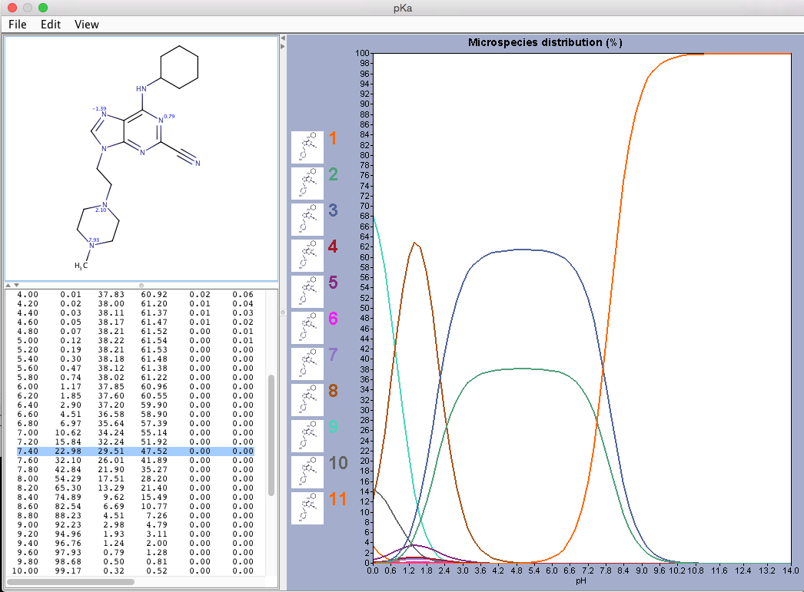
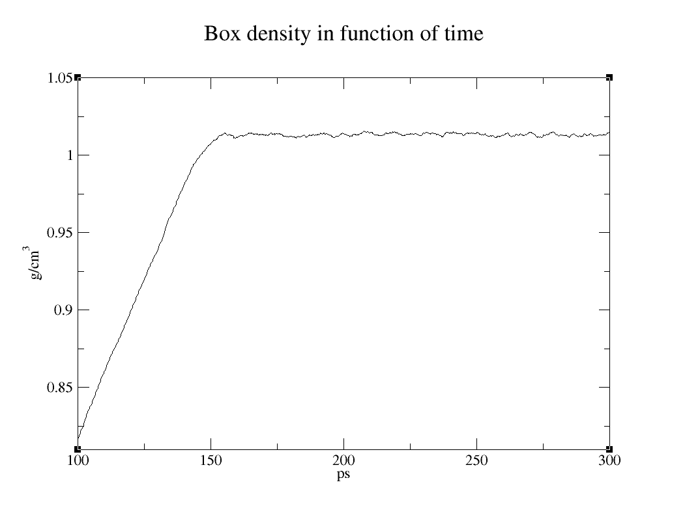
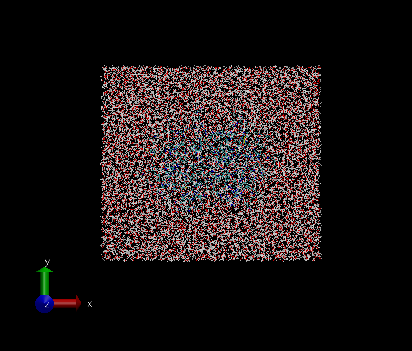
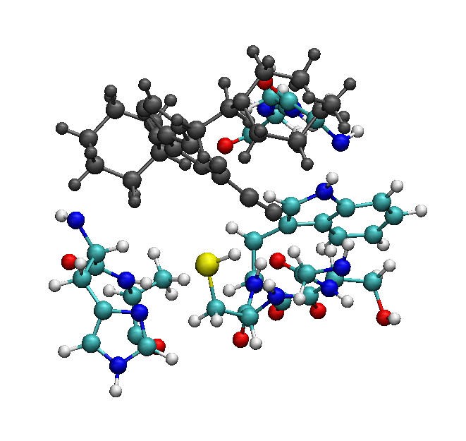
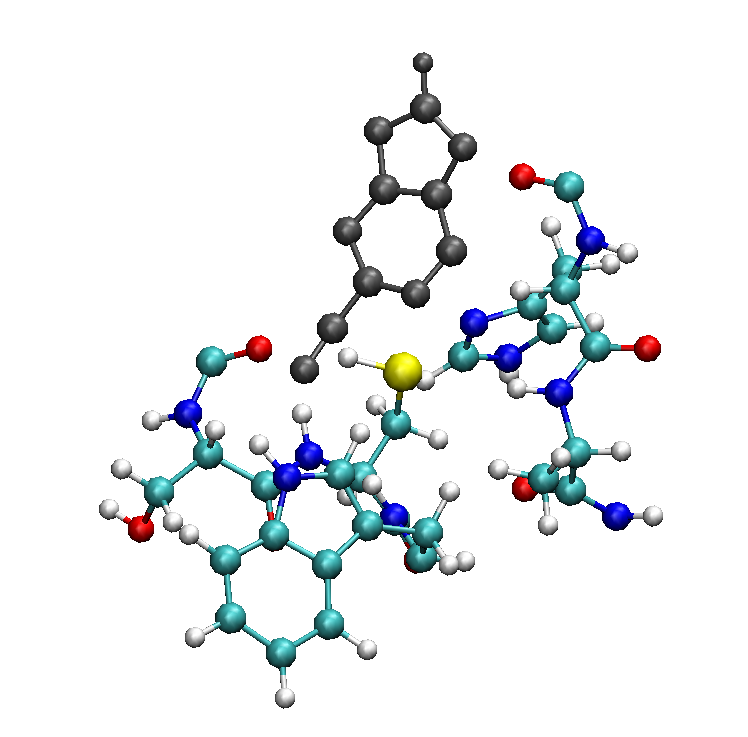

* table of contents
{:toc}

Starting from the best pose provided by the HADDOCK procedure, we want
to exploit the capability of CPMD[<sup>1</sup>](#one) and in particular its QM/MM
approach in order to get a guess of the topology of the covalent
complex.

To achieve this objective, we will need a series of codes and tools[<sup>2</sup>](#two)
that are already installed on your machine and that are directly available at the command line or can be loaded through the module environment:

<a class="prompt prompt-cmd">
module load &lt;Module name to load&gt;
</a>

Most of the input/output files mentioned in this tutorial can be found in the folder of your laptop:

`~/Tutorials/CPMD/3-Covalent_Binding_OLD_QMMM_Interface`

<a class="prompt prompt-question">Some questions displayed in orange are supposed to be answered by the reader.</a>


The PDB file `cluster1_1.pdb` contains the best pose by HADDOCK. The
ligand (residue UNK) is at the bottom of the file:

<a class="prompt prompt-cmd">
grep UNK cluster1_1.pdb > ligand.pdb
</a>


## Protonation states

If you inspect the `ligand.pdb` file with the Chimera[<sup>3</sup>](#three) visualization
tool:

<a class="prompt prompt-cmd">
chimera ligand.pdb
</a>

you will notice that the large majority of the H atoms are missing. Only
three H atoms are present in the structure. However, HAA and HBB are bound
to the N atoms of the piperazine ring and their protonation is
debatable.

Therefore, we will preliminary investigate the protonation states of the
ligand by calculating the pKa (in vacuum, i.e. without the protein
matrix) of the potential H<sup>+</sup> sites. This can be easily
achieved by using the ChemAxon tool "MarvinSketch" within the Marvin
Suite[<sup>4</sup>](#four):

<a class="prompt prompt-cmd">
MarvinSketch
</a>

The suite can be downloaded after a free registration, and the
protonation analysis workflow is available without any license.

MarvinSketch does not work with the atom coordinates with chemical
structures. The chemical structure of the ligand has to be “drawn”
through the provided buttons along the frame of the main window

Drawing a molecule is rather intuitive and will be left to the reader discover the details and have fun with that. Remember that the ligand has a piperazine and cyclohexane rings at its ends.

After drawing the molecule, if the structure is chemically consistent (no pink clouds within the structure) we can move to calculate the pKa by selecting `Calculations/Protonation/pKa` from the menu bar. Keep all the default parameters and press OK (twice).

<figure align="center">

</figure>

The analysis shows that at physiological pH (~7.4) the most probable
protonation state (47.52%) is the one with only HAA. this will be the protonation state that we will consider in this tutorial[<sup>5</sup>](#five). Let us create a PDB file for the ligand with all the H atoms. This can easily
be done by using the `AddH` tool in Chimera:

<a class="prompt prompt-pymol">
Tools/Structure Editing/AddH
</a>

Keep all the default parameters and press `OK`.

Chimera uses atom and residue names, or if these are not "standard",
atomic coordinates, to determine connectivity and atom types; the atom
types are then used to determine the number of H atoms to be added and
their positions. The positions of pre-existing atoms are not changed,
but any lone pairs and unidentifiable-element atoms are deleted.

Let us remove the HAB atom:

<a class="prompt prompt-info">
Select / Atom Specifier …<br>
Insert @HAB<br>
Press OK<br>
Actions / Atoms/Bonds / Delete
</a>

and save the structure as `ligandH.pdb`:
<a class="prompt prompt-info">
File / Save PDB<br>
Write the name in the “File name” field<br>
Press “Save”
</a>

Finally, let us remove all the H atoms from the `cluster1_1.pdb` file by
using the tool `pdb4amber` in the free AmberTools suite[<sup>6</sup>](#six):

<a class="prompt prompt-cmd">
module load AmberTools/18<br>
pdb4amber -i cluster1_1.pdb -o complex.pdb -y
</a>

Type simply the command name `pdb4amber` to get a short description of the options of the command[<sup>7</sup>](#seven).

In fact, AMBER does not follow the PDB standard atom name convention and
a name remapping for some H atoms would be needed to get the PDB correctly recognized by
the `tleap` program of AmberTools (see below). Removing the H atoms allows us to overcome the issue
without compromising accuracy: the H atoms will be added in standard positions later by the
`tleap` tool itself and the subsequent equilibration phase
needed to correctly solvate the system will provide compatible H atom
positions.

The (old) QM/MM interface of CPMD we will use in this tutorial can deal with AMBER or GROMOS force
fields. For our aim, the AMBER force field is more suitable. Therefore,
we need to build the topology file for our system in AMBER format. We
will perform this task with the AmberTools suite.

## Ligand parameterization

While standard residues constitute the protein of our system and suitable force
field parameter libraries are available in AmberTools for them, no
partial charges are available for non-standard chemical compounds like
our ligand. Several methods are available for calculating partial atomic
charges of a non standard compound (see for example
<http://ambermd.org/tutorials/basic/tutorial4b/> or the other CPMD QM/MM tutorial for the old QM/MM interface where the acetone molecule in water is investigated). The most accurate
methods require the use of a quantum mechanical code, like Gaussian
(<http://gaussian.com>) to calculate the electronic potential around the
system over which to fit the “RESP” (Restrained ElectroStatic Potential) partial atomic charges[<sup>8</sup>](#eight). However, in
our final QM/MM setup our ligand will be fully included in the quantum
region and therefore an accurate description of the ligand at force
field level is not needed. For this reason, we will parameterize the
ligand within AmberTools, and in particular by using the semi-empirical
approach built in the antechamber tool:

<a class="prompt prompt-cmd">
antechamber -i ligandH.pdb -fi pdb -o ligandH.prepin -fo prepi
–nc 1 –m 1 -c bcc –pf y -rn UNK
</a>

After few seconds of calculations the `sqm` code called by antechamber
will produce the file `ligandH.prepin` that contains the AM1-BCC partial
charges together with the atom and bond types derived from the GAFF (Generalized
Amber Force Field) library for the atoms and bonds of the ligand residue
UNK.

Actually, `antechamber` calls several programs in sequence that produce
many intermediate files in your directory: the option "-pf y" removes
them at the end of the process.

As already mentioned, use the –h option or type simply the command name `antechamber` to get a short description of all the options recognized by antechamber and to understand the meaning of each option employed in the instruction above. In addition, you can use `antechamber –L` to list the supported file formats and charge methods.

To complete the ligand parameterization we need to add the other
parameters like the ones associated to angles and dihedrals. The `parmchk`
tool in AmberTools allows one to add them in a file (usually named with the `.frcmod` extension) that
will be needed in the next step:

<a class="prompt prompt-cmd">
parmchk -i ligandH.prepin -o ligandH.frcmod -f prepi
</a>

## Topology and coordinate files

To build the topology and coordinate files for our protein+ligand
complex in AMBER format we will employ the `tleap` tool (AmberTools contains
also `xleap` that is the GUI version of `tleap`). Enter the tleap environment with the command:

<a class="prompt prompt-cmd">
tleap –f $AMBERHOME/dat/leap/cmd/oldff/leaprc.protein.ff99SB -s
</a>

where the file `leaprc.protein.ff99SB` is used to load all the libraries
containing the parameters of the AMBER force field ff99SB that we are going to use
in this tutorial. In fact, the QM/MM interface of CPMD has been mainly validated
mainly by using this force field and it is a good standard for our aim[<sup>9</sup>](#nine).
Moreover, the conversion script that we will provide you to convert the AMBER topology file to a GROMOS one readable by the QM/MM interface in CPMD (see later) has been developed specifically for this force field.

To make `tleap` parameters in `ligandH.prepin` and `ligandH.frcmod`, first we need to load the GAFF
library:

<a class="prompt prompt-info">
loadamberparams gaff.dat
</a>

and then the ligand library `ligandH.prepin` and the ligand `.frcmod` file created in
the previous step:

<a class="prompt prompt-info">
loadamberprep ./ligandH.prepin<br>
loadamberparams ./ligandH.frcmod
</a>

If we are using the GUI version of `tleap`, `xleap`, we can now give a look
at the ligand through the command edit:

<a class="prompt prompt-info">
edit UNK
</a>

One can also check if all the parameters for the ligand have been
correctly loaded:

<a class="prompt prompt-info">
check UNK
</a>

It is possible that the following warning appears:

<div align='center'>
<b>WARNING: The unperturbed charge of the unit: 0.999000 is not zero</b>
</div>
<br>

This is due to precision accuracy in the ligand parameterization and it
can be ignored.

At this point all the required libraries to recognize the different moieties of our complex have been loaded, and we can now proceed by loading the PDB file of the complex itself:

<a class="prompt prompt-info">
XXX = loadpdb complex.pdb
</a>

The program creates a new unit XXX containing our complex. All the residues should be now correctly recognized and the missing H atoms added accordingly. If you check the XXX unit:

<a class="prompt prompt-info">
check UNK
</a>

a warning will show up[<sup>10</sup>](#ten): 


<div align='center'>
<b>WARNING: The unperturbed charge of the unit: 8.000000 is not zero</b>
</div>
<br>

In fact, the charge of the complex is not zero and needs to be neutralized
with counterions in order to perform the next “equilibration” step
through classical molecular dynamics simulations. To this aim, we need
first to load the library containing the force field parameters for the
ions (Joung & Cheatham JPCB (2008)):

<a class="prompt prompt-info">
loadamberparams frcmod.ionsjc_tip3p 
</a>

and then use the command addions to add CL<sup>-</sup> ions in a shell
around the complex using a Coulombic potential on a grid:

<a class="prompt prompt-info">
addions XXX Cl- 0
</a>

where “0” instructs `addions` to neutralize the unit.

The complex environment is the cellular one, therefore we want to
solvate the complex in order to better mimic such environment:

<a class="prompt prompt-info">
loadOff solvents.lib<br>
solvatebox XXX TIP3PBOX 14
</a>

The first command loads the library with the solvent parameters and in particular the parameters for the classical “TIP3P” water model[<sup>11</sup>](#eleven) that we have used in the second command. In the second command an orthorhombic box whose walls are at least 14 Å from any atom of the complex system is created around the system and fulfilled by TIP3P water molecules. 

If you are using the graphical environment (`xleap`), we can visualize the resulting system:

<a class="prompt prompt-info">
edit XXX
</a>

In the new window you can also look at the partial charges and other
parameters of your system:

<a class="prompt prompt-info">
Select the atoms (Press “Select” at the top and keep pressing the left button of the mouse to select the interested atoms)<br>
Click on the menu Edit/Edit selected atoms
</a>

Finally (after coming back to the main window if needed), we save the topology and coordinates files for our solvated
complex:

<a class="prompt prompt-info">
saveamberparm XXX complex_solv.top complex_solv.rst
</a>

and we exit the program:

<a class="prompt prompt-info">
quit
</a>

You can now visualize the complex system though for example the popular VMD software[<sup>12</sup>](#twelve):

<a class="prompt prompt-cmd">
vmd –parm7 complex_solv.top –rst7 complex_solv.rst
</a>

and for example exploit this software to convert the two input files in a `complex_solv.pdb` file in PDB format:
<a class="prompt prompt-info">
In the “VMD Main” window select the complex_solv.top entry<br>
From the menu: File / Save Coordinates<br>
In the field “Select atoms” choose “all”<br>
Click on “save” and give the file name complex_solv.pdb
</a>

## Force Field-based equilibration

We need now to equilibrate the system at force field level. This is important because a QM/MM simulation (and more in general a quantum molecular dynamics simulation) that we are going to run in this tutorial is numerically much less stable than a classical or force field-based molecular dynamics simulation (hereafter “MD simulation”). This means that it will probably crash in the first steps if it is not started from a “good” initial configuration, i.e. a configuration as close as possible to a thermodynamical equilibrium configuration at QM/MM level compatible with the imposed ensemble conditions. Therefore, the best we can do at this stage is to obtain a well-equilibrated configuration at force field level, under the assumption that force field and QM/MM equilibrium configurations be close.
To run MD simulation we will use the sander program in the AmberTools suite (or its parallel counterpart `sander.MPI` to exploit the parallel futures of your machine).
There is no unique procedure to equilibrate a solvated system. Below a possible procedure with a rationale for each step: 

1.  First, classical minimization of the system restraining the protein
    and ligand molecules to their initial position: this step is
    performed since the initial tleap solvation is not physically very
    reasonable (no hydrogen bonds with the solute molecule, etc) and
    this way we favor water molecules to move and reorient correctly
    around the complex molecules:

<a class="prompt prompt-cmd">
mpirun -np 2 sander.MPI -O -i 1-restraint.inp -o eq_restraint.out –c complex_solv.rst -p complex_solv.top -r eq_restraint.rst –ref complex_solv.rst &
</a>

Note: the command <a class="prompt prompt-cmd">tail –f eq_restraint.out</a> can be used to monitor the minimization progress and verify if the
convergence has been obtained or if it reaches the max number of steps
specified in the input file without satisfying the convergence criteria.
It is very frequent that the minimization stops before reaching the
maximum number of steps even if the convergence has not been reached.
In this case an error message like this:

<div align='center'>
<b>REPEATED LINMIN FAILURE</b>
</div>
<br>
    can appear close to the end of the log file eq\_restraint.out. This
means that the minimizer got "stuck" in a place from which the
minimization algorithm could not find a way out. Unless there is
something very askew with the system (<u>visual inspection of the system
is always the first check</u>), the amount of minimization that has
occurred by the time you reach such a "sticking" point will be
sufficient to move on to the next step.

2.  Then, a minimization without restraints is performed in order to
    find a configuration close to the most stable T=0 one:

<a class="prompt prompt-cmd">
mpirun -np 2 sander.MPI -O -i 2-minimization.inp –o eq_minimization.out -c eq_restraint.rst -p complex_solv.top -r eq_minimization.rst &
</a>

3.  Now, we rise the system temperature to 300 K through a linear heating with a MD simulation at constant
    volume. In this step we restrain *weakly* the
    protein and ligand molecules to the initial position so that water
    can spread all around the complex without forming “holes”. This and
    the following simulations can require much longer time than the
    previous steps.

<a class="prompt prompt-cmd"> mpirun -np 2 sander.MPI -O -i 3-heating.inp -p complex_solv.top -c eq_minimization.rst -ref eq_minimization.rst -o eq_heating.out -r eq_heating.rst -x eq_heating.crd -e eq_heating.en &
</a>

<a class="prompt prompt-question">Is the temperature stable at 300 K?</a>

If the simulation has to be extended, you can use the input file `3-heating_1.inp`, which allows you to extend the simulation for additional 300 ps:

<a class="prompt prompt-cmd"> mpirun -np 2 sander.MPI -O -i 3-heating_1.inp -p complex_solv.top -c eq_heating.rst -ref eq_heating.rst -o eq_heating_1.out -r eq_heating_1.rst -x eq_heating_1.crd -e eq_heating_1.en &
</a>

4.  Finally, we couple our system simultaneously to a thermostat at 300
    K and a barostat at 1 atm and perform an NPT simulation to let the
    density of the system to reach the equilibrium value at room
    condition (~ 1 g/cm<sup>3</sup> since the largest majority of the system is formed by water molecules).
    Since the liquid water relaxation time is order of 10 ps we need to
    perform this equilibration with a simulation much longer than 10 ps:

<a class="prompt prompt-cmd"> mpirun -np 2 sander.MPI -O -i 4-eq_density.inp -p complex_solv.top -c eq_heating.rst -o eq_density.out -r eq_density.rst -x eq_density.crd -e eq_density.en &
</a>

You can monitor the status of the simulation looking at the log file:

<a class="prompt prompt-cmd"> tail –f eq_density.out </a>

<a class="prompt prompt-question">
Is the system well-equilibrated? Which quantities can you look at to assess this?
</a>

Note: when the last step ends, you can fast analyze the behavior of all
the physically relevant quantities of your system (like the density for
example) by using the perl script `process_mdout.perl` that you can
find in the tutorial subfolder `4-Force_Field-based-equilibration` together the AMBER input files:

<a class="prompt prompt-cmd">
mkdir analysis<br>
cd analysis<br>
process_mdout.perl ../eq_density.out<br>
xmgrace summary.DENSITY
</a>

<figure align="center">

</figure>

<a class="prompt prompt-question"> Why is density slightly larger than 1 g/cm<sup>3</sup>? </a>

If you open the final equilibrated structure with VMD:

<a class="prompt prompt-cmd"> vmd -parm7 complex_solv.top -rst7 eq_density.rst </a>

it is possible that the ligand is not so close to its binding site as it
was in the structure coming from HADDOCK. This is not very good when one wants
to try to induce a chemical reaction inside the site. This instability could
be due to several reasons:

1. _A poor initial pose_: additional work on the HADDOCK parameters here would be needed.
2. _An unsuitable force field_: force fields are continuously updated and in principle the newer ones should be preferred. But as we also mentioned in footnote <sup>9</sup>, this is not always true and one should always preliminarily go through the literature regarding his system and then choose the force field that has proved to provide the better results.
3. _The semi-empirical parameterization of the ligand_, and in particular its partial charges: there are more accurate methods to perform this step, in particular the one that require more expensive quantum chemistry calculations to get the electric potential around the ligand. See for example the other CPMD QM/MM tutorial investigating the acetone molecule in water solvent.

    If all the previous causes has been investigated and excluded, then the most reasonable reason is that

4. _the pose is intrinsically instable at force-field level_: in fact, it could be the case that non-bonding interactions are not enough to keep the ligand/protein complex in that position and that only the covalent bonding (not imposed/obtainable in our current level of description) could allow the formation of such complex. Therefore, at this stage the best one can do is repeat the equilibration by employing restrains specifically design to maintain the desire relative positions between the ligand and the protein. As an example, we provide input files with the name suffix “_constraint” that allows one to perform the same equilibration steps described above and in addition include a distance restraint between the nitrile carbon atom of the ligand and the sulfur atom of CYS25. 

In place of the AmberTools suite, the entire equilibration procedure (including building the topology file) could be done with any other classical MD package you are familiar with, such as [GROMACS](http://www.gromacs.org). However, in this case, as it will be clear in the next section, you will need to convert your topology and final coordinate files back to the Amber format. If you are using GROMACS, see for example 

<https://fertoledo.wordpress.com/2015/10/21/how-to-convert-a-trajectory-from-gromacs-to-amber/>

## Preparing the MM files for CPMD

Let’s give a look at the last configuration obtained from the classical
molecular dynamics equilibration:

<a class="prompt prompt-cmd"> 
vmd -parm7 complex_solv.top -rst7 eq_density.rst
</a>

<figure align="center">

</figure>

<a class="prompt prompt-question"> What happened to our orthorhombic box? </a>

The picture shows the solvated system without applying periodic boundary conditions (PBC) that however sander and many other programs in AmberTools suite take into account. Therefore, in this representation the molecules drift over time and may span multiple periodic cells; this is a normal situation in MD. However, now we want to move to CPMD in order to perform a QM/MM MD simulation, and CPMD does not apply “automatically” PBC to the starting configuration. Consequently, we need to “reimage” the coordinates into the primary unit cell. This task can be performed by the [cpptraj](http://ambermd.org/doc12/Amber18.pdf) program in the AmberTools suite. Move the topology and final coordinates files to a folder and then create the input file eq_density.cpptraj for cpptraj:

<a class="prompt prompt-info">
trajin eq_density.rst         <- coordinates file to read
trajout reimaged.rst          <- restart output file and format
center :1-216                 <- center the box to the geometric center of the complex
image center                  <- force all the molecules into the primary unit cell
</a>

Run `cpptraj` according to this syntax:

<a class="prompt prompt-cmd">
cpptraj complex_solv.top &lt; eq_density.cpptraj
</a>

Verify that the reimaging has been correctly accomplished:

<a class="prompt prompt-cmd">
vmd -parm7 acetone_solv.top -rst7 reimaged.rst
</a>

<figure align="center">

</figure>

The picture above has been obtained with VMD by selecting (in the
Display menu) the Orthographic display mode in place of the default
Perspective one.

We are now ready to convert our topology and coordinate files in a
format that the current QM/MM interface of CPMD can read. The
`amber12togromos.x` code[<sup>13</sup>](#thirteen) you can find in the above tarball file, is an
in-house program (source available under request:
<e.ippoliti@fz-juelich.de>) written some years ago to convert the Amber
MD files in the GROMOS format[<sup>14</sup>](#fourteen):

<a class="prompt prompt-cmd">
amber12togromos.x complex_solv.top reimaged.rst solvate
</a>

The option “solvate” allows one to specify that the water molecules
should be treated as solvent ones: this is useful only if you are
interested to read in the CPMD log file energies and other quantities
partitioned in solute and solvent components.

The converter will generate the following text files:

-   `gromos.top` the GROMOS topology file for our system

-   `gromos.inp` the GROMOS input file

-   `gromos.crd` the coordinates file in GROMOS96 format

Note: to open and visualize the `gromos.crd` file with VMD:

<a class="prompt prompt-cmd">
vmd –g96 gromos.crd
</a>

These 3 files are ready for a QM/MM MD simulation. However, some changes
in those files could be necessary in order to correctly set up the
simulation. Below we describe the most relevant sections[<sup>15</sup>](#fifteen) of these
files that need to be verified. Note that the `amber12togromos.x` code
provides a `gromos.inp` file with fully commented sections.

<u> _In `gromos.inp`_ </u>

1.  In the section SYSTEM the two numbers should be in sequence:

    Number of (identical) solute (not necessarily the QM part!)
    molecules[<sup>16</sup>](#sixteen)

    Number of (identical) solvent (not necessarily the MM part!) molecules

    This information can be obtained for example by inspecting the
 `gromos.crd` file:

<a class="prompt prompt-cmd"> vi gromos.crd </a>

2.  In the section BOUNDARY:

    The first number should be 0 for isolated system; &gt;0 if PBC in
    parallelepiped box has been used; &lt;0 if PBC in octahedral box has
    been used.

    The following 3 numbers are the sizes of the box that can be read at
    the end of `gromos.crd` file.

    90.0 is the angle between the x and z axis of the box.

    The last number is ignored by CPMD in QM/MM simulations.

3.  In the section SUBMOLECULES the numbers in sequence should be:

    Number of (different) solute molecules<sup>18</sup>.

    Index of the last atom of the first solute molecule.

    Index of the last atom of the second solute molecule.

    ...

    Such data can be read from the `gromos.crd` file:

4.  In the section PRINT you may want to modify the first number, which
    is the number of steps after that CPMD writes info of the energy in
    the output file (100 is usually enough).

5.  In the section FORCE, under the line of 1's (which turn the various
    force components on, so that when only 1’s are present all the force
    terms are included in the calculations), we have to put:

    The number of different layers, usually 2 (solute and solvent)  
    Index of the last atom of layer 1  
    Index of the last atom of layer 2  
    ...

<u> _In `gromos.top`_ </u>

1.  In the section ATOMTYPENAME replace the names of the types of the
    atoms, coming from the standard generic force field library GAFF (o,
    c, c3, etc):

<a class="prompt prompt-cmd"> vi $AMBERHOME/dat/leap/parm/gaff.dat </a>

    to the Amber force field library (O, C, CT, etc):

<a class="prompt prompt-cmd"> vi $AMBERHOME/dat/leap/parm/parm99.dat </a>

The correctly modified files gromos_mod.top and gromos_mod.inp have been provided in the tutorial subfolder `5-Preparing_the_MM_files_for_CPMD`

## Selecting the QM part

The system we want to study contains 40,554 atoms. With the current computational architectures, a full quantum description of a system of this size is far beyond the capabilities of any QM code. The largest systems that so far have been fully treated at quantum level are order of 5,000 atoms. This is the reason why we need to resort to QM/MM approaches to deal with such large systems and at the same time having the possibility to treat at quantum level the part(s) that require the inclusion of the electronic degrees of freedom for a correct description (e.g. for the description of chemical reactions).
Usually, the computational load of a QM/MM calculation is dominated by the size of the QM part. Therefore, the QM part should be as small as possible, but at the same time it should of course include all the regions that are important (e.g. the ones involved in the chemical reaction) or potentially important (e.g. the ones whose polarization has an effect on the phenomenon under investigation) to be treated at quantum level.

<a class="prompt prompt-question"> How should the QM part for our system be selected? </a>

<a class="prompt prompt-cmd"> vmd –g96 gromos.crd </a>

Since we want to consider a chemical reaction between the ligand and the protein, the first idea is to include the entire ligand and the residues closer to it, let us say within ~6 Å from the atoms of the ligand. We can visualize this complex region with VMD by using the selection:
 
<a class="prompt prompt-pymol"> resname UNK or (not resname SOLV and same residue as within 6 of resname UNK) </a>

and from this, by visual inspection we can identify and exclude the farthest residues that probably are not involved in the reaction mechanism between the nitrile carbon atom of the ligand and the closer sulfur atom on the protein (resid: 19, 135, 136, 137, 159, 183, 184, 216):

<figure align="center">

</figure>

<br>*Note that the ligand is colored in gray in the picture*

If we open the Tk console of VMD by selecting from the menu in the VMD Main window:

<a class="prompt prompt-info"> Extensions / Tk Console </a>

we can easily count the number of atoms for this selection:

<a class="prompt prompt-pymol">
set sel [atomselect top "resname UNK or (not resname SOLV and resid 22 23 24 25 26 63 64 65 66 67 68 134 160 161 162 163 209)"]<br>
$sel num
</a>

The result is 277 atoms. Even if the largest QM/MM systems studied with CPMD have a QM part of around 2000 atoms, such calculations required a huge amount of computational resources and were performed on one of the recent and most powerful supercomputers, an IBM BlueGene machine. In fact, typical QM parts contain less than 200 atoms and also in this case, projects involving QM/MM simulations of that size usually take around one year to be finalized.
Since the reaction we are interested in involves the nitrile carbon atom of the ligand and the sulfur atom in the CYS25, we could think to reduce the QM part to the ligand and only the residues close to the CYS 25 (resid: 23, 24, 25, 26, 64, 65, 66, 162, 163):

<figure align="center">

</figure>

This new selection contains 157 atoms:

<a class="prompt prompt-pymol">
set sel [atomselect top "resname UNK or (not resname SOLV and resid 23 24 25 26 64 65 66 162 163)"]<br>
$sel num
</a>

This is a more treatable QM part but very probably we will need a very large amount of computational time to perform our calculations.
We can think to further reduce our selection by considering only the part of the ligand involved in the reaction (i.e. the aromatic plane containing the nitrile group) and the closest residues to the sulfur atom in CYS25 (resid: 23, 24, 25, 26, 162, 163):

<figure align="center">

</figure>

This way we reach a size of 91 atoms:

<a class="prompt prompt-pymol">
set sel [atomselect top "(name C08 C0A C0B C0K C0N C0O N07 N09 N0J N0M N0P HC1) or (not resname SOLV and resid 23 24 25 26 162 163)"]<br>
$sel num
</a>

Really, the boundary between the QM and MM part cannot be arbitrarily
chosen. In particular, the bonds “to cut”, i.e. the bonds that connect
an atom treated at quantum level with an atom described at force field
level, should be:

1.  Single (σ) bonds;

2.  Between two atoms with the same or at least very similar
    electronegativity, since the electronic description around that QM
    atom would be inevitably poor;

3.  Not belonging to conjugated or aromatic moieties in order to avoid
    cutting over π molecular orbitals.

For biological systems these rules imply that QM/MM boundaries can only
be introduced between C-C or possibly C-N bonds. This bring us to
a QM part with 93 atoms:

<figure align="center">

</figure>

that can be visualized on VMD by using the following selection:

<a class="prompt prompt-pymol">
serial 347 348 349 350 351 352 353 354 355 356 357 358 359 360 361 362 363 364 365 366 367 368 369 370 371 372 373 374 375 376 377 378 379 380 381 382 383 384 385 386 387 388 389 390 391 392 2402 2403 2404 2405 2406 2407 2408 2409 2410 2411 2412 2413 2414 2415 2416 2417 2418 2419 2420 2421 2422 2423 2424 2425 2426 2427 2428 2429 2430 2431 2432 3263 3264 3265 3266 3267 3268 3269 3270 3271 3272 3273 3274 3275 3276
</a>

Cutting a large molecule like a protein by following the prescriptions above is usually a safe procedure. However, describing at two different levels of theory (quantum and force field) a small molecule like the ligand could be more troublesome. We left as an exercise to verify that the removal of the cyclohexane ring, even performing the correct valence capping as explained in the next section, will produce a too poor electronic description for the ligand, that in turn will result in the lose of structure during the first steps of the simulation. In contrast, the removal of the 4-methylpiperazinylethyl moiety does not trigger any lose of stability. However, as mentioned in the article where the original PDB of the complex has been taken[<sup>17</sup>](#seventeen), homologous cathepsins that differ in those moieties can have very different inhibition potencies and could therefore be important to keep that moiety for a correct description of the reaction that is going to take place. Therefore, keeping the entire ligand we finally have a QM part formed by 133 atoms:

<figure align="center">

</figure>

that can be visualized on VMD by using the following selection (that will be useful later to build the CPMD input file as well):

<a class="prompt prompt-pymol">
serial 347 348 349 350 351 352 353 354 355 356 357 358 359 360 361 362 363 364 365 366 367 368 369 370 371 372 373 374 375 376 377 378 379 380 381 382 383 384 385 386 387 388 389 390 391 392 2402 2403 2404 2405 2406 2407 2408 2409 2410 2411 2412 2413 2414 2415 2416 2417 2418 2419 2420 2421 2422 2423 2424 2425 2426 2427 2428 2429 2430 2431 2432 3246 3247 3248 3249 3250 3251 3252 3253 3254 3255 3256 3257 3258 3259 3260 3261 3262 3263 3264
</a>

Use VMD to understand how the final QM part has been determined and which bonds are cut.

Then, save a PDB file with only the QM part and name it QM.pdb[<sup>18</sup>](#eighteen):

<a class="prompt prompt-pymol">
set QM [atomselect top "serial 347 348 349 350 351 352 353 354 355 356 357 358 359 360 361 362 363 364 365 366 367 368 369 370 371 372 373 374 375 376 377 378 379 380 381 382 383 384 385 386 387 388 389 390 391 392 2402 2403 2404 2405 2406 2407 2408 2409 2410 2411 2412 2413 2414 2415 2416 2417 2418 2419 2420 2421 2422 2423 2424 2425 2426 2427 2428 2429 2430 2431 2432 3246 3247 3248 3249 3250 3251 3252 3253 3254 3255 3256 3257 3258 3259 3260 3261 3262 3263 3264 3265 3266 3267 3268 3269 3270 3271 3272 3273 3274 3275 3276 3277 3278 3279 3280 3281 3282 3283 3284 3285 3286 3287 3288 3289 3290 3291 3292 3293 3294 3295 3296 3297 3298 3299 3300 3301"]<br>
$QM writepdb QM.pdb
</a>

Before concluding this section about the selection of the QM part, it is important to highlight an important point. The computational load of a QM or QM/MM simulation depends on the size of the basis set employed. In the case of QM codes employing a “localized” basis set (e.g. Gaussian2016), the computational cost is proportional to the number of atoms. However, CPMD expands the system wavefunction over a “plain waves” basis set. This means that the computational load is not proportional to the number of atoms inside the cell but to the size of box itself. Therefore, once fixed the size of the QM simulation box, for CPMD it does not matter (from the computational point of view) how many atoms inside the box you will treat at quantum mechanical level, i.e. how many atoms inside the box you will add in the input file! What is relevant for the computational cost point of view is only the size of box.

## Preparing the QM files for CPMD

With the AMBER package we have built the system and the files needed to
describe the “MM” part, i.e. the part of the system that in a QM/MM
simulation is described at force field level. The next step to setup a
QM/MM simulation with CPMD is to write the input file of CPMD. This file is the
place where to specify 1) the QM part, 2) the details of the QM/MM simulation.

The CPMD code is a parallelized **plane wave** / **pseudopotential**
implementation of Density Functional Theory (DFT), particularly designed
for *ab initio* molecular dynamics. This means that CPMD:

1.  Employs DFT to solve the quantum electronic problem

2.  Expands the total wavefunction over a **plane wave** basis set

3.  Describes explicitly (degrees of freedom) only the valence electrons
    and uses the **pseudopotentials** to approximate the effect of the
    neglected core electrons over the valence ones.

4.  Allows performing Car-Parrinello (and also Born-Oppenheimer) molecular dynamics simulations 

We cannot enter here in the details of DFT and its implementation in
CPMD[<sup>19</sup>](#nineteen) and in what follows the basics of the theory are supposed to be
known.

<u> _CPMD Input file_ </u>

Any CPMD input file is organized in sections that start with `&<NAME
OF THE SECTION>` and end with `&END`. Everything outside those sections
is ignored. Moreover, all keywords have to be in upper case otherwise they will
be ignored. The sequence of the sections does not matter, nor does the
order of keywords (except in some special case reported in the manual).
A minimal input file (for the simplest full QM calculations) must have
at least a `&CPMD`, a `&SYSTEM`, and an `&ATOMS` section. Here below an
example:

```
&INFO
  Geometry optimization
&END

&CPMD
OPTIMIZE GEOMETRY XYZ
  CONVERGENCE ORBITALS
    1.0d-7
  CONVERGENCE GEOMETRY
    7.0d-4
&END

&DFT
 FUNCTIONAL BLYP
&END

&SYSTEM
  ANGSTROM
  SYMMETRY
    ORTHORHOMBIC
  CELL ABSOLUTE
    10.6 10.0 9.8 0.0 0.0 0.0
  CUTOFF
    70.
&END

&ATOMS
*C_MT_BLYP.psp KLEINMAN-BYLANDER
  LMAX=D
    3
  0.000000 0.000000 0.000000
  1.367073 0.000000 -0.483333
  -0.683537 -1.183920 -0.483333

*O_MT_BLYP.psp KLEINMAN-BYLANDER
  LMAX=D
    1
  0.000000 0.000000 1.220000

*H_MT_BLYP.psp KLEINMAN-BYLANDER
  LMAX=P
    6
  1.367073 0.000000 -1.572333
  1.880433 0.889165 -0.120333
  1.880433 -0.889165 -0.120333
  -0.683537 -1.183920 -1.572333
  -0.170177 -2.073085 -0.120333
  -1.710256 -1.183920 -0.120333
&END
```

This input file starts with an (optional) &INFO section. This section
allows you to put comments about the calculation into the input file and
they will be repeated in the output file. This can be very useful to
identify and match your input and output files.

The first part of the `&CPMD section` instructs the program about the
kind of job to perform. In the case of the example, a geometry
optimization (XYZ option specifies you want the final structure also in
xyz format in a file called `GEOMETRY.xyz` and a ’trajectory’ of the
optimization in a file named `GEO_OPT.xyz`) with a tight wavefunction and
geometry convergence criterions respectively (default 10<sup>-5</sup>
and 5\*10<sup>-4</sup>) is requested.

The `&SYSTEM section` contains various parameters related to the
simulation cell and the representation of the electronic structure. The
keywords SYMMETRY, CELL and CUTOFF are required and define the
(periodic) symmetry, the shape and size of the simulation box (x, y, z,
cos(xy), cos(xz), cos(yz)), as well as the plane wave energy cutoff
(i.e. the size of the basis set), respectively. The keyword ANGSTROM
specifies that the atomic coordinates, the (super)cell (quantum box)
parameters and several other parameters are read in Ångströms (pay
attention: default is atomic units (a.u.) which are always used
internally). The (quantum) simulation box has to be large enough to
include the large majority of the electronic density of the system. In
order to verify if the box size is large enough, one usually performs
convergence tests by focusing on quantities like the total energy.

CPMD uses the Density Functional Theory (DFT) to solve the quantum
problem. The `&DFT section` is used to select the density functional
(FUNCTIONAL) and its related parameters. In the case of the example the
gradient corrected BLYP functional[<sup>20</sup>](#twenty) is employed (local density
approximation is the default).

Finally, the `&ATOMS section` is needed to specify the atom
coordinates and the pseudopotential(s), that are used to represent them.

The input for a new atom type is started with a "_*_" in the first
column. This line further contains the file name where to find the
information for the corresponding pseudopotential, and several other
possible labels such as KLEINMAN-BYLANDER in the example, which
specifies the method to be used for the calculation of the nonlocal
parts of the pseudopotential (this approximation make the nonlocal parts
calculation extremely fast but it keeps also in general high accuracy). The 
collection of pseudopotential files is available for CPMD. We provide in the tutorial subfolder `7-Preparing_the_QM_files_for_CPMD` and the ones necessary to describe the atoms of this system.

The next line contains information on the nonlocality of the
pseudopotential: you can specify the maximum *l*-quantum number terms that CPMD will 
take into account in the calculations with `LMAX`= _l_ where _l_ is S for _l_ =0, P for
_l_ =1, D for _l_ =2, and so on[<sup>21</sup>](#twentyone). For each pseudopotential, the information of only a
limited number of l-quantum number terms has been stored in its file. You can verify 
how many l-quantum number terms are available by opening the pseudopotential file and
looking at the number of columns in the section `&WAVEFUNCTION`: the first column is 
the distance from the nucleus, while the other columns are the data for _l_ =0, _l_ =1, _l_=2…
Of course, larger is `LMAX`, more expensive will be the computation.


On the following lines the coordinates for this atomic species have to
be given.

The first line gives the number of atoms of the current type.

<u> _CPMD QM/MM Input file_ </u>

A CPMD input file for a QM/MM simulation is similar to the CPMD input
file for a standard full QM calculation. However, there are 6 main
differences that should always be taken into account when you deal with
the old QM/MM interface of CPMD:

1.  In the `&CPMD` section the `QMMM` keyword has to be added.

2.  A new `&QMMM` section, which we will explain in detail below,
    is mandatory.

3.  In the `&ATOMS` section, the QM atoms has to be specified as in the
    full QM calculations. However, instead of explicit coordinates one
    has to provide the *atom indices* (that we have identified in the
    previous paragraph) as given in the GROMOS topology or coordinates
    files:

<a class="prompt prompt-cmd"> vi gromos.crd </a>
    
We have already identified the atom indices in the previous section and in particular these indices correspond to the ones identified with the VMD keyword `serial`.
A bash command to get the string of indices corresponding to the carbon (“C”) from the `gromos.crd` file is: 

    
<a class="prompt prompt-cmd">
for i in 347 348 349 350 351 352 353 354 355 356 357 358 359 360 361 362 363 364 365 366 367 368 369 370 371 372 373 374 375 376 377 378 379 380 381 382 383 384 385 386 387 388 389 390 391 392 2402 2403 2404 2405 2406 2407 2408 2409 2410 2411 2412 2413 2414 2415 2416 2417 2418 2419 2420 2421 2422 2423 2424 2425 2426 2427 2428 2429 2430 2431 2432 3246 3247 3248 3249 3250 3251 3252 3253 3254 3255 3256 3257 3258 3259 3260 3261 3262 3263 3264 3265 3266 3267 3268 3269 3270 3271 3272 3273 3274 3275 3276 3277 3278 3279 3280 3281 3282 3283 3284 3285 3286 3287 3288 3289 3290 3291 3292 3293 3294 3295 3296 3297 3298 3299 3300 3301; do grep " $i  " gromos.crd; done | awk '{if (substr($3,1,1) ~ "C") print $4}' | tr '\n' ' '; echo
</a>

while to get the number of “C” atoms in the QM part:
    
<a class="prompt prompt-cmd">
for i in 347 348 349 350 351 352 353 354 355 356 357 358 359 360 361 362 363 364 365 366 367 368 369 370 371 372 373 374 375 376 377 378 379 380 381 382 383 384 385 386 387 388 389 390 391 392 2402 2403 2404 2405 2406 2407 2408 2409 2410 2411 2412 2413 2414 2415 2416 2417 2418 2419 2420 2421 2422 2423 2424 2425 2426 2427 2428 2429 2430 2431 2432 3246 3247 3248 3249 3250 3251 3252 3253 3254 3255 3256 3257 3258 3259 3260 3261 3262 3263 3264 3265 3266 3267 3268 3269 3270 3271 3272 3273 3274 3275 3276 3277 3278 3279 3280 3281 3282 3283 3284 3285 3286 3287 3288 3289 3290 3291 3292 3293 3294 3295 3296 3297 3298 3299 3300 3301; do grep " $i  " gromos.crd; done | awk '{if (substr($3,1,1) ~ "C") print $4}' | wc -l
</a>
    
and in a similar way for the other atomic species (“H”, “”N”, “O”, “S”).

1.  The `ANGSTROM` keyword in the `&SYSTEM` section cannot be used, so any
    length has to be specified in *a.u.*

2.  The option `ABSOLUTE` in the keyword `CELL` cannot be used. Therefore,
    the correct syntax for the size of an orthorhombic box A x B x C is

<a class="prompt prompt-info"> A  B/A  C/A  0  0  0 </a>

1.  The QM system in a QM/MM calculation can only be dealt as isolated
    system, i.e. without explicit PBC since there is the MM environment
    all round it. Even though we are requesting an isolated system
    calculation (SYMMETRY keyword with the option `ISOLATED SYSTEM` or
    `0`), the calculation is, in fact, still done in a periodic cell (we
    are still using a plane wave basis set to expand the wavefunction of
    the QM part!). Biological molecules are charged or they have a
    dipole moment, therefore we have to take care of the long-range
    interactions between periodic images and there are methods
    (activated with the keyword `POISSON SOLVER` in the `&SYSTEM` section)
    implemented in CPMD to compensate for this effect. We will choose
    the `TUCKERMAN` Poisson solver[<sup>22</sup>](#twentytwo) since it has been proven to be
    the most effective one with typical systems studied in biology.
    Decoupling of the electrostatic images in the Poisson solver
    requires increasing the box size over the dimension of the molecule:
    practical experience shows that 3.5 Å between the outmost atoms and
    the box walls is usually sufficient for typical biological systems. More information about the solver can be found on the CPMD manual[<sup>23</sup>](#twentythree). 

To determine the box size of the QM part one can for example use the
following standard bash procedure:

-   Remove the first line:

<a class="prompt prompt-cmd"> tail –n +2 QM.pdb > QM.dat </a>

-   Reorder the lines in the column 7 (8,9) for the coordinate x (y, z)
    with an increasing numerical (-n) order:

<a class="prompt prompt-cmd"> sort -k 7 -n QM.dat </a>

-   Take the last value (L) of the column (in Å), subtract it to the
    first one (F), add 7 Å (i.e. 2 \* 3.5 Å for the Poisson
    solver’s requirements) and then convert it to a.u.:

<a class="prompt prompt-cmd"> echo "(L - F + 7)/0.529" | bc –l </a>

-   Finally, remember that under the `CELL` keyword of the CPMD input file
    the size of the quantum cell will be inserted according to the
    syntax:

<a class="prompt prompt-info"> size_x     size_y/size_x  size_z/size_x  0   0   0 </a>

<u> _`&QMMM` section_ </u>

In this paragraph we will review the most relevant keywords to be
specified in the **`&QMMM` section** of the CPMD input file:[<sup>24</sup>](#twentyfour)

 `TOPOLOGY`: On the next line the name of a GROMOS topology file has to
 be given.

 `COORDINATES`: On the next line the name of a GROMOS96 format coordinate
 file has to be given.

 `INPUT`: On the next line the name of a GROMOS input file has to be
 given.

 `AMBER`: An Amber functional form for the classical force field is used
 (if this keyword is not specified, the default is the GROMOS
 functional form).

 `ELECTROSTATIC COUPLING`: The electrostatic interaction of the quantum (QM) system
 with the classical (MM) system is explicitly kept into account for all
 classical atoms at a distance *r* ≤ `RCUT_NN` from any quantum atom and
 for all the MM atoms at a distance of `RCUT_NN` < *r* ≤ `RCUT_MIX`
 and a charge larger than 0.1*e* (NN atoms). MM atoms with a charge
 smaller than 0.1*e* and a distance of `RCUT_NN` < *r* ≤ RCUT_MIX,
 and all MM atoms with `RCUT_MIX` < *r* ≤ RCUT_ESP are coupled to
 the QM system by a ESP coupling Hamiltonian (EC atoms).

 If the additional `LONG RANGE` keyword is specified, the interaction of
 the QM system with the rest of the MM atoms is explicitly kept into
 account via interacting with a multipole expansion for the QM system
 up to quadrupolar order. A file named `MULTIPOLE` is produced.

 If `LONG RANGE` is omitted the quantum system is coupled to the
 classical atoms not in the NN-area and in the EC-area list via the
 force-field charges.

 If the keyword `ELECTROSTATIC COUPLING` is omitted, all classical atoms
 are coupled to the quantum system by the force field charges
 (mechanical coupling): computational expensive calculation!

 `RCUT_NN`: The cutoff distance for atoms in the nearest neighbor region
 from the QM system is read from the next line. We will use the default
 value of 10 a.u.

 `RCUT_MIX`: The cutoff distance for atoms in the intermediate region is
 read from the next line. We will use the value of 15 a.u.

 `RCUT_ESP`: The cutoff distance for atoms in the ESP-area is read from
 the next line. We will use the value of 20 a.u.

 `UPDATE LIST`: On the next line the number of MD steps between updates
 of the various lists of atoms for ELECTROSTATIC COUPLING is given. At
 every list update a file INTERACTING\_NEW.pdb is created (and
 overwritten).

 `SAMPLE INTERACTING`: The sampling rate for writing a trajectory of the
 interacting subsystem is read from the next line. With the additional
 `OFF` keyword or a sampling rate of `0`, those trajectories are not
 written.

 `ARRAYSIZES`: This keyword defines the beginning of a block (to be terminated by a line containing `END ARRAYSIZES`) that can contain the parameters for the dimensions of various internal arrays. Each vector size has to be specified in a single line with the syntax:

```
<vector name>  <size>
```

The suitable parameters can be estimated using the script estimate_gromos_size.sh that can be found in the tutorial subfolder `7-Preparing_the_QM_files_for_CPMD`:

<a class="prompt prompt-cmd"> estimate_gromos_size.sh gromos.top </a>

<u> _How to Cut the Bonds_ </u>

As we have already mentioned in the previous section, whenever the QM/MM boundary cuts through an existing bond, special care has to be taken to make sure that the electronic structure of the QM-subsystem is a good representation of the one we would get with a full QM calculation, and also that the structure in the boundary region is preserved. So far, two different approaches have been implemented in CPMD: the hydrogen capping and the special link-atom pseudopotentials. The former, that is described in the CPMD manual[<sup>25</sup>](#twentyfive), is a bit laborious to setup and it is very useful when the classical atom at one end of the cut bond is not a carbon atom. The latter has been further improved and optimized with the method[<sup>26</sup>](#twentysix) described in and it is currently the most popular one. It consists in placing a scaled down optimized pseudopotential with the required valence change (usually ZV=1 since cutting through a single bond) in place of classical atom. Currently, the optimized monovalent pseudopotential for replacing a carbon atom has been developed “C_GIA_DUM_AN_BLYP.oecp” and it is provided in the tutorial subfolder `7-Preparing_the_QM_files_for_CPMD` together with all the other pseudopotential files associated to the atomic species present in the system investigated in this tutorial.

Therefore, in the `&ATOMS` section we will need to add an additional
entry, representing the monovalent carbon atoms (green balls in the picture[<sup>27</sup>](#twentyseven) below) 
that saturate all the 4 dangling bonds of our QM part:

<a class="prompt prompt-pymol"> 
*C_GIA_DUM_AN_BLYP.oecp KLEINMAN-BYLANDER
  LMAX=P
    4
  344 393 2392 2433
</a>

Note that the addition of these 4 atoms in the QM part has to be taken into account when we calculate the size of the quantum simulation box!

<figure align="center">

</figure>

By using the Tk console of VMD, we can write the PDB file of the complete (saturated) QM part:

<a class="prompt prompt-pymol"> 
set sel [atomselect top "serial 344 347 348 349 350 351 352 353 354 355 356 357 358 359 360 361 362 363 364 365 366 367 368 369 370 371 372 373 374 375 376 377 378 379 380 381 382 383 384 385 386 387 388 389 390 391 392 393 2392 2402 2403 2404 2405 2406 2407 2408 2409 2410 2411 2412 2413 2414 2415 2416 2417 2418 2419 2420 2421 2422 2423 2424 2425 2426 2427 2428 2429 2430 2431 2432 2433 3246 3247 3248 3249 3250 3251 3252 3253 3254 3255 3256 3257 3258 3259 3260 3261 3262 3263 3264 3265 3266 3267 3268 3269 3270 3271 3272 3273 3274 3275 3276 3277 3278 3279 3280 3281 3282 3283 3284 3285 3286 3287 3288 3289 3290 3291 3292 3293 3294 3295 3296 3297 3298 3299 3300 3301"]<br>
$sel writepdb QM_saturated.pdb
</a>

Finally, repeating the previously mentioned procedure to get the size of the QM simulation box, we can get the line to be added below the CELL keyword in the CPMD input file:

<a class="prompt prompt-info"> 
CELL
42.38  1.1279  0.8436  0  0  0
</a>

## QM/MM strategies

In the previous paragraph you have discussed almost all the ingredients to setup the input files for a QM/MM simulation. In the tutorial folder `8-QMMM_Strategies` you can find a `template.inp` input file for our complex system with all the sections discussed so far. What is still missing is to understand which “kind” of simulation we want to perform and populate the `&CPMD` section accordingly.
Usually, as in this tutorial case, we are in the condition to know (or at least suppose) that a chemical reaction within the selected QM part has to take place. The objective is therefore to make this chemical reaction to occur and consequently have a preliminary topology for subsequent equilibration and analysis.
Three scenarios are possible:

1. There is **no potential energy barrier** for the chemical reaction. In this case a geometry optimization or as we will see in a short a <u>simulating annealing</u> could be enough to get an initial topology for our complex.

2. There is **a free energy barrier of order of k<sub>B</sub>T**. In this case, after the initial simulating annealing, we need to setup a <u>quantum molecular dynamics</u> (e.g. a Car-Parrinello MD). If the chemical reaction is supposed to occur on the picosecond timescale, this approach should be enough to observe the reaction.

3. The **free energy barrier is considerably larger than k<sub>B</sub>T** and/or the timescale for the reaction is much larger than picoseconds, the reaction cannot occur spontaneously during the simulation time of the quantum molecular dynamics and a <u>steered or restrained/constrained molecular dynamics</u> or more in general some <u>enhanced sampling technique</u> (e.g. metadynamics, umbrella sampling) has to be employed.

When we have no information about the reaction, each of the above mentioned approach has to be attempted in sequence, 
also because each approach is preliminary for the subsequent one.
Moreover, the approaches are listed in increasing order of complexity and computational requirements. Just to provide 
some estimates, for a system with a size similar to the one we are currently investigating, on a state-of-the-art 
workstation the first approach is supposed to take several hours/days of calculations, the second one requires order 
of weeks, while performing a meaningful simulation with the third approach needs some months. For this reason, 
in this tutorial we will focus mainly on the first two approaches.

## QM/MM annealing

If there is no energy barrier in the chemical reaction, then you should
observe the reaction with a simple **geometry optimization**, i.e. by
minimizing the potential energy of the (quantum) system as a function of
the nuclear coordinates. Unfortunately, all the geometry optimization
algorithms in CPMD either do not work in combination with the QM/MM
interface, or do support optimization of the QM atom positions only.[<sup>28</sup>](#twentyeight)
Consequently, we have to use some “trick” to find a minimal energy
structure at QM/MM level. In particular, in this tutorial we will
perform a _simulated annealing_ (keyword in the `&CPMD` section of the CPMD input file: `ANNEALING IONS`), i.e. we run
a Car-Parrinello MD where gradually removing kinetic energy from the
nuclei by multiplying velocities with a factor (in our case it is set to
0.99, so 1% of the kinetic energy will be removed in every step).
Here it is the `annealing.inp` file that performs this preliminary
step:[<sup>29</sup>](#twentynine)

```
&QMMM
TOPOLOGY
 gromos_mod.top
COORDINATES
 gromos.crd
INPUT
 gromos_mod.inp
ELECTROSTATIC COUPLING LONG RANGE
RCUT_NN
 10
RCUT_MIX
 15
RCUT_ESP
 20
UPDATE LIST
 100
SAMPLE_INTERACTING
 0
AMBER
ARRAYSIZES

 MAXATT 29
 MAXAA2 234
 MAXNRP 3319
 MAXNBT 74
 MAXBNH 1626
 MAXBON 1736
 MAXTTY 139
 MXQHEH 3692
 MAXTH  2350
 MAXQTY 10
 MAXHIH 10
 MAXQHI 10
 MAXPTY 62
 MXPHIH 7336
 MAXPHI 5835
 MAXCAG 1049
 MAXAEX 29364
 MXEX14 8682

 END ARRAYSIZES
&END


&CPMD
QMMM
MOLECULAR DYNAMICS CP
ISOLATED MOLECULE
QUENCH BO
ANNEALING IONS
 0.99
TEMPERATURE
 300
EMASS
 600.
TIMESTEP
 5.0
MAXSTEP
 3000
TRAJECTORY SAMPLE
 0
STORE
 100
RESTFILE
 1
&END

&DFT
FUNCTIONAL BLYP
&END

&SYSTEM
POISSON SOLVER TUCKERMAN
SYMMETRY
 0
CELL
 42.38  1.1279  0.8436  0  0  0
CUTOFF
 70.
CHARGE
 0.0
&END


&ATOMS
*H_MT_BLYP.psp KLEINMAN-BYLANDER
   LMAX=P
    62
 350 352 354 355 357 361 363 365 366 368 372 374 376 377 380 382 385 387 389 391 2405 2407 2409 2410 2414 2416 2418 2422 2424 2426 2427 2428 2432 3247 3248 3250 3251 3253 3254 3256 3257 3259 3260 3262 3264 3275 3278 3279 3281 3282 3285 3286 3288 3289 3292 3293 3294 3295 3297 3298 3300 3301

*C_MT_BLYP.psp KLEINMAN-BYLANDER
   LMAX=D
    46
347 351 353 358 362 364 369 373 375 378 379 383 384 386 388 390 392 2402 2406 2408 2411 2413 2417 2419 2423 2425 2429 3246 3249 3252 3255 3258 3261 3265 3267 3268 3271 3272 3274 3277 3280 3284 3287 3291 3296 3299

*O_MT_BLYP.psp KLEINMAN-BYLANDER
   LMAX=D
    7
348 356 359 370 2403 2420 2430

*N_MT_BLYP.psp KLEINMAN-BYLANDER
   LMAX=D
    17
349 360 371 381 2404 2412 2415 2421 2431 3263 3266 3269 3270 3273 3276 3283 3290
     
*S_MT_BLYP.psp KLEINMAN-BYLANDER
   LMAX=D
    1
 367

*C_GIA_DUM_AN_BLYP.oecp KLEINMAN-BYLANDER
   LMAX=P
    4
 344 393 2392 2433
&END
```

Some comments on the keywords in the `&CPMD` section which have not been explained, yet:

`MOLECULAR DYNAMICS CP`: 	Perform a molecular dynamics run. 
CP stands for a Car-Parrinello type of MD.

`ISOLATED MOLECULE`:	Calculate the (quantum) ionic temperature assuming that the (quantum) system consists of an isolated molecule or cluster.

`QUENCH BO`:	The wavefunction of the QM part is minimized at the beginning of the MD run.

`TEMPERATURE`:	The initial temperature for the QM atoms in Kelvin is read from the next line: we start from 300 K since it is the temperature at which we equilibrate the system classically.

`EMASS`:	The fictitious electron mass in atomic units for the CP
dynamics is read from the next line. We choose 600 a.u. but ideally a
careful set of tests should be done to verify that adiabaticity conditions
are met[<sup>30</sup>](#thirty): this and the following parameter are the only parameters to tune
in order to decouple the electronic and ionic degrees of freedom and therefore 
to minimize their energy transfer (adiabatic condition needed to perform
a correct Car-Parrinello MD).

`TIMESTEP`:	The time step in atomic units is read from the next line. We use the default time step of 5 a.u. ~ 0.12 fs.

`MAXSTEP`:	The maximum number of MD steps for molecular dynamics to be performed. The value is read from the next line.

`TRAJECTORY SAMPLE`:	Store the atomic positions, velocities and optionally forces every N time steps into the `TRAJECTORY` file. N is read from the next line. If N = 0 the trajectory file will not be written.

`STORE`:	The `RESTART` file is updated every N steps. N is read from the next line. Default behavior is to write the file just at the end of the run.

`RESTFILE`:	The number of distinct `RESTART` files (named `RESTART.1`, `RESTART.2`, etc.) generated during CPMD runs is read from the next line. The restart files are written in turn. Default is 1.

We are now ready to run the first simulation with CPMD. To run the CPMD simulation, copy the input file `annealing.inp`, the (modified) `gromos`* files and the pseudopotential files in a folder and run the commands:

<a class="prompt prompt-cmd"> 
module load CPMD/QMMM
mpirun -np 2 cpmd.x annealing.inp . &gt; annealing.out &
</a>

The “.” after the input file name is the folder where CPMD will look for the pseudopotential files (of course, you can put the pseudopotential files in a different folders and replace “.” with the absolute path of this folder; this is the usual situation since CPMD users are used to collect their own pseudopotential library).
While the simulation runs, you can monitor the decreasing QM temperature (third column named TEMPP) this way from the log file:

<a class="prompt prompt-cmd">
tail -f annealing.out
</a>

When the temperature reaches about 2-4 K, we can “softly” stop the calculation (that is in order to make CPMD write a `RESTART` file) by typing on the prompt line:

<a class="prompt prompt-cmd">
touch EXIT
</a>

The final configuration will be stored in the `RESTART.1` file.
Several files will be generated during a CPMD QM/MM simulation:

`QMMM_ORDER`: The first line specifies the total number of atoms (NAT) and the number of quantum atoms (NATQ). The subsequent NAT lines contain for each atom 1) the GROMOS atom number as defined in the topology and coordinate files, 2) the internal CPMD atom number as in the `TRAJECTORY` file, 3) the internal species number (isp) and 4) the number in the list of atoms for this species NA(isp). The quantum atoms are specified in the first NATQ lines.

`CRD_INI.g96`: Contains the positions of all atoms in the first frame of the simulation in GROMOS96 (extended) format (g96).

`CRD_FIN.g96`: Contains the positions of all atoms in the last frame of the simulation in GROMOS96 (extended) format (g96).

`INTERACTING.pdb`: Contains all the QM atoms and all the MM atoms in the NN list (see `ELECTROSTATIC COUPLING` in section 7) in a non-standard PDB-like format. The 5<sup>th</sup> column specifies the GROMOS atom number as defined in the topology file and in the coordinates file. The 10<sup>th</sup> column specifies the CPMD atom number as in the TRAJECTORY file. The quantum atoms are labeled by the residue name QUA.

`INTERACTING_NEW.pdb`: The same as before, but it is created if the file INTERACTING.pdb is detected in the current working directory of the CPMD run.

`MM_CELL_TRANS`: The QM system (atoms and wavefunction) is always re-centered in the given supercell. This file contains, the trajectory of the re-centering offset for the QM box. The first column is the frame number (NFI), followed by the x-, y-, and z-component of the cell-shift vector.

`ENERGIES`: Contains all the energies along the trajectory.

`RESTART.<1,2,...>`: Binary restart files containing all the information to restart the simulation.

`LATEST`: A text file that contains the name of the last restart file written and the time that file has been overwritten.

The last two files are present in a simpler full QM simulation with CPMD as well.

Let’s give a closer look at the output file `annealing.out`[<sup>31</sup>](#thirtyone) by starting from the following lines:

```
CAR-PARRINELLO MOLECULAR DYNAMICS

 USING SEED       123456 TO INIT. PSEUDO RANDOM NUMBER GEN.
 PATH TO THE RESTART FILES:                                    ./
 ITERATIVE ORTHOGONALIZATION
    MAXIT:                                                     30
    EPS:                                                 1.00E-06
 MAXIMUM NUMBER OF STEPS:                              3000 STEPS
 MAXIMUM NUMBER OF ITERATIONS FOR SC:                 10000 STEPS
 PRINT INTERMEDIATE RESULTS EVERY                     10001 STEPS
 STORE INTERMEDIATE RESULTS EVERY                       100 STEPS
 STORE INTERMEDIATE RESULTS EVERY     10001 SELF-CONSISTENT STEPS
 NUMBER OF DISTINCT RESTART FILES:                              1
 TEMPERATURE IS CALCULATED ASSUMING AN ISOLATED MOLECULE 
```

In the CPMD code, atoms are frequently referred to as ions, which may be confusing. This is due to the pseudopotential approach that allows one to integrate the core electrons (i.e. the electron closer to the nucleus as opposed to the valence ones) into the (pseudo)atom description: this pseudoatom is traditionally referred to as an ion. See for example the following output segment:

```
 FICTITIOUS ELECTRON MASS:                               600.0000
 TIME STEP FOR ELECTRONS:                                  5.0000
 TIME STEP FOR IONS:                                       5.0000
 QUENCH SYSTEM TO THE BORN-OPPENHEIMER SURFACE
 SIMULATED ANNEALING OF IONS WITH            ANNERI =    0.990000
 ELECTRON DYNAMICS: THE TEMPERATURE IS NOT CONTROLLED
 ION DYNAMICS:      THE TEMPERATURE IS NOT CONTROLLED
```

From this part of the output you can verify that the TIMESTEP keyword was correctly recognized as well as the output options, and that there will be no temperature control, i.e. we were doing a microcanonical (NVE-ensemble) simulation.

Then, several sections devoted to detail the QM/MM interface and its data immediately follow:

```
INITIALIZATION TIME:                                4.83 SECONDS

 ***      MDPT| SIZE OF THE PROGRAM IS   95528/ 288728 kBYTES ***
 ***     PHFAC| SIZE OF THE PROGRAM IS   97076/ 300980 kBYTES ***
 ***    ATOMWF| SIZE OF THE PROGRAM IS   98100/ 302796 kBYTES ***
 ATRHO| CHARGE(R-SPACE):   383.000000     (G-SPACE):   383.000000

 RE-CENTERING QM SYSTEM AT EVERY TIME STEP

   BOX TOLERANCE [a.u.]     7.00000000000000

 BOX SIZE [a.u.]                     QM SYSTEM SIZE [a.u.]
  X DIRECTION:  CELLDIM =    42.3800; XMAX-XMIN=    29.1370
  Y DIRECTION:  CELLDIM =    47.8004; YMAX-YMIN=    34.5556
  Z DIRECTION:  CELLDIM =    35.7518; ZMAX-ZMIN=    22.5106

>>>>>>>> QUENCH SYSTEM TO THE BORN-OPPENHEIMER SURFACE <<<<<<<<

 ***    QUENBO| SIZE OF THE PROGRAM IS  112180/ 308536 kBYTES ***
 *** MM_ELSTAT| SIZE OF THE PROGRAM IS  112288/ 308536 kBYTES ***
 WARNING! CUTTING THROUGH CHARGE GROUP     110  ATOMS:     342     346
 WARNING! CUTTING THROUGH CHARGE GROUP     127  ATOMS:     393     394
 WARNING! CUTTING THROUGH CHARGE GROUP     746  ATOMS:    2390    2393
 WARNING! CUTTING THROUGH CHARGE GROUP     760  ATOMS:    2433    2434

     !!!!!!!!!!!!!!!!!! WARNING !!!!!!!!!!!!!!!!!!!
     THE QM SYSTEM DOES NOT HAVE AN INTEGER CHARGE.
     A COMPENSATING CHARGE OF   -0.114400 HAS BEEN
     DISTRIBUTED OVER THE NN ATOMS.
     !!!!!!!!!!!!!!!!!!!!!!!!!!!!!!!!!!!!!!!!!!!!!!

…
```

CPMD issues warnings due to the positions of the boundaries between QM and MM parts: the cuts have been done within a charge group, i.e. a set of atoms whose sum of all the partial charges is zero. Therefore, the QM part does not have an integral part and -0.1144e of charge has been added to the background in order to compensate the non-zero value of the total charge in the QM part.

After the force initialization section, the molecular dynamics (MD) begins:

```
NFI    EKINC   TEMPP           EKS      ECLASSIC          EHAM           EQM         DIS          TCPU
  1     0.00054    296.9    -786.38895      -746.83295    -746.83241    -588.23597   0.390E-04    5.98
  2     0.00492    293.8    -786.37247      -747.23299    -747.22807    -588.23123   0.155E-03    5.53
  3     0.01258    290.7    -786.35229      -747.63219    -747.61961    -588.22936   0.346E-03    5.78
  4     0.01981    287.5    -786.32791      -748.02673    -748.00692    -588.22916   0.608E-03    5.78
...
```

The individual columns have the following meaning:

`NFI`: 	MD step number (number of finite iterations) 

`EKINC`: Kinetic energy of the “fictitious” electronic degrees of freedom of a Car-Parrinello MD.

`TEMPP`: 	Temperature (= kinetic energy / degrees of freedom) for atoms (ions) 

`EKS`: 	Quantum DFT Kohn-Sham electronic energy; equivalent to the potential energy in classical MD

`ECLASSIC`: The total energy in a classical MD, but it is not the conserved quantity in a Car-Parrinello MD (ECLASSIC = EHAM - EKINC).

`EHAM`:	Energy of the total Car-Parrinello Hamiltonian; the conserved quantity. 

`EQM`:	Energy of QM part (electrons + nuclei contribution)

`DIS`:	Mean squared displacement of the atoms from the initial coordinates.

`TCPU`: 	Time took to calculate this step

Finally, we get a summary of averages and root mean squared deviations for some of the monitored quantities. This is quite useful in order to detect unwanted energy drifts or too large fluctuations in the simulation:

```
RESTART INFORMATION WRITTEN ON FILE                  ./RESTART.1

 ****************************************************************
 *                      AVERAGED QUANTITIES                     *
 ****************************************************************
                              MEAN VALUE       +/-  RMS DEVIATION
                                     <x>     [<x^2>-<x>^2]**(1/2)
 ELECTRON KINETIC ENERGY        0.009665             0.224681E-02
 IONIC TEMPERATURE               20.5072              42.4041
 DENSITY FUNCTIONAL ENERGY   -821.253298              9.75456
 CLASSICAL ENERGY            -818.521420              15.1955
 CONSERVED ENERGY            -818.511755              15.1976
 NOSE ENERGY ELECTRONS          0.000000              0.00000
 NOSE ENERGY IONS               0.000000              0.00000
 CONSTRAINTS ENERGY             0.000000              0.00000
 RESTRAINTS ENERGY              0.000000              0.00000
 ION DISPLACEMENT               0.384781             0.121723
 CPU TIME                         5.9034
```

The simplest way to visually inspect if the reaction has taken place is to use the `interacting.pdb` file:

<a class="prompt prompt-cmd"> vmd INTERACTING_NEW.pdb </a>

The full final configuration can be found in the `CRD_FIN.g96` file:

<a class="prompt prompt-cmd"> vmd –g96 CRD_FIN.g96 </a>

## QM/MM MD

If the reaction has not occurred, then we can proceed with the next step, i.e. a QM/MM MD.

To verify that the final configuration obtained in the previous section is physically "reasonable" minimum energy configuration and that the “artificial” Car-Parrinello MD has not brought the system in a very improbable configuration, a good test is to run a simulation in an NVE ensemble monitoring temperature (`TEMPP`, column 3) and physical energy (`ECLASSIC`, column 5): if after some steps these two quantities stabilize (usually with the temperature oscillating around a value smaller than 100 K), then we can be a bit more confident that the `CRD_FIN.g96` and the `RESTART.1` files previously obtained contain a good minimum energy structure. On the other hand, if energy and/or temperature continuously increase, that means we have not get a good structure yet and another annealing procedure is required, usually starting it from another point (for example after heating the system at 300 K as we will explain in the next section, in order to move the system away from that “wrong” energy potential basin). The test can be accomplished by the following procedure:


Create a new folder:
<a class="prompt prompt-cmd">
mkdir TEST<br>
cd TEST
</a>
     
Copy the following files from the previous calculation:
<a class="prompt prompt-cmd">
cp ../gromos* .<br>
cp ../CRD_FIN.g96 ./annealing.g96<br>
cp ../RESTART.1 RESTART<br>
cp ../annealing.inp test.inp
</a>
     
Modify the `test.inp` file in order to:

1. Change the `&CPMD` section this way:

```
&CPMD
RESTART COORDINATES VELOCITIES WAVEFUNCTION
QMMM
MOLECULAR DYNAMICS CP
ISOLATED MOLECULE
EMASS
600.
TIMESTEP
5.0
MAXSTEP
3000
TRAJECTORY SAMPLE
0
&END
```

The `RESTART` keyword tells CPMD to read atomic coordinates, atomic velocities and the wavefunction from a restart file called `RESTART`. If the option `LATEST` is added to this line, the name of the restart file will be read in a text file named LATEST that CPMD creates every time it writes a restart file (if you adopt this restarting strategy, you should copy both `RESTART.1` and `LATEST` from the previous calculation).

The rest of the input file is the same as the annealing step and cannot be removed without making CPMD complain.

2. Replace the gromos.crd entry for the COORDINATES keyword in the &QMMM section with annealing.g96.

Run the test
<a class="prompt prompt-cmd">
mpirun -np 2 cpmd.x test.inp .. > test.out
</a>

Monitor the simulation
<a class="prompt prompt-cmd">
tail -f test.out
</a>
    
When it ends, you can plot on a graph the temperature and the physical energy reported in `ENERGIES` by using for example gnuplot
<a class="prompt prompt-cmd"> gnuplot </a>
<a class="prompt prompt-info">
p 'ENERGIES' u 1:3 w l<br>
p 'ENERGIES' u 1:5 w l<br>
quit
</a>

<figure align="center">
<div align='center'></div>
</figure>

NOTE: Very probably the picture above does not correspond to your test. In fact, if you obtained the initial structure from a classical **constrained** molecular dynamics, the system is not already at or close to equilibrium as the test assumes! In that case, in this test without constrains you will observe the temperature increasing for a (very) long time before reaching equilibrium. Therefore, in this case for the test will be sufficient to focus on the energy of the fictitious electron (`EKIN`, column 2) and verify that it is oscillate without assuming an increasing trend. 

If the test is successful, we can take the configuration obtained by the annealing procedure and start heating the system up to the room temperature. There are several methods implemented in CPMD to heat the system. We choose to increase the target temperature by coupling the system to a thermostat and linearly increasing its target temperature at each time step by performing a usual Car-Parrinello MD. A simple Berendsen-type thermostat[<sup>32</sup>](#thirtytwo) can be used in the heating phase: it does not fully preserve the correct canonical ensemble but we are not interested to this feature at this stage, while it is numerically fast and more stable than alternative algorithms.

Two additional keywords are required in the `&CPMD` section with respect to the previous input file:

1. `TEMPERATURE` with the option `RAMP`; 3 numbers have to be specified on the line below the keyword: initial and target temperature in K and the ramping speed in K per atomic time unit (to get the change per time step you have to multiply it with the value of `TIMESTEP`). Read the initial temperature from the output file of the annealing procedure.

2. `BERENDSEN` with the option IONS; 2 numbers has to be specified on the line below the keyword: the target temperature (the initial one in our case) and the time constant $\tau$ of the thermostat in a.u. (0.12 ps = 5000 a.u. is a reasonable value).

If you come back to the folder where the annealing has been performed, the procedure to accomplish the heating run can be summarized this way:

Create a new folder:
<a class="prompt prompt-cmd">
mkdir HEATING<br>
cd HEATING
</a>
    
Copy the following files from the previous calculation:
<a class="prompt prompt-cmd">
cp ../gromos_mod* .<br>
cp ../CRD_FIN.g96 ./annealing.g96<br>
cp ../RESTART.1 RESTART<br>
cp ../TEST/test.inp heating.inp
</a>

Modify `heating.inp` according the rules above mentioned:
<a class="prompt prompt-cmd"> vi heating.inp </a>

by adding the two following lines in the `&CPMD` section:

```
BERENDEN IONS
 3.8  5000
TEMPERATURE RAMP
 3.8  340.0  20
```

and requesting 5000 steps:

```
MAXSTEP
 5000
```

Monitor the temperature:

<a class="prompt prompt-cmd"> tail -f heating.out </a>

If the temperature reaches approximately the target temperature before the `MAXSTEP` number of steps are performed and it keeps stable, you can gently stops the simulation in advance:

<a class="prompt prompt-cmd"> touch EXIT </a>

We are finally ready to run a Car-Parrinello molecular dynamics at room conditions.
To do that, as usual, we will create a new folder:

<a class="prompt prompt-cmd">
cd ..<br>
mkdir PRODUCTION-RUN<br>
cd PRODUCTION-RUN
</a>

and then we will copy the necessary files in order to start the calculation from the last configuration got in the heating run:

<a class="prompt prompt-cmd"> 
cp ../HEATING/gromos* .<br>
cp ../CRD_FIN.g96 ./heating.g96<br>
cp ../HEATING/RESTART.1 RESTART<br>
cp ../HEATING/heating.inp   cpmd.inp
</a>

To run a correct Car-Parrinello molecular dynamics we need to modify the previous input file according to the following prescriptions:

- We replace the `annealing.g96` entry for the `COORDINATES` keyword in the `&QMMM` section with heating.g96.

- Before the MD starts, we request to perform a wavefunction optimization (by using the wavefunction read from the `RESTART` file as starting point) in order to begin the Car-Parrinello MD with the well-optimized wavefunction corresponding to the current atomic positions (read from the `RESTART` file as well). In fact, if the adiabatic condition holds (see later in this section) and the initial wavefunction is already close to the Born-Oppenheimer (BO) surface, the Car-Parrinello scheme evolves the quantum system wavefunction by keeping it close to, but not exactly on the BO surface. Therefore, allowing the Car-Parrinello MD to start from a wavefunction on the BO surface will improve the quality of the Car-Parrinello dynamical evolution of the wavefunction. The initial wavefunction optimization can be requested with the keyword in the `&CPMD` section:

```
QUENCH BO
```
 
- We want to restart from the previous wavefunction, coordinates and velocities since we want to use the temperature information from the `RESTART` file. Therefore, we keep the option `VELOCITIES` in the `RESTART` keyword and we will remove the `TEMPERATURE` keyword[<sup>33</sup>](#thirtythree). 

- We replace the Berendsen thermostat with the Nose-Hoover chainskeyword[<sup>34</sup>](#thirtyfour): this because unlike the faster and more stable Berendsen one this kind of thermostat preserves the Maxwell distribution of the velocities and it allows sampling the correct canonical ensemble. In other words, it provides an NVT ensemble for a system in equilibrium.
The keyword that turns this algorithm on is `NOSE`, and then you have to specify the degrees of freedom to which you want to apply it (`IONS`); the target temperature in Kelvin and the thermostat frequency in cm-1 are read from the next line:

```
NOSE IONS
300  4000
```

Regarding the choice of frequency (at which the energy transfer from/to the thermostat happens), you have only to pay attention not to select a resonance vibrational frequency of your system: a normal mode analysis can help to identify them.

- We will perform 10,000 molecular dynamics steps (or more if you have time: typical CPMD trajectories nowadays are hundreds of ps long!) which correspond to about 1.2 ps with our current timestep (5 a.u. = ~0.12 fs):

```
MAXSTEP
10000
```
 
- We want to write a trajectory file every 100 steps:

```
TRAJECTORY SAMPLE
100
```
 
- Finally, we want to save a restart file every 1000 steps and maybe retain at least two consecutive restart files for security reason. We can do that by properly using the keyword `RESTFILE` and `STORE`:

```
STORE
1000
RESTFILE
2
```
 
This way CPMD will create two restart files in sequence called `RESTART.1`, and `RESTART.2`, and it will overwrite them in the same sequence. 

Running a physically correct Car-Parrinello MD simulation requires that the adiabaticity condition be met during the simulation, i.e. the separation of the electronic and ionic degrees of freedom is maintained along the entire trajectory.
Theoretically, such separation can be achieved by separating the power spectrum of the classical or “fictitious” orbital fields from the phonon spectrum of the ions. A condition sufficient to guarantee it is to assure that the gap between the lowest fictitious electronic frequency and the highest ionic frequency is large enough. Since the classical electronic frequencies depend on the fictitious electron mass EMASS one should carefully optimize its value in order to set the lowest electronic frequency appropriately. 
The adiabaticity can be verified by running test simulations with this setup and looking at the energy components. In particular, if adiabatic condition holds, the kinetic energy of the fictitious electronic degrees of freedom (`EKINC`, second column in the “ENERGIES” file) should keep small and must not have an increasing trend. In fact, only in this case the electronic structure is supposed to remain close to the Born-Oppenheimer surface and thus the wavefunction and the forces derived from this wavefunction can be considered physically meaningful. Therefore, we must monitor the behavior of the `EKINC` in order to verify that the system keeps being in the adiabatic regime and the production run simulation is physically meaningful:

```
TOTAL INTEGRATED ELECTRONIC DENSITY
    IN G-SPACE =                                   383.0000000000
    IN R-SPACE =                                   383.0000000000

 (K+E1+L+N+X+Q+M)       TOTAL ENERGY =         -786.38895465 A.U.
 (K+E1+L+N+X)        TOTAL QM ENERGY =         -588.23597149 A.U.
 (Q)              TOTAL QM/MM ENERGY =           -0.02330326 A.U.
 (M)                 TOTAL MM ENERGY =         -197.90779871 A.U.
                     DIFFERENCE      =           -0.22188119 A.U.
 (K)                  KINETIC ENERGY =          444.70658466 A.U.
 (E1=A-S+R)     ELECTROSTATIC ENERGY =         -468.48899310 A.U.
 (S)                           ESELF =          503.66462901 A.U.
 (R)                             ESR =           27.34136599 A.U.
 (L)    LOCAL PSEUDOPOTENTIAL ENERGY =         -425.81394778 A.U.
 (N)      N-L PSEUDOPOTENTIAL ENERGY =           33.22785637 A.U.
 (X)     EXCHANGE-CORRELATION ENERGY =         -171.86747163 A.U.
          GRADIENT CORRECTION ENERGY =           -8.25344627 A.U.

       NFI    EKINC   TEMPP           EKS      ECLASSIC          EHAM           EQM         DIS    TCPU
         1  0.00054   302.5    -786.38895    -746.83295    -746.83241    -588.23597   0.390E-04    5.98
         2  0.00492   302.3    -786.37247    -747.23299    -747.22807    -588.23123   0.155E-03    5.53
         3  0.01258   302.2    -786.35229    -747.63219    -747.61961    -588.22936   0.346E-03    5.78
         4  0.01981   302.0    -786.32791    -748.02673    -748.00692    -588.22916   0.608E-03    5.78
         5  0.02453   301.9    -786.29831    -748.41435    -748.38982    -588.22910   0.939E-03    5.84
         6  0.02644   301.8    -786.26381    -748.79506    -748.76862    -588.22853   0.134E-02    5.72
         7  0.02630   301.6    -786.22469    -749.16917    -749.14286    -588.22749   0.180E-02    5.94
         8  0.02515   301.5    -786.18254    -749.53824    -749.51309    -588.22627   0.233E-02    5.83
         9  0.02374   301.3    -786.13832    -749.90283    -749.87909    -588.22515   0.292E-02    5.62
 NBPML:    923208 ELEMENTS IN THE PAIRLIST
        10  0.02248   301.2    -786.09343    -750.26370    -750.24122    -588.22427   0.358E-02    6.13
        11  0.02159   301.0    -786.04886    -750.62107    -750.59948    -588.22368   0.430E-02    5.92
        12  0.02106   300.9    -786.00529    -750.97467    -750.95361    -588.22334   0.507E-02    5.87
        13  0.02072   300.7    -785.96367    -751.32445    -751.30373    -588.22312   0.591E-02    6.33
        14  0.02039   300.5    -785.92494    -751.67036    -751.64998    -588.22288   0.679E-02    5.75
        15  0.01997   300.4    -785.89000    -752.01236    -751.99239    -588.22260   0.773E-02    5.88
        16  0.01951   300.2    -785.85983    -752.35058    -752.33107    -588.22238   0.871E-02    6.08
        17  0.01908   300.0    -785.83531    -752.68518    -752.66610    -588.22231   0.973E-02    5.70
        18  0.01872   299.8    -785.81719    -753.01630    -752.99758    -588.22243   0.108E-01    6.05
        19  0.01843   299.7    -785.80622    -753.34423    -753.32580    -588.22275   0.119E-01    5.84

                    EKIN/100  

```

<figure align="center">

</figure>
<div align="center">_#steps_</div>

Ensuring adiabaticity of Car-Parrinello MD consists of decoupling the electronic and nuclear subsystems and thus minimizing the energy transfer from ionic degrees of freedom to electronic ones. In this sense, the system during a Car-Parrinello MD should be kept in a metastable state.

Hint: any time you notice some strange behavior of some physical quantity, but also a very good practice in general, is to look at your trajectory through some visualization tool: the most of the problems are immediately identified by a visual inspection!
To visualize a CPMD QM/MM trajectory stored in the `TRAJECTORY` file you can use VMD:

<a class="prompt prompt-cmd"> vmd -g96 CRD_INI.g96 -cpmd TRAJECTORY </a>

## Restrained QM/MM MD

When the chemical reaction has a free energy barrier significantly larger than _k_<sub>B</sub>T, it cannot occur spontaneously during a QM/MM molecular dynamics simulation. We need therefore somehow to provide the system the energy necessary to overcome the barrier. This can be done in several different ways and the best approach depends on the system and specific reaction we have to deal with. However, there are some common strategies that we want to mention here.
A common feature of any chemical reaction between a ligand and a target is that in order it can take place, the ligand needs to approach some atoms in the binding site. Often, we know already which are the involved atoms, or at least we have some educated guess. Therefore, the simpler approach is to steer or restrained/constrained some distances between ligand and target atoms. By the way, this is the basis of several enhanced sampling methods that allows calculating the potential of mean force (PMF), i.e. the projection of the free energy landscape over some specified direction, such as Umbrella Sampling (restraints) and Thermodynamic Integration (constraints). If those directions are good reaction coordinates then the free energy barrier associated to the chemical reaction can be directly inferred from the calculated free energy profile. 
CPMD allows specifying several constraints and restraints on the atoms. This can be done by introducing the following input block in the section `&ATOMS` of the CPMD input file:

```
CONSTRAINTS 
…
…
END CONSTRAINTS
```

and inside there defining one or more atomic constraints and restraints according to the syntax described in section 9.5.2 of the CPMD manual. For example, in order to constrain the distance between the nitrile carbon of our ligand (`index 3268`) and the sulfur atom of CYS25 (`index 367`) at its initial value and then smoothly modify it to a target value, you could use the block:

```
CONSTRAINTS 
FIX STRUCTURE
  1
DIST 3268 367 -999. GROWTH -0.0005
END CONSTRAINTS
```

`FIX STRUCTURE` starts a group of individual constraints where the whole structural units can be fixed. The keyword is followed by the number of individual constraints on the next line. In our case we have only a distance constraint as specified in the `DIST` line. The value -999. instructs CPMD to constrain to the current value. The keyword `GROWTH` indicates that the constraint value should be changed at each time step with a rate of change given after the keyword (-0.0005) in units (bohr) per atomic time unit, i.e. independent from the current length of a time step. Note that in MD runs only the actual initial value (-999.) can be fixed. With this approach, the number of time steps has to be carefully calculated in order to reach the target value for the distance.

Alternatively, instead of constraining the distance between the two atoms, we can restrain it: 

```
CONSTRAINTS 
RESTRAINTS
 1
DIST 3268 367 -999. 0.5 GROWTH -0.0005
END CONSTRAINTS
```

by a harmonic potential having a spring constant 0.5 in a.u.

Sometimes it can be useful to constrain this way:

```
CONSTRAINTS 
FIX STRUCTURE SHOVE
  1
DIST 3268 367 -999. -1
END CONSTRAINTS
```

where the `SHOVE` option of the `FIX STRUCTURE` keyword requires an additional entry at the end of each constraint line (only one in our case). This entry has to be either -1, 0, or 1. The constraint is then either fixed (0) or allowed to shrink (-1) or grow (1).

The values of the Lagrange multipliers and of the actual constraint are printed in the file `CONSTRAINT` that is created in the current directory.

In the folder `~/Tutorials/CPMD/3-Covalent_Binding_OLD_QMMM_Interface/10-QMMM_MD/STEERED` you can find an attempt of a steered (constrained) MD. 
<a class="prompt prompt-question"> Does the expected chemical reaction between the nitrile carbon atom of the ligand and the sulfur atom of CYS25 take place? What is missing?</a>


------------------

## References

<a name="one">[1]</a> <http://www.cpmd.org>

<a name="two">[2]</a> All the tools can also be freely downloaded from their corresponding
website, apart from the QM/MM routines of CPMD which are not available
on the CPMD website since they require a commercial GROMOS license to be
used for publication or commercial purposes. You can download and
install them from this link (to be used only within the scope of this tutorial):

<https://www.dropbox.com/s/rr8ifkgwgo5gwl2/cpmd-4.0-Rev3392.tar.gz>

<a name="three">[3]</a> <https://www.cgl.ucsf.edu/chimera/>

<a name="four">[4]</a> <https://www.chemaxon.com/download/marvin-suite/#marvin>

<a name="five">[5]</a> Note that in a thorough analysis one should take into account all the protonation states with a probability let us say > 1%. This is in particular important if the protonation states varies in the region of the molecule that will be later described at quantum mechanical level (QM part). 

<a name="six">[6]</a> <http://ambermd.org/#AmberTools>

<a name="seven">[7]</a> To have the list of options for any command of AmberTools, just type the name of the command followed by “-h” option in the terminal.

<a name="eight">[8]</a> For details and background of the RESP procedure see J. Phys. Chem, 1993, 97, 10269-10280.

<a name="nine">[9]</a> Regarding more recent Amber force fields, according to our experience in
the most recent ff14SB the barriers associated to angle and dihedral of PHE,
TYR and TRP aromatic side chains are lower than the ones in the ff12SB.
Since the active site has also aromatic side chains close to where the
chemical reaction has to take place, this might be relevant for our system
description. Unfortunately, in the last versions of AmberTools, for some
weird reason it is not possible to load directly ff12SB with a leaprc file.
Therefore, in case you would like to try to use this force field, the simple
way we found to load ff12SB parameters is
initializing tleap with the leaprc.protein.ff14SB and then loading the
ff12SB frcmod file:

<a class="prompt prompt-info">
tleap -f $AMBERHOME/dat/leap/cmd/oldff/leaprc.protein.ff14SB -s
</a>

and then loading the ff12SB frcmod file:

<a class="prompt prompt-info">
loadamberparams frcmod.ff12SB
</a>

<a name="ten">[10]</a> Probably, other “close contact” warnings will show up as well. These can be ignored because the correct contact distances will be sorted out during the equilibration phase (see next section).

<a name="eleven">[11]</a> <http://en.wikipedia.org/wiki/Water_model>

<a name="twelve">[12]</a> <http://www.ks.uiuc.edu/Research/vmd>

<a name="thirteen">[13]</a> You can also find the binary in the tutorial subfolder `5-Preparing_the_MM_files_for_CPMD`

<a name="fourteen">[14]</a> You can safely ignore error messages like `WRTOPO: illegal bond type in ICQH!`

<a name="fifteen">[15]</a> See also section 11.16 in the CPMD reference manual:
<http://cpmd.org/downloadable-files/no-authentication/manual_v4_0_1.pdf>

<a name="sixteen">[16]</a> Note that in the context of the CPMD QM/MM input file, in a system
like ours the protein, the ligand and the counterions have to be
considered as a **1-molecule** solute.

<a name="seventeen">[17]</a> E. Altmann, S. W. Cowan-Jacob and M. Missbach, J. Med. Chem. 2004, 47, 5833-5836.

<a name="eighteen">[18]</a> One could guess that side chain of the TRP26:

<a class="prompt prompt-pymol"> serial 378 379 380 381 382 383 384 385 386 387 388 389 390 391 392 </a>

is not relevant for the chemical reaction to occur. This would reduce
the QM part to 75 atoms. This is also a possible, smaller and therefore
computational less demanding QM part to start investigating.

<a name="nineteen">[19]</a> For an overview refer to the CPMD manual
<http://www.cpmd.org/documentation/cpmd-html-manual>, the references
therein and the book “[Ab Initio Molecular Dynamics: Basic Theory and
Advanced
Methods](https://books.google.de/books/about/Ab_Initio_Molecular_Dynamics.html?id=VRZUw8Wk4CIC&redir_esc=y&hl=en)” by
D. Marx and J. Hutter (2009).

<a name="twenty">[20]</a> A.D. Becke, J.Chem.Phys. 1993, 98, 5648-5652; C. Lee, W. Yang, R.G. Parr, Phys. Rev. B 1988, 37, 785-789.

<a name="twentyone">[21]</a>  If LMAX is the only entry in this line, the program assumes that
LMAX is the l for the local potential. You can use another local
function by specifying the keyword \`\`LOC= '' after LMAX separated by a
comma. In addition, it is possible to assign the local potential to a
further potential with the keyword \`\`SKIP= '' (see the CPMD manual).

<a name="twentytwo">[22]</a> G.J. Martyna and M. E. Tuckerman, J. Chem. Phys. 110, 2810 (1999).

<a name="twentythree">[23]</a> Section 11.4.

<a name="twentyfour">[24]</a> See section 11.16.6 of the CPMD reference manual for a complete
list.

<a name="twentyfive">[25]</a> Section 11.16.9.

<a name="twentysix">[26]</a> O. A. v. Lilienfeld, D. Sebastiani, I. Tavernelli, and U.
Rothlisberger, Phys. Rev. Lett. 93, 153004 (2004).

<a name="twentyseven">[27]</a> Note that the picture reports the “index” of the atoms, while the “serial”, which corresponds at the sequential index inside gromos.crd file, in VMD differs for a unit: “serial” starts to count from 1, while “index” from 0.

<a name="twentyeight">[28]</a> Sometimes, it could be worth trying such a partial optimization. The reader is invited to test this approach as well.

<a name="twentynine">[29]</a> This CPMD input files can be also found in the tutorial subfolder `9-QMMM_Annealing`

<a name="thirty">[30]</a> <http://www.theochem.ruhr-uni-bochum.de/research/marx/marx.pdf>

<a name="thirtyone">[31]</a> For a more exhaustive description of the CPMD log file see the other more introductory CPMD QM/MM tutorial that studies the acetone molecule in water. 

<a name="thirtytwo">[32]</a> H. J. C. Berendsen, J. P. M. Postma,
W. F. van Gunsteren, A. DiNola, J. R. Haak J. Chem. Phys, 81, 3684 (1984).

<a name="thirtythree">[33]</a> Note that restarting with the velocities from the heating phase where we have employed the Berendsen thermostat algorithm is not always a good idea. In fact, this thermostat does not sample a correct canonical ensemble and therefore the velocity distribution of the atoms in the system could slightly deviate from the Maxwell one. However, the Nose-Hoover thermostat we employ in this step will adjust the velocity distribution during the first time steps and anyway the difference in the distribution can be important only for large systems and if high accuracy is required.

<a name="thirtyfour">[34]</a> S. Nosé and M. L. Klein, Mol. Phys. 50,
1055 (1983); S. Nosé, Mol. Phys. 52, 255 (1984); S. Nosé, J. Chem. Phys.
81, 511 (1984);  S. Nosé, Prog. Theor. Phys. Suppl. 103, 1 (1991); W. G.
Hoover, Phys. Rev. A 31, 1695 (1985).