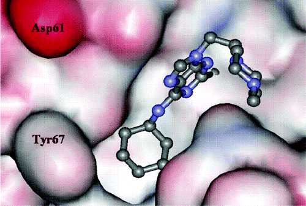
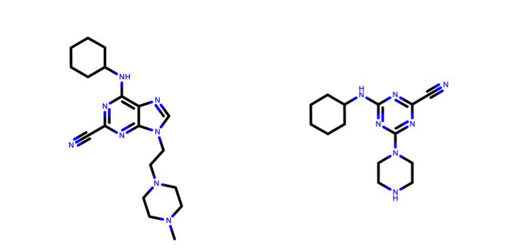
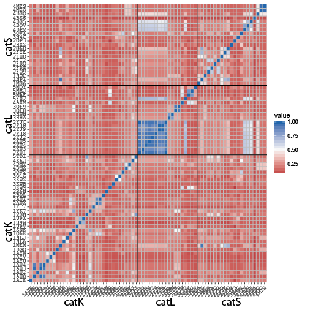
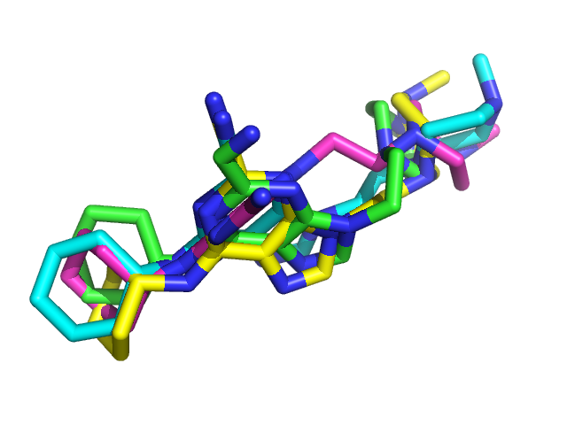
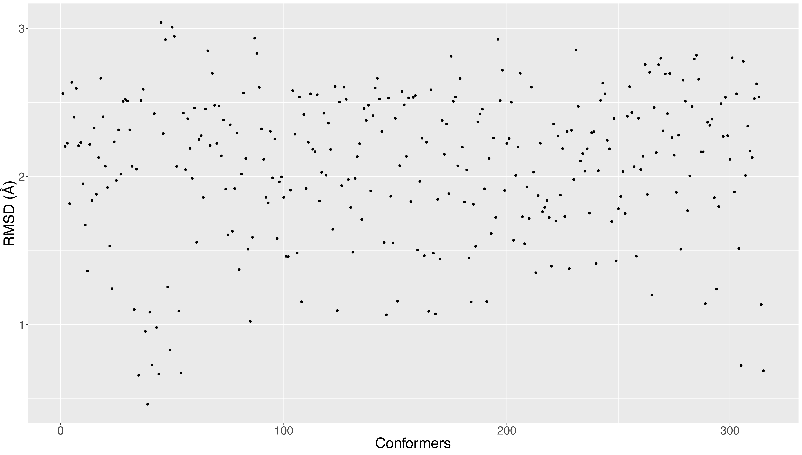

This tutorial consists of the following sections:

* table of contents
{:toc}

## Introduction
<!--
The format of the community forum has been defined as an _unconference_, stimulating us to think outside of the box and 
discussing challenges that are barely touched upon by our communities.
-->
This use-case is a first attempt to blur different software and take on the challenge of "covalent docking", an important part of pharceutical chemistry that has been barely touched upon by the integrative modelling community. For this, we will make use of our in-house software, [HADDOCK](http://www.bonvinlab.org/software/haddock2.2/), to predict the three dimensional structures of a covalently bound ligand to cathepsin proteins.
You are greatly encouraged to work at your own pace, to discuss with your neighbours, to interrupt us, to recommend different methods and/or software, to switch to one of the [many well-established HADDOCK tutorials](http://www.bonvinlab.org/education/), 
to calmly disagree, to enthusiastically demonstrate your interest for the topic, to correct typos, to challenge us with 
your own system of interest (*maybe after the tutorial*), to suggest new developments ... Just remember that, at this stage, this tutorial shall not serve as a standard protocol to predict the covalent binding of a small ligand in the active site a protein, but we are working on extending the scope of our approach.

## Motivation
We listed here some motivations for this topic, in no particular order:
- There is no publication from the Bonvin's group systematically benchmarking protein-small ligand docking using HADDOCK, yet! Despite the lack of a thoroughly benchmarked protocol, about 20% of the jobs submitted on the [HADDOCK web server](http://haddock.science.uu.nl/services/HADDOCK2.2/haddock.php) are dealing with small ligands. 
- [HADDOCK](http://www.bonvinlab.org/software/haddock2.2/) recently participated to the [D3R Grand Challenges 2 and 3](https://drugdesigndata.org/about/grand-challenge), blind prediction challenges involving three-dimensional calculation of protein-ligand poses and prediction of affinities or scores. We recently published our performance in the D3R Grand Challenge 2 ([dx.doi.org/10.1007/s10822-017-0049-y](dx.doi.org/10.1007/s10822-017-0049-y)).
- "Covalent docking" is something HADDOCK can actually handle by defining some specific distance restraints, something that other small molecule docking software surprisingly are unable to do.
- This topic is appealing to our industrial partners.
- Unique opportunity to work at the interface between most of the interest groups: [Integrative Modelling](http://bioexcel.eu/community/interest-groups/integrative-modelling-ig/), [Hybrid Methods](http://bioexcel.eu/community/interest-groups/hybrid-method-ig/), [Practical Applications for Industry](http://bioexcel.eu/community/interest-groups/industry-ig/) and [Free Energy Calculations](http://ask.bioexcel.eu/c/free-energy).
- Could possibly combine all three [BioExcel flagship software](http://bioexcel.eu/software/) into one common workflow.
- This is a collaborative effort, where software developers meet the different players in the field to combine expertise and skills in order to solve the puzzle.

## Scientific context
Osteoporosis affects about 10% of the population in Europe, Japan and North America and its incidence rate is growing with increasing life expectancy. The main feature of osteoporosis is bone loss mediated by osteoclasts and insufficient rebuilding of bone matrix by osteoblasts. A longstanding theory of osteoporosis is that the balance between these two activities has gone off, with bone destruction running ahead. It is very hard to slow down osteoclast activity without slowing down osteoblast activity as well, but one therapy showed promises: the cathepsin K inhibitors.

[Cathepsin K](https://en.wikipedia.org/wiki/Cathepsin_K) is a highly potent cysteine protease expressed in osteoclasts. This enzyme is able to break down collagen, elastin, gelatin and other proteins. It is found almost entirely in this cell type, giving a real hope of targeting osteoclasts selectively. At last, protease inhibitors themselves are a type of small molecule that, in general, give good success in drug discovery. For all those reasons, cathepsin K inhibitors have been studied for more than 20 years and several pharmaceutical companies have currently compounds in clinical trials.

## Overview
In this tutorial we will use [HADDOCK](http://www.bonvinlab.org/software/haddock2.2/) to predict the covalent binding of a small ligand on a protein receptor, using as example a purine nitrile derived inhibitor of cathepsin K (see fig. 1), described in the following publication: 
*[Novel Purine Nitrile Derived Inhibitors of the Cysteine Protease Cathepsin K](http://doi.org/doi:10.1021/jm0493111)* 
E. Altmann\*, S.W. Cowan-Jacob and M. Missbach\* 
J. Med. Chem. (2004)

<figure align="center">

</figure>
<!--  -->
  *Figure 1: Purine nitrile derived inhibitor cocrystallized in the cathepsin K active site. PDB code is 1u9v*

One important feature of this inhibitor (PDBeChem code: [IHE](http://www.ebi.ac.uk/pdbe-srv/pdbechem/chemicalCompound/show/IHE)) is that it can bind three highly homologous cathepsin proteins, with a remarkable affinity:

 * Cat K    6 nM IC50
 * Cat L   89 nM IC50
 * Cat S  150 nM IC50

Since a lot of three-dimensional structures of cathepsins in the presence of small inhibitors are available on the Protein Data Bank, we can simulate an "unbound" challenge where we must predict the correct interaction of this ligand with each cathepsin protein (respectively K, L and S) starting from homologous templates. As an additional challenge, we will also start from the [SMILES](https://en.wikipedia.org/wiki/Simplified_molecular-input_line-entry_system) string of the ligand and only use non-commercial third party software, or commercial software that deliver academic license.

Because this tutorial requires a lot of efforts to edit and clean PDB files in preparation for docking, we will provide you with most of the files. Feel free to try by yourself and please share with us any tips to speed up this fastidious work.

For this tutorial we will make use of the [HADDOCK2.2 web server](http://haddock.science.uu.nl/services/HADDOCK2.2/haddock.php). A description of our web server can be found in the following publications:
* _[The HADDOCK2.2 webserver: User-friendly integrative modeling of biomolecular complexes](doi.org/10.1016/j.jmb.2015.09.014)_ 
G.C.P van Zundert, J.P.G.L.M. Rodrigues, M. Trellet, C. Schmitz, P.L. Kastritis, E. Karaca, A.S.J. Melquiond, M. van 
Dijk, S.J. de Vries and A.M.J.J. Bonvin 
J. Mol. Biol. (2015)
* _[The HADDOCK web server for data-driven biomolecular docking](http://doi.org/doi:10.1038/nprot.2010.32)_ 
S.J. de Vries, M. van Dijk and A.M.J.J. Bonvin 
Nature Protocols (2010)

Throughout the tutorial, coloured text will be used to refer to questions or instructions.

<a class="prompt prompt-question">This is a question prompt: try answering it!</a>
<a class="prompt prompt-info">This is an instruction prompt: follow it!</a>
<a class="prompt prompt-pymol">This is a PyMol prompt: write this in the PyMol command line prompt!</a>
<a class="prompt prompt-cmd">This is a Linux prompt: insert the commands in the terminal!</a>

## Setup

Before you get started, we invite you all to create an account for our web-services using our [registration portal](https://nestor.science.uu.nl/auth/register/). Alternatively, you can make use of the special workshop credentials provided to you during the tutorial. Remember that the usage of our web services is **only free for non-profit work**!

> Given the limited time for this hands-on tutorial, we advise you to use the special workshop credentials (reduced number of models) and to only submit one docking run (either catK, catL or catS).

In order to run this tutorial, you will need to have a molecular viewer installed. We advise you to use 
[PyMOL](https://pymol.org/) and the visualization commands given during the hands-on will be specific to this software. 
Schrödinger offers [Educational-use-only PyMOL](https://pymol.org/edu/?q=educational/) builds freely available for courses.

> If you have questions, feedbacks or recommendations, either during the course of after, please post them on the dedicated topic we created on our [interest group forum](http://ask.bioexcel.eu/t/bioexcel-summer-school-2018-modelling-of-a-covalent-inhibitor-using-haddock-and-cpmd/)

## Select the "best" cathepsin templates for the docking

In practice, the structure of the protein can be obtained if:
- Free structures of homologous proteins are known and can be used as templates to model the protein. Typically, 
sequence similarity, structure resolution and experimental conditions will determine which template is the best to select.
- The unbound structure of the protein is known
- Bound structures of homologous proteins are known and can be used to approximate the bound structure of the receptor.
- Bound structures of the protein with different ligands are known.

<a class="prompt prompt-question">Assuming we can find either bound structures of close homologous 
proteins or bound structures of our target protein with different ligands, how would you select the best template 
for the docking?</a>

Based on our previous experience with the [D3R](https://drugdesigndata.org/) challenges, we decided to use ligand 
similarity to select a protein template for small molecule docking. The similarity metric that we employ is the widely 
accepted **Tanimoto Coefficient** (TC). Given two molecules, A and B, depicted in fig. 2 the TC is defined as follows:
$$TC=\frac{C}{A+B-C}$$
where TC is the Tanimoto Coefficient, A is the set of atoms of molecule A, B is the set of atoms of molecule B and C 
is the set of atoms that is shared between the two molecules.

<figure align="center">

</figure>
<!--  -->
  *Figure 2: How to calculate TC? Illustration on two ligands used in this tutorial. On the left is the structure of our ligand of interest taken from the reference PDBid [1U9V](https://www.rcsb.org/structure/1u9v), and on the right another covalent inhibitor of cathepsin K proteins taken from the PDBid [3KW9](https://www.rcsb.org/structure/3kw9)*

The shared set of atoms is depicted in fig. 3 and it is identified by detecting the Maximum Common Substructure (MCS) 
of the two molecules.

<figure align="center">

</figure>
<!--  -->
  *Figure 3: How to calculate TC? Maximum Common Substructure shared between the two molecules. The shared atoms are highlighted with a blue background.*

To illustrate the rich diversity of cathepsins K, L and S structures with inhibitors and their TC differences despite 
their very high homology, we calculated a pairwise TC matrix (see fig. 4)

<figure align="center">

</figure>
<!--  -->
  *Figure 4: Pairwise TC distances between all cathepsins K, L and S structures available in the presence of a small inhibitor*

We decided to choose the closest related templates based on their TC (table 2). To save you some time in 
fetching/cleaning the files, you can directly download them from the table 2 (just **click** on the PDBids).

 * CatK  [3kw9](media/3kw9_clean.pdb) 0.25
 * CatL  [4axm](media/4axm_clean.pdb) 0.62
 * CatS  [3n4c](media/3n4c_clean.pdb) 0.56

*Table 2: PDB codes of the structural templates used for the three cathepsins and respective C&alpha;-RMSD calculated with 
respect to the reference structure in &Aring;*

You can upload all the PDB files in PyMOL and align them to appreciate the structural conservation of the core of the proteins.

<a class="prompt prompt-info">
  PyMOL Menu → File → Open... → Select the files
</a>

Or if you want to use the PyMOL command-line instead, type the following command:

<a class="prompt prompt-pymol">
	load 3kw9_clean.pdb 
	load 4axm_clean.pdb 
	load 3n4c_clean.pdb
</a>

Now we want to add the reference structure to this session and align structurally all the files:

<a class="prompt prompt-pymol">
	fetch 1u9v 
	for i in cmd.get_object_list(): cmd.align(i, "1u9v") 
	zoom vis 
	as cartoon
</a>

If you want to highlight the ligand in the active site, you can display it as "sticks":

<a class="prompt prompt-pymol">
	show sticks, resn IHE
</a>

**Note:** You can turn on and off a cluster by clicking on its name in the left panel of the PyMOL window.

## Generate a starting structure for the ligand from SMILES strings

For the ligand, some programs like [PRODRG](http://davapc1.bioch.dundee.ac.uk/cgi-bin/prodrg) allow you to generate a 
structure for a chemical directly from a simple sketch in a text editor. However, whenever possible, we advise you to 
use SMILES or MOL files for the ligand when the atomic coordinates are not available. To illustrate the difficulty of 
ligand modelling, there is no strict consensus in the algorithms that generate the SMILES strings and each of them 
choose only one of the main possible strings. For instance, open the PDBeChem page for 
our [cathepsin K inhibitor](http://www.ebi.ac.uk/pdbe-srv/pdbechem/chemicalCompound/show/IHE) and look for the SMILES 
provided (ACDLabs, CACTVS, OpenEye).

<a class="prompt prompt-question"> What can you say about the consistency between the different SMILES sequences? 
Can you recognise the different structural groups in the ligand based on the SMILES?</a>

Use the [LigParGen server](http://zarbi.chem.yale.edu/ligpargen/) developed by the Jorgensen group, a free web-based 
service that provides structure and force field topology/parameters for organic molecules and small ligands. Generate 
starting structures using the default parameters for the three different SMILES strings provided by PDBeChem.

If you look carefully to the PDB files, you will notice that the atom naming and ordering varies from one file to the other. 
To save you some time and efforts, we provide you (table 3, **click** on the PDBids) with the renamed PDB files for all three conformers of the 
ligand, with a consistent naming and in an appropriate format for HADDOCK (`chainID` was added and `ATOM` is replaced by `HETATM`):

 * [OpenEye](media/IHE_ligpargen_OpenEye-renamed.pdb) RMSD 1.39Å
 * [CACTVS](media/IHE_ligpargen_CACTVS-renamed.pdb)   RMSD 2.02Å
 * [ACDLabs](media/IHE_ligpargen_ACDLabs-renamed.pdb) RMSD 2.20Å

Click on the software name you wish to use to download a 3D model of the ligand.

In figure 5, you can appreciate the relative good performance of this web-service. For the rest of the tutorial, we will 
use the model based on OpenEye SMILES as this is the one that gives in our experience the best results.

<figure align="center">

</figure>
<!--  -->
  *Figure 5: Superposition of the LigParGen models based on SMILES strings (OpenEye=yellow, CACTVS=magenta, ACDLabs=cyan) 
with the reference structure of the ligand (green)*

It is important to note at this point that the conformational sampling of the ligand can be greatly improved by using 
commercial software, such as [OMEGA](https://www.eyesopen.com/omega) from the OpenEye Scientific Software suite. It is 
possible to request an academic 
license to use OMEGA for free. Since this field is extremely competitive and occupied by many commercial players, 
keep in mind that there are probably other solutions available, just as good or better than OMEGA, depending on your budget.

When using the torsional sampling with OMEGA, we can generate ~350 conformers with some very good hits (i.e. low RMSD models with respect to the bound ligand), as illustrated in fig. 6. The best model comes with a RMSD of just about 0.4&Aring; and you can download it [here](media/omega_IHE.pdb). However, selecting the best conformer without any _a priori_ information on the ligand remains a very challenging task, for which we would be happy to get your advises.

<figure align="center">

</figure>
  *Figure 6: RMSD of all OMEGA conformers with respect to the reference structure of the ligand*

## Define restraint(s) for the docking
Since we do not want to be to restrictive on the docking, we will only enforce the "covalent bond" by defining a 
distance restraint between the sulfur atom of the targeted cysteine and the reactive nitrile carbon of the ligand. 
This distance is set to 1.8&Aring; &plusmn; 0.1&Aring;, consistent with the average length of a simple C-S bond. 
This is done by creating a distance restraint file in CNS format (.tbl file) consisting of the following statement:

<pre>
assign (segid A and name SG and resi 25) (segid B and name C0Q and resi 1) 1.8 0.1 0.1
assign (segid A and name CB and resi 25) (segid B and name C0Q and resi 1) 2.8 0.1 0.1
</pre>

You can either create it yourself using your favorite text editor (BUT NOT Word) or download it from [here](./media/unambig.tbl){:target="_blank"} for convenience.

Note that the second distance is meant to define the angle around the sulphur atom.
This file will be given to HADDOCK as an unambiguous distance restraint.

## Submit your docking runs

> Note that fine-tuning the parameters of the web server to covalently dock a ligand requires the most advanced privilege on the web server. If you did not apply for the "guru" access level yet, it is time to apply for it on our [registration portal](https://nestor.science.uu.nl/auth/register/).

The main bottleneck when trying to "covalently dock" a small ligand is that we must trick our software to work against all the safeguards we implemented to prevent clashes. To allow the distance restraint to be satisfied, we need to scale down the non-bonded interactions between the specific atoms involved in that covalent bond. For this purpose we created a special Cysteine residue (residue name: CYC) with significantly reduced VDW parameters for the sulfur atom (scaled down by a factor 10).

**Instruction:** If you did not download the PDB files we providing you in table 2, you will have to modify the residue name of cysteine 25 and replace "CYS A  25" by "CYC A  25". This can be done using the following command in a terminal:

<a class="prompt prompt-cmd">
  sed -e 's/CYS\ A\ \ 25/CYC\ A\ \ 25/g' file_original.pdb > file_modified.pdb
</a>

<!--
> As an additional remark, the [HADDOCK web server](http://haddock.science.uu.nl/services/HADDOCK2.2/haddock.php) directly fetches topology and parameters for the small ligand from [PRODRG](http://davapc1.bioch.dundee.ac.uk/cgi-bin/prodrg). In the near future, we may want to allow users to provide their own set of topology/parameter files, which is for the moment only possible provided the user runs the command line version of the software (or bribe us to implement the parameter files in the production server).
-->

We will now launch the docking run. For this we will make us of the [guru interface](http://haddock.science.uu.nl/services/HADDOCK2.2/haddockserver-guru.html) of the HADDOCK web server:

<a class="prompt prompt-info">
http://haddock.science.uu.nl/services/HADDOCK2.2/haddockserver-guru.html
</a>

**Note:** The blue bars on the server can be folded/unfolded by clicking on the arrow on the right

* **Step1:** Define a name for your docking run, e.g. *CatK-ligand1*.

* **Step2:** Input the protein PDB file. For this unfold the **First Molecule menu**.

<a class="prompt prompt-info">
First molecule: where is the structure provided? -> "I am submitting it"
</a>
<a class="prompt prompt-info">
Which chain to be used? -> All (for this particular case)
</a>
<a class="prompt prompt-info">
PDB structure to submit -> Choose the proper Cathepsin file
</a>

* **Step3:** Define manually the protonation state of Histidines. For this unfold the **Histine protonation state menu**.

<a class="prompt prompt-info">
Automatically guess histidine protonation states using molprobity -> uncheck this option

<a class="prompt prompt-info">
Specify the following protonation states depending on which Cathepsin you are using:
</a>

* 3KW9 (catK):  HIE162  / HIE177
* 4AXM (catL):  HIE140  / HIE163 / HID208
* 3N4C (catS):  HIE142  / HIE164 / HIE188 / HID205

* **Step4:** Input the ligand PDB file. For this unfold the **Second Molecule menu**.

<a class="prompt prompt-info">
First molecule: where is the structure provided? -> "I am submitting it"
</a>
<a class="prompt prompt-info">
Which chain to be used? -> All (for this particular case)
</a>
<a class="prompt prompt-info">
PDB structure to submit -> Choose the proper ligand PDB file
</a>

* **Step5:** Upload the distance restraing file (.tbl). For this unfold the **Distance restraints menu**.

<a class="prompt prompt-info">
Upload the tbl file as unambiguous restraints
</a>
<a class="prompt prompt-info">
HADDOCK deletes by default all hydrogens except those bonded to a polar atom (N, O).
Uncheck this option if you have NOEs or other specific restraints to non-polar hydrogens -> uncheck this option
</a>

* **Step6:** Change the clustering settings. For this unfold the **Parameters for clustering menu**.

The default clustering method in the HADDOCK2.2 server is 
[fcc-based clustering](https://github.com/haddocking/fcc), which is a measure of similarity of interfaces based on 
pairwise residue contacts. This method outperforms RMSD-based clustering for large systems, both in term of accuracy 
and speed. However for ligand docking, interface-RMSD remains the method of choice. Change therefore the clustering method:

<a class="prompt prompt-info">
Clustering method (RMSD or Fraction of Common Contacts (FCC)) -> RMSD
</a>
<a class="prompt prompt-info">
RMSD Cutoff for clustering (Recommended: 7.5A for RMSD, 0.60 for FCC) -> 1&Aring;
</a>	

* **Step 7:** Apply some ligand-specific scoring setting. For this unfold the **Scoring parameter menu**:

Our recommended HADDOCK score settings for small ligands docking are the following:

<pre>
     HADDOCKscore-it0   = 1.0 Evdw + 1.0 Eelec + 1.0 Edesol + 0.01 Eair - 0.01 BSA
     
     HADDOCKscore-it1   = 1.0 Evdw + 1.0 Eelec + 1.0 Edesol +  0.1 Eair - 0.01 BSA

     HADDOCKscore-water = 1.0 Evdw + 0.1 Eelec + 1.0 Edesol +  0.1 Eair
</pre>

This differs from the defaults setting (defined for protein-protein complexes). We recommend to change two weights for protein-ligand docking:

<a class="prompt prompt-info">
Evdw 1 -> 1.0
</a>
<a class="prompt prompt-info">
Eelec 3 -> 0.1
</a>

* **Step 8:** Apply some ligand-specific protocol setting. For this unfold the **Advanced sampling parameter menu**:

<a class="prompt prompt-info">
initial temperature for second TAD cooling step with flexible side-chain at the inferface -> 500
</a>
<a class="prompt prompt-info">
initial temperature for third TAD cooling step with fully flexible interface -> 300
</a>
<a class="prompt prompt-info">
number of MD steps for rigid body high temperature TAD -> 0
</a>
<a class="prompt prompt-info">
number of MD steps during first rigid body cooling stage -> 0
</a>

* **Step 8:** You are ready to submit! Enter your username and password (or the course credentials provided to you). Remember that for this interface you do need guru access.

Upon submission you will first be presented with a web page containing a link to the results page, but also an importantly a link to a haddockparameter file (simple text format) containing all settings and input data of your run. 

<figure align="center">

</figure>

We strongly recommend to save this haddockparameter file since it will allow you to repeat the run by simple upload into the [file upload inteface](http://haddock.science.uu.nl/services/HADDOCK2.2/haddockserver-file.html) of the HADDOCK webserver. It can serve as input reference for the run. This file can also be edited to change a few parameters for examples. An excerpt of this file is shown here:

<pre>
HaddockRunParameters (
  runname = 'Cathepsin-ligand',
  auto_passive_radius = 6.5,
  create_narestraints = True,
  delenph = False,
  ranair = False,
  cmrest = False,
  kcont = 1.0,
  surfrest = False,
  ksurf = 1.0,
  noecv = True,
  ncvpart = 2.0,
  structures_0 = 1000,
  ntrials = 5,
...
</pre>

Click now on the link to the results page. While your input data are being validated and processed the page will show:

<figure align="center">

</figure>

During this stage the PDB and eventually provided restraint files are being validated. Further the server makes use of [Molprobity]() to check side-chain conformations, eventually swap them (e.g. for asparagines) and define the protonation state of histidine residues. Once this has been successfully done, the page will indicated that your job is first QUEUED, and then RUNNING.

<figure align="center">

</figure>

The page will automatically refresh and the results will appear upon completions (which can take between 1/2 hour to several hours depending on the size of your system and the load of the server). You will be notified by email once your job has successfully completed.

## Analysis of the results

Once your run has completed you will be presented with a result page showing the cluster statistics and some graphical representation of the data (and if registered, you will also be notified by email). Please find below the pre-processed runs for the different cathepsins templates using the best OpenEye conformer:

- **CatK**: [View here the pre-processed results](http://haddock.science.uu.nl/services/HADDOCK2.2/Files/3kw9_IHE-OpenEye-1A){:target="_blank"}

- **CatL**: [View here the pre-processed results](http://haddock.science.uu.nl/services/HADDOCK2.2/Files/4axm_IHE-OpenEye-1A){:target="_blank"}

- **CatS**: [View here the pre-processed results](http://haddock.science.uu.nl/services/HADDOCK2.2/Files/3n4c_IHE-OpenEye-1A){:target="_blank"}

<a class="prompt prompt-question">Inspect the result pages. How many clusters are generated?</a>

**Note:** The bottom of the page gives you some graphical representations of the results, showing the distribution of the solutions for various measures (HADDOCK score, van der Waals energy, ...) as a function of the RMSD from the best generated model (the best scoring model).

The ranking of the clusters is based on the average score of the top 4 members of each cluster. The score is calculated as:
<pre>
      HADDOCKscore = 1.0 Evdw + 0.1 Eelec + 1.0 Edesol + 0.1 Eair
</pre>
where `Evdw` is the intermolecular van der Waals energy, `Eelec` the intermolecular electrostatic energy, `Edesol` represents an empirical desolvation energy term adapted from Fernandez-Recio *et al.* J. Mol. Biol. 2004, and `Eair` the AIR energy. The cluster numbering reflects the size of the cluster, with cluster 1 being the most populated cluster. The various components of the HADDOCK score are also reported for each cluster on the results web page.

<a class="prompt prompt-question">Consider the cluster scores and their standard deviations.</a>
<a class="prompt prompt-question">Is the top ranked cluster significantly better than the second one? (This is also reflected in the z-score).</a>

In case the scores of various clusters are within standard devatiation from each other, all should be considered as a valid solution for the docking. Ideally, some additional independent experimental information should be available to decide on the best solution.

<a class="prompt prompt-question">Assuming our docking simulations are accurate, what can you say about the average HADDOCK score of the top cluster for the different docking runs? Is is consistent with the IC50 values reported experimentally?</a>

It is important to emphasize that the HADDOCK score is not consistently in agreement with IC50 values, this is only a mere coincidence and we hope the collaboration with CPMD can greatly improve our predictions to this regard.

Let's now visualise the various solutions!

<a class="prompt prompt-info">Download and save to disk the first model of each cluster. Rename them so that you can easily identify which model correspond to which cathepsin protein (catK, catL, catS)</a>

Then start PyMOL and load the three cluster representatives:

<a class="prompt prompt-info">File menu -> Open -> Select the files ...</a>

Repeat this for each cluster. Once all files have been loaded, type in the PyMOL command window:

<a class="prompt prompt-pymol">
fetch 1u9v 
as cartoon 
util.cnc 
</a>

We now want to highlight the reactive cysteine (position 25) and the covalently bound ligand in sticks. In the reference structure, the ligand is referred to as residue name IHE. However, in HADDOCK models, the ligand is typically named UNK. At last, because HADDOCK added hydrogens to all polar and non-polar atoms, we can remove them to facilitate the visual comparison with the reference structure.

<a class="prompt prompt-pymol">
show sticks, resn IHE+UNK 
show stick, resi 25 
remove hydrogens 
</a>

Let's then superimpose all models on the reference structure 1u9v:

<a class="prompt prompt-pymol">
for i in cmd.get_object_list(): cmd.align(i,"1u9v") 
</a>

We computed ligand RMSD values (in &Aring;) for a number of docking runs (fit on the backbone of the protein and calculate RMSD on all atoms of the ligand) for the top model of the top cluster:

**catK** | **catL** | **catS** | **catK-bound** | **catK-bound_lig-rigid** |
| :------------ |:---------------:| -------------:| -------------:| -------------:|
| 3.35 | 3.62 | 3.65 | 3.1 | 2.8 |

Here, the **catK**, **catL** and **catS** runs correspond to the docking runs we have been setting up from homologous templates (resp. 3kw9, 4axm and 3n4c PDBids).

The **catK-bound** run refers to the representative model of the best cluster generated by HADDOCK using the bound structures of both the ligand and the protein, as extracted from the reference crystal structure 1u9v. The docking protocol is the same, meaning that both the ligand and the protein are flexible during the it1/water stages of HADDOCK.

At last, the **catK-bound_lig-rigid** run refers to the representative model of the best cluster generated by HADDOCK, using bound starting structures (just like the previous run), but enforcing the ligand to remain rigid during the flexible stages of HADDOCK's modelling. The protein however is still free to undergo local conformational changes.

<a class="prompt prompt-question">What can you say about the performance of HADDOCK to reproduce correctly the binding? What does the bound/rigid run tells us about the expected quality of the models we can expect for this system?</a>

## Congratulations!

You have completed this tutorial. If you have any questions or suggestions, feel free to post on the dedicated topic on our [interest group forum](http://ask.bioexcel.eu/t/bioexcel-summer-school-2018-modelling-of-a-covalent-inhibitor-using-haddock-and-cpmd/).

<!-- 

## Perspectives
- check mutations catK/catL/catS
- ligplotplus
- prodigy-lig-score 

challenges: conformational sampling ligand, template selection, ligand conformers clustering, scoring, binding affinity predictions (check slack Alex)

goals: 3D structure of the cpx, relative ranking, absolute BA predictions

-->
