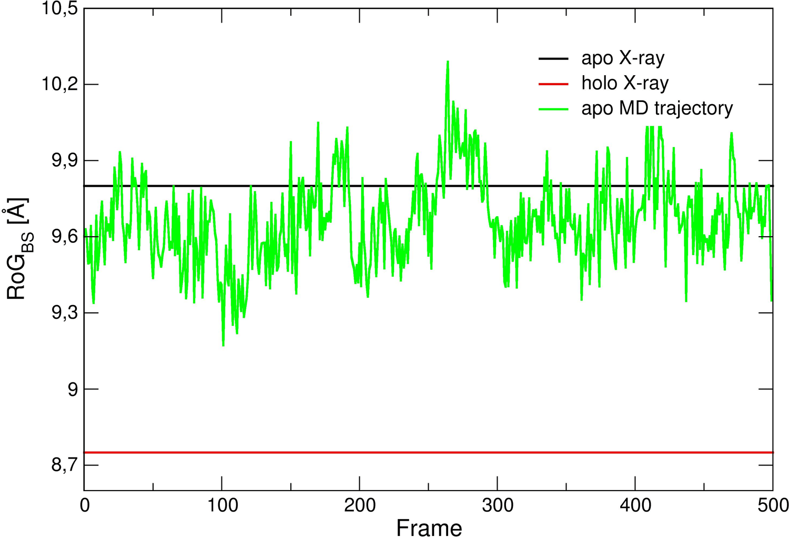
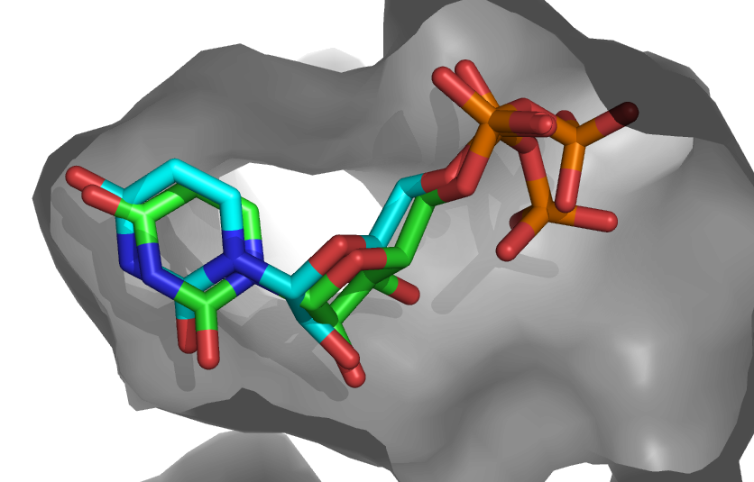

This tutorial consists of the following sections:


* table of contents
{:toc}

<hr>
## Introduction

In this tutorial we will exploit enhanced sampling molecular dynamics, namely metadynamics [[1](#ref01)], to improve the predictive power of molecular docking of small ligands to a protein target in the framework of an ensemble docking strategy [[2](#ref02)]. Molecular docking is a widely used technique employed in Computer-Aided Drug Design (CADD) [[3](#ref03)] with the aim to drastically reduce the cost associated with the development of new drugs. A docking calculation can be grossly split into two main tasks:

* The search for putative binding poses of the ligand onto the selected protein target(s);

* The ranking of all generated poses, according to a given _scoring function_ which should reproduce at best the free energy of binding of the complex. In some cases, however, scoring functions do not aim to estimate the free energy of binding but they are just used to sort the poses in a way to distinguish the most stable ones from unstable complex conformations.


Docking is also the main computational method used in virtual screening (VS) campaigns aiming to the identification of putative drug candidates *in silico* [[3](#ref03),[4](#ref04),[5](#ref05)]. Clearly, a docking calculation should correctly rank native-like poses of virtually any compound as the top ones, thus assigning them the highest score (i.e. the lowest binding free energy). Both the above tasks i) and ii) can be implemented in different ways, however, they are both subject to failures due to the intrinsic limitations of docking algorithms. Examples of these limitations include the lack of protein flexibility (unability to sample bound-like conformations of the binding site) and problems in correctly accounting for entropic and de-solvation contributions  the scoring functions [[3](#ref03),[4](#ref04),[6](#ref06)].


The sampling problem, which is the focus of the present tutorial, is a crucial issue in presence of significant structural changes of the protein receptor due to the interaction with ligands (mechanism known as induced fit [[7](#ref07)]), which induces at least changes in the orientation of side chains and more generally in the shape of the binding site. This is particularly relevant in the search for new drug candidates, for which experimental information regarding their complexes with the target protein is not always available.


Several methods were developed in the past decades to deal with this issue, but a general and successful approach is still missing [[6](#ref06),[8](#ref08)]. Among the existing approaches, the ensemble-docking method was developed with the aim to account for the plasticity of the receptor by performing docking calculations on multiple conformations (of the receptor) obtained by experimental or computational means. The advantage of using multiple conformations is the increased probability to have in the pool of structures at least one featuring a bound-like conformation of the binding site, suitable to optimally dock the correct ligand(s). This approach was shown to improve the outcome of docking and VS calculations [[2](#ref02),[3](#ref03),[5](#ref05)].


In this tutorial we will show how to further improve the predictive power of molecular docking in cases where even a long unbiased MD simulation is unable to generate bound-like conformations of the target under study. This is usually the case of proteins undergoing large-scale conformational changes, often involving transitions between states separed by high free energy (compared to thermal energy) barriers. The target protein we will focus on during the tutorial, the T4 phage beta-glucosyltransferase, belongs to this category, as shown by the large distortion at the binding site (BS) upon binding of its substrate uridine diposphate (RMSD<sub>BS</sub>  = 2.8 A between unbound and bound structures). In this tutorial, different conformations of the protein generated by enhanced-sampling MD simulations will be used in ensemble docking runs. The results will be compared with those obtained using an ensemble of protein structures generated by an unbiased MD simulation of the apo system.


The content of this tutorial follows the workflow presented [in our recently published work]( [https://pubs.acs.org/doi/10.1021/acs.jcim.8b00730](https://pubs.acs.org/doi/10.1021/acs.jcim.8b00730)):

A. Basciu, G. Malloci, F. Pietrucci, A.M.J.J. Bonvin, A.V. Vargiu, **Holo-like and Druggable Protein Conformations from Enhanced Sampling of Binding Pocket Volume and Shape**,  *J. Chem. Inf. Model*, 2019, 59, 4, 1515-1528, https://doi.org/10.1021/acs.jcim.8b00730

Throughout the tutorial, coloured text will be used to refer to questions or instructions.

<a class="prompt prompt-question">This is a question prompt: try answering it!</a>
<a class="prompt prompt-info">This is an instruction prompt: follow it!</a>
<a class="prompt prompt-pymol">This is a VMD prompt: write this in the Tk Console!</a>
<a class="prompt prompt-cmd">This is a Linux prompt: insert the commands in the terminal!</a>


<hr>
## Requirements

The following software packages will be used during the tutorial:

* [GROMACS2019](https://manual.gromacs.org/documentation/2019-beta1/index.html): a versatile package to perform molecular dynamics simulations and several related analyses;

* [PLUMED 2.5](https://www.plumed.org/doc-v2.5/user-doc/html/index.html): a package working with different MD simulation engines (such as GROMACS) used to implement different flavours of non-equilibrium MD simulations (among the others features), as well as for analysis purposes;

* [R](https://www.r-project.org/about.html): a data analysis software, used here to perform the cluster analysis on the MD trajectory;

* [HADDOCK2.4](https://wenmr.science.uu.nl/haddock2.4/): The HADDOCK web portal which allows to perform information-driven flexible docking among macromolecules and between a chemical compound and a macromolecule.


You can download from [here](https://surfdrive.surf.nl/files/index.php/s/uChxo21NAp2QxSl) an archive containing the `tutorial_files` directory used in this tutorial. 
This contains all the materials and scripts needed to run the tutorial.


<hr>
## System setup and MD simulations

First, let's create the directories needed for the tutorial. Open a terminal and type the following commands:

<a class="prompt prompt-cmd">
cd Tutorials/EDES-HADDOCK <br />
mkdir -p Xray MD/plain/analysis MD/meta</a>

#### Setting up the simulation system

First go to the Xray directory and download the pdb file of the apo-form of the T4 phage beta-glucosyltransferase (hereafter GLUCO) (PDB code: [1JEJ](https://www.rcsb.org/structure/1JEJ)) or use the shell command *wget* to download it directly from the terminal:

<a class="prompt prompt-cmd">
cd Xray<br />
wget https://files.rcsb.org/download/1JEJ.pdb</a>

<a class="prompt prompt-question"> What should you check before using a pdb file downloaded from the RCBS databank?</a>

<details style="background-color:#DAE4E7">
<summary>See solution:</summary>
It is customary to check the pdb files for possible issues when running docking calculations.
In particular, one should check for missing residues (lines starting with the string `REMARK 465`)
or missing atoms (lines starting with the string `REMARK 470`).
</details><br>

Fortunately, our structure contains all the residues present in the aminoacid sequence, as well as all the heavy atoms. For the sake of simplifying the subsequent analysis, we will generate a _clean_ pdb file without crystallographic waters named `apo_GLUCO.pdb` and containing only the protein; you can use your favorite text editor or [VMD1.9.3](https://www.ks.uiuc.edu/Research/vmd) from the terminal:

<a class="prompt prompt-cmd">vmd -dispdev none 1JEJ.pdb &lt;&lt;EOF <br>
animate write pdb &#34;apo_GLUCO.pdb&#34; sel [atomselect top protein] <br>
quit <br>
EOF <br /></a>

If copying and pasting the previous commands in the terminal doesn't work, it may be due to hidden characters coming from the formatting of this page. You can find the "clean" (without extra characters) list of commands by typing in the terminal:

<a class="prompt prompt-cmd">cat /home/utente/Tutorials/EDES-HADDOCK/tutorial_files/apoMD/vmd_commands</a>

Copying and pasting those commands should work, and you could find a clean pdb file (apo_GLUCO.pdb) in the directory <code class="highlighter-rouge">/home/utente/Tutorials/EDES-HADDOCK/tutorial_files/apoMD/</code>.

Once we have the structure of our protein target, we can generate the files needed to run the MD simulations. In this case, we are going to use [GROMACS2019](https://manual.gromacs.org/current/user-guide/index.html) [[11](#ref11)] and so we need the topology file (top extension) containing information about atom types, bonded and non-bonded interactions, etc., and the initial structure file in the native format of GROMACS2019 (gro extension). A typical simulation flowchart for GROMACS2019 is reported in the official [GROMACS manual](https://manual.gromacs.org/documentation/2019/user-guide/flow.html).

GROMACS was installed in the directory `/usr/local/gromacs-2019-2/`, and in order to use it, first type:

<a class="prompt prompt-cmd">source /usr/local/gromacs-2019-2/bin/GMXRC.bash</a>

We will use the pdb2gmx tool to generate the topology and the initial structure of the protein (`gmx_mpi_d help commands` prints a list of available commands). From your current directory, type:

<a class="prompt prompt-cmd">cd ../MD <br>
gmx_mpi_d pdb2gmx -f ../Xray/apo_GLUCO.pdb -o apo_GLUCO.gro -p apo_GLUCO.top -ignh <br></a>

You can generate the topology according to a series of different force-fields, including the AMBER, OPLS, CHARMM, and obviously the GROMOS96 families. The following list of force-fields pops up when running the command above:

<p><a class="prompt prompt-info">Select the Force Field: <br />

From '/usr/local/gromacs-2016-4_GNU_MPI_GPU_PLUMED/share/gromacs/top': <br />
1: AMBER03 protein, nucleic AMBER94 (Duan et al., J. Comp. Chem. 24, 1999-2012, 2003) <br />
2: AMBER94 force field (Cornell et al., JACS 117, 5179-5197, 1995) <br />
3: AMBER96 protein, nucleic AMBER94 (Kollman et al., Acc. Chem. Res. 29, 461-469, 1996) <br />
4: AMBER99 protein, nucleic AMBER94 (Wang et al., J. Comp. Chem. 21, 1049-1074, 2000) <br />
5: AMBER99SB protein, nucleic AMBER94 (Hornak et al., Proteins 65, 712-725, 2006) <br />
6: AMBER99SB-ILDN protein, nucleic AMBER94 (Lindorff-Larsen et al., Proteins 78, 1950-58, 2010) <br />
7: AMBERGS force field (Garcia & Sanbonmatsu, PNAS 99, 2782-2787, 2002) <br />
8: CHARMM27 all-atom force field (CHARM22 plus CMAP for proteins) <br />
9: GROMOS96 43a1 force field <br />
10: GROMOS96 43a2 force field (improved alkane dihedrals) <br />
11: GROMOS96 45a3 force field (Schuler JCC 2001 22 1205) <br />
12: GROMOS96 53a5 force field (JCC 2004 vol 25 pag 1656) <br />
13: GROMOS96 53a6 force field (JCC 2004 vol 25 pag 1656) <br />
14: GROMOS96 54a7 force field (Eur. Biophys. J. (2011), 40, 843-8:56, DOI: 10.1007/s00249-011-0700-9) <br />
15: OPLS-AA/L all-atom force field (2001 aminoacid dihedrals) <br />
</a></p>

We choose here the GROMOS96 54a7 force-field (option **14**), and another screen will pop up:

<a class="prompt prompt-info">Select the Water Model: <br>
1: SPC simple point charge, recommended <br>
2: SPC/E extended simple point charge <br>
3: None <br>
</a>

Select option **3**, as in our case we previously removed all crystallographic water molecules from the structure. If you do so, an error message might pop up warning you that the residue "HIE" is not contained in the topology database. This will be promptly resolved by renaming, in the pdb file, the residue "HIE" to "HIS". An already amended pdb file is available, so you can either change the file yourself or you can overwrite the current "apo_GLUCO.pdb" file with the new one by typing:

<a class="prompt prompt-info">cp ../tutorial_files/apoMD/apo_GLUCO_HIS.pdb ../Xray/apo_GLUCO.pdb
</a>

Run again the previous command. If you didn't get any error message, you can just look at the output, where you will see a lot of information and warnings. An important point regards the total charge, amounting to 6e:

<a class="prompt prompt-info">...<br>
There are 2656 dihedrals, 1883 impropers, 5543 angles <br>
6003 pairs, 3783 bonds and 0 virtual sites <br>
Total mass 40672.172 a.m.u. <br>
Total charge 6.000 e <br>
Writing topology <br>
...<br>
</a>

For the following steps you'll need some input files and pre-calculated data, which can be found in the directory: `../tutorial_files`.


#### Plain MD simulations in explicit solvent

We are going to run MD simulations in explicit water using periodic boundary conditions for the efficient treatment of electrostatic interactions [[11](#ref12)]. We first need to use the command `editconf` which will set the dimensions of the box (and center the protein therein) for periodic boundary simulations using explicit water molecules. A triclinic box will be generated (option -bt), and the minimum distance between the solute and the box will be set to 1.2 nm (option -d). From your current folder, type:

<a class="prompt prompt-cmd">cd plain<br>
gmx_mpi_d editconf -f ../apo_GLUCO.gro -o apo-box.gro -bt triclinic -d 1.2</a>

Next, we fill the box containing our protein with water molecules, and save the corresponding structure and topology files. We will first copy the protein topology file `apo_GLUCO.top` into `apo-solv.top` in order to use the last file for the remaining steps and to keep the `apo_GLUCO.top` as a backup file.

<a class="prompt prompt-cmd">cp ../apo_GLUCO.top apo-solv.top</a>

Next, run the `solvate` command (we will choose the single point charge SPC water model specified by the file `spc216.gro`) by typing:

<a class="prompt prompt-cmd">gmx_mpi_d solvate -cp apo-box.gro -cs spc216.gro -o apo-solv-init.gro -p apo-solv.top</a>

You can now check the topology file with your preferred text editor (e.g. `vim apo-solv.top`), and, if not present, manually include the parameters of the water model in the topology file by adding the following lines at the end of the file, before the entry `[ system ]`:

<a class="prompt prompt-info">; Include water topology<br />
\#include &#34;gromos54a7.ff/spc.itp&#34;<br /></a>

We are now ready to generate the GROMACS input file (tpr extension), a binary file containing all the information needed to perform the requested calculations on the system of interest. This is done with the `grompp` command, which needs both the structure and the topology files and also an input file (mdp extension) containing the instructions to run the simulation (such as simulation type, pressure and temperature control flags, treatment of long-range interaction flags, flags related to the information to be printed and so on). The file em-pbc.mdp (available in the folder `tutorial_files/apoMD`) sets the typical parameters needed to run a structural relaxation of the system, which allows to (partially) remove the steric hindrance due to clashing contacts between atoms of the protein and/or solvent.

Copy the mdp file:

<a class="prompt prompt-cmd"> cp ../../tutorial_files/apoMD/em-pbc.mdp .  </a>

and type the following command to generate the tpr file needed to perform a structural relaxation of the system:

<a class="prompt prompt-cmd">gmx_mpi_d grompp -f em-pbc.mdp -c apo-solv-init.gro -o em-pbc.tpr -p apo-solv.top</a>

The tool grompp checks on the fly the values given to the parameters present in the mdp file, and generates possible notes and warnings. By default, the program fails when some warnings are generated, but the user can change this behavior by setting the "-maxwarn" flag to values larger than 0 (clearly after ensuring that all the warnings raised are _safe_).

Type now:

<a class="prompt prompt-cmd">gmx_mpi_d grompp -f em-pbc.mdp -c apo-solv-init.gro -o em-pbc.tpr -p apo-solv.top -maxwarn 2</a>  

And it should work.

You might remember at this point that the protein has a positive charge of 6e. To neutralize this charge, we can add counterions using the `genion` command as follows (we report the more general command line to add both positively and negatively charged ions, K+ and Cl- in this case):

<a class="prompt prompt-cmd">gmx_mpi_d genion -s em-pbc.tpr -p apo-solv.top -o apo-solv-init.gro -pname K -nname CL -nn 6 -np 0 </a>

The following output will appear, prompting to select the group of solvent molecules for ions substitution. Six molecules of the selected group will be replaced by chlorine ions.

<a class="prompt prompt-info">... <br>
Reading file em-pbc.tpr, VERSION 2016.4 (single precision) <br>
Will try to add 0 K ions and 6 CL ions. <br>
Select a continuous group of solvent molecules <br>
Group 0 (  System) has 51622 elements <br>
Group 1 ( Protein) has 3721 elements <br>
Group 2 ( Protein-H) has 2870 elements <br>
Group 3 ( C-alpha) has 351 elements <br>
Group 4 (  Backbone) has 1053 elements <br>
Group 5 ( MainChain) has 1405 elements <br>
Group 6 (  MainChain+Cb) has 1743 elements <br>
Group 7 ( MainChain+H) has 1746 elements <br>
Group 8 ( SideChain) has 1975 elements <br>
Group 9 ( SideChain-H) has 1465 elements <br>
Group  10 ( Prot-Masses) has 3721 elements <br>
Group  11 ( non-Protein) has 47901 elements <br>
Group  12 ( Water) has 47901 elements <br>
Group  13 ( SOL) has 47901 elements <br>
Group  14 ( non-Water) has 3721 elements <br></a>

In this case, we see that there are three identical groups of molecules, 11 to 13, which identify waters. Type one of them in the console, e.g. 13. Note that, as in the case of the solvate command, also with genion you might need to edit a posteriori the `apo-solv.top` file by adding the following lines before the entry `[ system ]`:

<a class="prompt prompt-info">; Include ions <br>
\#include &#34;gromos54a7.ff/ions.itp&#34;</a>

Run again the grompp command to generate the tpr file including ions:

<a class="prompt prompt-cmd">gmx_mpi_d grompp -f em-pbc.mdp -c apo-solv-init.gro -o em-pbc.tpr -p apo-solv.top</a>

As already pointed out, remember you might need to use the '-maxwarn' flag.

We can now generate the ndx file, an index file containing groups of molecules and which can be customized according to the user needs. In the following we will only generate the file without changing anything with respect to the default. We will use it when performing the cluster analysis with GROMOS.

From your current directory, type:

<a class="prompt prompt-cmd">echo quit | gmx_mpi_d make_ndx -f em-pbc.tpr -o apo-solv.ndx</a>

You could have a look to this file with your preferred text editor. It consists of entries starting with `[ namegroup ]`, followed by lines reporting the serial numbers of atoms within that group. Now we are ready to perform the structural relaxation of our system with the `mdrun` engine of GROMACS:

<a class="prompt prompt-cmd">nohup gmx_mpi_d mdrun -v -deffnm em-pbc &</a>

Wait a few seconds and check the output file em-pbc.log to understand if your run was successful.

The next step after structural relaxation is to perform a MD simulation slowly heating the system up to the desired temperature. To save time here we will set the temperature to 300 K quite abruptly. The file equil-pbc.mdp (available in the folder `tutorial_files/apoMD`) contains the directives on how to perform the MD simulation with explicit water and under periodic boundary conditions.

Generate now the input file (tpr extension) needed to run the actual simulation:

<a class="prompt prompt-cmd">cp ../../tutorial_files/apoMD/equil-pbc.mdp .<br>
gmx_mpi_d grompp -f equil-pbc.mdp -c em-pbc.gro -p apo-solv.top -n apo-solv.ndx -o equil-pbc.tpr</a>

As you see, in order to generate the tpr file for the actual MD simulation, you will need the energy minimized structure coming from the previous step. If you were not successful in running it, you can copy the "em-pbc.gro" by typing:

<a class="prompt prompt-cmd">cp ../../tutorial_files/apoMD/em-pbc.gro .<br /></a>

And then use again the previous command to generate the tpr file.

After you generated the 'equil-pbc.tpr' file you can start the simulation by typing the following command:

<a class="prompt prompt-cmd">nohup gmx_mpi_d mdrun -deffnm equil-pbc &</a>

Let the simulation go or kill the job (kill -9 &lt;PID&gt;; when needed, you could use pre-calculated data).


<hr>
## Metadynamics simulations

We are going to perform metadynamics simulations using [GROMACS 2019]( [https://manual.gromacs.org/documentation/2019/reference-manual/index.html](https://manual.gromacs.org/documentation/2019/reference-manual/index.html)) and [PLUMED2.5]( [https://www.plumed.org/doc-v2.5/user-doc/html/index.html](https://www.plumed.org/doc-v2.5/user-doc/html/index.html)),
a plugin facilitating the implementation of different kinds of enhanced sampling
techniques (and not only) in several simulation packages, using the same
syntax independently of the specific engine used. Briefly, metadynamics is a method
developed by Laio and Parrinello about 15 years ago [[1](#ref01)]. It enforces systems
to escape free energy minima by means of a
history-dependent fictitious potential. The system is thus forced to explore
conformations associated to other (meta)stable basins and/or free energy barriers.
This is achieved by defining a set of collective variables (CVs, e.g. a distance,
an angle, a dihedral angle and the number of contacts between two groups of
atoms) which identify the relevant motions to be enhanced in order to steer the
sampling of otherwise rarerly reachable conformations. The exploration of the CVs phase
space (which _drags_ the system towards atomic conformations otherwise
rarely visited) is forced through the deposition of _hills_, namely
Gaussian-like potentials, added every nG steps of the simulation to the CVs
space at the point corresponding to the system's state. These Gaussian hills
will generate a repulsive force which is transmitted to the real atoms of
the system thus enhancing the conformational sampling. Clearly, a good CV
should be associated with a _slow_ motion of the system (in absence of
bias), so that its value at conformations associated with different free
energy basins will differ too. The choice of the CVs is indeed crucial to
the success of a metadynamics simulation and some rules of thumbs to guide
the choice of the height, width and deposition time have been outlined by
Laio et al. [[12](#ref12)]. It was shown that under proper conditions, metadynamics
generates, in the CVs space, a free energy landscape representing an
unbiased estimate of the underlying free energy [[13](#ref13)]. Since its
introduction, many flavors of metadynamics were introduced [[15](#ref15)] whose
description is out of the scope of this tutorial. Here we will use the
so-called "Well Tempered Metadynamics" [[16](#ref16)], that represents an improvement
over the original algorithm thanks to the possibility of controlling the
regions of the free energy surface that are physically meaningful to explore.

Often a single CV is not sufficient to catch the relevant slow modes
involved in the structural transition of interest. Indeed, all the CV-based
methods often exploit the use of multiple variables, which ideally should be
orthogonal to each other so as to enhance the sampling along independent directions
of the CV space. A clever method to enhance sampling across a virtually unlimited
number of CVs is the so-called bias-exchange metadynamics [[16](#ref16)]. In bias-exchange metadynamics many simulations of the system at the same temperature are performed, biasing each replica with a time-dependent potential added to a different CV.
Exchanges between the bias potentials in the different variables are
periodically allowed according to a replica exchange scheme. Due to the
efficaciously multidimensional nature of the bias, the method allows to
explore complex free energy landscapes with high efficiency. In order to
perform a metadynamics simulation, we need first to define our CVs. Here we
will enhance the conformational sampling locally at the binding site (BS) of
the apo-form of GLUCO, by biasing both the radius of gyration of the BS as
well as the intramolecular contacts among the residues lining that site.


<hr>
## Binding site definition and collective variables set-up

To define the BS, we exploit the crystallographic structure of the GLUCO-UDP
complex. Namely we define the BS as the site lined by all residues having at
least one atom within 3.5 A from UDP. From the RCBS pdb databank download
PDB ID: [1JG6](https://www.rcsb.org/structure/1JG6) in the
`Xray` directory, or use wget to download it from the terminal.
So, if you were in the `MD/plain` directory, type:

<a class="prompt prompt-cmd">cd ../../Xray/ <br>
wget https://files.rcsb.org/download/1JG6.pdb</a>

We will now generate a _clean_ pdb file `holo_GLUCO.pdb` containing only the
protein and the UDP molecule, using VMD from the terminal (here you must
specify the resname of the uridine diphosphate substrate, UDP). Copy and paste the following commands:

<a class="prompt prompt-cmd">vmd -dispdev none 1JG6.pdb &lt;&lt;EOF <br>
animate write pdb &#34;holo_GLUCO_noh.pdb&#34; sel [atomselect top &#34;protein or resname UDP&#34;]<br>
quit <br>
EOF <br></a>

As for the apo structure, if copying and pasting the previous commands in the terminal doesn't work, you can copy the _clean_ (without extra characters) list of commands by typing in the terminal:

<a class="prompt prompt-cmd">cat /home/utente/Tutorials/EDES-HADDOCK/tutorial_files/apoMD/vmd_commands_holo<a/>

In this case we care going to define our BS on the hydrogenated holo structure (which you can obtain with software such as [OpenBabel](https://openbabel.org/docs/dev/index.html)). Copy the hydrogenated holo we have already prepared for you from the `tutorial_files` folder:

<a class="prompt prompt-cmd">
cp ../tutorial_files/apoMD/holo_GLUCO.pdb .
</a>


Open the file with VMD again, and get the resid numbers of all aminoacids lining the BS:

<a class="prompt prompt-cmd"> vmd holo_GLUCO.pdb</a>

You will see a VMD Main window, as well as a Display and a Graphics representation window.

<a class="prompt prompt-info">
Go to "Extension"<br>
Select "Tk Console", as shown in Figure 1
</a>


<figure align="center">

</figure>

<center><i> Figure 1: VMD Main screen, showing how to open the Tk Console </i></center>
<br>

Within the Tk Console, type the following:

<a class="prompt prompt-pymol">set BP_residues [atomselect top &#34;protein and same residue as within 3.5 of resname UDP and noh&#34;] <br>
lsort -integer -uniq [$BP_residues get resid] <br>
lsort -integer -uniq [$BP_residues get serial] <br></a>

You will get the following list of residue numbers:

<a class="prompt prompt-info">18 188 189 191 195 213 214 237 238 240 243 261 268 269 272</a>

And a similar list containing the atom numbers (serials) of BP's residues.

However, for cases in which no holo structure with the co-crystallized ligand is available, of course a similar procedure will not be feasible. A possible solution could be the usage of binding-site dection softwares among the plaetora available. Examples of these softwares include [COACH](https://zhanglab.ccmb.med.umich.edu/COACH/), [RaptorX binding](https://raptorx.uchicago.edu/BindingSite/), [ConSurf](https://consurf.tau.ac.il/2016/).

In particular, in [[9](#ref09)] we show how the BP selection according to the COACH software is virtually identical to the one obtained by using the holo structure.

As a further example on the usage of VMD to extract structural properties of the protein, suppose you are now interested only in the residues
which are not hydrophobic (this choice could be justified by the nature of
the UDP substrate, bearing a -3e charge). This can be easily done as follows (note that we also increased the cut-off!):

<a class="prompt prompt-pymol">
set BP_res_no_hph [atomselect top &#34;(not hydrophobic) and protein and (same residue as within 4 of resname UDP)&#34;] <br>
lsort -integer -uniq [$BP_res_no_hph get resid] <br></a>

You will get the following list of residue numbers:

<a class="prompt prompt-info">187 188 189 191 195 214 215 237 261 267 269 272</a>

Another useful parameter we can extract from the experimental structure
of the holo protein is the radius of gyration (RoG) of the BP, which
indicates how compact (i.e. open or closed) is the binding pocket. Larger
values of the RoG should correspond to more open conformations of the BP.
Since the binding of a small ligand to the BP of a protein often causes a
partial collapse of the pocket, we expect the RoG of the holo to be smaller
than that of the apo protein. We can calculate the value of the BP RoG in
the experimental structure through VMD by typing the following command in
the Tk Console:

<a class="prompt prompt-pymol">measure rgyr $BP_residues</a>

You will get the value (in &Aring;) corresponding to the RoG of the BP. You should have obtained the value of 8.75 &Aring;. Now you can close VMD.

As you will see below, PLUMED [[18](#ref18)] needs atomic serial numbers as input (and not residue IDs). Thus, to perform the simulation, we should get the list of serial numbers defining  the BP. We thus load the apo protein ready to be simulated into VMD and use the residue list obtained previously to print the list of serials defining
the BS. To extract the serial numbers you can use for example a gro file or a pdb file, as long as the topology matches the one of the system you are going to simulate! Go to the `../MD/plain` directory and copy there the `apo_GLUCO_Hs.pdb` file from the `tutorial_files` folder. Now open it on VMD.

<a class="prompt prompt-cmd">cd ../MD/plain<br>
cp ../../tutorial_files/apoMD/apo_GLUCO_Hs.pdb .<br>
vmd -dispdev none apo_GLUCO_Hs.pdb</a>

Now, paste into the Tk console all the following commands:

<a class="prompt prompt-pymol"> set out1 [open BS_serial_numbers.dat w] <br>
set out2 [open BS_resid_numbers.dat w] <br>
set out3 [open BS_RGyr_apo.dat w] <br>
set BS [atomselect top &#34;protein and resid 18 188 189 191 195 213 214 237 238 240 243 261 268 269 272 and noh&#34;] <br>
set BS_serials [lsort -integer -uniq [$BS get serial]] <br>
puts $out1 $BS_serials <br>
set BS_resids [lsort -integer -uniq [$BS get resid]] <br>
puts $out2 $BS_resids <br>
set RGyr_apo [measure rgyr $BS ] <br>
puts $out3 $RGyr_apo <br>
close $out1 <br>
close $out2 <br>
close $out3 <br>
quit <br></a>

Note that with the previous commands we also calculated the value of the RoG
of the BP for the apo structure (9.80 &Aring;), as we will also need this value later.
However if you compare the RoG of the apo with the one of the holo (8.75 &Aring;) you can already spot a 11% decrease of the RoG with respect to the apo value.

Before going on, we need to define the other three CVs that we are going to use to bias the simulation. They are three (pseudo)contacts across the inertia plane variables, each defined as the number of contacts between residues of the binding site on opposite sides of the corresponding inertia plane.
The idea is that they represent a functional and computationally cheap way to induce fluctuations in the shape of the binding pocket along each of the three orthogonal spacial directions. For details see [[9](#ref9)].

In order to do that, we will use our home-made tcl script. The script, based on the [&#34;Orient&#34; package for VMD](https://www.ks.uiuc.edu/Research/vmd/script_library/scripts/orient/), adopts the following procedure:

1. Calculates the principal axes of inertia (x,y,z) of the BS;

2. Defines, for each couple of axes, a plane passing through the center of mass of the BS and orthogonal to the third direction. For example, the plane xy will be ortoghonal to the axes z;

3. Splits the residues lining the BS, along each direction, in two lists, according to their position with respect to the center of mass of the pocket. In particular, for this work, the position of residues will be identified by the centers of mass of their backbone atoms.

4. We will end up having 6 different lists: 2 for each of the 3 spatial directions. These lists will be used to define the CIPs variables.


The script requires: (i) the list of residues lining the BS and (ii) the protein structure.

In this case the BS residues list is already defined within the script, so you just have to run it. Open the apo structure of the protein ready to be simulated (in this case apo_GLUCO_Hs.pdb) with VMD and run our "divide_into_lists.tcl" script:

<a class="prompt prompt-cmd">vmd apo_GLUCO_Hs.pdb</a>

From VMD open the Tk console and run the script by typing:

<a class="prompt prompt-cmd">source ~/Tutorials/EDES-HADDOCK/tutorial_files/scripts/divide_into_lists.tcl</a>

The output, which you can see from the Tk console window, should be:

<pre style="background-color:#DAE4E7">
plane xy
Z_1 resids: 18 213 214 237 238 240 269 272
Z_2 resids: 188 189 191 195 261 267
Z_1 serials:  {280 282 294 295} {3480 3482 3498 3499} {3500 3502 3505 3506} {3877 3879 3897 3898} {3899 3901 3916 3917} {3932 3934 3947 3948} {4380 4382 4402 4403} {4444 4446 4457 4458}
Z_2 serials:  {3084 3086 3089 3090} {3091 3093 3100 3101} {3122 3124 3144 3145} {3181 3183 3203 3204} {4247 4249 4266 4267} {4347 4349 4359 4360}

plane xz
Y_1 resids: 18 240 261 267 269 272
Y_2 resids: 188 189 191 195 213 214 237 238
Y_1 serials:  {280 282 294 295} {3932 3934 3947 3948} {4247 4249 4266 4267} {4347 4349 4359 4360} {4380 4382 4402 4403} {4444 4446 4457 4458}
Y_2 serials:  {3084 3086 3089 3090} {3091 3093 3100 3101} {3122 3124 3144 3145} {3181 3183 3203 3204} {3480 3482 3498 3499} {3500 3502 3505 3506} {3877 3879 3897 3898} {3899 3901 3916 3917}

plane yz
X_1 resids: 188 189 195 213 214 237 238 267 269 272
X_2 resids: 18 191 240 261
X_1 serials:  {3084 3086 3089 3090} {3091 3093 3100 3101} {3181 3183 3203 3204} {3480 3482 3498 3499} {3500 3502 3505 3506} {3877 3879 3897 3898} {3899 3901 3916 3917} {4347 4349 4359 4360} {4380 4382 4402 4403} {4444 4446 4457 4458}
X_2 serials:  {280 282 294 295} {3122 3124 3144 3145} {3932 3934 3947 3948} {4247 4249 4266 4267}
</pre>


So, for each of the three planes, the script gives the lists of residues and serials defining the groups of (heavy) atoms lying on opposite sides of each inertia plane. Refer to [Figure 2b-c](https://pubs.acs.org/na101/home/literatum/publisher/achs/journals/content/jcisd8/2019/jcisd8.2019.59.issue-4/acs.jcim.8b00730/20190416/images/large/ci-2018-00730p_0002.jpeg) in our work for a visual representation of inertia planes and of how residues are split into different groups to define each CIP variable.

In practical applications, please remember to:

1. Cross-check that the topology file used to extract the serial number is identical to the one of the protein to be simulated. This is to avoid mismatching between the serial numbering that can very well happen between, for example, an hydrogenated structure and a not-hydrogenated one;

2. Visually inspect (for example with VMD or Pymol) how the residues are distributed within the BS to eventually optimize by hand the definition of the CIPs. For example, it is a good idea to avoid that residues belonging to the same secondary-structure element and are very close in space are associated to different lists.

In this example the topology file used and the definition of the different lists have been already checked and no further inspection is necessary.You can now close VMD.

After all the CVs have been defined, we need to set the parameters of the Gaussian hills that are going to be deposited during the metadynamics simulation. These parameters are: the height of the hills "h", their width "w", and deposition time "Tau". In particular, "w" will be chosen by analyzing the evolution of the CVs along the unbiased MD simulation. In order to do it, we can use the tool `driver` of the PLUMED package. First, we need a text file defining the CVs to be analyzed along the trajectory; driver will read the trajectory and will print for each frame the values of the CVs selected in the input file. From `tutorial_files/Driver` move the input file `plumed_driver.dat` in the folder `/EDES-HADDOCK/MD/plain/analysis`:

<a class="prompt prompt-cmd">cp ../../tutorial_files/Driver/plumed_driver.dat analysis/ <br>
cd analysis</a>

Open the file with your favorite text editor to see how the CVs are defined. For further information on how the define the CVs the interested reader can refer to the [PLUMED manual](https://www.plumed.org/doc-v2.5/user-doc/html/_colvar.html). Now run the calculation with driver:

<a class="prompt prompt-cmd">/usr/local/plumed-2.3.5/bin/plumed driver --mf_dcd ../../../tutorial_files/apoMD/apo_trajectory_500frames.dcd --plumed plumed_driver.dat</a>

Note: if you copied the previous command and it doesn't work, a possible solution is that you have to delete and write again (and not copy) the two minus signs before the "mf_dcd" and "plumed"; flags.

The output file COLVAR_apoMD contains the values of the CVs sampled along the unbiased trajectory (you can find a pre-calculated file in the `tutorial_files/Driver` folder). In this case the trajectory containts only 500 frames, as it serves as example for this tutorial. However remember that even if you run longer unbiased MD simulations, to assess how much the CVs changed during the unbiased MD simulation in order to define the sigma values for a metadynamics run, the calculation should be performed on a time-scale of the order of a few hundreds of ps at most.

Now you can plot the CV values sampled during the unbiased run with your preferred graph viewer. Here we will use [xmgrace](https://plasma-gate.weizmann.ac.il/Grace).
For the sake of keeping things simple, here we will do the work only for 2 of the 4 CVs selected:

<a class="prompt prompt-cmd">grep -v education/HADDOCK/HADDOCK COLVAR_apoMD | awk '{print $2}' > RoG.dat <br>
grep -v "\-\-" COLVAR_apoMD | awk '{print $3}' > CIP1.dat</a>

These commands print the columns corresponding to the RoG and to the CIP1
into two separate files and get rid of the first line which is not correctly interpreted by xmgrace. For the sake of the comparison with the experimental RoG values for the apo and holo X-ray structures let's create a simple text file containing these values. Open `ref.dat` in your current folder with your preferred
editor and type (the brackets < , > should not be included!)

<a class="prompt prompt-info"> 0 &lt;insert the RoG value for the apo structure&gt; <br>
500 &lt;insert the RoG value for the apo structure&gt; <br>
& <br>
0 &lt;insert the RoG value for the holo structure&gt; <br>
500 &lt;insert the RoG value for the holo structure&gt; <br>
&</a>

If needed, the file can be found in the `tutorial_files/apoMD` folder. Now we are ready to plot the CVs profiles. Type:

<a class="prompt prompt-cmd">xmgrace -nxy ref.dat RoG.dat</a>

You will see a graph like that in Figure 2, showing the RoG of the BS of the
structures sampled, together with the RoG for the experimental structures. A
similar plot could be easily obtained also for the other CV chosen.

<figure align="center">

</figure>

<center> <i>Figure 2: The RoG of the structures sampled during the apoMD simulation.</i> </center>
<br>

Despite that it is preferable to perform these analyses on longer trajectories,
you can see already from this graph that the RoG did not change
significantly and in particular did not get close to the holo value.
Thus, it seems it could be a good choice as CV to enhance the sampling trying
to generate conformations with a more closed pocket. A similar analysis could be performed on the other CVs selected for this work.

It is customary to set the value of w to be between 1/4 and 1/2 of the average fluctuations (standard deviations) of a CV
during a short plain MD run [[13](#ref13),[19](#ref19),[20](#ref20)]. Here, we calculate the standard
deviation of the RoG over 500 frames spaced 1 ps from each other. You could calculate the standard deviation using your preferred
way, either by means of a graphics plot program such as xmgrace, or by
coding this into a script. Here, we will use the bash script `av_std-sel-region-column.sh` which can be found in the directory
`tutorial_files/scripts` to calculate the average and standard deviation of
our CVs. The script takes as input the name of the file containing the
values of the CVs, the column corresponding to the CV, the first and last
rows delimiting the size of the data, and the stride parameter to consider
one row every stride. As output, you will see on the terminal the average
and standard deviation of the CV corresponding to the column you chose. To perform the analysis described above, type:

<a class="prompt prompt-cmd">~/Tutorials/EDES-HADDOCK/tutorial_files/scripts/av_std-sel-region-column.sh COLVAR_apoMD 2 2 501 1 <br>
~/Tutorials/EDES-HADDOCK/tutorial_files/scripts/av_std-sel-region-column.sh COLVAR_apoMD 3 2 501 1 <br>
~/Tutorials/EDES-HADDOCK/tutorial_files/scripts/av_std-sel-region-column.sh COLVAR_apoMD 4 2 501 1  <br>
~/Tutorials/EDES-HADDOCK/tutorial_files/scripts/av_std-sel-region-column.sh COLVAR_apoMD 5 2 501 1 <br></a>

The standard deviations of the CVs will be used to set up the following
metadynamics run. You should have obtained standard deviations respectively of 0.17, 66.7, 63.1 and 53 for the RoG and for the three CIPs.


#### Metadynamics simulations

To setup a metadynamics simulation with GROMACS and PLUMED we first need
some PLUMED files and an input file in the tpr format (which can be found
in the `tutorial_files/plumed` folder). As for the PLUMED files, they are:

* `plumed-common.dat`. It contains the definition of the CVs, in terms of the serial
numbers of atoms to be biased within each of them, and additional information
such as restraints, units, etc.

* `plumed.0.dat, plumed.1.dat, plumed.2.dat, plumed.3.dat`. Each file contains the instructions to read the plumed-common.dat file, as well as information on the bias to be applied to
the related CV (such as its height and the frequency of deposition of the
energy hills). In this case, we set the value of the bias factor to the
default of 10 and the height to 0.6 kcal/mol.

More detailed information on how to run a metadynamics simulation can be found at the following webpages:

- [General documentation on metadynamics with PLUMED](https://plumed.github.io/doc-v2.4/user-doc/html/_m_e_t_a_d.html)
- [Running metadynamics simulations with PLUMED](https://plumed.github.io/doc-v2.4/user-doc/html/trieste-4.html)
- [Running Bias Exchange metadynamics simulations with PLUMED](https://plumed.github.io/doc-v2.4/user-doc/html/cambridge.html#cambridge-exercise-2)

Next, copy the content of `~/Tutorials/EDES-HADDOCK/tutorial_files/meta` into the `~/Tutorials/EDES-HADDOCK/MD/meta` folder created at the beginning of the tutorial:

<a class="prompt prompt-cmd">cp -r ~/Tutorials/EDES-HADDOCK/tutorial_files/meta/* ~/Tutorials/EDES-HADDOCK/MD/meta/ <br></a>

To run a multi-replica simulation, GROMACS2019 requires creating a folder for each of the replicas, containing all the files needed for running that specific simulation. Details can be found in the [GROMACS manual]( [https://manual.gromacs.org/2019-beta3/user-guide/mdrun-features.html](https://manual.gromacs.org/2019-beta3/user-guide/mdrun-features.html)).

Go into the `meta` folder: you will see 4 sub-folders (`rep0`, `rep1`, `rep2`, `rep3`), one for each of the 4 replicas, containing the plumed and tpr files for each run. Go into the `rep0` sub-folder, and read the `plumed-common.dat` and `plumed.0.dat` files to understand the instructions contained.

You can see the list of the atom serial numbers in the `plumed-common.dat`. Open the file `plumed.0.dat` and insert the appropriate value of the sigma parameter where needed. You should have calculated the w parameter (sigma) values in the previous section of this

tutorial using the av_std-sel-region-column.sh script. The file already contains a value for sigma, but you can change it according to previous prescription and change it if you wish to. Also keep in mind that smaller values of the sigma parameters are associated to a finer and safer sampling, but also to a longer simulation time to fill up free energy minima and allow the system to efficiently explore the conformational space. Repeat the above steps for the remaining 3 plumed files (`plumed.1.dat`, `plumed.2.dat`, `plumed.3.dat`) within the sub-directories `meta/rep1`, `meta/rep2`, `meta/rep3`.

You are now ready to run the simulation:

<a class="prompt prompt-cmd">nohup mpirun -np 4 gmx_mpi_d mdrun -multidir rep0 rep1 rep2 rep3 -s topol -deffnm BE_GLUCO -append -cpi BE_GLUCO.cpt -plumed plumed.dat -dlb yes  -replex 10000 -nsteps 500000000 &</a>

Where the flag "-replex" is used to specify the frequency of attempts to exchange the bias
between two replicas.

Since it could take up to 10 minutes before the files (`COLVAR.X` and `HILLS.X` within the `meta/repX` folder) are written, in the following you can use pre-generated files to analyze the trajectory. Among them, the
most important ones are the files `COLVAR.X`, reporting the
values of the CVs sampled by the system during the simulation. Thus, this file allows to assess to what extent the sampling was enhanced within the CVs space.

In this section, we will analyze
the MD trajectories mainly in terms of structural variation of the BS compared to the
experimental structure of the complex. First, let's plot the profile of the RoG along the MD trajectory.
If our CVs are relevant to sample maximally different conformations of the BS, we should see an increased variance in all of them.
In particular, we hope to sample RoG values close to that of the experimental holo protein.
Again, there is no time to wait for completion of the run, so copy the `COLVAR_BEMETA_repX` files from the
folder `tutorial_files/plumed` (each corresponding to 500 saved values) to your working folder:

<a class="prompt prompt-cmd">cp ../../tutorial_files/plumed/COLVAR_BEMETA_rep* ../../tutorial_files/apoMD/ref.dat .<br>
grep -v "\-\-" COLVAR_BEMETA_rep0 | awk '{print $2}' > RoG0.dat <br>
grep -v "\-\-" COLVAR_BEMETA_rep1 | awk '{print $2}' > RoG1.dat <br>
grep -v "\-\-" COLVAR_BEMETA_rep2 | awk '{print $2}' > RoG2.dat <br>
grep -v "\-\-" COLVAR_BEMETA_rep3 | awk '{print $2}' > RoG3.dat <br>
</a>

To plot the profiles of the RoG across the 4 replicas, we use xmgrace:

<a class="prompt prompt-cmd"> xmgrace ref.dat RoG0.dat RoG1.dat RoG2.dat RoG3.dat </a>

You should see a plot which looks like the one in Figure 3.

<figure align="center">

</figure>

<center> <i>Figure 3: Profiles of RoG across the 4 replicas of the bias-exchange well-tempered metadynamics simulation,
plotted against the experimental values corrsponding to the apo and holo structures. </i></center>
<br>

Despite the short simulation time, the method effectively enhanced the sampling of different conformations of the BS.
However, both shrunk and expanded conformations of the BS are sampled (this can be verified by looking to the profiles
of the additional three CVs).
To effectively guide the sampling towards a specific direction (e.g. to compress the BS) one could add soft restraints
on some of the CVs (please check [here](https://plumed.github.io/doc-v2.4/user-doc/html/_r_e_s_t_r_a_i_n_t.html) if interested).
Following this scheme, in [[9](#ref9)], a "**windows approach**" was adopted to guide the sampling only towards the desired
region of the conformational space. The idea is to run a set of metadynamics simulations each starting from a conformation
corresponding to decreasing values of the RoG, using restraints on this CV in order to gently mimick the compression of the BS
induced by substrate binding.

You could have a look at
[Figure 3a](https://pubs.acs.org/na101/home/literatum/publisher/achs/journals/content/jcisd8/2019/jcisd8.2019.59.issue-4/acs.jcim.8b00730/20190416/images/large/ci-2018-00730p_0003.jpeg)
and
[Figure 4a](https://pubs.acs.org/na101/home/literatum/publisher/achs/journals/content/jcisd8/2019/jcisd8.2019.59.issue-4/acs.jcim.8b00730/20190416/images/large/ci-2018-00730p_0004.jpeg)
of our publication to get a taste of how this approach allows to reproduce the correct geometry of the BS almost independently on
simulation details (in particular on the number of windows used).


<hr>
## Cluster analysis of the trajectories

In order to perform ensemble-docking in a reasonable time, we need to extract a tractable number of conformations of
the protein target, which is done by performing a cluster analysis [[21](#ref21)].
To our purpose, it is important that the cluster analysis maximizes the diversity of conformations sampled by
the BS, In this way, if conformations prone to host the ligand were sampled during MD
simulations, some near-native structures should be included in the pool of cluster representatives selected.
To achieve this goal, in [[9](#ref9)] we performed a multi-step cluster analysis on the CVs, using the data analysis
software [R](https://www.r-project.org/about.html). This approach can be compared with a more standard cluster analysis using as metric the RMSD of the BS (this can be performed for instance with the `gmx cluster` command of the
GROMACS 2019 package - see [https://manual.gromacs.org/2019/onlinehelp/gmx-cluster.html](https://manual.gromacs.org/2019/onlinehelp/gmx-cluster.html))

The performance of a cluster analysis depends on a number of parameters (such as the number of clusters, the cut-offs, etc.)
that in principle should be as general and system-independent as possible. In addition, several methods were developed to
identify the minimum number of non-redundant clusters in a distribution, but we will not touch this argument in this tutorial.
In addition, for the sake of saving time, we will perform a cluster analysis only on the unbiased MD trajectory (the protocol
does not depend on the way the trajectory was generated).

### Multi-step clustering protocol

To follow the protocol in [[9](#ref9)] we will use in-house bash scripts interfacing with the R software, according to the
following scheme:

1. The RoG distribution of your trajectory is binned into a pre-defined number (10) of equally-wide slices. This is achieved by
giving in input to the script the desired width (in Anstrom) of each slice;

2. The script needs in input also the desired number of clusters. Note that the number of clusters extracted from each slice is
proportional to the number of structures binned within that slice, meaning that the tails of the RoG distribution will contribute
less compared to slices around the center of the distribution;

3. A standard hierarchical agglomerative clustering algorithm is used to extract the clusters from each slice separately.
The representative of each cluster is selected as the one closest to the center, according to the euclidean metrics calculated on the CVs;

4. Cluster representatives are used as starting points for a subsequent K-means-based cluster analysis performed on the whole trajectory;

5. The clusters extracted from the previous step are selected for ensemble-docking calculations.

Note that in order to perform the cluster analysis outlined above we only need the file containing the CVs values, not the trajectory.
These values are contained in the COLVAR file, which can be obtained from the trajectory by running plumed as standalone software.
Here we will use the following files, already formatted in a convenient manner for our analyses:

* `CVS_clustering.dat`, which contains, for each structure, the cluster number (starting from 1), the values of all of the CVs
(starting from the RoG) separed by commas, and another column containing only the RoG values;
* `CVS_clustering_for_kmeans.dat`, containing only the CVs separated by commas;
* `index_RoGBS.dat`, containing, for each structure, the cluster number and the associated RoG value;

The following scripts (and templates) will be finally used:

* `R_clustering.sh`. This is the only script to really run. It bins the RoG values into slices and perform all the steps preliminary
to the cluster analysis;
* `hclust_4cvs_template.R`. This is a template file to perform hierarchical clustering with R;
* `k-means-head.R` and `k-means-tail.R`. These are template files for the k-means clustering with R;

From the terminal, go into the directory `~/Tutorials/EDES-HADDOCK/tutorial_files/clustering_with_R` and type:

<a class="prompt prompt-cmd"> ./R_clustering.sh </a>

The script will read the file `index_RoGBS.dat`. You also need to specify the desired number of clusters (e.g. 100),
and the sigma (slice width) value. For instance, you can type:

<a class="prompt prompt-cmd">./R_clustering.sh 100 0.1 </a>

The first part of your output should look like:

<pre style="background-color:#DAE4E7">
Number of clusters for each slice:

Numer of clusters: 1
Number of clusters in slice1: 1 | Structures in this slice: 3
Numer of clusters: 3
Number of clusters in slice2: 3 | Structures in this slice: 14
Numer of clusters: 8
Number of clusters in slice3: 8 | Structures in this slice: 42
Numer of clusters: 17
Number of clusters in slice4: 17 | Structures in this slice: 83
Numer of clusters: 24
Number of clusters in slice5: 24 | Structures in this slice: 121
Numer of clusters: 23
Number of clusters in slice6: 23 | Structures in this slice: 116
Numer of clusters: 12
Number of clusters in slice7: 12 | Structures in this slice: 61
Numer of clusters: 7
Number of clusters in slice8: 7 | Structures in this slice: 33
Numer of clusters: 4
Number of clusters in slice9: 4 | Structures in this slice: 20
Numer of clusters: 1
Number of clusters in slice10: 1 | Structures in this slice: 4

Total number of clusters: 100
</pre>

Thus, the script prints the number of structures contained in each RoG slice, as well as the number of clusters extracted from each of them.
Note that the slices corresponding to the tail of the RoG distribution (namely slice 1 and 10) are poorly populated, thus only one cluster
is being extracted from them. Two possibile solutions to this problem would be:

1. To increase the total number of clusters;
2. To require a minimum number of clusters from each RoG slice. This solution is actually already implemented in the script `R_clustering.sh`,
where we set the minimum number of clusters to 1.

Note also that, since RoG profiles are also descriptors of the overall flexibility of the protein, experimental information on the this parameter
(and in principle on any of the parameters used here) can be exploited to tune the sampling and/or to the extraction of relevant conformations
(e.g. by enforcing an higher number of structures corresponding to an experimental RoG value to be extracted from the cluster analysis).

The list of selected clusters is written in the file `matrix_k-means-init-centers.dat`. In the terminal, type:

<a class="prompt prompt-cmd">grep -v "x" matrix_k-means-init-centers.dat</a>

You will see a list of numbers indicating the frames selected from your MD run.
You can now save those frames for instance using software [CATDCD]( [https://www.ks.uiuc.edu/Research/vmd/plugins/catdcd/](https://www.ks.uiuc.edu/Research/vmd/plugins/catdcd/)).

For purpose of this tutorial, you can find a set containing 10 clusters coming from the unbiased MD trajectory and 10 coming from the
metadynamics run in `../../tutorial_files/cluster_analysis/clusters_ready/`.


### Standard clustering approach

Another way to perform the cluster analysis is e.g. to use the method `gromos` from the GROMACS 2019 software
(see [https://manual.gromacs.org/documentation/2019/onlinehelp/gmx-cluster.html](https://manual.gromacs.org/documentation/2019/onlinehelp/gmx-cluster.html)) using the RMSD of the BS as metric.
That is to say, the most similar structures with respect to the RMSD metrics will be merged together in a single cluster,
generating a set of clusters with the lowest within-cluster RMSD.

In order to perform this analysis, go to the `MD/plain` directory and copy there the file `apo-solv_withBS.ndx` from
`../../tutorial_files/cluster_analysis/`. To perform the cluster analysis only on the BS you need to edit the index file
(ndx extension) previously created, and insert there the serials of all residues defining the BP. At the end of the `apo-solv_withBS.ndx`
file, you should have something like the following:


<pre style="background-color:#DAE4E7">
[ BS33 ]

172 174 175 176 177 178 179  1969  1971  1972  1973  1974  1976  1977  1978 [...] 2832  2835  2838  2839  2869  2871  2872  2873  2874  2875  2876  2877  2878
</pre>

Note: make sure that the serials above identify the residues lining the BP in the trajectory file. To run the cluster analysis type:

<a class="prompt prompt-cmd">gmx_mpi_d cluster -f ../../tutorial_files/apoMD/apoMD-traj-pbc.trr -s ../../tutorial_files/apoMD/apoMD-traj-pbc.tpr -n apo-solv_withBS.ndx -cl clusters.pdb -cutoff 0.02 -method gromos</a>

The following output will appear, asking you to select the region of the system that
you want to consider:

<a class="prompt prompt-info">
Select group for least squares fit and RMSD calculation: <br>
Group 0 (System) has 51592 elements <br>
Group 1 (Protein) has 3721 elements <br>
Group 2 (Protein-H) has 2870 elements <br>
Group 3 (C-alpha) has 351 elements <br>
Group 4 (Backbone) has 1053 elements <br>
Group 5 (MainChain) has 1405 elements <br>
Group 6 (MainChain+Cb) has 1743 elements <br>
Group 7 (MainChain+H) has 1746 elements <br>
Group 8 (SideChain) has 1975 elements <br>
Group 9 (SideChain-H) has 1465 elements <br>
Group 10 (Prot-Masses) has 3721 elements <br>
Group 11 (non-Protein) has 47871 elements <br>
Group 12 (Water) has 47865 elements <br>
Group 13 (SOL) has 47865 elements <br>
Group 14 (non-Water) has 3727 elements <br>
Group 15 (Ion) has 6 elements <br>
Group 16 (CL) has 6 elements <br>
Group 17 ( Water_and_ions) has 47871 elements <br>
Group 18 (BS33) has 118 elements <br>
</a>

Type **18** to select the binding site region.

Now, another output will be prompted, asking you what part of the protein we want to be
written in the pdb file of each cluster. Of course, since we need to run docking
calculations on those structures, we need the entire protein without water molecules.
Type 1 and the cluster analysis will start.<hr>


<hr>
## Protein-ligand docking with HADDOCK

Note that protein-ligand HADDOCKing typically requires fine-tuning a handful of parameters that requires the most advanced privilege on the web server. If you did not apply for the _guru_ access level yet, it is time to apply for it via our [registration portal](https://bianca.science.uu.nl/auth/register/). Alternatively, you can use the course credentials that were provided to you during the summer school to submit your docking runs. Please, use the pre-calculated runs to move on with the analysis section.

#### Setting up a new docking run targeting the identified binding pocket

We will now setup a docking run targeting specifically the identified binding pocket of the protein.
For our targeted ligand docking protocol, we will first create two sets of restraints that we will use at different stages of the docking:

1. For the rigid-body docking, we will first define the entire binding pocket on the receptor as active and the ligand as active too.
This will ensure that the ligand is properly drawn inside the binding pocket.

2. For the subsequent flexible refinement stages, we define the binding pocket only as passive and the ligand as active.
This ensures that the ligand can explore the binding pocket.

In order to create those two restraint files, use the HADDOCK server tool to generate AIR restraints: [https://alcazar.science.uu.nl/services/GenTBL/](https://alcazar.science.uu.nl/services/GenTBL/) (unfold the *Residue selection* menu):

<a class="prompt prompt-info">
Selection 1: Active residues (directly involved in the interaction) -> enter here the list of residues defining the binding site:
</a>

```18,188,189,191,195,213,214,237,238,240,243,261,267,269,272```

<a class="prompt prompt-info">
Selection 2: Active residues (directly involved in the interaction) -> enter here the residue number of our ligand:
</a>

```1```

<a class="prompt prompt-info">
Click on submit and save the resulting page, naming it GLUCO-UDP-act-act.tbl
</a>

**Note:** This works best with Firefox. Currently when using Chrome, saving as text writes the wrong info to file. In that case copy the content of the page and paste it in a text file.

**Note:** Avoid Safari for the time being - it is giving problems (we are working on it).

Now repeat the above steps, but this time entering the list of residues for the binding pocket into the passive residue list.
Save the resulting restraint file as GLUCO-UDP-pass-act.tbl

**Note:** If needed, click on the links below to download two pre-generated distance restraints files:

* [GLUCO-UDP-act-act.tbl](./media/GLUCO-UDP-act-act.tbl)
* [GLUCO-UDP-pass-act.tbl](./media/GLUCO-UDP-pass-act.tbl)

The number of distance restraints defined in those file can be obtained by counting the number of times that an ```assign``` statement is found in the file, e.g.:

<a class="prompt prompt-cmd">
grep -i assign GLUCO-UDP-act-act.tbl \| wc -l
</a>

<a class="prompt prompt-question">
Compare the two generated files: what are the differences? How many restraints are defined in each?
</a>

**Note:** A description of the restraints format can be found in Box 4 of our Nature Protocol 2010 server paper:

* S.J. de Vries, M. van Dijk and A.M.J.J. Bonvin.
[The HADDOCK web server for data-driven biomolecular docking.](https://www.nature.com/nprot/journal/v5/n5/abs/nprot.2010.32.html)
_Nature Protocols_, *5*, 883-897 (2010).  Download the final author version <a href="https://igitur-archive.library.uu.nl/chem/2011-0314-200252/UUindex.html">here</a>.


We will now launch the docking run. For this we will make us of the [HADDOCK 2.4 web server](https://wenmr.science.uu.nl/haddock2.4/submit/1
):

<a class="prompt prompt-info">
https://wenmr.science.uu.nl/haddock2.4/submit/1
</a>

**Note:** The blue bars on the server can be folded/unfolded by clicking on the arrow on the right


* **Step1:** Define a name for your docking run, e.g. *bemeta-ensemble* or *apoMD_ensemble*.


* **Step2:** Prepare the ensemble of 10 conformations that you will provide as starting structure for the protein.

HADDOCK accepts ensembles of conformations as starting files, provided all the coordinates are concatenated in one single PDB file and all the conformations contain **EXACTLY** the same atoms (same number, same names, same chain/segid, ...). And easy way to prepare the "bemeta" and "apoMD" ensembles from the clusters files provided in the folder `../../tutorial_files/cluster_analysis/clusters_ready/` is to use [pdb-tools](https://github.com/haddocking/pdb-tools).

<a class="prompt prompt-cmd">
cd ../../tutorial_files/cluster_analysis/clusters_ready/<br>
python ~/software/pdb-tools/pdb_join.py meta/\*.pdb &gt; bemeta_ensemble.pdb <br>
python ~/software/pdb-tools/pdb_join.py apo/\*.pdb &gt; apoMD_ensemble.pdb
</a>

* **Step3:** Input the protein PDB file. For this unfold the **Molecule definition menu**.


<a class="prompt prompt-info">
First molecule: where is the structure provided? -> "I am submitting it"
</a>

<a class="prompt prompt-info">
Which chain to be used? -> All (for this particular case)
</a>

<a class="prompt prompt-info">
PDB structure to submit -> Choose the proper ensemble file
</a>

<a class="prompt prompt-info">
Segment ID to use during docking -> A
</a>


* **Step4.** Input the ligand PDB file. For this unfold the **Molecule definition menu**.


**Note:** The coordinates of the ligand atoms must be submitted as `HETATM` and the residue number set to 1.  You can download here the [ligand coordinates](./media/ligand_clean.pdb) if you want to proceed directly.


<a class="prompt prompt-info">
Second molecule: where is the structure provided? -> "I am submitting it"
</a>

<a class="prompt prompt-info">
Which chain to be used? -> All
</a>

<a class="prompt prompt-info">
PDB structure to submit -> Browse and select "ligand_clean.pdb"
</a>

<a class="prompt prompt-info">
Segment ID to use during docking -> B
</a>

* **Step5:** Click on the "Next" button at the bottom left of the interface. This will upload the structures to the HADDOCK webserver where they will be processed and validated (checked for formatting errors). The server makes use of [Molprobity](https://molprobity.biochem.duke.edu/) to check side-chain conformations, eventually swap them (e.g. for asparagines) and define the protonation state of histidine residues.

* **Step6:**  Define the ligand molecule as rigid. Since the structure of the ligand is directly obtained from the reference crystal structure of the complex, we can disable the flexibility of the ligand to enforce the bound conformation of the ligand in our models. This we do in the **Molecule 2 parameters menu**  in the **Input parameters** widow.

<a class="prompt prompt-info">
Unfold the menu "Semi-flexible segments"  <br>
How are the flexible segments defined -> rigid
</a>

#### Defining the restraints to guide the docking

* **Step7:**   Click on the "Next" button at the bottom left of the interface. Input the restraint files for docking. For this unfold the **Distance restraints menu** in the **Docking parameters** window.

<a class="prompt prompt-info">
Instead of specifying active and passive residues, you can supply a HADDOCK restraints TBL file (ambiguous restraints) -> Upload here the GLUCO-UDP-act-act.tbl
</a>

<a class="prompt prompt-info">
You can supply a HADDOCK restraints TBL file with restraints that will always be enforced (unambiguous restraints) -> Upload here the GLUCO-UDP-pass-act.tbl
</a>

**Note:** HADDOCK deletes by default all hydrogens except those bonded to a polar atom (N, O). In the case of protein-ligand docking however, we typically keep the non-polar hydrogens.


<a class="prompt prompt-info">
Remove non-polar hydrogens? -> FALSE (uncheck this option)
</a>


* **Step8:** Change the clustering settings since we are dealing with a small molecule. For this unfold the **Clustering parameter menu**:

The default clustering method in the HADDOCK2.4 server is
[fcc-based clustering](https://github.com/haddocking/fcc), which is a measure of similarity of interfaces based on
pairwise residue contacts. This method outperforms RMSD-based clustering for large systems, both in term of accuracy
and speed. However for ligand docking, interface-RMSD remains the method of choice. Change therefore the clustering method:

<a class="prompt prompt-info">
Clustering method (RMSD or Fraction of Common Contacts (FCC)) -> RMSD
</a>

<a class="prompt prompt-info">
RMSD Cutoff for clustering (Recommended: 7.5A for RMSD, 0.60 for FCC) -> 1&Aring;
</a>


* **Step9:** Define when to use each of the two restraint files we are uploading: For this unfold the **Restraints energy constants menu**.


<a class="prompt prompt-info">
Unfold the menu "Energy constants for unambiguous restraints"<br>
First iteration (it0-itw) -> it1 (this defines that the ambiguous restraints (the pass-act file) will only be used in iterations it1 and itw(flexible docking and water refinement)
</a>

<a class="prompt prompt-info">
Unfold the menu "Energy constants for ambiguous restraints"<br>
Last iteration (it0-itw) -> it0 (this defines that the ambiguous restraints (the act-act file) will only be used in iteration it0 (rigid-body docking)
</a>

* **Step10:** Apply some ligand-specific scoring settings. For this unfold the **Scoring parameter menu**:

Our recommended HADDOCK score settings for small ligands docking are the following:

<pre>
HADDOCKscore-it0 = 1.0 Evdw + 1.0 Eelec + 1.0 Edesol + 0.01 Eair - 0.01 BSA
HADDOCKscore-it1 = 1.0 Evdw + 1.0 Eelec + 1.0 Edesol +  0.1 Eair - 0.01 BSA
HADDOCKscore-water = 1.0 Evdw + 0.1 Eelec + 1.0 Edesol +  0.1 Eair
</pre>

This differs from the defaults setting (defined for protein-protein complexes). We recommend to change two weights for protein-ligand docking:

<a class="prompt prompt-info">
Evdw 1 -> 1.0
</a>

<a class="prompt prompt-info">
Eelec 3 -> 0.1
</a>


* **Step11:** Apply some ligand-specific sampling settings. For this unfold the **Advanced sampling parameter menu**:


<a class="prompt prompt-info">
initial temperature for second TAD cooling step with flexible side-chain at the inferface -> 500
</a>

<a class="prompt prompt-info">
initial temperature for third TAD cooling step with fully flexible interface -> 300
</a>

<a class="prompt prompt-info">
number of MD steps for rigid body high temperature TAD -> 0
</a>

<a class="prompt prompt-info">
number of MD steps during first rigid body cooling stage -> 0
</a>

#### Job submission

* **Step12:** You are ready to submit! Enter your username and password (or the course credentials provided to you). Remember that for this interface you do need guru access.


Upon submission you will first be presented with a web page containing a link to the results page, but also an importantly a link to a haddockparameter file (simple text format) containing all settings and input data of your run.

We strongly recommend to save this haddockparameter .json  file since it will allow you to repeat the run by simple upload into the [file upload inteface](https://wenmr.science.uu.nl/haddock2.4/submit_file) of the HADDOCK webserver. It can serve as input reference for the run. This file can also be edited to change a few parameters for examples. An excerpt of this file is shown here:

<pre>
{
  "runname": "Cathepsin-ligand"
  "auto_passive_radius": 6.5,
  "create_narestraints": false,
  "delenph": false,
  "ranair": false,
  "cmrest": false,
  "kcont": 1.0,
  "surfrest": false,
  "ksurf": 1.0,
  "noecv": true,
  "ncvpart": 2.0,
  "structures_0": 1000,
  "ntrials": 5,
...}
</pre>


Click now on the link to the results page. The page will indicate that your job is first QUEUED, and then RUNNING:

<figure align="center">


</figure>


The page will automatically refresh and the results will appear upon completions (which can take between 1/2 hour to several hours depending on the size of your system and the load of the server). You will be notified by email once your job has successfully completed.


#### Analysis of the results

Once your run has completed you will be presented with a result page showing the cluster statistics and some graphical representation of the data (and if registered, you will also be notified by email). If using course credentials provided to you, the number of models generated will have been decreased to allow the runs to complete within a reasonable amount of time.

We already pre-calculated full docking run for both ensembles (we slightly increased the default number of models generated at each stage of HADDOCK: 4000 for rigid-body docking and 400 for semi-flexible and water refinement). Only the best (in term of HADDOCK score) 200 models generated at the water refinement stage of HADDOCK were further selected for analysis. The full runs for both "bemeta" and "apoMD" ensemble can be accessed at:

- **bemeta_ensemble**: [View here the pre-calculated results](https://wenmr.science.uu.nl/haddock2.4/run/4242424242/bemeta-ensemble){:target="_blank"}
- **apoMD_ensemble**: [View here the pre-calculated results](https://wenmr.science.uu.nl/haddock2.4/run/4242424242/apoMD_ensemble){:target="_blank"}

<a class="prompt prompt-question">Inspect the result pages. How many clusters are generated?</a>

**Note:** The bottom of the page gives you some graphical representations of the results, showing the distribution of the solutions for various measures (HADDOCK score, van der Waals energy, ...) as a function of the RMSD from the best generated model (the best scoring model).

The ranking of the clusters is based on the average score of the top 4 members of each cluster. The score is calculated as:

<pre>
HADDOCKscore = 1.0 Evdw + 0.1 Eelec + 1.0 Edesol + 0.1 Eair
</pre>

where `Evdw` is the intermolecular van der Waals energy, `Eelec` the intermolecular electrostatic energy, `Edesol` represents an empirical desolvation energy term adapted from Fernandez-Recio *et al.* J. Mol. Biol. 2004, and `Eair` the AIR energy. The cluster numbering reflects the size of the cluster, with cluster 1 being the most populated cluster. The various components of the HADDOCK score are also reported for each cluster on the results web page.  

<a class="prompt prompt-question">Consider the cluster scores and their standard deviations.</a>

<a class="prompt prompt-question">Is the top ranked cluster significantly better than the second one? (This is also reflected in the z-score).</a>

In case the scores of various clusters are within standard devatiation from each other, all should be considered as a valid solution for the docking. Ideally, some additional independent experimental information should be available to decide on the best solution.


#### Visualisation of docked models

Let's now visualise the various solutions!

<a class="prompt prompt-info">Download and save to disk the first model of each cluster. Rename them so that you can easily identify which model correspond to which ensemble (bemeta, apoMD)</a>

Then start PyMOL and load the best clusters representatives:

<a class="prompt prompt-info">File menu -> Open -> Select the files ...</a>

Repeat this for each cluster. Once all files have been loaded, in order to load the reference structures type in the PyMOL command window:

<a class="prompt prompt-pymol">
load ~/Tutorials/EDES-HADDOCK/tutorial_files/apoMD/holo_GLUCO.pdb<br>
as cartoon<br>
util.cnc<br>
</a>

We now want to highlight the ligand in sticks. In the reference structure, the ligand belong to chain A and has the residue number 400. To allow RMSD calculations, we first need to change the residue number, chainID and segid of the ligand in the reference structure:

<a class="prompt prompt-pymol">
alter (resn UDP and holo_GLUCO), chain=&#34;B&#34;<br>
alter (resn UDP and holo_GLUCO), segi=&#34;B&#34;<br>
alter (resn UDP and holo_GLUCO), resi=&#34;1&#34;
</a>


<!--<br>
alter (resn UDP and 1jg6 and name O2), name=&#34;O1&#34;<br>
alter (resn UDP and 1jg6 and name O4), name=&#34;O2&#34;<br>
alter (resn UDP and 1jg6 and name C2), name=&#34;C1&#34;<br>
alter (resn UDP and 1jg6 and name C4), name=&#34;C2&#34;<br>
alter (resn UDP and 1jg6 and name C5), name=&#34;C3&#34;<br>
alter (resn UDP and 1jg6 and name N3), name=&#34;N2&#34;<br>
alter (resn UDP and 1jg6 and name C6), name=&#34;C4&#34;<br>
alter (resn UDP and 1jg6 and name C1&#39;), name=&#34;C5&#34;<br>
alter (resn UDP and 1jg6 and name C2&#39;), name=&#34;C6&#34;<br>
alter (resn UDP and 1jg6 and name O2&#39;), name=&#34;O3&#34;<br>
alter (resn UDP and 1jg6 and name C3&#39;), name=&#34;C7&#34;<br>
alter (resn UDP and 1jg6 and name C4&#39;), name=&#34;C8&#34;<br>
alter (resn UDP and 1jg6 and name O3&#39;), name=&#34;O5&#34;<br>
alter (resn UDP and 1jg6 and name O4&#39;), name=&#34;O4&#34;<br>
alter (resn UDP and 1jg6 and name C5&#39;), name=&#34;C9&#34;<br>
alter (resn UDP and 1jg6 and name O5&#39;), name=&#34;O6&#34;<br>
alter (resn UDP and 1jg6 and name PA), name=&#34;P1&#34;<br>
alter (resn UDP and 1jg6 and name O1A), name=&#34;O7&#34;<br>
alter (resn UDP and 1jg6 and name O2A), name=&#34;O8&#34;<br>
alter (resn UDP and 1jg6 and name O3A), name=&#34;O9&#34;<br>
alter (resn UDP and 1jg6 and name PB), name=&#34;P2&#34;<br>
alter (resn UDP and 1jg6 and name O1B), name=&#34;O10&#34;<br>
alter (resn UDP and 1jg6 and name O1B), name=&#34;O10&#34;<br>
alter (resn UDP and 1jg6 and name O2B), name=&#34;O11&#34;<br>
alter (resn UDP and 1jg6 and name O3B), name=&#34;O12&#34;<br>
</a>
-->

At last, we can remove water molecules (reference structure) and hydrogens to facilitate the visual comparison with the reference structure.

<a class="prompt prompt-pymol">
show sticks, resn UDP<br>
remove hydrogens<br>
remove resn HOH
</a>

Let's then superimpose all models on the reference structure holo_GLUCO and calculate the ligand RMSD:

<a class="prompt prompt-pymol">
align bemeta_cluster1_1, holo_GLUCO<br>
rms_cur resn UDP and holo_GLUCO, resn UDP and bemeta_cluster1_1
</a>

<a class="prompt prompt-info">
Repeat this for the various cluster representatives and take note of the ligand RMSD values
</a>

<a class="prompt prompt-question">
Does the best cluster ranked by HADDOCK also correspond to the best (smallest) ligand-RMSD value? If not, what is the difference in orientation of the ligands between the top two clusters?
</a>

<a class="prompt prompt-question">If not, what is its rank? And is the HADDOCK score of this cluster significantly better than the best cluster?</a>

<details style="background-color:#DAE4E7">

<summary>See solution:
</summary>
<pre>
* apoMD cluster1_1  HADDOCKscore [a.u.] = -31.0 +/- 0.8 ligand-RMSD = 1.92&Aring;

* apoMD cluster4_1  HADDOCKscore [a.u.] = -30.2 +/- 1.3 ligand-RMSD = 4.16&Aring;

* apoMD cluster2_1  HADDOCKscore [a.u.] = -29.6 +/- 1.1 ligand-RMSD = 2.17&Aring;

* bemeta cluster1_1 HADDOCKscore [a.u.] = -28.6 +/- 2.6 ligand-RMSD = 1.40&Aring;

* bemeta cluster2_1 HADDOCKscore [a.u.] = -28.2 +/- 0.4 ligand-RMSD = 4.58&Aring;

* bemeta cluster3_1 HADDOCKscore [a.u.] = -28.0 +/- 2.3 ligand-RMSD = 1.94&Aring;

* bemeta cluster4_1 HADDOCKscore [a.u.] = -27.6 +/- 2.3 ligand-RMSD = 1.75&Aring;

* apoMD cluster3_1  HADDOCKscore [a.u.] = -27.1 +/- 1.0 ligand-RMSD = 4.88&Aring;
</pre>
<br>
</details>

<br>
If you want to take a look at the best solution generated by HADDOCK, unfold the menu below:

<details style="background-color:#DAE4E7">
<summary>See a view of the top model of cluster1 for bemeta (in cyan), superimposed on the reference structure (1jg6 in green):
</summary>
<figure align="center">

</figure>
<br>
</details>
<br>


<hr>
## Congratulations!

You have completed this tutorial. If you have any questions or suggestions, feel free to post on the BioExcel online [forum](https://ask.bioexcel.eu).


<hr>
## References  

<a name="ref01">[1]</a>: Laio and Parrinello, PNAS October 1, 2002. 99 (20) 12562-12566

<a name="ref02">[2]</a>: Huang and Zou, Proteins. 2007 Feb 1;66(2):399-421

<a name="ref03">[3]</a>: Forli, Molecules 2015, 20, 18732-18758

<a name="ref04">[4]</a>: Mandal et al., Eur J Pharmacol. 2009 Dec 25;625(1-3):90-100

<a name="ref05">[5]</a>: Sliwoski et al., Pharmacol Rev. 2013 Dec 31;66(1):334-95

<a name="ref06">[6]</a>: Chen, Trends Pharmacol Sci. 2015 Feb;36(2):78-95

<a name="ref07">[7]</a>: Koshland D. E. PNAS 1958, 44, 98-104

<a name="ref08">[8]</a>: Teague, Nat Rev Drug Discov. 2003 Jul;2(7):527-41

<a name="ref09">[9]</a>: Basciu A. et al., J. Chem. Inf. Model. 2019, 59, 4, 1515-1528

<a name="ref10">[10]</a>: G.C.P van Zundert et al., J. Mol. Biol., 2015, 428, 720-725

<a name="ref11">[11]</a>: Pronk et al. Bioinf, 29 (2013), pp. 845-854

<a name="ref12">[12]</a>: Deserno and Holm, J. Chem. Phys. 109, (1998) 7678

<a name="ref13">[13]</a>: Laio et al., J. Phys. Chem. B, 2005, 109 (14), pp 6714-6721

<a name="ref14">[14]</a>: Bussi et al., Phys. Rev. Lett. 2006, 96, 090601

<a name="ref15">[15]</a>: Laio and Gervasio, Reports on Progress in Physics (2008), Vol 71, Num 12

<a name="ref16">[16]</a>: Barducci et al., Phys. Rev. Lett. 2008, 100, 020603

<a name="ref17">[17]</a>: Piana and Laio., J. Phys. Chem. B, 2007, 111 (17), pp 4553-4559

<a name="ref18">[18]</a>: Tribello et al., Comput. Phys. Commun. 185, 604 (2014)

<a name="ref19">[19]</a>: Gervasio et al., J Am Chem Soc. 2005 Mar 2;127(8):2600-7

<a name="ref20">[20]</a>: Vargiu et al., Nucleic Acids Res. 2008 Oct; 36(18): 5910-5921

<a name="ref21">[21]</a>: Shao et al., J. Chem. Theory Comput. 2007, 3, 2312-2334
