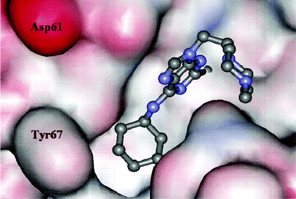
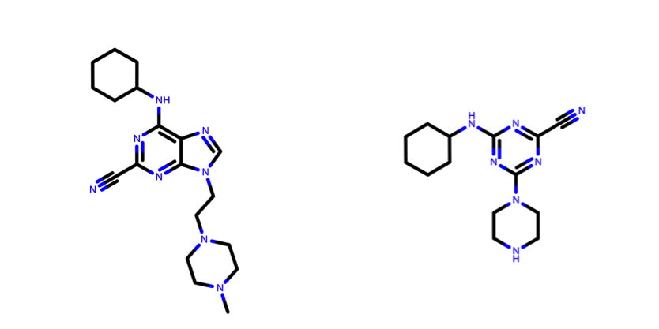

* table of contents
{:toc}

## Introduction
The format of the community forum has been defined as an _unconference_, stimulating us to think outside of the box and discussing challenges that are barely touched upon by our communities. This tutorial paves the route for the use of [HADDOCK](http://www.bonvinlab.org/software/haddock2.2/) to covalently bind a ligand to a receptor. This use-case is a first attempt to blur different software and take on the challenge of "covalent docking". You are greatly encouraged to work at your own pace, to discuss with your neighbours, to interrupt us, to recommend different methods and/or software, to switch to one of the [many well-established HADDOCK tutorials](http://www.bonvinlab.org/education/), to calmly disagree, to enthusiastically demonstrate your interest for the topic, to correct typos, to challenge us with your own system of interest, to suggest new developments ... Just remember that, at this stage, this tutorial shall not serve as a standard protocol to predict the covalent binding of a small ligand in the active site a protein.

## Motivations
We listed here some motivations for this topic, in no particular order:
- There is no publication from the Bonvin's group on protein-small ligand docking using HADDOCK, yet! Despite the lack of a thoroughly benchmarked protocol, about 20% of the jobs submitted on the [HADDOCK web server](http://milou.science.uu.nl/services/HADDOCK2.2/haddock.php) are dealing with small ligands.
- [HADDOCK](http://www.bonvinlab.org/software/haddock2.2/) recently participated to the [D3R Grand Challenges 2 and 3](https://drugdesigndata.org/about/grand-challenge), blind prediction challenges involving three-dimensional calculation of protein-ligand poses and prediction of affinities or scores.
- "Covalent docking" calls for the development of specific features in [HADDOCK](http://www.bonvinlab.org/software/haddock2.2/), some of which have just been implemented before this community forum.
- This topic is appealing to our industrial partners.
- Unique opportunity to work at the interface between most of the interest groups: [Integrative Modelling](http://bioexcel.eu/community/interest-groups/integrative-modelling-ig/), [Hybrid Methods](http://bioexcel.eu/community/interest-groups/hybrid-method-ig/), [Practical Applications for Industry](http://bioexcel.eu/community/interest-groups/industry-ig/) and Free Energy Calculations.
- Could possibly combine all three [BioExcel flagship software](http://bioexcel.eu/software/) into one common workflow.
- This is a collaborative effort, where software developers meet the different players in the field to combine expertise and skills in order to solve the puzzle.

## Scientific context
Osteoporosis affects about 10% of the population in Europe, Japan and North America and its incidence rate is growing with increasing life expectancy. The main feature of osteoporosis is bone loss mediated by osteoclasts and insufficient rebuilding of bone matrix by osteoblasts. A longstanding theory of osteoporosis is that the balance between these two activities has gone off, with bone destruction running ahead. It is very hard to slow down osteoclast activity without slowing down osteoblast activity as well, but one therapy showed promises: the cathepsin K inhibitors.

[Cathepsin K](https://en.wikipedia.org/wiki/Cathepsin_K) is a highly potent cysteine protease expressed in osteoclasts. This enzyme is able to break down collagen, elastin, gelatin and other proteins. It is found almost entirely in this cell type, giving a real hope of targeting osteoclasts selectively. At last, protease inhibitors themselves are a type of small molecule that, in general, give good success in drug discovery. For all those reasons, cathepsin K inhibitors have been studied for more than 20 years and several pharmaceutical companies have currently compounds in clinical trials.

## Overview
In this tutorial we will use [HADDOCK](http://www.bonvinlab.org/software/haddock2.2/) to predict the covalent binding of a small ligand on a protein receptor, using as example a purine nitrile derived inhibitor of cathepsin K (see fig. 1), described in the following publication:<br>
_[Novel Purine Nitrile Derived Inhibitors of the Cysteine Protease Cathepsin K](doi.org/doi:10.1021/jm0493111)_<br>
E. Altmann\*, S.W. Cowan-Jacob and M. Missbach\*<br>
J. Med. Chem. (2004)


*Figure 1: Purine nitrile derived inhibitor cocrystallized in the cathepsin K active site. PDB code is 1u9v*

One important feature of this inhibitor (PDBeChem code: [IHE](http://www.ebi.ac.uk/pdbe-srv/pdbechem/chemicalCompound/show/IHE)) is that it can bind three highly homologous cathepsin proteins, with a remarkable affinity:


| | IC50 (nM) | |
| :------------ |:---------------:| -------------:|
| Cat K | Cat L | Cat S |
| 6 | 89 | 150 |

*Table 1: Selectivity Data on the Inhibition of Homologous Cathepsins*

Since a lot of three-dimensional structures of cathepsins in the presence of small inhibitors are available on the Protein Data Bank, we can simulate an "unbound" challenge where we must predict the correct interaction of this ligand with each cathepsin protein (respectively K, L and S) starting from homologous templates. As an additional challenge, we will also start from the [SMILES](https://en.wikipedia.org/wiki/Simplified_molecular-input_line-entry_system) string of the ligand and only use non-commercial third party software, or commercial software that deliver academic license.

This tutorial consists of the following sections:
- Setup
- Select the "best" cathepsin templates for the docking
- Generate a starting structure for the ligand from SMILES strings
- Define restraint(s) for the docking
- Submit your docking runs
- Analysis of the results
- Perspectives

Because this tutorial requires a lot of efforts to edit and clean PDB files in preparation for docking, we will provide you with most of the files. Feel free to DIY and share with us your best tips to fasten this fastidious work.

For this tutorial we will make use of the [HADDOCK2.2 web server](http://milou.science.uu.nl/services/HADDOCK2.2/haddock.php). A description of our web server can be found in the following publications:

_[The HADDOCK2.2 webserver: User-friendly integrative modeling of biomolecular complexes](doi.org/10.1016/j.jmb.2015.09.014)_<br>
G.C.P van Zundert, J.P.G.L.M. Rodrigues, M. Trellet, C. Schmitz, P.L. Kastritis, E. Karaca, A.S.J. Melquiond, M. van 
Dijk, S.J. de Vries and A.M.J.J. Bonvin<br>
J. Mol. Biol. (2015)

_[The HADDOCK web server for data-driven biomolecular docking](http://doi.org/doi:10.1038/nprot.2010.32)_<br>
S.J. de Vries, M. van Dijk and A.M.J.J. Bonvin<br>
Nature Protocols (2010)

Throughout the tutorial, coloured text will be used to refer to questions or instructions.

<a class="prompt prompt-question">This is a question prompt: try answering it!</a>
<a class="prompt prompt-info">This is an instruction prompt: follow it!</a>


## Setup
Before you get started, we invite you all to create an account on our [HADDOCK web server](http://milou.science.uu.nl/services/HADDOCK2.2/haddock.php). Please fill in the [registration form](http://milou.science.uu.nl/services/HADDOCK2.2/signup.html). The usage of the web server is **only free for non-profit work**.

In order to run this tutorial, you will need to have a molecular viewer installed. We advise you to us 
[PyMOL](https://pymol.org/) and the visualization commands provided during the hands-on will be given for PyMOL. 
Schrödinger offers [Educational-use-only PyMOL](https://pymol.org/edu/?q=educational/) builds available at no cost for courses.


> If you have questions, feedbacks or recommendations, either during the course of after, please post them on the dedicated topic we created on our [interest group forum](http://ask.bioexcel.eu/c/IG-IM)

## Select the "best" cathepsin templates for the docking

In practice, the structure of the protein can be obtained if:
- Free structures of homologous proteins are known and can be used as templates to model the protein. Typically, 
sequence similarity, structure resolution and experimental conditions will determine which template is the best to select.
- The unbound structure of the protein is known
- Bound structures of homologous proteins are known and can be used to approximate the bound structure of the receptor.
- Bound structures of the protein with different ligands are known.

<a class="prompt prompt-question">Providing we can find either bound structures of close homologous 
proteins or  bound structures of our protein of interest with different ligands, how would you select the best template 
for the docking?</a>

Based on our previous experience with the [D3R](https://drugdesigndata.org/) challenges, we decided to use ligand 
similarity to select a protein template for small molecule docking. The similarity metric that we employ is the widely 
accepted **Tanimoto Coefficient** (TC). Given two molecules, A and B, depicted in fig. 2 the TC is defined as follows:
$$TC=\frac{C}{A+B-C}$$
where TC is the Tanimoto Coefficient, A is the set of atoms of molecule A, B is the set of atoms of molecule B and C 
is the set of atoms that is shared between the two molecules.


*Figure 2: Depictions of the molecules being compared. On the left is the ligand of the structure with PDBid 
[1U9V](http://www.rcsb.org/pdb/explore/explore.do?structureId=1u9v) and on the right the one with 
PDBid [3KW9](http://www.rcsb.org/pdb/explore/explore.do?structureId=3kw9)*

The shared set of atoms is depicted in fig. 3 and it is identified by detecting the Maximum Common Substructure (MCS) 
of the two molecules.


*Figure 3: Highlight of the shared atoms between the two molecules*

To illustrate the rich diversity of cathepsins K, L and S structures with inhibitors and their TC differences despite 
their very high homology, we calculated a pairwise TC matrix (see fig. 4)


*Figure 4: Pairwise TC distances between all cathepsins K, L and S structures available in the presence of a small inhibitor*

We decided to choose the closest related templates based on their TC (table 2). To save you some time in 
fetching/cleaning the files, you can directly download them from the table 2.

| CatK | CatL | CatS |
| :------------ |:---------------:| -------------:|
| [3kw9](media/3kw9_clean.pdb) | [4axm](media/4axm_clean.pdb) | [3n4c](media/3n4c_clean.pdb) |
| 0.25 | 0.62 | 0.56 |

*Table 2: PDB codes of the templates used for the three cathepsins and respective C&alpha;-RMSD calculated with 
respect to the reference structure in &Aring;*

## Generate a starting structure for the ligand from SMILES strings

For the ligand, some programs like [PRODRG](http://davapc1.bioch.dundee.ac.uk/cgi-bin/prodrg) allow you to generate a 
structure for a chemical directly from a simple sketch in a text editor. However, whenever possible, we advise you to 
use SMILES or MOL files for the ligand when the atomic coordinates are not available. To illustrate the difficulty of 
ligand modelling, there is no strict consensus in the algorithms that generate the SMILES strings and each of them 
choose only one of the main possible strings. For instance, open the PDBeChem page for 
our [cathepsin K inhibitor](http://www.ebi.ac.uk/pdbe-srv/pdbechem/chemicalCompound/show/IHE) and look for the SMILES 
provided (ACDLabs, CACTVS, OpenEye).

<a class="prompt prompt-question"> What will you say about the consistency between the different SMILES sequences? 
Can you recognise the different structural groups in the ligand based on the SMILES?</a>


Use the [LigParGen server](http://zarbi.chem.yale.edu/ligpargen/) developed by the Jorgensen group, a free web-based 
service that provides structure and force field topology/parameters for organic molecules and small ligands. Generate 
starting structures using the default parameters for the three different SMILES strings provided by PDBeChem.

If you look carefully to the PDB files, you will notice that the atom naming and ordering varies from one file to the other. 
To save you some time and efforts, we provide you (table 3) with the renamed PDB files for all three conformers of the 
ligand, with a consistent naming and in an appropriate format for HADDOCK (chainID was added and ATOM is replaced by HETATM):

| [OpenEye](media/IHE_ligpargen_OpenEye-renamed.pdb) | [CACTVS](media/IHE_ligpargen_CACTVS-renamed.pdb) | [ACDLabs](media/IHE_ligpargen_ACDLabs-renamed.pdb) |
| :------------ |:---------------:| -------------:|
| 1.39 | 2.02 | 2.20 |

*Table 3: Edited LigParGen models generated from the respective SMILES strings and their all-atom RMSD to the reference*

In figure 5, you can appreciate the relative good performance of this web-service. For the rest of the tutorial, we will 
use the model based on OpenEye SMILES as this is the one that gives in our experience the best results.


*Figure 5: Superposition of the LigParGen models based on SMILES strings (OpenEye=yellow, CACTVS=magenta, ACDLabs=cyan) 
with the reference structure of the ligand (green)*

It is important to note at this point that the conformational sampling of the ligand can be greatly improved by using 
commercial software, such as [OMEGA](https://www.eyesopen.com/omega) from the OpenEye Scientific Software suite. It is 
possible to request an academic 
license to use OMEGA for free. Since this field is extremely competitive and occupied by many commercial players, 
keep in mind that there are probably other solutions available, just as good or better than OMEGA, depending on your budget.

When using the torsional sampling with OMEGA, we can generate ~350 conformers with some very good hits, as illustrated 
in fig. 6. The best model comes with a RMSD of just about 0.4&Aring; and you can download it [here](media/omega_IHE.pdb). 
However, selecting the best conformer without any _a priori_ information on the ligand remains a very challenging task, 
for which we would be happy to get your advises.


*Figure 6: RMSD of all OMEGA conformers with respect to the reference structure of the ligand*

## Define restraint(s) for the docking
Since we do not want to be to restrictive on the docking, we will only enforce the "covalent bond" by defining a 
distance restraint between the sulfur atom of the targeted cysteine and the reactive nitrile carbon of the ligand. 
This distance is set to 1.8&Aring; &plusmn; 0.1&Aring;, consistent with the average length of a simple C-S bond. 
This is done by creating a tbl file consisting of the following statement:

```assign (segid A and name SG and resi 25) (segid B and name C0Q and resi 1) 1.8 0.1 0.1```

This file will be given to HADDOCK as an unambiguous distance restraint.

## Submit your docking runs

> Note that fine-tuning the parameters of the web server to covalently dock a ligand requires the most advanced privilge on the web server. If you have not be granted the guru access level yet, it is time to apply for it by sending a request to [haddocksupport_@_gmail.com](mailto:haddocksupport@gmail.com)

The main bottleneck when trying to "covalently dock" a small ligand is that we must trick our software to work against all the safeguards we implemented to prevent clashes. Especially when the ligand is buried, which is to some extent the case here, we need to work against the repulsive component of the VDW forces. To allow the distance restraint to be satisfied, we need to either scale down the non-bonded interactions in HADDOCK or to modify the parameters of a residue to reduce its VDW parameters. We decided to create a modified cysteine (residue name: CYC) with significantly reduced VDW parameters for the sulfur atom (scaled down by a factor 10).

**Instruction:** If you did not download the PDB files we providing you in table 2, you will have to modify the residue name of cysteine 25 and replace "CYS A  25" by "CYC A  25".

> As an additional remark, the [HADDOCK web server](http://milou.science.uu.nl/services/HADDOCK2.2/haddock.php) directly fetches topology and parameters for the small ligand from [PRODRG](http://davapc1.bioch.dundee.ac.uk/cgi-bin/prodrg). In the near future, we may want to allow users to provide their own set of topology/parameter files, which is for the moment only possible provided the user runs the command line version of the software (or bribe us to implement the parameter files in the production server).

Apart from the modified residue discussed previously, some points must require your attention:
- In the field `First Molecule`: we must provide manually the histidine protonation state. Pay attention to uncheck the automatic option and specify the following protonation states:
    * 3KW9 (catK): **HIE162** / **HIE177**
    * 4AXM (catL): **HIE140** / **HIE163** / **HID208**
    * 3N4C (catS): **HIE142** / **HIE164** / **HIE188** / **HID205**
- In the `Distance Restraints` menu: upload the tbl file as unambiguous restraints
- In the `Distance Restraints` menu: by default, HADDOCK removes the non-polar hydrogen that might account for the 
tightly binding of the chemical. This option must be **unchecked**
- In the `Sampling parameters` menu: please set the number of structure for explicit solvent refinement to **0** to 
skip the last refinement stage of HADDOCK. Since the ligand is pretty buried and in a rather dry pocket,
 we experienced that we achieve better results with the structures generated in the second/flexible stage of HADDOCK (it1)
- In the field `Parameters for clutering`: the default clustering method in HADDOCK2.2 is 
[fcc-based clustering](https://github.com/haddocking/fcc), which is a measure of similarity of interfaces based on 
pairwise residue contacts. If this method outperforms RMSD-based clustering for large systems, both in term of accuracy 
and speed, interface-RMSD remains a method of choice for small ligand docking. In the ‘Parameters for clustering’
 section, please change the clustering method to **RMSD** and set the cutoff value for clustering to **2&Aring;**
- In the field `Energy and interaction parameters`: we must scale down the non-bonded intermolecular interaction to 
already bring the ligand deep in the pocket at the rigid body monimisation stage of HADDOCK. For this, we must scaling
 the intermolecular interactions for rigid body EM to **0.001**
- In the field `Advanced sampling parameters`: some advanced parameters for the sampling are too aggressive for 
protein-small molecule binding and must be reduced or removed to avoid the ligand being kicked out the binding pocket:
    * number of MD steps for rigid body high temperature TAD = **0**
    * number of MD steps during first rigid body cooling stage = **0**

Once all the web server options have been filled out, you can enter your username and password and click submit. 
The web form will first be validated. Once done it will be added to the job queue and start running when resources 
are available. Normally you will be notified by email once your job is added to the queue and afterwards on the 
continuation of your job.

<!-- ## Analysis of the results

## Perspectives
- check mutations catK/catL/catS
- ligplotplus
- prodigy-lig-score 

challenges: conformational sampling ligand, template selection, ligand conformers clustering, scoring, binding affinity predictions (check slack Alex)

goals: 3D structure of the cpx, relative ranking, absolution BA predictions
-->