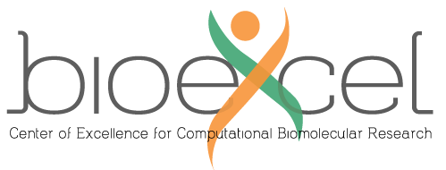
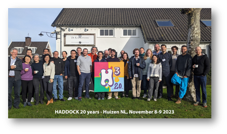

## Fundings

The development of Haddock3 is made possible thanks to the financial support from Horizon 2020, projects [BioExcel](https://www.bioexcel.eu) [823830](https://cordis.europa.eu/project/id/823830) and [101093290](https://cordis.europa.eu/project/id/101093290), EGI-ACE [101017567](https://cordis.europa.eu/project/id/101017567), and from the Netherlands e-Science Center (027.020.G13), that provided and still provides substantial fundings for software development.
This allows the HADDOCK team to ensure software quality, improvements, maintenance, and user support.

<figure style="text-align: center;">

</figure>

## User driven developments

In Haddock3, not only do we try to provide a powerful docking tool that can handle a variety of biomolecular entities, but we are also developing new modules and functionalities based on user requests.
On a yearly basis, we ask users to fill out a survey, allowing us to focus on several different directions to improve the tool and make it more suitable for the community.
Feature requests can also be performed directly from our [GitHub repository issues](https://github.com/haddocking/haddock3/issues/new/choose).

## 20 years of HADDOCK

Haddock3 is the newest version of HADDOCK, an original idea initially developed by [Dominguez, C., Boelens, R. & Bonvin, A. M. J. J. in 2003](https://pubs.acs.org/doi/10.1021/ja026939x).
For more than 20 years now, HADDOCK has been improved, going from its first description to several milestones, namely Haddock2.2, Haddock2.4, and now Haddock3.

In November 2023, we celebrated the 20-year anniversary of HADDOCK, where most of the incredible scientists who contributed to its development attended.

<figure style="text-align: center;">

</figure>

We wish to thank all the students, PhD candidates, and postdoctoral researchers for each of their contributions to the tool, as they have allowed us to continuously develop new methods and improve HADDOCK functionalities over the years.
