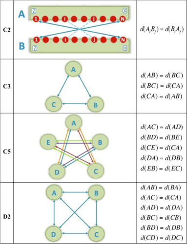

# Automated restraints generation

- [Symmetry restraints](#symmetry-restraints)
  - [Non crystallographic symmetry - NCS](#non-crystallographic-symmetry)
  - [Rotational symmetry](#rotational-symmetry)
  - [S3 symmetry](#s3-symmetry)
- [DNA / RNA restraints](#dna--rna-restraints)
- [Contact restraints](#contact-restraints)

## Symmetry restraints

CNS modules using restraints, such as `[rigidbody]`, `[flexref]`, `[emref]` or `[mdref]`, are also capable of handling symmetry restraints.
This can be very useful when you know that the system you are working with contains such property, and you wish to enforce sampled solutions to be symmetrical.

Various symmetry restraints are already available in Haddock3.
But custom symmetry restraints can also be provided. To learn more about them, read the [custom symmetry section](#custom-symmetry-restraints).


### Pre-defined symmetry restraints

3 types of symmetry restraints have been implemented in haddock3:

- [**Non-crystallographic symmetry**](#non-crystallographic-symmetry): Restraining the conformation to be identical
- [**Rotational symmetries**](#rotational-symmetry): where C2, C3, C4, C5 and C6 symmetry can be enforced between selected partners.
- [**S3 symmetry**](#s3-symmetry): The S3 rotational and translational symmetry.

They are described in more detail below.

Here is a related research article describing some of the available symmetries in HADDOCK: E. Karaca, A.S.J. Melquiond, S.J. de Vries, P.L. Kastritis and A.M.J.J. Bonvin
[Building macromolecular assemblies by information-driven docking: Introducing the HADDOCK multi-body docking server.](https://doi.org/doi:10.1074/mcp.M000051-MCP201)
_Mol. Cell. Proteomics_, *9*, 1784-1794 (2010). Download the final author version <a href="https://utrechtuniversity.on.worldcat.org/atoztitles/link?sid=Entrez:PubMed&id=pmid:20305088">here</a>.


#### Non-crystallographic symmetry

Non-crystallographic symmetry (NCS) restraints are a type of restraints available in CNS.
While symmetry is in the name, there is in fact no symmetry involved.
They simply enforce an RMSD = 0 between the selected segments, independently of any rotation and/or translation, restraining the conformations to be similar.

To make use of NCS parameters, one should first activate the use of such restraints using the `ncs_on = true` parameter!

NCS restraints are defined between two partners, but multiple NCS restraints can be set up in the same run.
Parameters used to define NCS restraints are always composed of 6 information (divided into three sections, separated by underscores `_`), that must be provided:

- **The prefix section**:
  - **Symmetry type**: the parameter must start with `ncs_` as a prefix, indicating haddock3 on what type of symmetry restraints we are dealing with.
- **The infix section**:
  - **Starting residue**: using the infix `sta` (for start), defines the first residue in the NCS restraint segment.
  - **Ending residue**: using the infix `end` (for end), defines the last residue in the NCS restraint segment.
  - **ChainID/SegmentID**: using the infix `seg` (for segment), defines the segment ID in the CNS restraint segment.
  - **Partner index**: after the infix, must be set an integer defining the partner (e.g.: `seg1`). This index is used to group parameters related to the same partner together and match the start, end, and segment ID.
- **The suffix section**:
  - **Symmetry index**: the suffix (`_Y`) must start for one and define the index of the symmetry. This allows the definition of multiple C**N** symmetries at the same time and properly attribute the parameters.

It is also possible to tune the force constant for the NCS symmetries restraints using the `kncs` parameter.

Here is an example on how to define a NCS restraints:
```toml
# Activation of the NCS restraints
ncs_on = true  # Very important, otherwise nothing will be considered
# Tune the force constant
kncs = 1.0  # Here default parameter is shown for the purpose of this manual

################################
# Definition of NCS restraints #
################################
## PRFIX:  ncs_ is used to define NCS restraints
## INFIX:  `sta`, `end`, `seg` must be defined for the 3 segments
## SUFFIX: _1 is used (as it's the first definition of C3 symmetry)
####################################
# Definition of the first partner
ncs_sta1_1 = 1    # Residue number of the first residue in the first C3 symmetry segment 
ncs_end1_1 = 30   # Residue number of the last residue in the first C3 symmetry segment 
ncs_seg1_1 = "A"  # Segment ID (chain ID) of this segment
# Definition of the second partner
ncs_sta2_1 = 1    # Residue number of the first residue in the first C3 symmetry segment 
ncs_end2_1 = 30   # Residue number of the last residue in the first C3 symmetry segment 
ncs_seg2_1 = "B"  # Segment ID (chain ID) of this segment
```

Note that for the use of NCS restraints:

- starting and ending residues **MUST** be the same.
- chains/segments must be different.
- the two partners must have the same sequence and residue numbering.

We have dedicated functions to assess the validity of the NCS parameters.

#### Rotational symmetry

Rotational symmetries (**C symmetries**) can be enforced between partners.
Currently, C2, C3, C4, C5 and C6 symmetries are available.
Each symmetry type (C**N**) must be defined between **N** partners to be valid.

<figure align="center">

</figure>

To make use of C**N** symmetry parameters, one should first activate the use of such restraints using the `sym_on = true` parameter!

Parameters used to define segments on which symmetry must be enforced are always composed of 6 information (divided into three sections, separated by underscores `_`), that must be provided:

- **The prefix section**:
  - **Symmetry type**: the parameter must start with `cNsym_` as a prefix, where `N` is an integer defining the symmetry type (e.g.: `c2sym_`), allowing haddock3 to understand how many partners should be expected and how to automatically build the symmetry distance restraints.
- **The infix section**:
  - **Starting residue**: using the infix `sta` (for start), defines the first residue in the C**N** symmetry segment.
  - **Ending residue**: using the infix `end` (for end), defines the last residue in the C**N** symmetry segment.
  - **ChainID/SegmentID**: using the infix `seg` (for segment), defines the segmentID in the C**N** symmetry segment.
  - **Partner index**: after the infix, must be set an integer defining the partner (e.g.: `seg1`). This index is used to group parameters related to the same partner together and match the start, end, and segment ID.
- **The suffix section**:
  - **Symmetry index**: the suffix (`_Y`) must be define the index of the symmetry. This allows the definition of multiple C**N** symmetries at the same time.

Note that multiple symmetry restraints can be set up in the same run.
This is performed by adding the index (`_Y`) to the parameter name (e.g: `cNsym_xxx_Y`)
The first definition must always start with an index of 1 (`_1`)!

Here is an example of how to define two C3 symmetries:

```toml
# Activation of the symmetry restraints
sym_on = true  # Very important, otherwise nothing will be considered
# Tune the force constant
ksym = 10.0  # Here default parameter is shown for the purpose of this manual

###################################
# First definition of C3 Symmetry #
###################################
## PRFIX:  c3sym_ is used to define C3 symmetry
## INFIX:  `sta`, `end`, `seg` must be defined for the 3 segments
## SUFFIX: _1 is used (as it's the first definition of C3 symmetry)
####################################
# Definition of the first partner
c3sym_sta1_1 = 1    # Residue number of the first residue in the first C3 symmetry segment 
c3sym_end1_1 = 30   # Residue number of the last residue in the first C3 symmetry segment 
c3sym_seg1_1 = "A"  # Segment ID (chain ID) of this segment
# Definition of the second partner
c3sym_sta2_1 = 1    # Residue number of the first residue in the first C3 symmetry segment 
c3sym_end2_1 = 30   # Residue number of the last residue in the first C3 symmetry segment 
c3sym_seg2_1 = "B"  # Segment ID (chain ID) of this segment
# Definition of the third partner
c3sym_sta3_1 = 1    # Residue number of the first residue in the first C3 symmetry segment 
c3sym_end3_1 = 30   # Residue number of the last residue in the first C3 symmetry segment 
c3sym_seg3_1 = "C"  # Segment ID (chain ID) of this segment

####################################
# Second definition of C3 Symmetry #
####################################
## PRFIX:  c3sym is used to define C3 symmetry
## INFIX:  `sta`, `end`, `seg` must be defined for the 3 segments
## SUFFIX: _2 is used (as it's the second definition of C3 symmetry)
####################################
# Definition of the first partner
c3sym_sta1_2 = 31
c3sym_end1_2 = 60
c3sym_seg1_2 = "A"
# Definition of the second partner
c3sym_sta2_2 = 31
c3sym_end2_2 = 60
c3sym_seg2_2 = "B"
# Definition of the third partner
c3sym_sta3_2 = 31
c3sym_end3_2 = 60
c3sym_seg3_2 = "C"
```

It is also possible to tune the force constant for the C**N** symmetries using the `ksym` parameter.

We are providing an example of protein-homotrimer docking using haddock3 [here](/software/haddock3/manual/docking_scenarios#protein-homotrimer).


#### S3 symmetry

To make use of S3 symmetry parameters, one should first activate the use of such restraints using the `sym_on = true` parameter!

It is also possible to tune the force constant for the S3 symmetry using the `ksym` parameter.


## DNA & RNA restraints

Often, you will want to keep DNA / RNA base-pairing fixed during a simulation.
Without any restraints, the pairing can fall apart when running semi-flexible refinements or molecular dynamics simulations.

A dedicated parameter can be turned **on** to automatically discover base pairs and generate restraints between nucleotides to keep them together.
For this, simply set the `dnarest_on` to true (`dnarest_on = true`) in the corresponding CNS modules (mainly `[flexref]` and `[mdref]`).

*Note* that while the parameter name only contains DNA in its name, it is also functional for RNA!


## Contact restraints

Contact restraints can be automatically defined and set up in CNS modules (mainly `[flexref]` and `[mdref]`).
Contact restraints can be automatically defined and set up in CNS modules (mainly `[flexref]` and `[mdref]`).

By turning **on** the `contactairs` parameter (`contactairs = true`), HADDOCK will first search for current contacts in the input complex and define restraints to make sure to retain the contact during the simulation step.

This can be useful when complexes where obtained using Center of Mass restraints (`cmrest = true`) at the `[rigidbody]` stage, or in refinement scenarios.
By turning **on** the `contactairs` parameter (`contactairs = true`), HADDOCK will first search for current contacts in the input complex and define restraints to make sure to retain the contact during the simulation step.

This can be useful when complexes where obtained using Center of Mass restraints (`cmrest = true`) at the `[rigidbody]` stage.

# Custom symmetry restraints

If the type of symmetries already implemented in haddock3 is not sufficient for your needs, you can always supply your own symmetry restraint file.
This is performed by defining the path to this file using the `symtbl_fname = custom_symmetry_restraints.tbl` parameter.
This parameter is available in `[rigidbody]`, `[flexref]`, `[emref]` and `[mdref]` modules.

For more details on how to define symmetry restraints, please refer to the [Xplor documentation, Distance Symmetry Restraints](https://nmr.cit.nih.gov/xplor-nih/xplorMan/node393.html).

