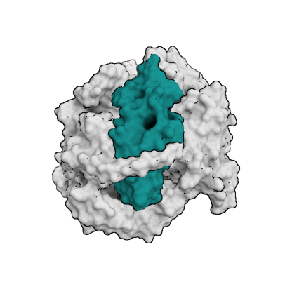
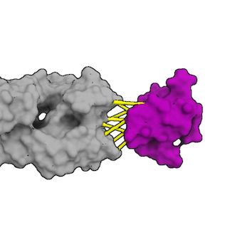
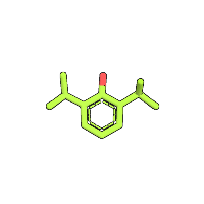
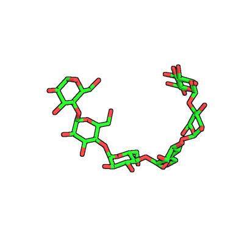
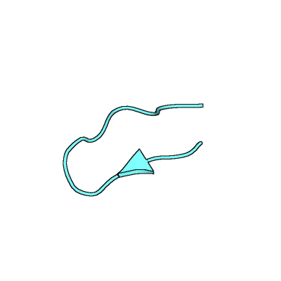
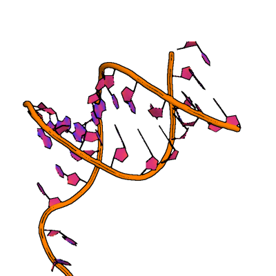
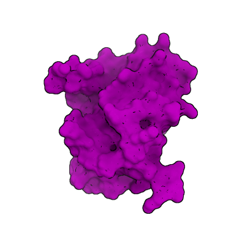
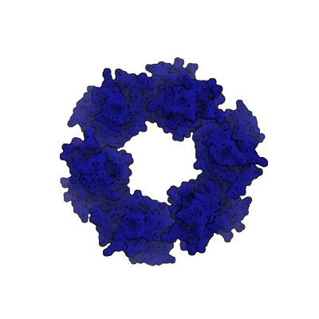
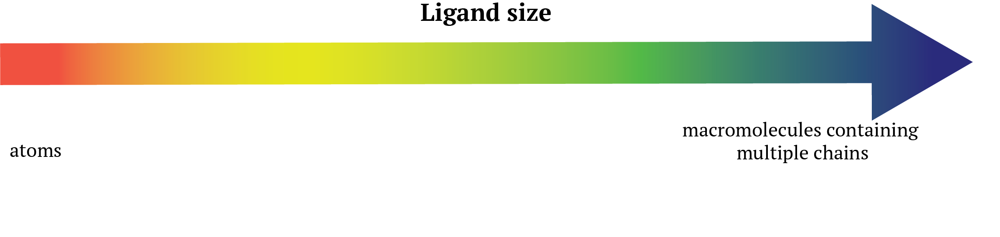
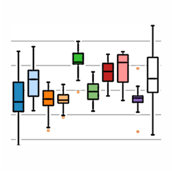

# Best practice guide

**A must-read when starting to use our software!**

HADDOCK is a powerful tool, however, to reach its full potential it must be wisely used.
Thus **the best practice guide shows how to run HADDOCK in a sensible and rational manner.**
Which settings are best used in which scenario and which on the other hand are better avoided?
This best practice guide will guide you through all possible scenarios with related settings linked with tutorials of the newest HADDOCK version, published articles, and protocols from our group.

## Before docking

### [How to prepare structures for HADDOCK?](./bpg/structures.md)

<a href="./bpg/structures.md" title="Structures preparation">

</a>
  
### [How to use information about interactions in HADDOCK?](./bpg/restraints.md)

<a href="./bpg/restraints.md" title="Restraints preparation"> 
 
</a>

##  Docking with HADDOCK

<table class="three-col-table">

  <tr>
    <td>
<b>
<a href="./bpg/small_mol.md" alt="Docking of small molecules" title="Docking of small molecules">Small molecules</a>
</b>
</td>
    <td>
<b>
<a href="./bpg/glycans.md" alt="Docking of glycans" title="Docking of glycans">Glycans</a>
</b>
</td>
    <td>
<b>
<a href="./bpg/peptides.md" alt="Docking of peptides" title="Docking of peptides">Peptide</a>
</b>
</td>
    <td>
<b>
<a href="./bpg/dna.md" alt="Docking of nucleotides" title="Docking of small molecules">Nucleotides</a>
</b>
</td>
    <td>
<b>
<a href="./bpg/proteins.md" alt="Docking of proteins" title="Docking of protein">Proteins</a>
</b>
</td>
    <!--
 <td>
<b>
<a href="./bpg/cg.md" alt="Docking of coarse grained molecules" title="Docking of coarse grained molecules ">Coarse grain</a>
</b>
</td>
 -->
  </tr>
  <tr>
    <td>
      
    </td>
    <td>
      
    </td>
    <td>
      
    </td>
    <td>
      
    </td>
    <td>
      
    </td>
    <!--
 <td>
 
 </td>
 -->
  </tr>
  <tr>
       <td colspan="6">
         

       </td>
  </tr>
 </table>

##  [After docking: How to analyze docking results from HADDOCK or refine models?](./bpg/analysis.md)

<a href="./bpg/analysis.md" title="Analysis">

</a>

