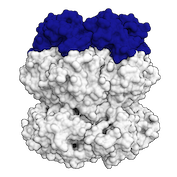

## Coarse-graining in HADDOCK

  

 Best practice guide

To perform the docking of large biological complexes in a reasonable timescale HADDOCK offers the option to coarse grain molecules.
By downscaling the level of resolution of biomolecules to coarser representations, HADDOCK can study protein interactions that are hardly accessible by classical atomistic approaches.
Currently, coarse-graining of proteins and nucleic acids with [Martini](http://cgmartini.nl) is supported. 
Preparation of coarse-grained pdb files is described in the HADDOCK [manual here](/software/haddock2.4/pdb-cg/) and coarse grained topology is described  in *run.cns* format in the [manual here](/software/haddock2.4/run/#coarse-grained-topology-and-parameters-files).
All available documentation about coarse-graining is summed up in these sections:

### [Tutorials](../tutorials.md)

* [**Integrative modelling of the RNA polymerase III apo complex**](/education/HADDOCK24/RNA-Pol-III): A combination of our DISVIS, POWERFIT and HADDOCK2.4 portals using cross-links and cryo-EM data to model a large macromolecular assembly.

### [Publications](../publications.md)

* J. Roel-Touris and **A.M.J.J. Bonvin**. [Coarse-Grained (Hybrid) Integrative Modeling of Biomolecular Interactions](https://doi.org/10.1016/j.csbj.2020.05.002). _Comp. Struct. Biotech. J._, *18*, 1182-1190 (2020).

* R.V. Honorato, J. Roel-Touris and **A.M.J.J. Bonvin**. [MARTINI-based protein-DNA coarse-grained HADDOCKing](https://doi.org/10.3389/fmolb.2019.00102). _Frontiers in Molecular Biosciences_, *6*, 102 (2019).

* J. Roel-Touris, C.G. Don, R.V. Honorato, J.P.G.L.M Rodrigues and **A.M.J.J. Bonvin**. [Less is more: Coarse-grained integrative modeling of large biomolecular assemblies with HADDOCK](https://doi.org/10.1021/acs.jctc.9b00310). _J. Chem. Theo. and Comp._, *15*, 6358-6367 (2019).

### [Optimal settings of docking of coarse grained molecules](https://wenmr.science.uu.nl/haddock2.4/settings#cg)

|Parameter|run.cns name| default value|optimal value |
|-|:-:|:-:|:-:| 
|**Dieletric constant for it0** | <code> dielec_0</code> | rdie | **cdie** |  
|**Dieletric constant for it1** | <code> dielec_1</code> | rdie | **cdie**  |

More about optimal settings for different docking scenarios can be found [here](https://wenmr.science.uu.nl/haddock2.4/settings#optimal).

### [FAQ](../faq.md)

Any more questions about coarse-grained docking with HADDOCK?

Have a look at:
- [F.A.Q](../faq.md)
- [Ask for help / find support](../info.md)

