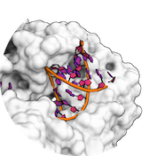

## DNA and RNA

  

 Best practice guide

HADDOCK supports the docking of nucleic acids, including both DNA and RNA. Currently, only canonical nucleic acid bases are supported. They are listed [here](https://wenmr.science.uu.nl/haddock2.4/library).

### DNA and RNA nucleotide naming convention

In HADDOCK, DNA and RNA bases must adhere to a strict naming convention to be correctly recognized and interpreted by CNS. 

**DNA nucleotides**:
- Adenosine: `DA`
- Thymine: `DT`
- Cytosine: `DC`
- Guanine: `DG`

*Note* that DNA nucleotides are denoted by **two**-letter codes, starting at position 18 in the PDB file.

**RNA nucleotides**:
- Adenosine: `A`
- Uracil: `U`
- Cytosine: `C`
- Guanine: `G`

*Note* that RNA nucleotides are denoted by **single**-letter codes, starting at position 18 in the PDB file.

Any residue labeled simply as `T` will be ignored during docking. 
If you notice missing thymine residues in your DNA after docking, it is likely that all DNA residues were labeled incorrectly - following the RNA naming convention instead. 
This would result in the molecule being treated as RNA rather than DNA.

### [Publications](../publications.md)

* Z. Kurkcuoglu and A.M.J.J. Bonvin. [Pre- and post-docking sampling of conformational changes using ClustENM and HADDOCK for protein-protein and protein-DNA systems](https://doi.org/10.1002/prot.25802). _Proteins: Struc. Funct. &amp; Bioinformatics_, *88*, 292-306 (2020).

* R.V. Honorato, J. Roel-Touris and A.M.J.J. Bonvin. [MARTINI-based protein-DNA coarse-grained HADDOCKing](https://doi.org/10.3389/fmolb.2019.00102). _Frontiers in Molecular Biosciences_, *6*, 102 (2019).

* M. van Dijk, K. Visscher, P.L. Kastritis and A.M.J.J. Bonvin.
[Solvated protein-DNA docking using HADDOCK.](https://doi.org/doi:10.1007/s10858-013-9734-x)
_J. Biomol. NMR_, *56*, 51-63 (2013).

* M. van Dijk and A.M.J.J. Bonvin
[Pushing the limits of what is achievable in protein-DNA docking. Benchmarking HADDOCK's performance.](https://doi.org/doi:10.1093/nar/gkq222)_Nucl. Acid Res._, *38*, 5634-5647 (2010).

* M. van Dijk and A.M.J.J. Bonvin
[A protein-DNA docking benchmark.](https://doi.org/doi:10.1093/nar/gkn386)
_Nucl. Acids Res._ (2008), *36*, e88, doi: 10.1093/nar/gkn386.

* M. van Dijk, A.D.J. van Dijk, V. Hsu, R. Boelens and A.M.J.J. Bonvin
[Information-driven Protein-DNA Docking using HADDOCK: it is a matter of flexibility.](https://doi.org/doi:10.1093/nar/gkl412)
_Nucl. Acids Res._, *34* 3317-3325 (2006).

### [Tutorials](../tutorials.md)

* [**Haddock3 basic protein-DNA docking tutorial**](https://www.bonvinlab.org/education/HADDOCK3/HADDOCK3-protein-DNA-basic):
 This tutorial demonstrates the use of Haddock3 for predicting the structure of a protein-DNA complex in which two protein units bind to the double-stranded DNA in a symmetrical manner (reference structure [3CRO](https://www.rcsb.org/structure/3CRO)).
 In addition to provided ambiguous restraints used to drive the docking, symmetry restraints are also defined to enforce symmetrical binding to the protein.
 This tutorial is using a local version of Haddock3, and therefore requires the use of a terminal and some basic command line expertise.

### Optimal settings for docking of nucleic acids

|Module|Parameter| default value|optimal value |
|-|:-:|:-:|:-:| 
|**`[rigidbody]`: Epsilon constant for the electrostatic energy term** | <code>epsilon</code>|  10.0 | **78.0** |   
|**`[rigidbody]`: Turn off desolvation component term** | <code>w_desolv</code>|  1.0 | **0** | 
|**`[rigidbody]`: Constant dielectric constant** | <code>dielec</code>|  rdie | **cdie** | 
|**`[flexref]`: Epsilon constant for the electrostatic energy term** | <code>epsilon</code>| 10.0| **78.0** |  
|**`[flexref]`: Turn off desolvation component term** | <code>w_desolv</code>|  1.0 | **0** | 
|**`[flexref]`: Constant dielectric constant** | <code>dielec</code>|  rdie | **cdie** | 
|**`[flexref]`: Turn on automatic DNA base-pair restraints** | <code>dnarest_on</code>|  false | **true** | 
|**`[flexref]`: Reduce TAD factor** | <code>tadfactor</code>|  8 | **4** | 
|**`[flexref]`: Reduce start temperature in 3rd cooling phase** | <code>temp_cool3_init</code>|  1000 | **300** | 

More about optimal settings for different docking scenarios can be found [here](https://wenmr.science.uu.nl/haddock2.4/settings#optimal).

### [FAQ](../faq.md)

Any more questions about nucleic acids docking with HADDOCK?
Have a look at:
- [F.A.Q](../faq.md)
- [Ask for help / find support](../info.md)
