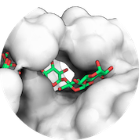

## Glycans

  

 Best practice guide

HADDOCK also supports the docking of several carbohydrates.
A list of glycan residues supported by HADDOCK can be found [here](https://wenmr.science.uu.nl/haddock2.4/library). This page consists of the following chapters:

### [Tutorials](../tutorials.md)

* [HADDOCK3 protein-glycan modeling and docking](https://www.bonvinlab.org/education/HADDOCK3/HADDOCK3-protein-glycan/): This tutorial shows how to use HADDOCK3 to dock a glycan to a protein, provided that some information exists about the protein binding site.

### [Publications](../publications.md)

* A. Ranaudo, M. Giulini, A. Pelissou Ayuso and A.M.J.J. Bonvin. [Modelling Protein-Glycan Interactions with HADDOCK.](https://pubs.acs.org/doi/10.1021/acs.jcim.4c01372) _J. Chem. Inf. Mod._ 64, 7816–7825 (2024).

### [Optimal settings for docking of glycans](https://wenmr.science.uu.nl/haddock2.4/settings#glycans)

|Parameter|Module / parameter| default value|optimal value |
|-|:-:|:-:|:-:| 
|**Clustering method** | <code> `[ilrmsdmatrix]` and `[clustrmsd]`</code>|  |  |   
|**Cutoff for clustering in `[clustrmsd]`** | <code> clust_cutoff </code>| 7.5 | **2.5** |  

More about optimal settings for different docking scenarios can be found [here](https://wenmr.science.uu.nl/haddock2.4/settings#optimal).

### [FAQ](../faq.md)

Any more questions about glycan docking with HADDOCK? 
Have a look at:
- [F.A.Q](../faq.md)
- [Ask for help / find support](../info.md)
