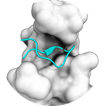

## Peptides

  

 Best practice guide

HADDOCK supports the docking of peptides as well.
Since the secondary structure of short peptides is not always well defined, it is safer to dock an ensemble of multiple conformations.
Different ways of generating these conformations are described [here](./structures.md#modelling-of-peptides-and-mutations-in-proteins).
More documentation about peptide docking with HADDOCK is in the following sections:

### [Tutorials](../tutorials.md)

* [**HADDOCKing of the p53 N-terminal peptide to MDM2**](/education/molmod/docking/):
 This tutorial introduces protein-peptide docking using the HADDOCK web server. It also introduces the CPORT web server for interface prediction, based on evolutionary conservation and other biophysical properties.  

### [Publications](../publications.md)

* C. Geng, S. Narasimhan, J. P.G.L.M. Rodrigues and **A.M.J.J. Bonvin**.
[Information-driven, ensemble flexible peptide docking using HADDOCK](https://doi.org/10.1007/978-1-4939-6798-8_8).
_Methods in Molecular Biology: Modeling Peptide-Protein Interactions._ Eds Ora Schueler-Furman and Nir London. Humana Press Inc. *1561*, 109-138 (2017).

* A.D. Spiliotopoulos, P.L. Kastritis, A.S.J. Melquiond, **A.M.J.J. Bonvin**, G. Musco, W. Rocchia and A. Spitaleri.
[dMM-PBSA: a new HADDOCK scoring function for protein-peptide docking](https://journal.frontiersin.org/article/10.3389/fmolb.2016.00046/full).
_Frontiers in Molecular Biosciences_, *3*:46 doi:10.3389/fmolb.2016.00046 (2016).

* E. Deplazes, J. Davies, **A.M.J.J. Bonvin**, G.F. King and A.E. Mark.
[On the Combination of Ambiguous and Unambiguous Data in the Restraint-driven Docking of Flexible Peptides with HADDOCK: The Binding of the Spider Toxin PcTx1 to the Acid Sensing Ion channel (ASIC)1a](https://doi.org/doi:10.1021/acs.jcim.5b00529).
_J. Chem. Inf. and Model._ *56*, 127-138 (2016).

* J.P.G.L.M. Rodrigues, A.S.J. Melquiond and  **A.M.J.J. Bonvin**.
[Molecular Dynamics Characterization of the Conformational Landscape of Small Peptides: A series of hands-on collaborative practical sessions for undergraduate students](https://doi.org/doi:10.1002/bmb.20941).
_Biochemistry and Molecular Biology Education_, *44*, 160-167 (2016).

* M. Trellet, A.S.J. Melquiond and **A.M.J.J. Bonvin**.
[Information-driven modelling of protein-peptide complexes.](https://link.springer.com/protocol/10.1007/978-1-4939-2285-7_10)
_Methods in Molecular Biology._ Ed. Peng Zhou. Humana Press Inc. 221-239 (2015)

* M. Trellet, A.S.J. Melquiond and **A.M.J.J. Bonvin**.
[A Unified Conformational Selection and Induced Fit Approach to Protein-Peptide Docking](https://dx.plos.org/10.1371/journal.pone.0058769)
_PLoS ONE_, *8(3)* e58769 (2013). --> [**ERRATUM**](https://milou.science.uu.nl/Files/ERRATUM_unified_conformational_selection.pdf)

### [Optimal settings for docking of peptides](https://wenmr.science.uu.nl/haddock2.4/settings#peptides)

|Parameter|run.cns name| default value|optimal value |
|-|:-:|:-:|:-:| 
|**Clustering method** | <code>clust_meth</code>| FCC | **RMSD** |   
|**Cutoff for clustering** | <code> clust_cutoff </code>| 0.6 | **5** |  
|**Number of MD steps for rigid body high temperature TAD**| <code>initiosteps</code> | 500| **2000**|
|**Number of MD steps during first rigid body cooling stage**| <code>cool1_steps</code> | 500| **2000**|
|**Number of MD steps during second cooling stage with flexible side-chains at interface**|<code>cool2_steps</code> | 500 |**4000**|
|**Number of MD steps during third cooling stage with fully flexible interface**| <code>cool3_steps</code> |500 | **4000**|

More about optimal settings for different docking scenarios can be found [here](https://wenmr.science.uu.nl/haddock2.4/settings#optimal).

### [FAQ](../faq.md)

Any more questions about peptide docking with HADDOCK?

Have a look at:
- [F.A.Q](../faq.md)
- [Ask for help / find support](../info.md)
