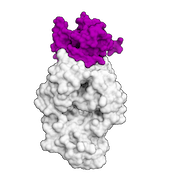

## Proteins

  

 Best practice guide

As the name **HADDOCK** (**H**igh **A**mbiguity **D**riven protein-protein **DOCK**ing) suggests, HADDOCK was originally developed for docking of proteins.
Nowadays HADDOCK belongs to the state-of-the-art software in the protein-protein docking field, thus protein-protein documentation is the most comprehensive one.
You can read more about protein-protein docking in the following sections:

### [Tutorials](../tutorials.md)

#### HADDOCK2.4 versions

* [**HADDOCK2.4 local installation tutorial**](/education/HADDOCK24/HADDOCK24-local-tutorial):
 A tutorial demonstrating the installation and use of a local installation of HADDOCK2.4. It demonstrates various docking scenarios.
 You will need for this a valid license of HADDOCK2.4.

* [**HADDOCK2.4 basic protein-protein docking tutorial**](/education/HADDOCK24/HADDOCK24-protein-protein-basic):
 A tutorial demonstrating the use of the HADDOCK web server to model a protein-protein complex using interface information derived from NMR chemical shift perturbation data.
 This tutorial does not require any Linux expertise and only makes use of our web server and [PyMol](https://www.pymol.org) for visualization/analysis.

* [**HADDOCK2.4 MS cross-links tutorial**](/education/HADDOCK24/HADDOCK24-Xlinks):
 A tutorial demonstrating the use of cross-linking data from mass spectrometry to guide the docking in HADDOCK.
 This tutorial builds on our [DisVis tutorial](/education/Others/disvis-webserver/) and illustrates various scenarios of using
 cross-linking data in HADDOCK.
 This tutorial does not require any Linux expertise and only makes use of our web server and [PyMol](https://www.pymol.org) for visualization/analysis.

* [**DISVIS/HADDOCK2.4 oligomer puzzle**](/education/HADDOCK24/XL-MS-oligomer):
 In this tutorial, you will have to solve an oligomer puzzle, namely predicting the correct oligomeric state
 of a symmetrical homomer complex based on a few (artificial) cross-links.
 The tutorial does not require any Linux expertise and only makes use of the DISVIS and HADDOCK web servers and [PyMol](https://www.pymol.org) for visualization/analysis.

* [**HADDOCK2.4 CA-CA restraints guided docking tutorial**](/education/HADDOCK24/HADDOCK24-CACA-guided):
 A tutorial demonstrating a template-based approach to model protein-protein complexes. It combines the PS-HomPPI web server to find suitable templates and generate CA-CA distance restraints and HADDOCK for the CA-CA guided modeling.
 This tutorial does not require any Linux expertise and only makes use of the PS-HomPPI and HADDOCK web servers and [PyMol](https://www.pymol.org) for visualization/analysis.

* [**HADDOCK2.4 ab-initio, multi-body symmetrical docking tutorial**](/education/HADDOCK24/HADDOCK24-CASP-CAPRI-T70):
 A tutorial demonstrating multi-body docking with HADDOCK using its ab-initio mode with symmetry restraints.
 It is based on a former CASP-CAPRI target (T70).
  
* [**HADDOCK2.4 antibody-antigen docking tutorial**](/education/HADDOCK24/HADDOCK24-antibody-antigen):
 This tutorial demonstrates the use of HADDOCK2.4 for predicting the structure of an antibody-antigen complex using information 
 about the hypervariable loops of the antibody and either the entire surface of the antigen or a loose definition of the epitope.
 This tutorial does not require any Linux expertise and only makes use of our web servers and [PyMol](https://www.pymol.org) for visualization/analysis.

### [Publications](../publications.md)

* **A.M.J.J. Bonvin**, E. Karaca, P.L. Kastritis & J.P.G.L.M. Rodrigues. Correspondence: [Defining distance restraints in HADDOCK](https://doi.org/10.1038/s41596-018-0017-6). _Nature Protocols_ *13*, 1503 (2018). [Free online only access](https://rdcu.be/1OyH)

* **A.M.J.J. Bonvin**, C. Geng, M. van Dijk, E. Karaca, P. L. Kastritis, P.I. Koukos, Z. Kurkcuoglu, A.S.J. Melquiond, 
J.P.G.L.M. Rodrigues, J. Schaarschmidt, C. Schmitz, J. Roel-Touris, M.E. Trellet, S. de Vries, A. Vangone, L. Xue, G.C.P. van Zundert
[HADDOCK](https://doi.org/10.1007/978-3-642-35943-9_330-1). In _Encyclopedia of Biophysics_, In press (2018).

* G.C.P van Zundert, J.P.G.L.M. Rodrigues, M. Trellet, C. Schmitz, P.L. Kastritis, E. Karaca, A.S.J. Melquiond, M. van Dijk, S.J. de Vries and  **A.M.J.J. Bonvin**.
[The HADDOCK2.2 webserver: User-friendly integrative modeling of biomolecular complexes](https://doi.org/doi:10.1016/j.jmb.2015.09.014).
_J. Mol. Biol._, *428*, 720-725 (2016).

* G.C.P. van Zundert, A.S.J. Melquiond and **A.M.J.J. Bonvin**.
[Integrative modeling of biomolecular complexes: HADDOCKing with Cryo-EM data.](https://doi.org/10.1016/j.str.2015.03.014)
_Structure._ *23*, 949-960 (2015).

* J.P.G.L.M Rodrigues, E. Karaca and **A.M.J.J. Bonvin**.
[Information-driven structural modelling of protein-protein interactions.](https://link.springer.com/protocol/10.1007/978-1-4939-1465-4_18)
_Methods in Molecular Biology: Molecular Modelling of Proteins._ Ed. Andreas Kokul. Humana Press Inc. 399-424 (2015).

* G.C.P. van Zundert and **A.M.J.J. Bonvin**.
[Modeling protein-protein complexes using the HADDOCK webserver.](https://link.springer.com/protocol/10.1007/978-1-4939-0366-5_12)
_Methods in Molecular Biology: Protein Structure Prediction._ Ed. Daisuke Kihara. Humana Press Inc., 163-179 (2014).

* **A.M.J.J. Bonvin**, M. van Dijk, E. Karaca, P.L. Kastritis, A.S.J. Melquiond, C. Schmitz and S.J. de Vries
[HADDOCK](https://www.springer.com/life+sciences/biochemistry+%26+biophysics/book/978-3-642-16711-9)
In Encyclopedia of Biophysics, Ed. G.C.K. Roberts, Springer-Verlag Berlin Heidelberg (2013).

* C. Schmitz, A.S.J. Melquiond, S.J. de Vries, E. Karaca, M. van Dijk, P.L. Kastritis and **A.M.J.J. Bonvin**
Protein-protein docking with HADDOCK
In: <a href="https://eu.wiley.com/WileyCDA/WileyTitle/productCd-3527328505,subjectCd-CH17.html">NMR in Mechanistic Systems Biology</a>. Ed. I. Bertini, K.S. McGreevy and G. Parigi, Wiley-Blackwell, 512-535.

* P.L. Kastritis, A.D.J. van Dijk and **A.M.J.J. Bonvin**
[Explicit Treatment of Water Molecules in Data-Driven Protein-Protein Docking: The Solvated HADDOCKing Approach](https://doi.org/doi:10.1007/978-1-61779-465-0_22)
_Methods in Molecular Biology_ *819*, Part 5, 355-374 (2012)

* E. Karaca and **A.M.J.J. Bonvin**
[A multi-domain flexible docking approach to deal with large conformational changes in the modeling of biomolecular complexes.](https://doi.org/doi:10.1016/j.str.2011.01.014)
_Structure_, *19* 555-565(2011).

* P.L. Kastritis, I.H. Moal, H. Hwang, Z. Weng, P.A. Bates, **A.M.J.J. Bonvin** and J. Janin
[A structure-based benchmark for protein-protein binding affinity.](https://doi.org/doi:10.1002/pro.580)
_Prot. Sci._, *20*, 482-41 (2011).

* A.S.J. Melquiond and **A.M.J.J. Bonvin**
[Data-driven docking: using external information to spark the biomolecular rendez-vous.](https://www.icpress.co.uk/lifesci/p618.html)
In: Protein-protein complexes: analysis, modelling and drug design. Edited by M. Zacharrias, Imperial College Press, 2010. p 183-209.

* E. Karaca, A.S.J. Melquiond, S.J. de Vries, P.L. Kastritis and **A.M.J.J. Bonvin**
[Building macromolecular assemblies by information-driven docking: Introducing the HADDOCK multi-body docking server.](https://doi.org/doi:10.1074/mcp.M000051-MCP201)
_Mol. Cell. Proteomics_, *9*, 1784-1794 (2010). Download the final author version <a href="https://igitur-archive.library.uu.nl/chem/2011-0314-200254/UUindex.html">here</a>.

* S.J. de Vries, M. van Dijk and **A.M.J.J. Bonvin**
[The HADDOCK web server for data-driven biomolecular docking.](https://www.nature.com/nprot/journal/v5/n5/abs/nprot.2010.32.html)
_Nature Protocols_, *5*, 883-897 (2010).

* S.J. de Vries, M. van Dijk and **A.M.J.J. Bonvin**
[The Prediction of Macromolecular Complexes by Docking.](https://onlinelibrary.wiley.com/doi/10.1002/9780470741894.ch9/summary)
In: Prediction of Protein Structures, Functions, and Interactions (ed J. M. Bujnicki), John Wiley &amp; Sons, Ltd, Chichester, UK (2009).

* S. de Vries and **A.M.J.J. Bonvin**
[How proteins get in touch: Interface prediction in the study of biomolecular complexes.](https://www.bentham-direct.org/pages/content.php?CPPS/2008/00000009/00000004/0005K.SGM)
_Curr. Pept. and Prot. Research_, *9*, 394-406 (2008).

* A.D.J. van Dijk and **A.M.J.J. Bonvin**
[Solvated docking: introducing water into the modelling of biomolecular complexes.](https://doi.org/doi:10.1093/bioinformatics/btl395)

* S.J. de Vries and **A.M.J.J. Bonvin**
[Intramolecular surface contacts contain information about protein-protein interface regions.](https://doi.org/doi:10.1093/bioinformatics/btl275)
_Bioinformatics_, *22* 2094-2098 (2006).

* **A.M.J.J. Bonvin**
[Flexible protein-protein docking.](https://doi.org/doi:10.1016/j.sbi.2006.02.002)
_Curr. Opin. Struct. Biol._, *16*, 194-200 (2006).

* S.J. de Vries, A.D.J. van Dijk and **A.M.J.J. Bonvin**
[WHISCY: WHat Information does Surface Conservation Yield? Application to data-driven docking.](https://doi.org/doi:10.1002/prot.20842)
_Proteins: Struc. Funct. &amp; Bioinformatics_, *63*, 479-489 (2006).

* A.D.J. van Dijk, R. Boelens and **A.M.J.J. Bonvin**
[Data-driven docking for the study of biomolecular complexes.](https://doi.org/doi:10.1111/j.1742-4658.2004.04473.x)
_FEBS Journal_, *272*, 293-312 (2005).

* C. Dominguez, R. Boelens and **A.M.J.J. Bonvin**
[HADDOCK: A protein-protein docking approach based on biochemical or biophysical information.](https://pubs.acs.org/doi/abs/10.1021/ja026939x)
_J. Am. Chem. Soc._, *125*, 1731-1737 (2003).

### Optimal settings

Default settings are optimal for protein-protein docking, however one can still modify parameters, such as the number of generated models. 

More about optimal settings for different docking scenarios can be found [here](https://wenmr.science.uu.nl/haddock2.4/settings).

### [FAQ](../faq.md)

A special section about docking of mutations with HADDOCK is dedicated in the [frequently asked questions page](/software/haddock2.4/faq/#what-about-point-mutations).

Any more questions about protein-protein docking with HADDOCK?
Have a look at:
- [F.A.Q](../faq.md)
- [Ask for help / find support](../info.md)
