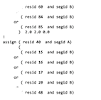
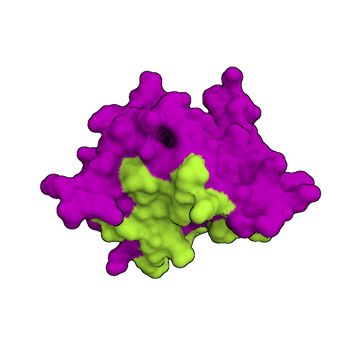
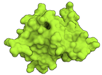

## Restraints

<p align="right">
  
</p>


<p style='text-align: right; font-family: "PT Sans"; font-weight: 600;'> <font  size="6" color="RED" >Best practice guide</font></p>

As you probably saw in the [previous step dedicated to structure preparation](./structures.md), there are many ways how to obtain structures of molecules that you want to dock.
The next step is to define the way you expect these molecules to interact.
HADDOCK is an information-driven tool, which means that the more available information about binding you have, the more meaningful your results will be.
Based on the available information we distinguish between the following options:
- [What information about binding is available?](#what-information-about-binding-is-available)
  - [Information about the interface is available](#1-information-about-the-interface-is-available)
    - [Unambiguous Interaction restraints](#unambiguous-interaction-restraints)
    - [Ambiguous Interaction restraints](#ambiguous-interaction-restraints)
  - [Information about the interface is not available](#2--information-about-the-interface-is-not-available)
    - [Information about the quaternary structure of proteins (symmetry)](#information-about-the-quaternary-structure-of-proteins-symmetry)
      - [Symmetry restraints](#symmetry-restraints)
      - [Non-crystallographic symmetry restraints (NCS)](#non-crystallographic-symmetry-restraints-ncs)
      - [Membrane Z-positioning restraints](#membrane-z-positioning-restraints)
    - [*Ab-initio* docking](#ab-initio-docking)
      - [Random interaction restraints](#random-interaction-restraints)
      - [Center of mass restraints](#center-of-mass-restraints)
      - [Surface contact restraints](#surface-contact-restraints)
  - [Getting restraints HADDOCK-ready](#getting-restraints-haddock-ready)
- [Complementary software related to restraints for HADDOCK](#complementary-software-related-to-restraints-for-haddock)


<hr>


### What information about binding is available? 



### 1.) Information about the interface is available

#### Unambiguous Interaction restraints  

If your predictions are **highly reliable** and you wish to have all of them applied during docking, define them as [**unambiguous restraints**](../intro_restraints.md#unambiguous-distance-restraints) (using the `unambig_fname` parameter).
Unambiguous restraints are not subject to random removal, therefore all of them must be satisfied.
These can be for example:
- chain-break restraints generated by the [`haddock3-restraint restrain_bodies`](../restraints_cli.md#restrain-bodies) command line
- template-derived pairwise distance restraints ([tutorial](https://www.bonvinlab.org/education/HADDOCK24/HADDOCK24-CACA-guided/))
- MS crosslink data ([tutorial](https://www.bonvinlab.org/education/HADDOCK24/HADDOCK24-Xlinks/))
- cryo-EM connectivity data ([tutorial](https://www.bonvinlab.org/education/HADDOCK24/RNA-Pol-III/))


#### [<font color="RED">A</font>mbiguous <font color="RED">I</font>nteraction <font color="RED">R</font>estraints (<font color="RED">AIR</font>s)](../airs.md)

Nevertheless, as in life, in science one also needs to be somewhat critical to the data one works with.
If you are not 100% sure about the interaction information and want to be cautious while incorporating it into your docking, use [**ambiguous interaction restraints**](../intro_restraints.md#ambiguous-distance-restraints) (using the `ambig_fname` parameter).
Here, for each docking trial, a fraction of these restraints will be randomly removed, which ensures a wider sampling satisfying always a different subset of predefined restraints.
Thus, if some of the restraints are artificial, these can be filtered out if the complex satisfying them is unfavorable. 
Of course, you can tune this random removal approach by modifying the `npart` parameter or turning it off by setting `randremoval=false`.

For AIRs, it is important to define the residues at the interface for each molecule based on experimental data that provides information on the interaction interface.  

In the definition of those residues, one distinguishes between ***<font color="RED">"active"</font>*** and ***<font color="GREEN">"passive"</font>*** residues.  

 * The ***<font color="RED">"active"</font>*** residues are of central importance for the interaction between the two molecules **AND** are solvent accessible. 
 Either main chain or side chain relative accessibility should be typically > 40%, sometimes a lower cutoff might be used as well, for example, the HADDOCK server uses by default 15%. Throughout the simulation, these active residues are restrained to be part of the interface, if possible, otherwise incurring in a scoring penalty.    

 * The ***<font color="GREEN">"passive"</font>*** residues are all solvent-accessible surface neighbors of active residues (<6.5Å). They contribute to the interaction but are deemed of less importance. If such a residue does not belong in the interface there is no scoring penalty.


In general, an AIR is defined as an ambiguous intermolecular distance between any atom of an *active* residue of molecule A and any atom of both *active* and *passive* residues of molecule B (and inversely for molecule B).
This procedure can be performed:
- locally using the `haddock3-restraints active_passive_to_ambig` command line
- online using [GenTBL server](https://wenmr.science.uu.nl/services/GenTBL/)


Using ambiguous restraints for docking is described in several tutorials:
- [For Haddock3](https://www.bonvinlab.org/education/HADDOCK3/):
  - [**antibody-antigen docking**](https://www.bonvinlab.org/education/HADDOCK3/HADDOCK3-antibody-antigen)
  - [**protein-glycan modelling and docking**](https://www.bonvinlab.org/education/HADDOCK3/HADDOCK3-protein-glycan)
  - [**protein-DNA docking basic tutorial**](https://www.bonvinlab.org/education/HADDOCK3/HADDOCK3-protein-DNA-basic/)
- [Using HADDOCK2.4 webserver](https://www.bonvinlab.org/education/HADDOCK24/):
  - [basic protein-protein tutorial](https://www.bonvinlab.org/education/HADDOCK24/HADDOCK24-protein-protein-basic/#definition-of-restraints)
  - [small molecule docking tutorial](https://www.bonvinlab.org/education/HADDOCK24/HADDOCK24-binding-sites/)
  - [antibody-antigen docking tutorial](https://www.bonvinlab.org/education/HADDOCK24/HADDOCK24-antibody-antigen/#definition-of-restraints).


#### Other kinds of restraints

* [Hydrogen bonds restraints](../intro_restraints.md#hydrogen-distance-restraints): Another type of restraint not subject to random removal (accessed using `hbond_fname` parameter).

* [DNA/RNA restraints](../automated_restraints.md#dna--rna-restraints): Automatically generated base-pair restraints using the `dnarest = true` parameter.


HADDOCK can utilize plenty of experimental information.
Here we describe other types of restraints supported by HADDOCK:

* [Residual Dipolar Couplings](https://www.bonvinlab.org/software/haddock2.4/RDC/)  

* [Pseudo Contact Shifts](https://www.bonvinlab.org/software/haddock2.4/PCS/)  

* [Diffusion Anisotropy Restraints](https://www.bonvinlab.org/software/haddock2.4/DANI/)

* [Cryo-EM restraints](https://www.bonvinlab.org/software/haddock2.4/cryoEM/)

* [Radius of gyration restraints](https://www.bonvinlab.org/software/haddock2.4/Rg/)

<hr>



### 2.)  Information about the interface is not available

If there is no direct information about the interacting residues available, one can still browse through the available literature or employ bioinformatic prediction tools to gain some information about the potential complex.
HADDOCK offers a plethora of ways for these scenarios.

#### Information about the quaternary structure of proteins (symmetry)

##### [Symmetry restraints](../automated_restraints.md#symmetry-restraints)

HADDOCK offers the possibility to define multiple symmetry relationships within or in between molecules.
This is done by using symmetry distance restraints.
By defining multiple pairs of distances between the CA atoms of two chains, various symmetries can be enforced. 
Symmetry restraints are described in the manual [here](../automated_restraints.md#symmetry-restraints). 

*Ab-initio* multi-body docking with symmetry restraints is described this [*Ab-initio* tutorial](https://www.bonvinlab.org/education/HADDOCK24/HADDOCK24-CASP-CAPRI-T70/) (HADDOCK2.4).


##### [Non-crystallographic symmetry restraints (NCS)](../automated_restraints.md#non-crystallographic-symmetry)

The NCS option imposes non-crystallographic symmetry restraints: It enforces that two molecules, a fraction thereof or even two sub-domains within the same molecule, should be identical without defining any symmetry operation between them. 
Non-crystallographic symmetry restraints are described in the manual [here](../automated_restraints.md#non-crystallographic-symmetry). 

*Ab-initio* multi-body docking with NCS restraints is described [here](https://www.bonvinlab.org/education/HADDOCK24/HADDOCK24-CASP-CAPRI-T70/).

##### [Membrane Z-positioning restraints](../restraints_cli.md#z-surface-restraints)

These restraints do not deal with symmetry, but can be useful in guiding the docking of membrane proteins.
This type of restraint is used to keep segments within or outside of a defined Z-coordinate range.
They can be used for docking of membrane proteins but can be used generically as well.

They are described in the HADDOCK manual [here](../restraints_cli.md#z-surface-restraints).

#### [*Ab-initio* docking](../abinitio_docking.md)

##### [Random interaction restraints](../abinitio_docking.md#random-ambiguous-restraints)

Haddock3 `[rigidbody]` module offers to define [random AIRs](../abinitio_docking.md#random-ambiguous-restraints) from solvent-accessible residues (>20% relative accessibility) in case there is no experimental information, by **turning on** the `ranair = true` parameter.
The sampling will be done from the defined segments.
This can be useful for *ab-initio* docking to sample the entire protein surface.
To ensure a thorough sampling of the surface, the number of structures generated at the rigid-body stage `[rigidbody]` should be increased (e.g. `sampling=10000`), depending on the extent of the surface to be sampled.
These random restraints are described [here](../abinitio_docking.md#random-ambiguous-restraints). 

Random interaction restraints are used in the [binding site tutorial](https://www.bonvinlab.org/education/HADDOCK24/HADDOCK24-binding-sites/).


##### [Center of mass restraints](../abinitio_docking.md#center-of-mass-restraints)

[Center of mass (COM) restraints](../abinitio_docking.md#center-of-mass-restraints) are distance restraints that ensure close proximity of two molecules.
Such restraints can be useful in multi-body (N>2) docking to ensure that all molecules are in contact and thus promote compactness of the docking solutions.
Similarly to the contact surface restraints, they can be useful in combination with random interaction restraints definition (see above) or in the refinement of molecular complexes.

COM restraints are mentioned in multiple tutorials, for example:
- [Refining the interface of the cryo-EM fitted models with HADDOCK](https://www.bonvinlab.org/education/HADDOCK24/RNA-Pol-III/#refining-the-interface-of-the-cryo-em-fitted-models-with-haddock)
- [HADDOCK 2.4 CASP-CAPRI T70 *Ab-initio* docking tutorial](https://www.bonvinlab.org/education/HADDOCK24/HADDOCK24-CASP-CAPRI-T70/#definition-of-restraints)
- [Modelling a homo-oligomeric complex from MS cross-links](https://www.bonvinlab.org/education/HADDOCK24/XL-MS-oligomer/#definition-of-restraints).


##### [Surface contact restraints](../automated_restraints.md#contact-restraints)

[Surface contact restraints](../automated_restraints.md#contact-restraints) can be useful in multi-body (N>2) docking to ensure that all molecules are in contact and thus promote compactness of the docking solutions.
As for the random AIRs, surface contact restraints can be used in *ab-initio* docking; in such a case it is important to have enough sampling of the random starting orientations and this significantly increases the number of structures for rigid-body docking.
They can be useful in combination with random interaction restraints definition (see above) or in the refinement of molecular complexes.
They can be **turned on** by setting the `contact_airs = true` parameter.

<hr>

### Optimal settings for docking using bioinformatics predictions

When we are less certain about the interacting residues, it is better to enhance sampling by increasing the number of structures generated in each phase of docking.  
This can be performed by tuning:
- Increasing the number of generated complexes by tuning the `sampling` parameter in `[rigidbody]` module.
- Selecting more complexes to be refined: `select = 400` parameter in `[seletop]` module.
- Split the predicted AIRs into smaller subsets, and generate a `.tgz` archive.


<style>
table, th, td {
    padding: 5px;
}
</style>


|<font size="4" color="#203A98">Parameter</font>|<font size="4" color="#203A98">Module/parameter</font>| <font size="4" color="#203A98">default value</font>|<font size="4" color="#203A98">optimal value</font> |
|-|:-:|:-:|:-:| 
|**Number of generated structures for rigid body docking `[rigidbody]`**|<code>`sampling = `</code>| 1000| **10000**|
|**Provide multiple AIRs as tar gz archive**|<code>`ambig_fname = `</code>|.tbl| **.tbl.gz**|
|**Number of trials for rigid body minimisation**| <code>`ntrials = `</code>|5| **1**|
|**Number of structures selected for later refinements in `[seletop]`**| <code>`select = `</code>| 200| **400**|

**IMPORTANT NOTE**: Splitting your *very* ambiguous interaction restraints into multiple files can allow further de-noising (in addition to `randremoval = true`). This is performed by generating multiple restraints files, combining them in a single `.tgz` archive and finally using it from the `ambig_fname` parameter.
Have a look at the examples using multiple ambiguous restraints:
- In your haddock3 local installation: `examples/docking-multiple-ambig`
- [Online](https://github.com/haddocking/haddock3/tree/main/examples/docking-multiple-ambig)

Here is an example:
```toml
# General parameters
#####################
# ...
# Workflow / Modules
#####################
# ...
[rigidbody]
sampling = 10000
ambig_fname = "noisy_ambigs.tbl.tgz"
[seletop]
select = 400
# ... refinements steps ...
```


More about optimal settings for different docking scenarios can be found [here](https://wenmr.science.uu.nl/haddock2.4/settings#bioinfo).

<hr>

## Getting restraints HADDOCK-ready

Several methods can allow you to generate restraints for haddock3:

- [locally using the `haddock3-restraints` command line interface](../restraints_cli.md): Holds multiple subcommands that should cover the majority of the usages.
- online using [GenTBL server](https://wenmr.science.uu.nl/services/GenTBL/)


<hr>

## Dos and Don'ts

<style>
table, th, td {
    padding: 5px;
}
</style>

| <font size="10" color="RED">Don't</font> | <font size="10" color="GREEN">Do instead</font> |
|:---:|:---:|
| define the entire protein as **active** | define only key interacting residues as **active**, if they are not known, define the surface of one molecule as **passive** |


<hr>

#  Complementary software related to restraints for HADDOCK

In [BonvinLab](https://www.bonvinlab.org), a number of complementary web servers have been developed to help users to reevaluate restraints. 

## [ARCTIC-3D](https://wenmr.science.uu.nl/arctic3d/)

[ARCTIC-3D](https://wenmr.science.uu.nl/arctic3d/), standing for Automatic Retrieval and Clustering of Interfaces in Complexes, is a data mining algorithm that searches for experimental interfaces in the PDB and cluster interaction sites together. It is also able to directly generate AIRs for haddock3.


## [CPORT](http://alcazar.science.uu.nl/services/CPORT/) 

[CPORT](http://alcazar.science.uu.nl/services/CPORT/) is an algorithm for the prediction of protein-protein interface residues. It combines six interface prediction methods into a consensus predictor.

Tutorials using CPORT:

* [HADDOCKing of the p53 N-terminal peptide to MDM2](https://www.bonvinlab.org/education/molmod/docking/)


## [DISVIS](https://wenmr.science.uu.nl/disvis/) 

[DISVIS](https://wenmr.science.uu.nl/disvis/) visualizes and quantifies the information content of distance restraints between macromolecular complexes.

Tutorial describing DisVis: 

* [DisVis tutorial](https://www.bonvinlab.org/education/Others/disvis-webserver/)
* [HADDOCK2.4 tutorial for the use of MS crosslinks](https://www.bonvinlab.org/education/HADDOCK24/HADDOCK24-Xlinks/#setting-up-the-docking-with-the-disvis-derived-interfaces-scenario-2)
* [Integrative modelling of the RNA polymerase III apo complex](https://www.bonvinlab.org/education/HADDOCK24/RNA-Pol-III)


<hr>

Any more questions about restraints for HADDOCK?

Have a look at:
- [F.A.Q](../faq.md)
- [Ask for help / find support](../info.md)
