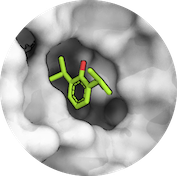

## Small-molecules / Ligands

  

 Best practice guide

It's possible to dock small ligands using HADDOCK but for that topology and parameter files for the ligand should be provided in CNS format.
Several sources exist to find such files:

* **BioBB using acpype**: The [BioExcel BioBuildingBlock (BioBB)](https://mmb.irbbarcelona.org/biobb/) library is hosting several tutorials on how to perform computations with a variety of different tools.
 Here is a link to the workflow used to parametrize ligands: [https://mmb.irbbarcelona.org/biobb/workflows/tutorials/biobb_wf_ligand_parameterization](https://mmb.irbbarcelona.org/biobb/workflows/tutorials/biobb_wf_ligand_parameterization)

* **ccp4-prodrg**: [`ccp4-prodrg`](https://www.ccp4.ac.uk/html/index.html)

* the **PRODGR** server maintained by Daan van Aalten at Dundee University: [https://prodrg2.dyndns.org](https://prodrg2.dyndns.org)  
 This server allows you to draw your molecule or paste coordinates and will return topologies and parameter files in various formats, including CNS. You should turn on the electrostatic to obtain partial charges.

* the **Automated Topology Builder (ATB)** and Repository developed in Prof. Alan Mark's group at the University of Queensland in Brisbane: [https://compbio.biosci.uq.edu.au/atb](https://compbio.biosci.uq.edu.au/atb)

A more detailed description is written in the [protein-ligand docking example](../docking_scenarios/prot-ligand.md).
To increase the chance of getting the right ligand conformation, one can perform ensemble docking.
In this scenario, multiple conformations can be generated as described [here](./structures.md#modeling-of-small-molecules).

The following sections summarize all documentation about small molecule docking with HADDOCK.

### [Tutorials](../tutorials.md)

* [**HADDOCK2.4 ligand binding site tutorial**](https://www.bonvinlab.org/education/HADDOCK24/HADDOCK24-binding-sites):
 A tutorial demonstrating the use of HADDOCK in ab-initio mode to screen for potential ligand binding sites.
 The information from the ab-initio run is then used to setup a binding pocket-targeted protein-ligand docking run.
 We use as an example the multidrug exporter AcrB. 

* [**Metadynamics**](/education/biomolecular-simulations-2020/Metadynamics_tutorial):
 This tutorial highlights the benefits of enhanced sampling using metadynamics to improve the predictive power of molecular docking for protein-small molecule targets, in the case of binding sites undergoing conformational changes. For this, we will first generate an ensemble of conformers for the target protein using [GROMACS](http://www.gromacs.org/) and [PLUMED](http://www.plumed.org/), before proceeding with the docking using [HADDOCK](http://www.bonvinlab.org/software/haddock2.4/).

* [**HADDOCK covalent binding**](https://www.bonvinlab.org/education/biomolecular-simulations-2018/HADDOCK_tutorial):
 This tutorial demonstrates how to use HADDOCK for the prediction of the three dimensional structure of a covalently bound ligand onto a receptor.

### [Publications](https://www.bonvinlab.org/publications/)

* A. Basciu, P.I. Koukos, G. Malloci, **A.M.J.J. Bonvin** and A.V. Vargiu. [Coupling enhanced sampling of the apo‐receptor with template‐based ligand conformers selection: performance in pose prediction in the D3R Grand Challenge 4](https://doi.org/10.1007/s10822-019-00244-6). _J. Comp. Aid. Mol. Des._ *34*, 149-162 (2020). A preprint can be downloaded from [here](https://arxiv.org/abs/2005.04142).  

* A. Basciu, P.I. Koukos, G. Malloci, **A.M.J.J. Bonvin** and A.V. Vargiu. [Coupling enhanced sampling of the apo‐receptor with template‐based ligand conformers selection: performance in pose prediction in the D3R Grand Challenge 4](https://doi.org/10.1007/s10822-019-00244-6). _J. Comp. Aid. Mol. Des._ *34*, 149-162 (2020). A preprint can be downloaded from [here](https://arxiv.org/abs/2005.04142).  

* P.I. Koukos, L.C. Xue and **A.M.J.J. Bonvin**. [Protein-ligand pose and affinity prediction. Lessons from D3R Grand Challenge 3](https://doi.org/10.1007/s10822-018-0148-4).  _J. Comp. Aid. Mol. Des._ *33*, 83-91 (2019).
* A. Vangone, J. Schaarschmidt, P. Koukos, C. Geng, N. Citro, M.E. Trellet, L.C. Xue and **A.M.J.J. Bonvin**. [Large-scale prediction of binding affinity in protein-small ligand complexes: the PRODIGY-LIG web server](https://doi.org/10.1093/bioinformatics/bty816). _Bioinformatics_, *35*, 1585–1587 (2019).  

* Z. Kurkcuoglu, P.I. Koukos, N. Citro, M.E. Trellet, J.P.G.L.M. Rodrigues, I.S. Moreira, J. Roel-Touris, A.S.J. Melquiond, C. Geng, J. Schaarschmidt, L.C. Xue, A. Vangone and **A.M.J.J. Bonvin**. [Performance of HADDOCK and a simple contact-based protein-ligand binding affinity predictor in the D3R Grand Challenge 2](https://doi.org/10.1007/s10822-017-0049-y). _J. Comp. Aid. Mol. Des._ *32*, 175-185 (2018).

### [Optimal settings for docking of small molecules](https://wenmr.science.uu.nl/haddock2.4/settings#ligands)

|Parameter|module / parameter| default value|optimal value |
|-|:-:|:-:|:-:| 
|**Clustering method** | <code> `[**clustrmsd**]`</code>|  |  |   
|**Cutoff for clustering** | <code> clust_cutoff </code>| 7.5 | **2.5** |  
|**Constant dieletric constant in `[rigidbody]`** | <code> dielec</code> | rdie | **cdie** |  
|**Reduce VdW energy component in `[rigidbody]`** | <code> w_vdw </code>| 0.01 | **0** | 
|**Constant dieletric constant in `[flexref]`** | <code> dielec</code> | rdie | **cdie** |
|**Epsilon constant for the electrostatic energy term in `[flexref]`** | <code> epsilon</code> |  1.0 | **10.0** |  
|**Number of MD steps for rigid body high temperature TAD in `[flexref]`** | <code> mdsteps_rigid</code> | 500 | **0** | 
|**Number of MD steps during first rigid body cooling stage in `[flexref]`** | <code> mdsteps_cool1</code>| 500 | **0** | 
|**Initial temperature for second TAD cooling step with flexible side-chain at the interfacein `[flexref]`** | <code> mdsteps_cool2 </code>| 1000 | **500** |
|**Initial temperature for third TAD cooling step with fully flexible interfacein `[flexref]`** | <code> mdsteps_cool3 </code> | 1000 | **300** |
|**Increase electrostatics component in `[emref]`**| <code> w_elec </code> | 0.2 | **0.1** | 

More about optimal settings for different docking scenarios can be found [here](https://wenmr.science.uu.nl/haddock2.4/settings#optimal).

Any more questions about small molecule docking with HADDOCK?

Have a look at:
- [F.A.Q](../faq.md)
- [Ask for help / find support](../info.md)
 
