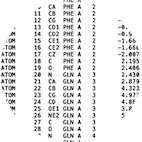
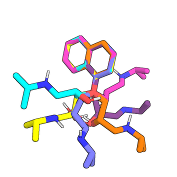
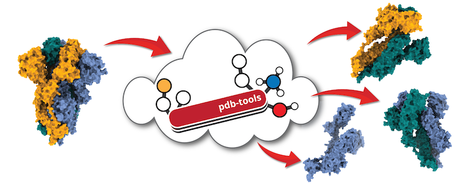

## Structures

  

 Best practice guide

The first step in your docking protocol is to know which molecules you want to find a complex for.
This might sound easy, but it can be quite tricky.
This section explains where to find or model input structures, how to edit them, and prepare them for HADDOCK.

### Which structures are available? 

#### Experimental structures  

In the best-case scenario, there is an experimental structure available.
All crystallographic, NMR, or cryo-EM structures protein structures are deposited in **protein data banks**:

* Worldwide Protein Data Bank [wwPDB](http://www.wwpdb.org)

* Protein Data Bank in Europe [PDBe](https://www.ebi.ac.uk/pdbe/node/1)

* The Research Collaboratory for Structural Bioinformatics Protein Data Bank [RCSB PDB](https://www.rcsb.org)

* Protein Data Bank Japan [PDBj](https://pdbj.org)

* Biological Magnetic Resonance Data Bank [BMRB](http://www.bmrb.wisc.edu)

#### Sequence and homologous proteins

In case when there is no experimental structure available for molecules of proteins of interest, one can use protein homologs as templates for protein modeling.
There are multiple tools that help us to do so.
Some online tools for **homolog search** are here: 

* [UniPROT](https://www.uniprot.org/blast/)

* [HMMER](https://www.ebi.ac.uk/Tools/hmmer/search/phmmer)

Once one finds the protein homologs, some freely available software for **homology model building** are here:

* [SWISS-MODEL](https://swissmodel.expasy.org/interactive)
    - this online tool can both look for homologous proteins and build a protein model   

* [MODELLER](https://salilab.org/modeller/)
    - online version [ModLoop](https://modbase.compbio.ucsf.edu/modloop/) for loop modeling 
    - local version for homology or comparative modeling of protein three-dimensional structures  

Homology modeling using these tools is described in our tutorial here:

* [Homology Modeling of the mouse MDM2 protein](https://www.bonvinlab.org/education/molmod/modelling/)

#### AI-generated structures

Using AI tools to generate structures is now becoming the standard.
Nevertheless, one should always be careful when using it, as artifacts can be generated.
Indeed, sterical clashes can be present.
Also, long disordered regions with low predicted pLDDT around the protein will not help during the docking, as it may prevent the interaction of the structured domain.
To prevent this, try to energy minimize the structure and remove *spaghetti* around the domain of interest.

* [AlphaFoldDB](https://alphafold.ebi.ac.uk/): Hosted by the EBI/EMBL, it contains more than 2 milions predicted monomeric strucutre for a bunch of taxonomic spieces, that can be downloaded.
* [UniProt](https://www.uniprot.org/): The UniProtKB now also provides, in the 'Structure' section, direct links to AlphaFoldDB, when available.
* [Online ColabFold](https://colab.research.google.com/github/sokrypton/ColabFold/blob/main/AlphaFold2.ipynb): Written and maintained by Sergey Ovchinnikov & Martin Steinegger, allows to run AlphaFold2 on a jupyter notebook using online resources.
* [Local ColabFold](https://github.com/YoshitakaMo/localcolabfold): The GitHub repository of ColabFold host multiple solutions to install AlphaFold2 locally.

#### Modelling of peptides and mutations in proteins

* **Point-mutations in HADDOCK**
 are handled by changing the amino acid name and HADDOCK will fill the missing side chain atoms. This step is further described [here](/software/haddock2.4/faq/#what-about-point-mutations) and can be done using the *pdb_mutate.py* tool in [***haddock-tools***](https://github.com/haddocking/haddock-tools).
 
**Note** that *pdb_mutate.py* will not create the new side-chain atoms (this is handled by HADDOCK). But if you prefer to have control of the side-chain conformation rather use tools like [Pymol](https://pymol.org/2/) to introduce the mutation. This is even **recommended in the case of a mutation to Histidine** as the server can not automatically guess the protonation state if the side-chain is missing.

* [Pymol](https://pymol.org/2/) is an almost irreplaceable tool in the every-day life of a computational chemist. Pymol is often used in a number of HADDOCK tutorials for structure preparations as well as analysis of docking results. 
    * Pymol offers a lot of handy plugins that extend its usability, for example, peptide-building ,some of them can be found here:  
        * [http://pldserver1.biochem.queensu.ca/~rlc/work/pymol/](http://pldserver1.biochem.queensu.ca/~rlc/work/pymol/)  
        * [https://github.com/Pymol-Scripts/Pymol-script-repo](http://pldserver1.biochem.queensu.ca/~rlc/work/pymol/)
    * Pymol offers an option to mutate residues and choose the side chain conformation manually. 
    * Modelling of peptides using Pymol modeling scripts is described [here](/education/molmod/simulation/).  

* [Rosetta](https://www.rosettacommons.org/docs/latest/application_documentation/utilities/build-peptide)
    * Rosetta, as well as plenty of other online tools have now functionalities with which you can build peptides from their sequences.  

* A list of modified amino acids supported by HADDOCK can be found [here](https://wenmr.science.uu.nl/haddock2.4/library).

#### Modeling of small molecules 

* [OpenEye OMEGA](https://www.eyesopen.com/omega)
    - OMEGA uses the SMILES strings as input to generate three-dimensional (3D) conformations of ligands. OMEGA was used by our group in previous rounds of the D3R challenge.
    - license necessary 

* [RDKit](https://www.rdkit.org)
    - open source chemoinformatics and machine learning software

* [OpenBabel](http://openbabel.org/index.html)
    - open source chemoinformatics software, with an online version [accessible here](https://www.cheminfo.org/Chemistry/Cheminformatics/FormatConverter/index.html).

* to prepare topology and parameter files for the ligand in CNS format one can use:

    * **ccp4-prodrg**: [`ccp4-prodrg`](https://www.ccp4.ac.uk/html/index.html)

    * the **Automated Topology Builder (ATB)** and Repository developed in the group of Prof. Alan Mark at the University of Queensland in Brisbane: [https://compbio.biosci.uq.edu.au/atb](https://compbio.biosci.uq.edu.au/atb)  

    * **BioBB using acpype**: The [BioExcel BioBuildingBlock (BioBB)](https://mmb.irbbarcelona.org/biobb/) library is hosting several tutorials on how to perform computations with a variety of different tools.
 Here is a link to the workflow used to parametrize ligands: [https://mmb.irbbarcelona.org/biobb/workflows/tutorials/biobb_wf_ligand_parameterization](https://mmb.irbbarcelona.org/biobb/workflows/tutorials/biobb_wf_ligand_parameterization).
   
The preparation of small molecules for docking is further described in the [frequently asked questions page](../faq.md#cofactors--small-ligand-docking-with-haddock).

#### Using Molecular Dynamics for generating multiple conformations

Proteins are not rock-solid and HADDOCK can handle flexibility of the interface to a certain extent.
Ensemble docking of conformations generated by molecular dynamics (MD) is an elegant way to account for larger conformational changes.
There are a number of MD engines available for generating of conformations such as:

* [GROMACS](http://www.gromacs.org)

* [OpenMM](http://openmm.org): Can also be used within haddock3 itself as it is now a module (see [refenement module / openmm](../modules/refinement.md#openmm-module))

* [GROMOS](http://www.gromos.net)

* [AMBER](https://ambermd.org)

* [CHARMM](https://www.charmm.org)

Examples of using MD for HADDOCK are shown here:

* [Molecular Dynamics Simulation of the p53 N-terminal peptide](https://www.bonvinlab.org/education/molmod/simulation/)  

* [Tutorial EDES / HADDOCK for ligand-protein docking](https://www.bonvinlab.org/education/biomolecular-simulations-2019/Metadynamics_tutorial/)

### Editing pdb files

Upon acquiring the input structures provided you might want to modify in one way or the other.
This might not be very straightforward since pdb files have to meet strict formatting requirements and are rather lengthy to edit manually.
The HADDOCK group has therefore developed a pipeline called PDB-Tools where pdb files can be submitted and edited it as needed.
PDB-tools are available here:

* [In your haddock3 environement](../pdbtools.md): command line interface
* [PDB-Tools Web](https://wenmr.science.uu.nl/pdbtools/): online version
* [Local version of PDB-Tools](http://www.bonvinlab.org/pdb-tools/): for a separated local installation

  

Tutorials:  

* [Tutorial explaining use of PDB-Tools Web](https://www.bonvinlab.org/education/HADDOCK24/HADDOCK24-antibody-antigen/#inspecting-and-preparing-the-antibody-for-docking)  

* [Tutorial explaining use of the local version of PDB-Tools](https://www.bonvinlab.org/education/HADDOCK3/HADDOCK3-antibody-antigen/#preparing-pdb-files-for-docking)

### Getting structures HADDOCK-ready

* [haddock3 manual -> Structure requirements](../structure_requirements.md)

* [Preparation of coarse-grained pdb files](https://www.bonvinlab.org/software/haddock2.4/pdb-cg/)
    * HADDOCK can now handle large complexes containing up to 20 chains. An elegant way to increase the speed of these calculations is to use coarse graining with [Martini](http://cgmartini.nl).    

* [Preparation of pdb files for the local version of HADDOCK2.4](/education/HADDOCK24/HADDOCK24-local-tutorial/#preparing-pdb-files-for-docking)

* [Haddock tools](https://github.com/haddocking/haddock-tools) are a bunch of useful tools available on [Github](https://github.com/haddocking/haddock-tools for use with local version of HADDOCK) that can be used to modify pdb or restraint files.

* A list of modified amino acids and other molecule types supported by HADDOCK can be found [here](https://wenmr.science.uu.nl/haddock2.4/library).

### Dos and Don'ts

| Don't | Do instead |
|:---:|:---:|
| input a pdb file without checking it first | carefully inspect your pdb and remove any unwanted atoms (water molecules, ions, crystallization agents)|
| edit pdb files in Word, OpenOffice or LibreOffice editor | edit pdb files in an ASCII text editor |
| use residues with multiple occupancies (e.g. 124A, 124B) | use [*pdb_selaltloc*](../pdbtools.md#pdb_selaltloc) to choose only one residue occupancy |
| use residues with overlapping numbering | use [*pdb_reres*](../pdbtools.md#pdb_reres) to renumber residues |
| use atoms with identical atom names for the same residue | edit your molecule with an ASCII text editor to make all atom names unique or use [*pdb_uniqname*](../pdbtools.md#pdb_uniqname) from our PDB-tools |
| use a pdb file with incorrect formatting | pdb formatting is very strict, check your file with [*pdb_validate*](../pdbtools.md#pdb_validate) and reload and export the file in Pymol if necessary |

Once you have your structures HADDOCK-ready you can go to the next step and define [**restraints**](./restraints.md).

Any more questions about pdb preparation for HADDOCK?

Have a look at:
- [F.A.Q](../faq.md)
- [Ask for help / find support](../info.md)
