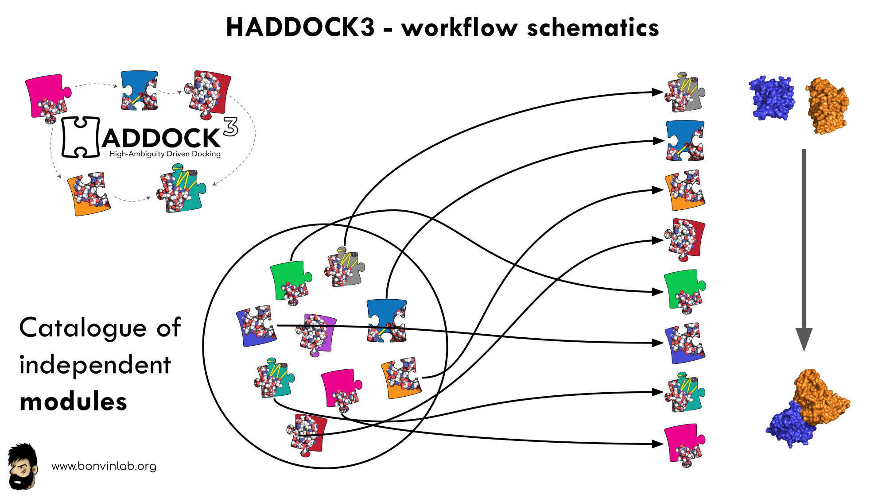

# Haddock3

Haddock3 is the next-generation integrative modeling software of the long-lasting HADDOCK docking tool.
It represents a complete rethinking and rewriting of the HADDOCK2.X series, implementing a new way to interact with HADDOCK and offering new features to users who can now define custom workflows.

In the previous HADDOCK2.x versions, users had access to a highly parameterisable yet rigid simulation pipeline composed of three steps: rigid-body docking (*it0*), semi-flexible refinement (*it1*), and final refinement (*itw*).

<figure style="text-align: center;">

</figure>

In HADDOCK3, users have the freedom to configure docking workflows into functional pipelines by combining the different HADDOCK3 modules, thus adapting the workflows to their projects.
HADDOCK3 has therefore developed to truthfully work like a puzzle of many pieces (simulation modules) that users can combine freely.
To this end, the “old” HADDOCK machinery has been modularized, and several new modules added, including third-party software additions.
As a result, the modularization achieved in HADDOCK3 allows users to duplicate steps within one workflow (e.g., to repeat twice the it1 stage of the HADDOCK2.x rigid workflow).

Note that, for simplification purposes, at this time, not all functionalities of HADDOCK2.x have been ported to HADDOCK3, which does not (yet) support NMR RDC, PCS and diffusion anisotropy restraints, cryo-EM restraints and coarse-graining.
Any type of information that can be converted into ambiguous interaction restraints can, however, be used in HADDOCK3, which also supports the ab initio docking modes of HADDOCK.

To keep HADDOCK3 modules organized, we cataloged them into several categories.
However, there are no constraints on piping modules of different categories.

The main module categories are *“topology”*, *“sampling”*, *“refinement”*, *“scoring”*, and *“analysis”*.
There is no limit to how many modules can belong to a category. Modules are added as developed, and new categories will be created if/when needed.
You can access the [HADDOCK3 documentation page](https://www.bonvinlab.org/haddock3/modules/index.html), or read the user manual for the [list of all categories and modules](./modules.md).

<figure style="text-align: center;">

</figure>

The HADDOCK3 workflows are defined in simple configuration text files, similar to the [TOML](https://toml.io/en/) format but with extra features.
Contrary to HADDOCK2.X which follows a rigid (yet highly parameterisable) procedure, in HADDOCK3, you can create your own simulation workflows by combining a multitude of independent modules that perform specialized tasks.
Details on [how to create a workflow is provided in a dedicated section](./config_file.md).
We also provide a set of [docking scenario examples](./docking_scenarios.md), containing quite a variety of different protocols that can also guide you.
