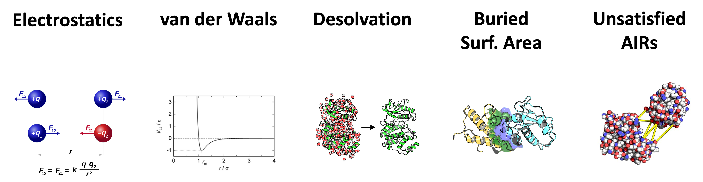

# HADDOCK - High Ambiguity Driven Docking

High Ambiguity Driven DOCKing (HADDOCK), is now a long standing docking software, that harness the power of CNS (Crystallography and NMR System – [https://cns-online.org](https://cns-online.org)) for structure calculation of molecular complexes.
What distinguishes HADDOCK from other docking software is its ability, inherited from CNS, to incorporate experimental data as restraints and use these to guide the docking process alongside traditional energetics and shape complementarity.
Moreover, the intimate coupling with CNS endows HADDOCK with the ability to actually produce models of sufficient quality to be archived in the Protein Data Bank.

A central aspect of HADDOCK is the definition of Ambiguous Interaction Restraints or AIRs.
These allow the translation of raw data such as NMR chemical shift perturbation or mutagenesis experiments into distance restraints that are incorporated into the energy function used in the calculations.
AIRs are defined through a list of residues that fall under two categories: active and passive.
Generally, active residues are those of central importance for the interaction, such as residues whose knockouts abolish the interaction or those where the chemical shift perturbation is higher.
Throughout the simulation, these active residues are restrained to be part of the interface, if possible, otherwise incurring a scoring penalty.
Passive residues are those that contribute to the interaction but are deemed of less importance. If such a residue does not belong in the interface there is no scoring penalty.
Hence, a careful selection of which residues are active and which are passive is critical for the success of the docking.

## HADDOCK scoring function

CNS modules use the HADDOCK scoring function to score and rank generated models.
The HADDOCK scoring function consists of a linear combination of various weighted physics-based energy terms and buried surface area.

The scoring is performed according to the _weighted sum_ (HADDOCK score) of the 6 following terms:

* _Eelec_: electrostatic intermolecular energy
* _Evdw_: van der Waals intermolecular energy
* _Edesol_: desolvation energy
* _BSA_: buried surface area
* _Eair_: distance restraints energy (only unambiguous and AIR (ambig) restraints)
* _Esym_: symmetry restraints energy (NCS and C2/C3/C5 terms)

<figure style="text-align: center;">

</figure>

As the weights for each of the scoring function components differs for the various available CNS module, they will be described in each of the modules (see: [haddock3 modules](./modules.md)).

Of course, these weights can be tuned by the user, by modifying their related parameters:
* `w_elec`: to tune the electrostatic intermolecular energy weight
* `w_vdw`: to tune the van der Waals intermolecular energy weight
* `w_desolv`: to tune the desolvation energy weight
* `w_bsa`: to tune the buried surface area weight
* `w_air`: to tune the distance restraints energy (only unambiguous and AIR (ambig) restraints) weight
* `w_sym`: to tune the symmetry restraints energy (NCS and C2/C3/C5 terms) weight

