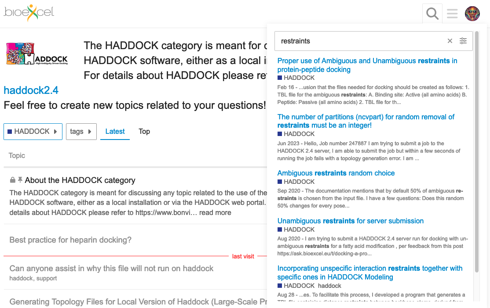

# User support

In HADDOCK, not only we want to provide a cutting edge biomolecular docking suite, but we also care about our users.
Several dedicated channels are available for you to ask questions, submit feedback, request new feature you would like to see in Haddock3 or simply discuss topics.

## Related to the use of HADDOCK

The BioExcel forum ([https://ask.bioexcel.eu/](https://ask.bioexcel.eu/)) is the exact location where you can ask any question related to HADDOCK (and other BioExcel core applications).
You can search for previous posts, as maybe your question has been asked by other scientists before you (there is a very high chance that your problem has already been addressed).
Or create a new post, in which case we will try to answer as fast as we can.

**Note** that you are not the only one having difficulties, and the question you may have been already asked and answered!
The BioExcel forum has a quite powerfull search engine that allows you to search for keywords present in all its content.
For this, simply click on the magnifying glass at the top-right for the forum, and type the keywords of interest (e.g.: "restraints").

<figure style="text-align: center;">

</figure>

## Code related issues

For code related issues, please refere to the [GitHub repository issues](https://github.com/haddocking/haddock3/issues), which allows us as well as users to track known issues and their progress.

In the GitHub issues, you can [create a new issue](https://github.com/haddocking/haddock3/issues/new/choose) related to:

- **Report a bug**: A bug is an error, flaw, or unintended behavior in the software that causes it to produce incorrect or unexpected results, or to behave in unintended ways.
- **Request for an enhancement/feature**: An enhancement/feature request is a suggestion for new functionality or an enhancement to existing features in the software.
- **Ask Question**: Question about the source code of the project.
