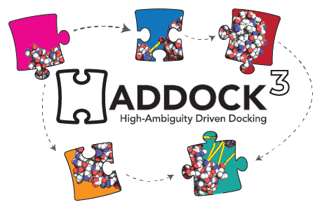

# Welcome to the Haddock3 user manual

<figure style="text-align: center;">

</figure>

HADDOCK, standing for **H**igh **A**mbiguity **D**riven protein-protein **DOCK**ing, is a widely used computational tool for the integrative modeling of biomolecular interactions.
Developed by researchers at [Utrecht University](https://uu.nl) in the [BonvinLab](https://bonvinlab.org) for more than 20 years, it integrates various types of experimental data, biochemical, biophysical, bioinformatic prediction, and knowledge to guide the docking process.

In this manual, we will describe:
- the basic concepts of HADDOCK
- the new functionalities of the haddock3 software suite
- how to create custom workflows
- provide example workflows

## Navigate through the manual

On the top-left part of your screen, you will find three icons:
- stacked lines: allows to display/hide the table of content
- brushes: allows to tune the colors of the manual
- the magnifying glass: perform keyword text search in the entire manual and access corresponding pages

<figure style="text-align: center;">

</figure>
