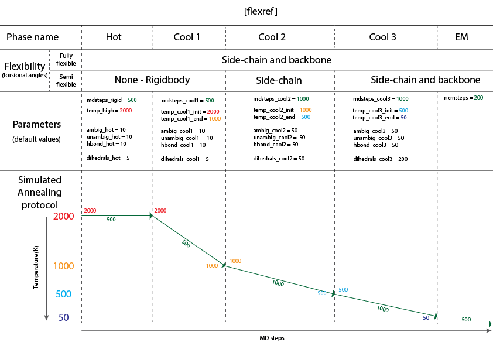

# Refinements modules

- [`[emref]` module](#emref-module)
- [`[flexref]` module](#flexref-module)
- [`[mdref]` module](#mdref-module)
- [`[openmm]` module](#openmm-module)


## `[emref]` module

Energy minimization refinement with CNS.

The `[emref]` module refines the input complexes by energy minimization using
the conjugate gradient method implemented in CNS.

Coordinates of the energy-minimized structures are saved, and each
complex is then evaluated using the HADDOCK scoring function.

The default HADDOCK scoring function in the `[emref]` module is the following:


#### Notable parameters

The most important parameters for the `[emref]` module are:

- `ambig_fname`: file containing the ambiguous interaction restraints (AIRs)
- `unambig_fname`: file containing the unambiguous interaction restraints
- `randremoval`: whether or not to activate the random removal of restraints (default: True)
- `nemsteps`: number of energy minimization steps

More information about `[emref]` parameters can be accessed [here](https://bonvinlab.org/haddock3/modules/refinement/haddock.modules.refinement.emref.html#default-parameters) or retrieved by running:

```bash
haddock3-cfg -m emref
```

<hr>

## `[flexref]` module

Flexible refinement with CNS.

The `[flexref]` module (also known as `it1` stage in HADDOCK2.X series),
is a semi-flexible simulated annealing (SA) protocol based on molecular
dynamics in torsion angle space.


This semi-flexible SA consists of several stages:
- High-temperature rigid body molecular dynamics
- Rigid body SA
- Semi-flexible SA with flexible side-chains at the interface
- Semi-flexible SA with fully flexible interface (both backbone and side-chains)

By default, only the interface regions are treated as *semi-*flexible.
It is automatically defined based on the intermolecular contacts made.
It is also possible to manually define the semi-flexible regions, and also define fully flexible regions that are allowed to move throughout the entire protocol from the high-temperature rigidbody molecular dynamics on.

<details >
  <summary style="bold">
  <b><i>See animation of flexref protocol:</i></b>
  </summary>
  <figure align="center">
    
  </figure>
  </details>
  <br>


The temperature and number of steps for the various stages can be tuned.

The default HADDOCK scoring function in the `[flexref]` module is the following:


#### Notable parameters

The most important parameters for the `[flexref]` module are:

- `ambig_fname`: file containing the ambiguous interaction restraints (AIRs)
- `unambig_fname`: file containing the unambiguous interaction restraints
- `seg_*_X_Y`: for the definition of semi-flexible segments (see [flexibility section](../flexibility.md#custom-definition-of-semi-flexible-segments) for more information)
- `fle_*_Y`: for the definition of semi-flexible segments (see [flexibility section](../flexibility.md#manual-definition-of-fully-flexible-segments) for more information)

More information about `[flexref]` parameters can be accessed [here](https://bonvinlab.org/haddock3/modules/refinement/haddock.modules.refinement.flexref.html#default-parameters) or retrieved by running:

```bash
haddock3-cfg -m flexref
```

#### `[flexref]` module simulated annealing protocol scheme

To simplify your understanding of the simulated annealing protocol and the parameters related to each step, we built a schematic representation of it:

<figure style="text-align: center;">

</figure>


<hr>

## `[openmm]` module

<hr>


## `[mdref]` module

Explicit solvent MD refinement with CNS.

The `[mdref]` module (previously known as `itw` in HADDOCK2.X series), is a small molecular dynamics simulation, in cartesian space, using explicit solvent.

A layer of solvent (8A for water, 12.5A for DMSO) is generated around
surface residues.

The `[mdref]` protocol is composed of 4 sequential steps:
- Short energy minimization
- 3 stages of molecular dynamics to reach 300K (at 100, 200 and 300K)
- Molecular dynamics at 300K.
- 3 stages of molecular dynamics, to reach 100K (at 300, 200 and 100K)


<details >
 <summary style="bold">
 <b><i>See animation of mdref protocol:</i></b>
 </summary>
 <figure align="center">
   
 </figure>
 </details>
 <br>

Using this protocol, with default parameters, no spectacular changes are
expected, however, the scoring of the various structures might be improved.

The default HADDOCK scoring function in the `[mdref]` module is the following:


#### Notable parameters

The most important parameters for the `[mdref]` module are:

- `ambig_fname`: file containing the ambiguous interaction restraints (AIRs)
- `unambig_fname`: file containing the unambiguous interaction restraints
- `waterheatsteps`: number of MD steps for heating up the system
- `watersteps`: number of MD steps at 300K
- `watercoolsteps` : number of MD steps for cooling down the system 

More information about `[mdref]` parameters can be accessed [here](https://bonvinlab.org/haddock3/modules/refinement/haddock.modules.refinement.mdref.html#default-parameters) or retrieved by running:

```bash
haddock3-cfg -m mdref
```
