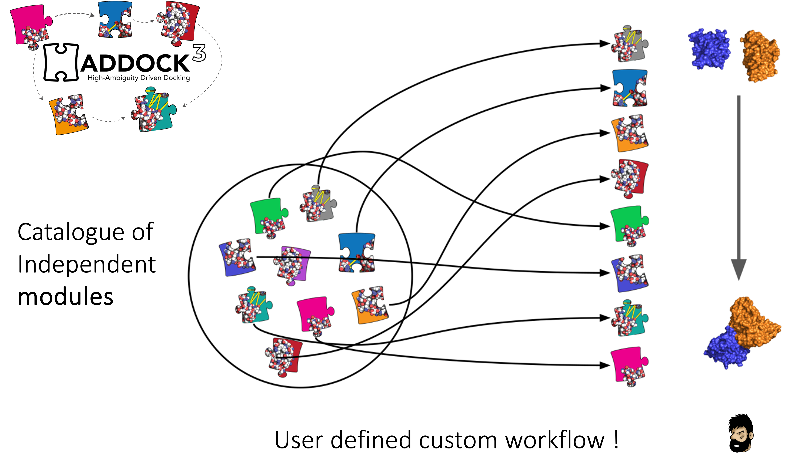
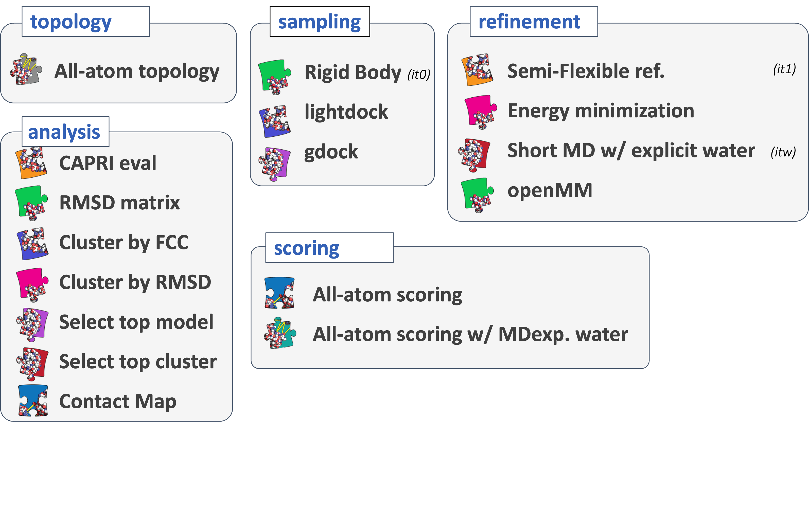

# Modules in haddock3

Haddock3 has this particularity (compared to the pervious HADDOCK2.X versions), that there is not a single static workflow to be processed, but rather a custom one requiring the user to design their own workflows by placing `[modules]` one after the other, enabling to generate a sequence of events to solve their research question.

<figure align="center">

</figure>

Various `[modules]` are available in Haddock3, and they are grouped together by types:
- [**Topology modules**](#topology-modules): these modules focus in the building of missing atoms and the generation of appropriate topology files enabling downstream use of molecular dynamics protocols.
- [**Sampling modules**](#sampling-modules): dedicated to performing sampling of initial conformations, such as rigidbody docking.
- [**Refinement modules**](#refinement-modules): these modules aim at refining interaction interface, using simulated annealing protocol, energy minimization or molecular dynamics with an explicit solvent shell.
- [**Scoring modules**](#scoring-modules): these modules are evaluating provided complexes with dedicated scoring functions, such as the HADDOCK score.
- [**Analysis modules**](#analysis-modules): these modules focus on the analysis of docking models. It ranges from the clustering of docking models to the selection of best-ranked ones passing by the evaluation of the models with respect to a reference structure using CAPRI criteria.


<figure align="center">

</figure>


## Defining module parameters

To tune module parameters, you first need to define which `[module]` you will be using, then add the list of parameters and their new values.

Note that if a parameter is not defined, its default value will be used instead.

### Tuning a module parameter

In the configuration file, right after declaring which module you want to use, add the parameters and their new values in the subsequent lines.

Here is a synthetic example:
```TOML
[module]
parameter1 = new_value_1
parameter3 = new_value_3
```

**Note** that you can only define one parameter per line.

### Definition of default parameter values

Each module has its own default parameter names and values, set in a file named `defaults.yaml`.
This is used to set default parameters when they are not specified in the configuration file.

The `defaults.yaml` file is not only used to check if the parameter name exists at execution time, but also as reference to know if the configuration file provided by the use respects the allowed value for a given parameter.

*Note for __advanced__ users*: If you feel that the parameter range is not suited for your research, you can always tune the defaults values or the maximum values that can be adopted by this parameter, by editing the `defaults.yaml` file inside the module directory (at your own risk).


## Set of available modules

Below is presented the list of available modules.
For detailed explanation of each module and their respective parameters, please refer to [the online documentation](https://bonvinlab/haddock3/).
You can also use the `haddock3-cfg` command line to get information on each module and their parameters ([documentation here](./clis.md#haddock3-cfg)).


### Topology modules

- [`[topoaa]`](./modules/topology.md#topoaa-module): Builds missing atoms and generates the all-atom topologies for the CNS engine.
- [`[topocg]`](./modules/topology.md#topology-modules): *coming soon*


### Sampling modules

- [`[rigidbody]`](./modules/sampling.md#rigidbody-module): Rigid body energy minimization with CNS (previously known as `it0` in HADDOCK2.X series).
- [`[gdock]`](./modules/sampling.md#gdock-module): Third-party genetic algorithm-based docking software.
- [`[lightdock]`](./modules/sampling.md#lightdock-module): Third-party Glow-worm Swarm Optimisation (GSO) docking software.


### Refinement modules

- [`[flexref]`](./modules/refinement.md#flexref-module): Semi-flexible refinement using a simulated annealing protocol through molecular dynamics simulations in torsion angle space (previously known as `it1` in HADDOCK2.X series).
- [`[emref]`](./modules/refinement.md#emref-module): Refinement by energy minimization (previously known as `itw EM only` in HADDOCK2.4).
- [`[mdref]`](./modules/refinement.md#mdref-module): Refinement by a short molecular dynamics simulation in explicit solvent (previously known as `itw` in HADDOCK2.X series).
- [`[openmm]`](./modules/refinement.md#openmm-module): Short molecular dynamics simulation (in explicit or implicit solvent) using the OpenMM library.


### Scoring modules

- CNS scoring modules:
  - [`[emscoring]`](./modules/scoring.md#emscoring-module): Scoring of a complex performing a short EM (builds the topology and all missing atoms).
  - [`[mdscoring]`](./modules/scoring.md#mdscoring-module): Scoring of a complex performing a short MD in explicit solvent + EM (builds the topology and all missing atoms).
- [`[prodigyprotein]`](./modules/scoring.md#prodigyprotein-module): Binding affinity prediction of a protein-protein complex by the `prodigy` tool.
- [`[prodigyligand]`](./modules/scoring.md#prodigyligand-module): Binding affinity prediction of a protein-ligand complex by the `prodigy-ligand` tool.


### Analysis modules

- Analysis:
  - [`[alascan]`](./modules/analysis.md#alascan-module): Performs alanine (or other residue) scanning on the models generated in the previous step.
  - [`[caprieval]`](./modules/analysis.md#caprieval-module): Calculates CAPRI metrics (i-RMDS, l-RMSD, Fnat, DockQ, RMSD) with respect to the top scoring model or reference structure if provided.
  - [`[contactmap]`](./modules/analysis.md#contactmap-module): Calculates the contact maps for the models generated in the previous step.
- Clustering:
  - [`[rmsdmatrix]`](./modules/analysis.md#rmsdmatrix-module): Calculates the pairwise RMSD matrix between all the models generated in the previous step.
  - [`[ilrmsdmatrix]`](./modules/analysis.md#ilrmsdmatrix-module): Calculates the pairwise interface-ligand-RMSD (iLRMSD) matrix between all the models generated in the previous step.
  - [`[clustrmsd]`](./modules/analysis.md#clustrmsd-module): Clusters models based on pairwise RMSD matrix previously computed by either the calculated with the `[rmsdmatrix]` or `[ilrmsdmatrix]` modules.
  - [`[clustfcc]`](./modules/analysis.md#clustfcc-module): Clusters models based on the fraction of common contacts (FCC)
- Selection:
  - [`[seletop]`](./modules/analysis.md#seletop-module): Select the top N models from the previous step.
  - [`[seletopclusts]`](./modules/analysis.md#seletopclusts-module): Selects top N clusters from the previous step.


## Developing a new module

Haddock3 is a collaborative project, and researchers can contribute to it, increasing the scope and potential of the Haddock3 suite.
Information on how to contribute and setup a proper development environment is available on the GitHub repository:
- [**CONTRIBUTING.md**](https://github.com/haddocking/haddock3/blob/main/CONTRIBUTING.md), contains information on how to contribute.
- [**DEVELOPMENT.md**](https://github.com/haddocking/haddock3/blob/main/DEVELOPMENT.md), contains information on how to set up an adequate development environment.

